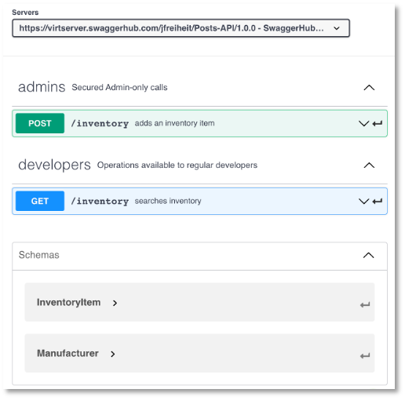
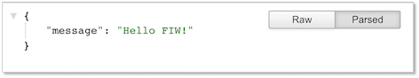
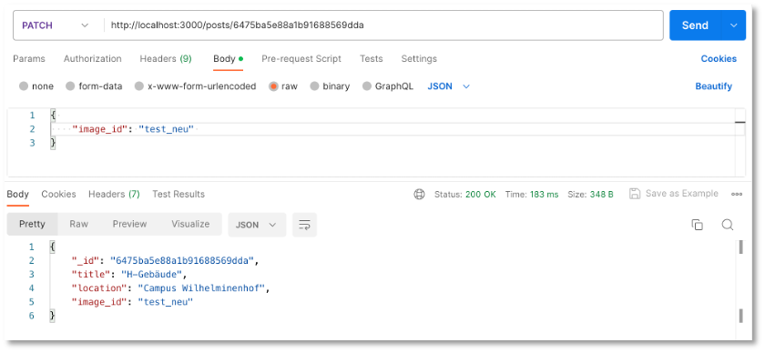

# Backend - REST-Server

Ehe wir uns der [IndexedDB-API](https://developer.mozilla.org/de/docs/Web/API/IndexedDB_API) zuwenden, erstellen wir zunächst eine "richtige" Datenbank für unsere Posts. Für diese Datenbank stellen wir die Implementierung einer Schnittstelle bereit, so dass wir die wesentlichen Datenbankanfragen darüber ausführen können. Diese wesentlichen Datenbankfragen werden mit [CRUD](https://en.wikipedia.org/wiki/Create,_read,_update_and_delete) abgekürzt, für <strong>C</strong>reate, <strong>R</strong>ead, <strong>U</strong>pdate und <strong>D</strong>elete. Das bedeutet, wir implementieren Funktionalitäten, mit denen wir einen neuen `post` in die Datenbank einfügen (*create*), aus der Datenbank auslesen (*read*), in der Datenbank aktualisieren (*update*) und aus der Datenbank löschen (*delete*) können. 

Die Schnittstelle, die wir implementieren, ist eine sogenannte [REST-API](https://www.redhat.com/de/topics/api/what-is-a-rest-api). *REST* steht für [*Representational State Transfer*](https://de.wikipedia.org/wiki/Representational_State_Transfer) und basiert auf einigen wenigen Prinzipien:

1. Alles wird als eine *Ressource* betrachtet, z.B. `post`.
2. Jede Ressource ist durch *URIs* (*Uniform Resource Identifiers*) eindeutig identifizierbar, z.B. `http://localhost/posts`.
3. Es werden die [Standard-HTTP-Methoden](https://de.wikipedia.org/wiki/Hypertext_Transfer_Protocol#HTTP-Anfragemethoden) verwendet, also `GET`, `POST`, `PUT`, `UPDATE`.  
4. Ressourcen können in verschiedenen Formaten vorliegen, z.B. in [HTML](https://html.spec.whatwg.org/multipage/), [XML](https://www.w3.org/TR/xml/), [JSON](https://jsonapi.org/format/), ...
5. Die Kommunikation ist *zustandslos*. Jede einzelne HTTP-Anfrage wird komplett isoliert bearbeitet. Es gibt keinerlei Anfragehistorie. 

Das bedeutet, wir erstellen ein Backend (einen REST-Server), an den HTTP-Anfragen mit der eindeutig identifizierbaren Ressource gestellt werden. Das Backend erstellt daraus die entsprechende SQL-Query. Das Resultat der Datenbankanfrage wird im `JSON`- oder `HTML`- oder `XML`- oder in einem anderen Format bereitsgestellt.


Prinzipiell gibt es also ein *Mapping* von HTTP-Anfragen auf SQL-Anfragen:

|CRUD |SQL |MongoDB |HTTP |
|-----|----|--------|-----|
|create |INSERT |insertOne(), insertMany() |POST |
|read |SELECT |findOne(), find() |GET |
|update |UPDATE |updateOne(), updateMany() |PUT (oder PATCH)|
|delete |DELETE |deleteOne(), deleteMany() |DELETE |

Zur Unterscheidung zwischen `PUT` und `PATCH` siehe z.B. [hier](https://www.geeksforgeeks.org/difference-between-put-and-patch-request/) oder [hier](https://stackoverflow.com/questions/21660791/what-is-the-main-difference-between-patch-and-put-request).
Wir wollen uns ein Backend erstellen, über das wir unsere Daten verwalten. Dazu überlegen wir uns zunächst ein paar sogenannte *Endpunkte* (siehe Prinzipien von REST oben) und die Zugriffsmethoden, mit denen wir auf unsere Daten zugreifen wollen.


| Methode | URL | Bedeutung |
|---------|-----|-----------|
| GET     | /posts | hole alle Datensätze |
| GET     | /posts/11 | hole den Datensatz mit der id=11 |
| POST    | /posts | füge einen neuen Datensatz hinzu |
| PUT     | /posts/11 | ändere den Datensatz mit der id=11 |
| DELETE  | /posts/11 | lösche den Datensatz mit der id=11 |

Der Wert der `id` ist natürlich nur ein Beispiel. Es soll für alle `id`-Werte funktionieren, die in unserem Datensatz enthalten sind. Korrekterweise beschreiben wir die Endpunkte mit variabler `id` besser durch `/posts/:id` oder `/posts/{id}`.

## OpenAPI

Hier geht es zunächst um die **Dokumentation** der zu erstellenden REST-API. Wenn Sie an der Dokumentation nicht interssiert sind, können Sie auch direkt zur [Implementierung](./#ein-nodejs-projekt-mit-express) springen. Eine ordentliche Dokumentation Ihrer REST-API ist jedoch immer gut und richtig. Es lässt sich daraus sogar bereits Code erzeugen. 

Für eine Dokumentation der zu erstellenden REST-API ist [OpenAPI](https://www.openapis.org/) geeignet. Unter [https://app.swaggerhub.com/home](https://app.swaggerhub.com/home) steht ein Werkzeug zur Verfügung, um eine solche API-Dokumentation zu erstellen. Sie müssen sich dort registrieren und einloggen. Klicken Sie `Create New`, um eine neue Dokumentation zu beginnen:

<figure markdown>
  { width="300" }
  <figcaption>Eingabemaske für neue REST-API</figcaption>
</figure>


Es wird automatisch erstellt:

=== "Simple Inventory API"

```yaml linenums="1"
openapi: 3.0.0
servers:
  # Added by API Auto Mocking Plugin
  - description: SwaggerHub API Auto Mocking
    url: https://virtserver.swaggerhub.com/jfreiheit/Posts-API/1.0.0
info:
  description: This is a simple API
  version: "1.0.0"
  title: Simple Inventory API
  contact:
    email: you@your-company.com
  license:
    name: Apache 2.0
    url: 'http://www.apache.org/licenses/LICENSE-2.0.html'
tags:
  - name: admins
    description: Secured Admin-only calls
  - name: developers
    description: Operations available to regular developers
paths:
  /inventory:
    get:
      tags:
        - developers
      summary: searches inventory
      operationId: searchInventory
      description: |
        By passing in the appropriate options, you can search for
        available inventory in the system
      parameters:
        - in: query
          name: searchString
          description: pass an optional search string for looking up inventory
          required: false
          schema:
            type: string
        - in: query
          name: skip
          description: number of records to skip for pagination
          schema:
            type: integer
            format: int32
            minimum: 0
        - in: query
          name: limit
          description: maximum number of records to return
          schema:
            type: integer
            format: int32
            minimum: 0
            maximum: 50
      responses:
        '200':
          description: search results matching criteria
          content:
            application/json:
              schema:
                type: array
                items:
                  $ref: '#/components/schemas/InventoryItem'
        '400':
          description: bad input parameter
    post:
      tags:
        - admins
      summary: adds an inventory item
      operationId: addInventory
      description: Adds an item to the system
      responses:
        '201':
          description: item created
        '400':
          description: 'invalid input, object invalid'
        '409':
          description: an existing item already exists
      requestBody:
        content:
          application/json:
            schema:
              $ref: '#/components/schemas/InventoryItem'
        description: Inventory item to add
components:
  schemas:
    InventoryItem:
      type: object
      required:
        - id
        - name
        - manufacturer
        - releaseDate
      properties:
        id:
          type: string
          format: uuid
          example: d290f1ee-6c54-4b01-90e6-d701748f0851
        name:
          type: string
          example: Widget Adapter
        releaseDate:
          type: string
          format: date-time
          example: '2016-08-29T09:12:33.001Z'
        manufacturer:
          $ref: '#/components/schemas/Manufacturer'
    Manufacturer:
      required:
        - name
      properties:
        name:
          type: string
          example: ACME Corporation
        homePage:
          type: string
          format: url
          example: 'https://www.acme-corp.com'
        phone:
          type: string
          example: 408-867-5309
      type: object
```

Zur Erläuterung:

- Unter dem Schlüssel `paths` (Zeile `20`) ist ein Pfad (eine *Route*) definiert, nämlich `/inventory`. Bei diesem Pfad handelt es sich um ein sogenanntes [*Path Item Object*](https://swagger.io/specification/#path-item-object)
- Der Pfad `/inventory` enthält zwei sogenannte [*Operation Objects*](https://swagger.io/specification/#operation-object), nämlich `GET` (Zeile `22`) und `POST` (Zeile `63`). Ein *Operation Object* kann verschiedene Eigenschaften beinhalten:

	- `tags`: Schlüsselwörter, um die API-Dokumentation zu gruppieren (siehe unten im Bild `Dokumentation der REST-API` die Gruppen `admins` und `developers`)
	- `summary`: dient der Erläuterung eines Endpunktes (siehe unten im Bild `Dokumentation der REST-API` die Erläuterungen `searches inventory` und `adds an inventory item`)
	- `description`: beschreibt die Funktionalität des Endpunktes detaillierter. Erscheint in der Dokumentation bei den Details eines Endpunktes (siehe unten im Bild `Get /inventroy-Endpunkt im Detail`)
	- `responses`: beschreibt die Rückgabe des Endpunktes. Es handelt sich um ein [*Responses Object*](https://swagger.io/specification/#responses-object). Diese können nach HTTP-Statuscodes unterteilt werden. Neben der `description` für den Statuscode kann dabei insbesondere der Typ der `responses` definiert werden. In der `content`-Eigenschaft wird zunächst der Typ der akzeptierten Response definiert, z.B. `application/json` oder `image/png`. Dann wird spezifiziert, welcher Datentyp zurückgeben wird. Die Zeilen `57-60` beschrieben bspw., dass ein Array von `InventoryItems` zurückgegeben wird. Ein solches `InventoryItem` ist unter der Eigenschaft `schemas` definiert. Mithilfe von `$ref: '#/components/schemas/InventoryItem'` wird auf dieses Schema referenziert. 
- Unter dem Schlüssel `components` können `schemas`, `responses`, `parameters`, `examples`, `requestBodies`, `headers` usw. spezifiziert werden. Mithilfe von `$ref` kann dann auf jede dieser Komponenten referenziert werden. In obigem Beispiel wurde das Schema `InventoryItem` und das Schema `Manufacturer` definiert. Diese Schemen entsprechen den verwendeten Datenmodellen. 


<figure markdown>
  { width="300" }
  <figcaption>Dokumentation der REST-API</figcaption>
</figure>


<figure markdown>
  { width="300" }
  <figcaption>GET /inventory-Endpunkt im Detail</figcaption>
</figure>

### YAML

Die obige Beschreibung ist übrigens in [YAML](https://yaml.org/). Ursprünglich stand YAML für *Yet Anaother Markup Language*. Jetzt sagt die Spezifikation von YAML aber *YAML Ain't Markup Language*. Es hat Ähnlichkeiten zu JSON, kommt allerdings ohne Klammerung aus. Dafür spielt das Einrücken eine Rolle. OpenAPI unterstützt sowohl JSON als auch YAML. 

### Die '/posts'-Routen

Wir spezifizieren zunächst die `/posts`-Routen, also `GET /posts` und `POST /posts`.

=== "Posts-API"

```yaml linenums="1"
openapi: 3.0.0
servers:
  # Added by API Auto Mocking Plugin
  - description: SwaggerHub Server
    url: https://virtserver.swaggerhub.com/jfreiheit/Posts-API/1.0.0
info:
  description: REST-API für IKT-PWA HTWInsta
  version: "1.0.0"
  title: Posts-API
  contact:
    email: freiheit@htw-berlin.de
  license:
    name: Apache 2.0
    url: 'http://www.apache.org/licenses/LICENSE-2.0.html'
tags:
  - name: Posts
    description: CRUD für Posts
  - name: Images
    description: CRUD für Bilder
paths:
  /posts:
    get:
      tags:
        - Posts
      summary: lese alle Posts
      operationId: getAllPosts
      description: download Array aller verfügbaren Posts
      responses:
        '200':
          description: alle verfügbaren Posts geladen
          content:
            application/json:
              schema:
                type: array
                items:
                  $ref: '#/components/schemas/Post'
    post:
      tags:
        - Posts
      summary: füge einen neuen Post hinzu
      operationId: createNewPost
      description: neuen Post erzeugen und speichern
      responses:
        '201':
          description: Post created
        '409':
          description: Post existiert bereits
      requestBody:
        content:
          application/json:
            schema:
              $ref: '#/components/schemas/Post'
        description: neuer Post
components:
  schemas:
    Post:
      type: object
      required:
        - title
        - location
        - image_id
      properties:
        title:
          type: string
          example: H-Gebäude
        location:
          type: string
          example: Campus Wilhelminenhof
        image_id:
          type: string
          example: Campus Wilhelminenhof
```


### Die '/posts/{id}'-Routen

Nun fügen wir noch die `/posts/{id}`-Routen hinzu, also `GET /posts/{id}`, `PUT /posts/{id}` und `DELETE /posts/{id}`.


=== "Posts-API"

```yaml linenums="54"
  /posts/{id}:
    get:
      tags:
        - Posts
      summary: lese einen Post mit der passenden id
      operationId: getOnePost
      description: download entsprechenden Post
      parameters:
        - name: id
          in: path
          required: true
          description: Post-ID
          schema:
            type : string
      responses:
        '200':
          description: Post mit entsprechender id geladen
          content:
            application/json:
              schema:
                type: object
                items:
                  $ref: '#/components/schemas/Post'
        '404':
          description: Post bzw. id nicht gefunden
    put:
      tags:
        - Posts
      summary: ändere einen Post mit der passenden id
      operationId: updateOnePost
      description: aktualisiere entsprechenden Post
      parameters:
        - name: id
          in: path
          required: true
          description: Post-ID
          schema:
            type : string
      responses:
        '200':
          description: Post mit entsprechender id aktualisiert
          content:
            application/json:
              schema:
                type: object
                items:
                  $ref: '#/components/schemas/Post'
        '404':
          description: Post bzw. id nicht gefunden
      requestBody:
        content:
          application/json:
            schema:
              $ref: '#/components/schemas/Post'
        description: zu aktualisierender Post
    delete:
      tags:
        - Posts
      summary: lösche einen Post mit der passenden id
      operationId: deleteOnePost
      description: lösche entsprechenden Post
      parameters:
        - name: id
          in: path
          required: true
          description: Post-ID
          schema:
            type : string
      responses:
        '200':
          description: Post mit entsprechender id gelöscht
          content:
            application/json:
              schema:
                type: object
                items:
                  $ref: '#/components/schemas/Post'
        '404':
          description: Post bzw. id nicht gefunden
```

### Die vollständige YAML-Datei

Hier die vollständige [YAML-Datei](./files/openapi.yaml), die Sie auch in Postman importieren können.

??? "openapi.yaml"
	```yaml
		openapi: 3.0.0
		info:
		  title: Posts-API
		  description: REST-API für IKT-PWA HTWInsta
		  contact:
		    email: freiheit@htw-berlin.de
		  license:
		    name: Apache 2.0
		    url: http://www.apache.org/licenses/LICENSE-2.0.html
		  version: 1.0.0
		servers:
		- url: https://virtserver.swaggerhub.com/jfreiheit/Posts-API/1.0.0
		  description: SwaggerHub Server
		tags:
		- name: Posts
		  description: CRUD für Posts
		- name: Images
		  description: CRUD für Bilder
		paths:
		  /posts:
		    get:
		      tags:
		      - Posts
		      summary: lese alle Posts
		      description: download Array aller verfügbaren Posts
		      operationId: getAllPosts
		      responses:
		        "200":
		          description: alle verfügbaren Posts geladen
		          content:
		            application/json:
		              schema:
		                type: array
		                items:
		                  $ref: '#/components/schemas/Post'
		                x-content-type: application/json
		      x-swagger-router-controller: Posts
		    post:
		      tags:
		      - Posts
		      summary: füge einen neuen Post hinzu
		      description: neuen Post erzeugen und speichern
		      operationId: createNewPost
		      requestBody:
		        description: neuer Post
		        content:
		          application/json:
		            schema:
		              $ref: '#/components/schemas/Post'
		      responses:
		        "201":
		          description: Post created
		        "409":
		          description: Post existiert bereits
		      x-swagger-router-controller: Posts
		  /posts/{id}:
		    get:
		      tags:
		      - Posts
		      summary: lese einen Post mit der passenden id
		      description: download entsprechenden Post
		      operationId: getOnePost
		      parameters:
		      - name: id
		        in: path
		        description: Post-ID
		        required: true
		        style: simple
		        explode: false
		        schema:
		          type: string
		      responses:
		        "200":
		          description: Post mit entsprechender id geladen
		          content:
		            application/json:
		              schema:
		                type: array
		                items:
		                  $ref: '#/components/schemas/Post'
		                x-content-type: application/json
		        "404":
		          description: Post bzw. id nicht gefunden
		      x-swagger-router-controller: Posts
		    put:
		      tags:
		      - Posts
		      summary: ändere einen Post mit der passenden id
		      description: aktualisiere entsprechenden Post
		      operationId: updateOnePost
		      parameters:
		      - name: id
		        in: path
		        description: Post-ID
		        required: true
		        style: simple
		        explode: false
		        schema:
		          type: string
		      requestBody:
		        description: zu aktualisierender Post
		        content:
		          application/json:
		            schema:
		              $ref: '#/components/schemas/Post'
		      responses:
		        "200":
		          description: Post mit entsprechender id aktualisiert
		          content:
		            application/json:
		              schema:
		                type: array
		                items:
		                  $ref: '#/components/schemas/Post'
		                x-content-type: application/json
		        "404":
		          description: Post bzw. id nicht gefunden
		      x-swagger-router-controller: Posts
		    delete:
		      tags:
		      - Posts
		      summary: lösche einen Post mit der passenden id
		      description: lösche entsprechenden Post
		      operationId: deleteOnePost
		      parameters:
		      - name: id
		        in: path
		        description: Post-ID
		        required: true
		        style: simple
		        explode: false
		        schema:
		          type: string
		      responses:
		        "200":
		          description: Post mit entsprechender id gelöscht
		          content:
		            application/json:
		              schema:
		                type: array
		                items:
		                  $ref: '#/components/schemas/Post'
		                x-content-type: application/json
		        "404":
		          description: Post bzw. id nicht gefunden
		      x-swagger-router-controller: Posts
		components:
		  schemas:
		    Post:
		      required:
		      - image_id
		      - location
		      - title
		      type: object
		      properties:
		        title:
		          type: string
		          example: H-Gebäude
		        location:
		          type: string
		          example: Campus Wilhelminenhof
		        image_id:
		          type: string
		          example: Campus Wilhelminenhof
		      example:
		        location: Campus Wilhelminenhof
		        title: H-Gebäude
		        image_id: Campus Wilhelminenhof
	```


## Ein Node.js-Projekt mit Express

Wir starten damit, uns ein `node.js`-Projekt zu erstellen. Dazu erstellen wir uns zunächst einen Ordner `backend`, wechseln in diesen Ordner und führen dann `npm init` aus:

```bash
mkdir backend
cd backend
npm init
```

Sie werden ein paar Sachen gefragt. Im Prinzip können Sie immer `Enter` drücken, außer beim `entry point`. Dort können Sie gleich `server.js` eingeben. Sie können das aber auch noch später in der `package.json` ändern.

```bash
This utility will walk you through creating a package.json file.
It only covers the most common items, and tries to guess sensible defaults.

See `npm help init` for definitive documentation on these fields
and exactly what they do.

Use `npm install <pkg>` afterwards to install a package and
save it as a dependency in the package.json file.

Press ^C at any time to quit.
package name: (backend) 
version: (1.0.0) 
description: Backend REST-API
entry point: (index.js) server.js
test command: 
git repository: 
keywords: rest api backend mongodb
author: J. Freiheit
license: (ISC) 
About to write to /Users/jornfreiheit/Sites/IKT22/05_Backend/00_skript/backend/package.json:

{
  "name": "backend",
  "version": "1.0.0",
  "description": "Backend REST-API",
  "main": "server.js",
  "scripts": {
    "test": "echo \"Error: no test specified\" && exit 1"
  },
  "keywords": [
    "rest",
    "api",
    "backend",
    "mongodb"
  ],
  "author": "J. Freiheit",
  "license": "ISC"
}


Is this OK? (yes) 
```


Die `package.json` wurde erstellt. Nun benötigen wir noch das Modul [Express](https://expressjs.com/de/). Express bietet uns eine unkomplizierte *Middleware* für die Weiterverwaltung von `http`-Anfragen an die Datenbank und zurück. 

```bash
npm install express --save
```

Die Option `--save` muss eigentlich nicht mehr angegeben werden, aber unter [Express](https://expressjs.com/de/) steht es noch so. Sie erhalten eine Meldung in der Form:

```bash
% npm install express --save

added 57 packages, and audited 58 packages in 887ms

7 packages are looking for funding
  run `npm fund` for details

found 0 vulnerabilities
```

In der `package.json` wurde die entsprechende Abhängigkeit eingetragen: 

=== "package.json"
	```json linenums="1" hl_lines="18"
	{
	  "name": "backend",
	  "version": "1.0.0",
	  "description": "Backend REST-API",
	  "main": "server.js",
	  "scripts": {
	    "test": "echo \"Error: no test specified\" && exit 1"
	  },
	  "keywords": [
	    "rest",
	    "api",
	    "backend",
	    "mongodb"
	  ],
	  "author": "J. Freiheit",
	  "license": "ISC",
	  "dependencies": {
	    "express": "^4.18.2"
	  }
	}
	``` 


#### server.js erstellen und implementieren

Öffnen Sie nun das `backend`-Projekt in Ihrer IDE und erstellen Sie sich dort eine Datei `server.js` mit folgendem Inhalt:

=== "server.js"
  	```javascript linenums="1"
    const express = require('express');
    const postRoutes = require('./routes/post.routes');

    const app = express();
    const PORT = 3000;

    app.use(express.json());
    app.use('/posts', postRoutes);

    app.listen(PORT, (error) => {
        if (error) {
            console.log(error);
        } else {
            console.log(`server running on http://localhost:${PORT}`);
        }
    });
  	``` 

Das bedeutet, wir importieren `express` (Zeile `1`), erzeugen uns davon ein Objekt und speichern dieses in der Variablen `app` (Zeile `4`). Wir legen in einer Konstanten `PORT` die Portnummer `3000` fest (Zeile `5` - die Portnummer können Sie wählen). Das `backend` ist somit unter `http://localhost:3000` verfügbar. Das eigentliche Starten des Webservers erfolgt in den Zeilen `10-16` durch Aufruf der `listen()`-Funktion von `express`. Die Syntax der `listen()`-Funktion ist generell wie folgt:

```bash
app.listen([port[, host[, backlog]]][, callback])
```

Wir übergeben als ersten Parameter die `PORT`-Nummer (`3000`) und als zweiten Parameter eine (anonyme) Funktion als sogenannten *callback*. *Callbacks* sind [hier](../promises/#callbacks) näher erläutert. Die anonyme Funktion wird durch die `listen()`-Funktion aufgerufen. Sollte ein Fehler aufgetreten sein (z.B. wenn der Port bereits belegt ist), wird der anonymen Funktion ein `error`-Objekt übergeben. Ist das der Fall, wird der Fehler auf der Konsole ausgegeben. Wird der anonymen Funktion kein Objekt übergeben, wurde der Webserver korrekt gestartet und die entsprechende Meldung erscheint auf der Konsole. 

Beachten Sie auch die verwendete Syntax `${PORT}` im sogenannte [template literal](https://developer.mozilla.org/en-US/docs/Web/JavaScript/Reference/Template_literals). Beachten Sie, dass *template literals* nicht in einfachen (`'`) oder doppelten (`"`) Anführungsstrichen stehen, sondern in <code>&#96;</code> (*backticks*). 

### Router

Noch lässt sich unser Programm aber nicht ausführen. Wir benötigen im Projektordner noch einen Ordner `routes` und darin eine Datei `post.routes.js`. Diese wird nämlich in der `server.js` bereits in Zeile `2` eingebunden und in Zeile `8` verwendet. 

=== "routes/post.routes.js"
	```javascript linenums="1"
	const express = require('express');
	const router = express.Router();

	// eine GET-Anfrage
	router.get('/', async(req, res) => {

	    res.send({ message: "Hello FIW!" });
	});

	module.exports = router;
	``` 


Beim `Router` handelt es sich um eine *Middleware* (siehe [hier](https://expressjs.com/de/guide/using-middleware.html)), die die Routen verwaltet und `request`-Objekte an die entsprechende Routen weiterleitet und `response`-Objekte empfängt. In unserer `post.routes.js` haben wir zunächst eine `GET`-Anfrage implementiert (Zeile `5`). Das `request`-Objekt heißt hier `req`. Das verwenden wir aber gar nicht. Das `respones`-Objekt heißt hier `res` und wird durch die Anfrage erzeugt. Wir senden in der `response` ein JavaScript-Objekt zurück, das einen Schlüssel `message` enthält. 

In der `server.js` haben wir mit `app.use(express.json())` (Zeile `7`) angegeben, dass alle JavaScript-Objekte in der `response` nach JSON umgewandelt werden sollen. Wenn nun die URL `localhost:3000` aufgerufen wird, dann wird ein `request` ausgelöst, den wir hier mit `Hello FIW!` als `response` beantworten (Zeilen `5-8`). 

Wichtig ist, dass wir `router` mit `module.exports` exportieren, damit es von anderen Modulen importiert und genutzt werden kann. Siehe dazu z.B. [hier](https://www.sitepoint.com/understanding-module-exports-exports-node-js/). Meine Empfehlung ist, **(noch) nicht** das [neue ESM6-Format](https://www.sitepoint.com/understanding-es6-modules/) zu nutzen! 

Noch "läuft" unser Backend aber noch nicht. Wir müssen es erst starten. 

### Starten des Projektes und Installation von nodemon

Das Projekt lässt sich nun starten. Wir geben dazu im Terminal im `backend`-Ordner

```bash
node server.js
```

ein. Im Terminal erscheint 

```bash
server running on http://localhost:3000 
```

und wenn Sie im Browser die URL `http://localhost:3000/` eingeben, wird dort



angezeigt. Sie können auch Postman öffnen und `http://localhost:3000` eintragen (`GET`-Methode):


Wann immer wir jetzt jedoch etwas an der Implementierung ändern, müssen wir im Terminal zunächst den Webserver mit 

```bash
Strg-C		// bzw. Control-C
```

stoppen, um ihn dann wieder mit `node server.js` zu starten. Um das zu umgehen, gibt es das Paket [nodemon](https://www.npmjs.com/package/nodemon). Da es nur sinnvoll während der Entwicklung eingesetzt werden kann (und sollte), installieren wir es als eine *development dependency*:

```bash
npm install --save-dev nodemon
```

Die `package.json` sieht daraufhin so aus:

=== "package.json"
	```json linenums="1" hl_lines="20-22"
	{
	  "name": "backend",
	  "version": "1.0.0",
	  "description": "Backend REST-API",
	  "main": "server.js",
	  "scripts": {
	    "test": "echo \"Error: no test specified\" && exit 1"
	  },
	  "keywords": [
	    "rest",
	    "api",
	    "backend",
	    "mongodb"
	  ],
	  "author": "J. Freiheit",
	  "license": "ISC",
	  "dependencies": {
	    "express": "^4.18.2"
	  },
	  "devDependencies": {
	    "nodemon": "^2.0.22"
	  }
	}
	```

Zur Verwendung von `nodemon` fügen wir in die `package.json` unter `"scripts"` noch die Eigenschaft `watch` (frei gewählt) und den dazugehörigen Wert `nodemon server.js` ein:

=== "package.json"
	```json linenums="1" hl_lines="7"
	{
	  "name": "backend",
	  "version": "1.0.0",
	  "description": "Backend REST-API",
	  "main": "server.js",
	  "scripts": {
	    "watch": "nodemon ./server.js",
	    "test": "echo \"Error: no test specified\" && exit 1"
	  },
	  "keywords": [
	    "rest",
	    "api",
	    "backend",
	    "mongodb"
	  ],
	  "author": "J. Freiheit",
	  "license": "ISC",
	  "dependencies": {
	    "express": "^4.18.2"
	  },
	  "devDependencies": {
	    "nodemon": "^2.0.22"
	  }
	}
	```

Nun lässt sich die Anwendung mithilfe von `nodemon` per 

```bash
npm run watch
```

starten und muss auch nicht mehr gestoppt und neu gestartet werden, wenn Änderungen an der Implementierungen durchgeführt wurden. Die Ausgabe im Terminal nach Eingabe von `npm run watch` ist ungefähr so:

```bash

> backend@1.0.0 watch
> nodemon ./server.js

[nodemon] 2.0.22
[nodemon] to restart at any time, enter `rs`
[nodemon] watching path(s): *.*
[nodemon] watching extensions: js,mjs,json
[nodemon] starting `node ./server.js`
server running on http://localhost:3000

```

Hier nur zum Verständnis. Angenommen, wir ändern bspw. in der `server.js` die Zeile `8` zu 

```js
app.use('/api', routes);
```

, dann würden alle Routen, die wir in `routes.js` definieren, unter `localhost:3000/api` verfügbar sein. Wenn wir dann also z.B. in der `routes.js` die Zeile `5` zu 

```js
router.get('/fiw', async(req, res) => {
```

ändern, dann ist der GET-Endpunkt `localhost:3000/api/fiw`. 

### MongoDB installieren

[MongoDB](https://www.mongodb.com/de-de) ist die am meisten verwendete *NoSQL (not only SQL)* Datenbank. Sie basiert nicht auf Relationen, Tabellen und ihren Beziehungen zueinander (ist also keine *relationale* Datenbank), sondern speichert Dokumente in JSON-ähnlichem Format. Die [Community Edition der MongoDB](https://github.com/mongodb/mongo) ist Open Source und kostenlos verfügbar. Wir verwenden hier jedoch eine Cloud-Instanz [MongoDB Atlas](https://www.mongodb.com/atlas/database). Um die Cloud-Version zu verwenden, müssen Sie sich bei MongoDB registrieren und einloggen. Wählen Sie dann einen kostenlosen Cluster. Diesen habe ich `IKT-PWA` genannt:

 

Wenn Sie unter dieser Ansicht auf `Connect` klicken und dann `Drivers`, erscheint folgendes Fenster:

 

Der dort unter **3.** aufgeführte `connection string` ist für Sie wichtig, um sich mit der datenbank auf MongoDB Atlas zu verbinden. Hier habe ich zur Authentifizierung ein X.509-Zertifikat verwendet. Wenn Sie stattdessen ein Passwort gewählt haben, müssen Sie darin den String `<password>` durch Ihr Passwort ersetzen, um sich mit der MongoDB zu verbinden. Wenn Sie MongoDB lokal installiert haben, ist der `connection string` typischer Weise `mongodb+://localhost:27017`.


### MongoDB Compass

Um sich Ihre MongoDB-Datenbanken anzuschauen, empfehle ich Ihnen das Tool [MongoDB Compass](https://www.mongodb.com/de-de/products/compass). Download und Installation sind normalerweise einfach. Stellen Sie mithilfe des `connection strings` eine Verbindung zur MongoDB her (siehe z.B. [hier](https://www.mongodb.com/docs/atlas/compass-connection/)). 

### Das Modul MongoDB installieren

Zur Verwendung von *MongoDB* im Backend verwenden wir als offiziellen [MongoDB-Node-Treiber](https://www.mongodb.com/docs/drivers/node/current/) das Modul [MongoDB](https://www.npmjs.com/package/mongodb). Wir installieren *MongoDB* mithilfe von

```bash
npm install mongodb
```

In die `package.json` wird das Paket und die entsprechende Abhängigkeit eingetragen:

=== "package.json"
  	```json linenums="1" hl_lines="20"
    {
      "name": "backend",
      "version": "1.0.0",
      "description": "Backend REST-API",
      "main": "server.js",
      "scripts": {
        "watch": "nodemon ./server.js",
        "test": "echo \"Error: no test specified\" && exit 1"
      },
      "keywords": [
        "rest",
        "api",
        "backend",
        "mongodb"
      ],
      "author": "J. Freiheit",
      "license": "ISC",
      "dependencies": {
        "express": "^4.18.2",
        "mongodb": "^5.5.0"
      },
      "devDependencies": {
        "nodemon": "^2.0.22"
      }
    }
  	```

*MongoDB* stellt eine einfach zu verwendende Schnittstelle zwischen Node.js und MongoDB bereit. Bevor wir uns mit der MongoDB verbinden, erstellen wir zunächst noch eine Datenbank. 


### Dotenv für sichere Zugangsdaten

Für die "geheimen" Zugangsdaten (die jetzt noch gar nicht "geheim" sind) verwenden wir das [dotenv](https://www.npmjs.com/package/dotenv)-Paket:

```bash
npm install dotenv --save
```

Im Projektordner erstellen wir und eine Datei `.env` (mit vorangestelltem Punkt!) und weisen darin dem Schlüssel `DB_CONNECTION` eine Wert zu. Dieser Wert entspricht dem `connection string` zu Ihrer MongoDB. D.h. für den Fall, dass Sie eine lokale Installation von [MongoDB Community Server]() haben, könnte er wie folgt lauten (dabei ist `htwinsta` bereits als Datenbankname angegeben!):

=== ".env"
	```js linenums="1"
	DB_CONNECTION = mongodb://127.0.0.1:27017/htwinsta
	```


Beachten Sie, dass der Wert nicht in Hochkomma steht und dass auch kein Semikolon folgt! 

Da ich die Authentifizierung mittels X.509-Zertifikat gewählt habe, sieht bei mir die `.env`-Datei z.B. so aus:

=== ".env"
  ```js linenums="1"
  DB_CONNECTION = mongodb+srv://ikt-pwa.0elr1ih.mongodb.net/?authSource=%24external&authMechanism=MONGODB-X509&retryWrites=true&w=majority
  DB_NAME = htwinsta
  COLLECTION = posts
  PATH_TO_PEM = ./assets/X509-cert-3298914405631471913.pem
  ```

Ich habe für den Namen der Datenbank ein eigenes Schlüssel-Wertepaar (`DB_NAME = htwinsta`) angelegt und meinen Schlüssel in den Ordner `assets` abgelegt, auf den ich dann mithilfe von `PATH_TO_PEM` zugreife. Außerdem habe ich auch eine `COLLECTION`definiert (`posts`), in die dann die Datensätze geschrieben werden soll. Sie können sich darin z.B. auch den Port konfigurieren, auf dem Ihr Backend laufen soll. Beachten Sie, die `.env`-Datei in die `.gitignore` einzutragen. Die `.env`-Datei sollte **nicht** committed werden!

### db.js - Verbindung zur MongoDB

Zur Verwaltung der Verbindung zur MongoDB erstellen wir ein Skript `db.js` im Ordner `configure`:

=== "configure/db.js"
  ```js linenums="1" 
  const { MongoClient } = require('mongodb');
  require('dotenv').config();

  const credentials = process.env.PATH_TO_PEM

  const client = new MongoClient(process.env.DB_CONNECTION, {
    sslKey: credentials,
    sslCert: credentials
  });

  const dbconnection = client.connect();
  const database = client.db(process.env.DB_NAME);
  const collection = database.collection(process.env.COLLECTION);
  console.log(`Connected to DB ... `);

  module.exports.client = client;
  module.exports.dbconnection = dbconnection;
  module.exports.database = database;
  module.exports.collection = collection;
  ```

Hier sind mehrere Dinge erwähnenswert:

- Nach dem Aufruf der `config()`-Funktion von `dotenv` (siehe Zeile `2`) können wir mithilfe von `process.env.` auf die einzelnen Schlüssel bzw. deren Werte aus der `.env`-Datei zugreifen.
- Wenn Sie sich nicht mithilfe eines Zertifikates authentifizieren, dann entfallen alle Zeilen mit `credentials`.
- Wir exportieren gleich mehrere Objekte. Dann kann wahlweise eines oder mehrere dieser Objekte in Skripte eingebunden werden, in denen diese jeweils benötigt werden. 


### CRUD-Zugriffe auf die Datenbank

Nun haben wir alles, was wir benötigen, um unsere Anfragen zu implementieren. Wir nutzen den `express.Router`, um die Routen zu definieren und können mithilfe des `db.js`-Skriptes auf MongoDB zugreifen. Wir werden nun sukzessive alle Anfragen in die `routes/post.routes.js` einfügen. 

#### R - read all

Wir beginnen mit der Anfrage, alle Daten aus der Datenbank auszulesen. Für die MongoDB erfolgt dies mit der Funktion `find()`. In `post.routes.js` ändern wir unsere `GET`-Anfrage wie folgt: 

=== "routes/post.routes.js"
  	```javascript linenums="1" hl_lines="3 6-10"
  	const express = require('express');
  	const router = express.Router();
    const { collection } = require('../configure/db')

    // GET all posts
    router.get('/', async(req, res) => {
        const allPosts = await collection.find().toArray();
        res.status(200);
        res.send(allPosts);
    });

  	module.exports = router;
  	```

Beachten Sie, dass wir dazu `collection` aus der `db.js` (Zeile `3`) verwenden. Diese gibt uns die Verbindung zur Collection `posts`. Die Route wird mit `localhost:3000/posts` definiert (siehe `server.js`). Die anonyme Callback-Funktion enthält noch zwei Schlüsselwörter: `async` und `await`. Die Funktion `find()` ist ein *Promise* (siehe dazu [hier](../promises/#promises)). Die Funktion `find()` wird asynchron ausgeführt und "irgendwann" ist entweder das Ergebnis dieser Funktion verfügbar oder die Funktion gibt einen Fehler zurück. Auf eines der beiden wird gewartet (`await`). Nur eine als `async` deklarierte Funktion darf einen `await`-Aufruf enthalten (siehe dazu z.B. [hier](https://developer.mozilla.org/de/docs/Web/JavaScript/Reference/Statements/async_function)).

neben dem Array aller Einträge in der `posts`-Collection (Zeile `9`) wird auch der HTTP-Statuscode `200` zurückgesendet (Zeile `8`). Wenn Sie nun in Postman `GET http://localhost:3000/posts` aufrufen, erscheinen alle Einträge aus der Datenbank. Allerdings haben wir dort noch keine Einträge. Wir bekommen deshalb ein leeres Array `[]` zurück.


#### C - create

Als nächstes implementieren wir einen Endpunkt, an dem wir einen neuen Datensatz in die Datenbank anlegen können. Dafür gibt es die http-Methode `POST`. Wir führen also nicht mehr eine `GET`-, sondern eine `POST`-Anfrage durch. Bei dieser `POST`-Anfrage wird der neue Datensatz an den Webserver mitgeschickt. Dies erfolgt im `body` des `request`-Objektes. Das Schreiben des Datensatzes in die Datenbank erfolgt mithilfe der `save()`-Funktion von MongoDB. 

=== "routes/post.routes.js"
	```javascript linenums="12"
    // POST one new post
    router.post('/', async(req, res) => {
        
        try {
            const newPost = {
                title: req.body.title,
                location: req.body.location,
                image_id: req.body.image_id 
            }
            const result = await collection.insertOne(newPost);
            res.status(201);
            res.send(result);
        } catch {
            res.status(404);
            res.send({
                error: "Post does not exist!"
            });
        }
    });
	```

In den Zeilen `17-19` werden die Daten aus dem `body` des `request`-Objektes ausgelesen und mit diesen Daten ein neues `Post`-Objekt erzeugt. Dieses neue `Post`-Objekt (`newPost`) wird in Zeile `21` in die Datenbank gespeichert und in Zeile `23` als `response` zusammen mit der Statusmeldung `201` (`created`) zurückgeschickt.  

Nun geben wir in Postman `POST http://localhost:3000/posts` ein und befüllen den `Body` z.B. mit:

```json linenums="1"
{ 
    "title": "H-Gebäude",
    "location": "Campus Wilhelminenhof",
    "image_id": "test" 
}
``` 

Achten Sie darauf, dass in der zweiten Menüzeile rechts `JSON` ausgewählt ist (im Bild blau) - nicht `Text`. Wir klicken auf `Send` und es erscheint:


Schauen Sie auch in MongoDB Compass nach, ob der Datensatz dort erscheint:


#### R - read one

Wir erweitern die `post.routes.js` um einen Endpunkt, der uns für eine gegebene `id` den entsprechenden Datensatz zurückliefert. Die `_id` werden von MongoDB automatisch vergeben und sind recht kryptisch, also z.B. `"6475ba5e88a1b91688569dda"` (siehe oben). Wir können natürlich nach jedem beliebigen Wert für jeden Schlüssel in der Datenbank suchen. Wir nehmen hier beispielhaft die `_id`, da die Suche nach einer `_id` ein klein wenig komplexer ist, weil es sich dabei um eine `ObjectId` handelt (im Gegensatz zu z.B. `location` oder `image_id`, welche reine Strings sind). 

Die `id` wird aus der URL des Endpunktes ausgelesen, d.h. wenn wir bspw. den Endpunkt `GET http://localhost:3000/posts/6475ba5e88a1b91688569dda` eingeben, dann soll der Datensatz mit der `_id: 6475ba5e88a1b91688569dda` im JSON-Format zurückgegeben werden. Wir nutzen dazu parametrisierte Routen und lesen die `id` aus der Parameterliste aus. Paremtrisierte Routen werden per `:` und dann den Namen des Parameters (hier `id`) erstellt. Um dann den Wert des Parametrs `id` aus der Parameterliste auszulesen, wird `params` verwendet. 

Da es sich bei der `_id` um eine `ObjectId` handelt (siehe oberes Bild von Compass), müssen wir diesen Typ zunächst aus dem `mongodb`-Package importieren:


=== "routes/post.routes.js"
  ```javascript linenums="4"
    const  ObjectId = require('mongodb').ObjectId
  ``` 

Wir nutzen die gleichnamige Variable `ObjectId`. Nun können wir mithilfe von `req.params` die `id` auslesen, die der Endpunkt-URL angehängt wird (siehe `'/:id'` in Zeile `34`):

=== "routes/post.routes.js"
	```javascript linenums="33"
    // GET one post by id
    router.get('/:id', async(req, res) => {
        
        try {
            const id_obj = new ObjectId(req.params.id);
            const post = await collection.find( {_id: id_obj } ).toArray();
            console.log('post', req.params.id)
            res.status(202);
            res.send(post);
        } catch {
            res.status(404);
            res.send({
                error: "Post does not exist!"
            });
        }
    });
	``` 

Wir erzeugen mithilfe der `id` ein neues `ObjectId`-Objekt (Zeile `37`). Zum Finden der passenden Datensätze wird in MongoDB die Funktion `find()` verwendet (siehe [hier](https://www.mongodb.com/docs/manual/reference/method/db.collection.find/)). Wird der Datensatz gefunden, d.h. existiert die entsprechende `_id`, dann wird dieser in der `response` zurückgesendet (Zeile `41`). Existiert er nicht, wird der HTTP-Statuscode `404` gesendet (Zeile `43`) und ein JSON mit der `error`-Nachricht `Post does not exist!` (Zeilen `44-46`). 

Nun geben wir in Postman z.B. `GET http://localhost:3000/posts/6475ba5e88a1b91688569dda` ein (bei Ihnen sind die `_id`-Werte andere!) und erhalten:


Probieren Sie auch einmal `GET http://localhost:3000/posts/0` aus, um die Fehlermeldung als JSON zu sehen. 


#### U - update

Um einen bereits existierenden Datensatz zu ändern, kann entweder die HTTP-Anfrage `PUT` oder `PATCH` verwendet werden. Zur Unterscheidung zwischen `PUT` und `PATCH` siehe z.B. [hier](https://www.geeksforgeeks.org/difference-between-put-and-patch-request/) oder [hier](https://stackoverflow.com/questions/21660791/what-is-the-main-difference-between-patch-and-put-request). Um einen Datensatz in der MongoDB zu ändern, stehen prinzipiell mehrere Funktionen zur Verfüging:

- `updateOne()`: ändert einzelne (oder alle) Teile eines Datensatzes und sendet die `_id` zurück, falls ein neur Datensatz angelegt wurde,
- `findOneAndUpdate()`: ändert einzelne (oder alle) Teile eines Datensatzes und sendet den kompletten Datensatz zurück,
- `replaceOne()`: ändert den kompletten Datensatz. 

In der folgenden Implementierung haben wir uns für die HTTP-Anfragemethode `PATCH` und für die MongoDB-Funktion `updateOne()` entschieden. Diese Funktion erwartet als ersten Parameter einen `<filter>`, d.h. die Werte, nach denen nach einem Datensatz gesucht werden soll. Im folgenden Beispiel ist der Filter die `_id`. Dazu wird erneute ein Parameter `id` für die URL definiert. Der zweite Parameter der `updateOne()`-Funktion sind die zu ändernden Werte für diesen Datensatz. Die zu ändernden Werte werden mithilfe von `$set : ` zur Änderung angegeben 8siehe Zeile `68`). In der folgenden Implementierung werden diese zu ändernden Werte als ein JSON dem `body` des `request`-Objektes übergeben. Um zu ermöglichen, dass ein, zwei oder drei Schlüssel-Werte-Paare in diesem JSON enthalten sein können, prüfen wir die Einträge im `body` und setzen daraus ein neues `post`-Objekt zusammen, wenn es bereits in der Datenbank existiert (deshalb zunächst `findOne()`):

=== "routes/post.routes.js"
	```javascript linenums="50"

    // PATCH (update) one post
    router.patch('/:id', async(req, res) => {
      try {
            const id_obj = new ObjectId(req.params.id);
          const post = await collection.findOne({ _id: id_obj })

          if (req.body.title) {
              post.title = req.body.title
          }

          if (req.body.location) {
              post.location = req.body.location
          }

          if (req.body.image_id) {
              post.image_id = req.body.image_id
          }

          await collection.updateOne({ _id: id_obj }, { $set: post });
          res.send(post)
      } catch {
          res.status(404)
          res.send({ error: "Post does not exist!" })
      }
  });
	```

Wir können diese Funktion in Postman ausprobieren, indem wir im `body` z.B. das JSON 

```json linenums="1"
{ 
    "image_id": "test_neu" 
}
```

mit unserem Request übergeben und `PATCH http://localhost:3000/posts/6475ba5e88a1b91688569dda` wählen (bei Ihnen eine andere `id`!). Der Datensatz mit der `_id=6475ba5e88a1b91688569dda` wird dann aktualisiert. 



Schauen Sie auch in der Datenbank nach (z.B. in MongoDB Compass) und wählen auch ruhig nochmal `GET http://localhost:3000/posts` (z.B. in Postman).


#### D - delete one

Jetzt implementieren wir noch den Endpunkt, um einen Datensatz zu löschen. Dazu werden die HTTP-Anfragemethode `DELETE` und die MongoDB-Funktion `deleteOne()` verwendet. Im folgenden Beispiel wird der Datensatz erneut über die `_id` ermittelt und dafür erneut die parametrisierte URL ausgelesen:

=== "routes/post.routes.js"
	```javascript linenums="76"
    // DELETE one post via id
    router.delete('/:id', async(req, res) => {
        try {
            const id_obj = new ObjectId(req.params.id);
            const post = await collection.deleteOne({ _id: id_obj })
            console.log('post', post)
            if(post.deletedCount === 1) {
                res.status(204)
                res.send( { message: "deleted" })
            } else {
                res.status(404)
                res.send({ error: "Post does not exist!" })
            }
        } catch {
            res.status(404)
            res.send({ error: "something wrong" })
        }
    });
	``` 

Die Rückgabe der `deleteOne()`-Funktion enthält die Eigenschaft `deletedCount`, die die Anzahl der gelöschten Datensätze enthält. Wir verwenden diese (Zeile `82`), um zu ermitteln, ob ein oder kein Datensatz gelöscht wurde. je nachden, wird der Statuscode `204` oder `404` zurückgegeben. Wenn wir nun in Postman z.B. `DELETE http://localhost:3000/members/6475ba5e88a1b91688569dda` wählen (bei Ihnen eine andere `id`!), wird der Datensatz mit der `_id=6475ba5e88a1b91688569dda` aus der Datenbank gelöscht. 

Hier nochmal die vollständige `routes/post.routes.js`:

??? "routes/post.routes.js"
	```js linenums="1"
    const express = require('express');
    const router = express.Router();
    const { collection } = require('../configure/db')
    const  ObjectId = require('mongodb').ObjectId

    // GET all posts
    router.get('/', async(req, res) => {
        const allPosts = await collection.find().toArray();
        res.status(200);
        res.send(allPosts);
    });

    // POST one new post
    router.post('/', async(req, res) => {
        
        try {
            const newPost = {
                title: req.body.title,
                location: req.body.location,
                image_id: req.body.image_id 
            }
            const result = await collection.insertOne(newPost);
            res.status(201);
            res.send(result);
        } catch {
            res.status(404);
            res.send({
                error: "Post does not exist!"
            });
        }
    });

    // GET one post by id
    router.get('/:id', async(req, res) => {
        
        try {
            const id_obj = new ObjectId(req.params.id);
            const post = await collection.find( {_id: id_obj } ).toArray();
            console.log('post', req.params.id)
            res.status(202);
            res.send(post);
        } catch {
            res.status(404);
            res.send({
                error: "Post does not exist!"
            });
        }
    });

    // PATCH (update) one post
    router.patch('/:id', async(req, res) => {
        try {
            const id_obj = new ObjectId(req.params.id);
            const post = await collection.findOne({ _id: id_obj })

            if (req.body.title) {
                post.title = req.body.title
            }

            if (req.body.location) {
                post.location = req.body.location
            }

            if (req.body.image_id) {
                post.image_id = req.body.image_id
            }

            await collection.updateOne({ _id: id_obj }, { $set: post });
            res.send(post)
        } catch {
            res.status(404)
            res.send({ error: "Post does not exist!" })
        }
    });

    // DELETE one post via id
    router.delete('/:id', async(req, res) => {
        try {
            const id_obj = new ObjectId(req.params.id);
            const post = await collection.deleteOne({ _id: id_obj })
            console.log('post', post)
            if(post.deletedCount === 1) {
                res.status(204)
                res.send( { message: "deleted" })
            } else {
                res.status(404)
                res.send({ error: "Post does not exist!" })
            }
        } catch {
            res.status(404)
            res.send({ error: "something wrong" })
        }
    });

    module.exports = router;
	```

### Cross-Origin Resource Sharing (CORS)

Die *Same Origin Policy (SOP)* ist ein Sicherheitskonzept, das clientseitig Skriptsprachen (also z.B. JavaScript oder CSS) untersagt, Ressourcen aus verschiedenen Herkunften zu verwenden, also von verschiedenen Servern. Dadurch soll verhindert werden, dass fremde Skripte in die bestehende Client-Server-Kommunikation eingeschleust werden. Gleiche *Herkunft (origin)* bedeutet, dass das gleiche Protokoll (z.B. `http` oder `https`), von der gleichen Domain (z.B. `localhost` oder `htw-berlin`) sowie dem gleichen Port (z.B. `80` oder `4200`) verwendet werden. Es müssen alle drei Eigenschaften übereinstimmen. 

Mit dem Aufkommen von Single Page Applications und dem darin benötigten AJAX kam jedoch der Bedarf auf, die SOP aufzuweichen. Es sollte möglich sein, dass z.B. JavaScript sowohl client-seitig das DOM ändert als auch einen Request an den Server (das Backend) sendet. Der Kompromiss, der dafür gefunden wurde, nennt sich *Cross-Origin Resource Sharing (CORS)*. Damit ist es möglich, für einige oder alle Anfragen zu definieren, dass sie im Sinne der SOP trotzdem erlaub sein sollen. 

Um CORS für Ihr Backend zu aktivieren, wechseln Sie im Terminal in Ihren `backend`-Ordner und geben dort

```bash
npm install cors
```

ein. Öffnen Sie dann die `server.js` und fügen Sie die hervorgehobenen Zeilen ein:

=== "server.js"
	```javascript linenums="1" hl_lines="3 8-9"
    const express = require('express');
    const postRoutes = require('./routes/post.routes');
    const cors = require('cors')
    const app = express();
    const PORT = 3000;

    app.use(express.json());
    // enable cors for all requests
    app.use(cors());
    app.use('/posts', postRoutes);

    app.listen(PORT, (error) => {
        if (error) {
            console.log(error);
        } else {
            console.log(`server running on http://localhost:${PORT}`);
        }
    });
	```

Wenn Sie z.B. nur die `get`-Anfrage teilen wollen, dann wählen Sie nicht `app.use(cors());`, sondern 

```javascript
app.get("/", cors(), (req, res) => {
    res.json({ message: "Hello FIW!" });
});
```

Mehr zum CORS-Paket von node.js bzw. express finden Sie [hier](https://expressjs.com/en/resources/middleware/cors.html).

!!! success
		Das bis hier erstellte Backend ist unter [https://github.com/jfreiheit/IKT-PWA-Backend.git](https://github.com/jfreiheit/IKT-PWA-Backend.git) verfügbar. 


