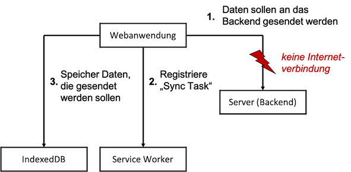
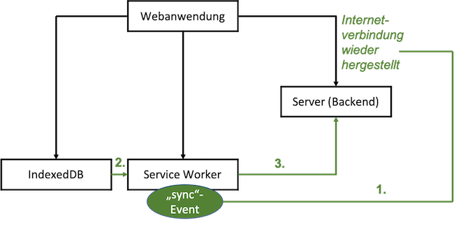
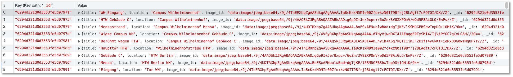
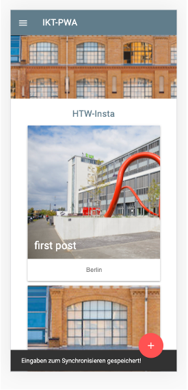

# Hintergrundsynchronisation


!!! hint
    Aktueller Stand vor Hintergrundsynchronisation:

    - [Frontend](https://github.com/jfreiheit/IKT-PWA-07)
    - [Backend](https://github.com/jfreiheit/IKT-PWA-BACKEND-01)
    - Collection [post](./files/posts.json)
    - Collection [post.files](./files/posts_files.json)
    - Collection [post.chunks](./files/posts_chunks.json)


Hintergrundsynchronisation erlaubt die Synchronisation von Daten, selbst dann, wenn die Anwendung offline ist. Diese "Synchronisation" erfolgt natürlich "asynchron". Angenommen, Sie geben offline Daten in die Anwendung ein und wollen diese versenden, z.B. an das Backend, dann wird dieser Request so lange in Ihrer Anwendung gespeichert, bis Sie wieder online sind und erst dann ausgeführt. 

Das Situation ist die Folgende:



Es sollen Daten an das Backend gesendet werden, aber die Internetverbindung ist unterbrochen. Deshalb werden die Daten in die IndexedDB gespeichert und im Service Worker wird eine *Sync Task* registriert. 



Sobald die Verbindung wieder steht, wird ein *Sync*-Event im Service Worker ausgelöst und dieser sendet die Daten an das Backend (`POST-Request`).

Dadurch, dass der Service Worker diesen `POST-Request` ausführt (und die Daten dabei mitsendet), kann die Hintergrundsynchronisation sogar dann stattfinden, wenn die Webanwendung bereits geschlossen ist! Deshalb sollten wir einfach immer beim Senden von Daten eine *Sync Task* registrieren, weil es sein kann, dass die Daten noch gar nicht vollständig gesendet wurden, bevor wir den Browsertab schließen. 

## Aktueller Stand Daten senden

Wir schauen uns zunächst nochmal an, wie wir derzeit die Daten, die wir über das Eingabeformular eingeben, speichern. Wenn wir den `Speichern`-Button drücken, wird das `Submit`-Ereignis des Formulars ausgelöst. Dies behandeln wir wie folgt:


=== "/src/js/feed.js" 
```js linenums="239"
form.addEventListener('submit', event => {
    event.preventDefault(); // nicht absenden und neu laden

    if (file == null) {
        alert('Erst Foto aufnehmen!')
        return;
    }
    if (titleInput.value.trim() === '' || locationInput.value.trim() === '') {
        alert('Bitte Titel und Location angeben!')
        return;
    }

    closeCreatePostModal();

    titleValue = titleInput.value;
    locationValue = locationInput.value;
    console.log('titleInput', titleValue)
    console.log('locationInput', locationValue)
    console.log('file', file)

    sendDataToBackend();
});
```

Wir verhindern zunächst das Standardverhalten beim `submit`-Ereignis, nämlich das Absenden der Daten und das Neuladen der Seite (Zeile `240`). In Zeile `242` prüfen wir, ob die `file`-variable belegt ist, d.h. ob wir bereits ein Foto aufgenommen haben und in Zeile `246` prüfen wir, ob beide `input`-Elemente, also sowohl für `title`, als auch für `location` einen Wert enthalten. Die JavaScript-`trim()`-Funktionen entfernt "Leerzeichen" aller Art am Ende des Strings (auch Tabs, Zeilenumbrüche etc.). Sollte eines der beiden (oder beide) Eingabefelder leer sein, beenden wir die Funktion mit einem `alert` und bleiben in dem Formular. `alert` ist natürlich nicht so toll, ein `toast` wäre viel besser, aber wir haben in unserer `index.html` nur einen `toast` für das erfolgreiche Speichern vordefiniert. Wenn beide Eingabefelder befüllt und ein Foto (in `file`) gespeichert sind, schließen wir das Formulatfenster (Zeile `251`) und senden die Daten an das Backend (Zeile `259`). Die `sendDataToBackend()`-Funktion sieht wie folgt aus:

=== "/src/js/feed.js" 
```js linenums="212"
function sendDataToBackend() {
    const formData = new FormData();
    formData.append('title', titleValue);
    formData.append('location', locationValue);
    formData.append('file', file);

    console.log('formData', formData)
   
    fetch('http://localhost:3000/posts', {
        method: 'POST',
        body: formData
    })
    .then( response => {
        console.log('Data sent to backend ...', response);
        return response.json();
    })
    .then( data => {
        console.log('data ...', data);
        const newPost = {
            title: data.title,
            location: data.location,
            image_id: imageURI
        }
        updateUI([newPost]);
    });
}
```

Es wird ein `FormData`-Objekt erstellt, da wir im `body` nicht nur Textfelder, sondern auch ein `file`-Objekt mitschicken. Mit der `POST`-Methode an das Backend wird dieses befüllte `FormData`-Objekt gesendet. Da dieses Objekt in der `file`-Eigenschaft aber ein `File`-Objekt enthält, die `updateUI()`-Funktion an dem Schlüssel `image_id` aber den `base64`-String des Bildes erwartet, übergeben wir dieser Funktion ein modifiziertes `Post`-Objekt. 

Schauen wir uns auch nochmal die IndexedDB an:



Wir sehen, dass in dem Store `posts` der IndexedDB die Datensätze mit ihrer `_id` und in `image_id` mit ihrem `base64`-String gespeichert sind. Die `_id` erhält der Datensatz aber erst durch die MongoDB, wo der Wert für `_id` automatisch erzeugt wird. Angenommen, wir wollen diese Daten nun zunächst in der IndexedDB zwischenspeichern und erst, wenn die Verbindung zum Backend besteht, an das Backend weiterleiten, benötigen wir in der IndexedDB einen anderen Store, der anders aufgebaut ist, als der `posts`-Store. Bevor wir uns darum kümmern, erweiteren wir die `Submit`-Behandlung jedoch erst um die Registrierung an die *Sync Task*. 

#### Sync Task registrieren

Wenn wir das Formular absenden und die in dem Formular eingegebenen Daten speichern wollen, steuern wir dies nun über eine *Sync Task*. Diese *Sync Task* sorgt dafür, dass die Daten (irgendwann) tatsächlich gespeichert werden, auch wenn wir gerade offline sind oder während des Speicherns offline geschaltet werden. Für eine solche *Sync Task* existiert die [SyncManager-API](https://developer.mozilla.org/en-US/docs/Web/API/SyncManager). Wenn Sie auf diesen Link klicken, dann sehen Sie, dass die `SyncManager-API`

1. nur 2 Methoden besitzt, nämlich `register()` und `getTags()` und 
2. dass sie bis jetzt leider nur von Chrome und Edge unterstützt wird. Allerdings auch in allen Android-Geräten (mit Chrome oder WebView) und somit trotzdem eine große Reichweite besitzt. 

Wir erweitern die Anmeldung an den Listener für das `submit`-Event zunächst wie folgt:


=== "/src/js/feed.js" 
```js linenums="239" hl_lines="21-26"
form.addEventListener('submit', event => {
    event.preventDefault(); // nicht absenden und neu laden

    if (file == null) {
        alert('Erst Foto aufnehmen!')
        return;
    }
    if (titleInput.value.trim() === '' || locationInput.value.trim() === '') {
        alert('Bitte Titel und Location angeben!')
        return;
    }

    closeCreatePostModal();

    titleValue = titleInput.value;
    locationValue = locationInput.value;
    console.log('titleInput', titleValue)
    console.log('locationInput', locationValue)
    console.log('file', file)

    if('serviceWorker' in navigator && 'SyncManager' in window) {
        navigator.serviceWorker.ready
            .then( sw => {
                sw.sync.register('sync-new-post');
            });
	}

    sendDataToBackend();
});
```

In diesem kleinen Code-Stückchen sind einige Dinge beachtenswert. Erstens, wird die `SyncManager-API` vom Service Worker verwendet, aber wir sind hier ja in `feed.js`, also in der Webanwendung. Wir können die Registrierung an die *Sync Task* nicht einfach in die `sw.js` schreiben, da das auslösende Ereignis der Registrierung (nämlich das Absenden des Formulars) in der Webanwendung stattfindet und wir dieses Ereignis in `feed.js` behandeln. Wir benötigen in `feed.js` also einen Zugriff auf den Service Worker. 

Dazu fragen wir zunächst, ob der Service Worker überhaupt durch den Browser unterstützt wird und auch, ob die `SyncManager-API` durch den Browser unterstützt wird. Dies geschieht in Zeile `260`. Dort fällt auf, dass der Service Worker eine Eigenschaft von `navigator` ist, die `SyncManager-API` eine Eigenschaft von `window`. [Window](https://developer.mozilla.org/de/docs/Web/API/Window) ist das Fenster, das ein DOM Dokument (also eine Webanwendung) enthält. Eine Eigenschaft von `window` ist `navigator` (also `window.navigator`). Das [Navigator](https://developer.mozilla.org/de/docs/Web/API/Window/navigator)-Objekt liefert Informationen über den Browser, in dem die Anwendung ausgeführt wird. 

Die (`readonly`)-Eigenschaft `ready` eines Service Workers ist eine Promise, welche `resolved` ist, sobald der Service Worker `active` ist. Siehe [hier für `ready`](https://developer.mozilla.org/en-US/docs/Web/API/ServiceWorkerContainer/ready). Über diese Promise erlangen wir Zugriff auf den Service Worker in unserer Webanwendung. Die [sync](https://developer.mozilla.org/en-US/docs/Web/API/ServiceWorkerRegistration/sync)-Eigenschaft ist in dem Interface [ServiceWorkerRegistration](https://developer.mozilla.org/en-US/docs/Web/API/ServiceWorkerRegistration) definiert. Die `register()`-Funktion ist eine der beiden Methoden aus der `SyncManager-API` und registriert eine *Sync Task*. Jeder *Sync Task* wird ein `tag` zugewiesen (ähnlich einer `id`). Über diesen `tag` kann später auf diese *Sync Task* zugegriffen werden. Wir haben dieser *Sync Task* den `tag` `'sync-new-post'` gegeben. 

Die *Sync Task* ist nun registriert. Allerdings weiß der Service Worker noch gar nicht, was er bei dieser *Sync Task* überhaupt synchronisieren soll. Das definieren wir jetzt.

#### Daten in die IndexedDB speichern

Die Daten, die (später) synchronisert werden sollen, werden zunächst in der IndexedDB gespeichert. Dort können Sie so lange bleiben, bis die Webanwendung (wieder) online ist, um dann an das Backend durch den Service Worker gesendet zu werden. Dazu erzeugen wir uns ein passendes JavaScript-Objekt `post`:


=== "/src/js/feed.js" 
```js linenums="239" hl_lines="21-26"
form.addEventListener('submit', event => {
	event.preventDefault(); // nicht absenden und neu laden

	if (file == null) {
	    alert('Erst Foto aufnehmen!')
	    return;
	}
	if (titleInput.value.trim() === '' || locationInput.value.trim() === '') {
	    alert('Bitte Titel und Location angeben!')
	    return;
	}

	closeCreatePostModal();

	titleValue = titleInput.value;
	locationValue = locationInput.value;

    if('serviceWorker' in navigator && 'SyncManager' in window) {
        navigator.serviceWorker.ready
            .then( sw => {
            	let post = {
                    id: new Date().toISOString(),
                    title: titleValue,
                    location: locationValue,
                    image_id: file    	// file durch den Foto-Button belegt
            	};
                sw.sync.register('sync-new-post');
            });
    }
});
```

Die `id` wurde hinzugefügt, um einen eindeutigen Identifier für den `post` in der IndexedDB zu haben (`keyPath`). Damit der Wert auch eindeutig ist, wird der Zeitstempel zum String umgewandelt und verwendet (Zeile `260`). 

Diesen `post` wollen wir nun in die IndexedDB speichern. Dazu steht uns aus der `db.js` die Funktion `writeData()` zur Verfügung. Diese Funktion erwartet als ersten Parameter den `Store`, in dem wir den `post` speichern wollen. Derzeit haben wir einen `Store` in unserer IndexedDB definiert, den `Store` `posts`:


=== "/src/js/db.js" 
```js linenums="2" hl_lines="4"
const db = idb.openDB('posts-store', 1, {
    upgrade(db) {
        // Create a store of objects
        const store1 = db.createObjectStore('posts', {
            // The '_id' property of the object will be the key.
            keyPath: '_id',
            // If it isn't explicitly set, create a value by auto incrementing.
            autoIncrement: true,
        });
        // Create an index on the '_id' property of the objects.
        store1.createIndex('_id', '_id');
    },
});
```

Diesen `Store` (ursprünglich hieß die Variable noch `store`, wir haben hier bereits `store1` daraus gemacht, könnte aber auch `store` bleiben) verwenden wir aber, um unsere Daten aus der Datenbank/dem Backend zu *cachen*. Wir verwenden ihn zum Schreiben und Lesen der Daten aus unserer Datenbank. Für das Synchroniseren der neuen Daten benötigen wir deshalb einen weiteren `Store`. Dazu kopieren wir einfach die `Store`-Erstellung in der `db.js` und nennen den neuhinzugekommen `Store` `sync-posts` (wir nennen die `id` hier auch `id` und nicht `_id`):


=== "/src/js/db.js" 
```js linenums="2" hl_lines="10-12"
const db = idb.openDB('posts-store', 1, {
    upgrade(db) {
		// Create a store of objects
        const store1 = db.createObjectStore('posts', {
            keyPath: '_id',
        });
        store1.createIndex('_id', '_id');
        
        // Create another store of objects
        const store2 = db.createObjectStore('sync-posts', {
            keyPath: 'id',
        });
        store2.createIndex('id', 'id');
    },
});
```

Gleichzeitig habe ich auch noch ein bisschen den Code gekürzt. Die Kommentare sind raus und das `autoIncrement: true` ist auch Standard, deshalb muss es nicht mit angegeben werden. Wenn wir die Anwendung nun ausführen, sehen wir unter `IndexedDB`, dass ein weiterer `Store` hinzugekommen ist:


Diesen Store verwenden wir nun, um die neuen `post`-Daten in die IndexedDB zu schreiben:

=== "/src/js/feed.js" 
```js linenums="239" hl_lines="31-34"
form.addEventListener('submit', event => {
	event.preventDefault(); // nicht absenden und neu laden

	if (file == null) {
	    alert('Erst Foto aufnehmen!')
	    return;
	}
	if (titleInput.value.trim() === '' || locationInput.value.trim() === '') {
	    alert('Bitte Titel und Location angeben!')
	    return;
	}

	closeCreatePostModal();

	titleValue = titleInput.value;
	locationValue = locationInput.value;
	console.log('titleInput', titleValue)
	console.log('locationInput', locationValue)
	console.log('file', file)

	if('serviceWorker' in navigator && 'SyncManager' in window) {
	    navigator.serviceWorker.ready
	        .then( sw => {
	            let post = {
	                id: new Date().toISOString(),
	                title: titleValue,
	                location: locationValue,
	                image_id: file
	            };
	       
	            writeData('sync-posts', post)
		            .then( () => {
		                sw.sync.register('sync-new-post');
		            });
	        });
	}
});
```

Die Registrierung der *Sync Task* ist nur dann sinnvoll, wenn die Daten auch tatsächlich in der IndexedDB gespeichert wurden. Deshalb erfolgt die Registrierung in dem `resolved`-Pfad der `writeData`-Promise. 

Jetzt können wir noch unseren `toast` verwenden, den wir in der `index.html` definiert haben. Hierbei handelt es sich um eine *Material Design Lite*-Komponente [Snackbar](https://getmdl.io/components/#snackbar-section):

=== "/index.html"
	```html linenums="98"
    <div id="confirmation-toast" aria-live="assertive" aria-atomic="true" aria-relevant="text" class="mdl-snackbar mdl-js-snackbar">
        <div class="mdl-snackbar__text"></div>
        <button type="button" class="mdl-snackbar__action"></button>
    </div>
	```


In der `feed.js` verketten wir die Promise für das Schreiben der Daten in die IndexedDB weiter und bestätigen dies mit einer Snackbar-Nachricht:


=== "/src/js/feed.js" 
```js linenums="239" hl_lines="33 35-39"
form.addEventListener('submit', event => {
	event.preventDefault(); // nicht absenden und neu laden

	if (file == null) {
	    alert('Erst Foto aufnehmen!')
	    return;
	}
	if (titleInput.value.trim() === '' || locationInput.value.trim() === '') {
	    alert('Bitte Titel und Location angeben!')
	    return;
	}

	closeCreatePostModal();

	titleValue = titleInput.value;
	locationValue = locationInput.value;
	console.log('titleInput', titleValue)
	console.log('locationInput', locationValue)
	console.log('file', file)

	if('serviceWorker' in navigator && 'SyncManager' in window) {
	    navigator.serviceWorker.ready
	        .then( sw => {
	            let post = {
	                id: new Date().toISOString(),
	                title: titleValue,
	                location: locationValue,
	                image_id: file
	            };
	       
	            writeData('sync-posts', post)
		            .then( () => {
		                return sw.sync.register('sync-new-post');
		            })
		            .then( () => {
		                let snackbarContainer = new MaterialSnackbar(document.querySelector('#confirmation-toast'));
		                let data = { message: 'Eingaben zum Synchronisieren gespeichert!', timeout: 2000};
		                snackbarContainer.showSnackbar(data);
		            });
	        });
	}
});
```

Beachten Sie, dass Sie das `return` in Zeile `271` einfügen, damit die Promise verkettet werden kann. Nachdem Sie nun Daten in das Formular eingegeben und auf `Speichern` geklickt haben, erscheint für 2 Sekunden unten eine Bestätigungsnachricht:





#### Ein Fallback

Wir haben festgelegt, was passieren soll, wenn der Browser *Service Worker* und die *SyncManager-API* unterstützt. Wir sollten jedoch ein *Fallback* einbauen für den Fall, dass das nicht der Fall ist. Viel bleibt uns für diesen Fall nicht übrig, zu tun. Wir können nur versuchen, die Daten, die wir in das Formular eingegeben haben, sofort an das Backend zu senden. Wir fügen dazu den Aufruf der `sendDataToBackend()`-Funktion im `else`-Fall für die Behandlung des `submit`-Ereignisses auf:


=== "/src/js/feed.js" 
```js linenums="239" hl_lines="41-42"
form.addEventListener('submit', event => {
    event.preventDefault(); // nicht absenden und neu laden

    if (file == null) {
        alert('Erst Foto aufnehmen!')
        return;
    }
    if (titleInput.value.trim() === '' || locationInput.value.trim() === '') {
        alert('Bitte Titel und Location angeben!')
        return;
    }

    closeCreatePostModal();

    titleValue = titleInput.value;
    locationValue = locationInput.value;
    console.log('titleInput', titleValue)
    console.log('locationInput', locationValue)
    console.log('file', file)

    if('serviceWorker' in navigator && 'SyncManager' in window) {
        navigator.serviceWorker.ready
            .then( sw => {
                let post = {
                    id: new Date().toISOString(),
                    title: titleValue,
                    location: locationValue,
                    image_id: file
                };
           
                writeData('sync-posts', post)
                .then( () => {
                    return sw.sync.register('sync-new-post');
                })
                .then( () => {
                    let snackbarContainer = new MaterialSnackbar(document.querySelector('#confirmation-toast'));
                    let data = { message: 'Eingaben zum Synchronisieren gespeichert!', timeout: 2000};
                    snackbarContainer.showSnackbar(data);
                });
            });
	} else {
        sendDataToBackend();
	}
});
```


Dieser Fallback lässt sich ausprobieren, indem man dafür sorgt, dass die Bedingung `if('serviceWorker' in navigator && 'SyncManager' in window)` `false` ist (z.B. `&& false`). Nun kümmern wir uns darum, dass das `sync`-Ereignis im Service Worker behandelt wird. Das geschieht immer dann, wenn der Service Worker erkennt, dass die Internetverbindung wieder hergestellt wurde. 


#### Ereignisbehandlung des `sync`-Events

Wenn der Service Worker erkennt, dass die Verbindung zum Internet wieder hergestellt ist, wird automatisch das `sync`-Event ausgelöst. Dieses Ereignis wird auch dann ausgelöst, wenn die Internetverbindung besteht **und** eine *Sync Task* registriert wurde. Wir wollen in diesem Fall die Daten aus der IndexedDB an das Backend senden. Dazu erweitern wir die `sw.js` um die Behandlung des `sync`-Ereignisses. Wir fügen diese Ereignisbehandlung an das Ende der `sw.js` ein:


=== "sw.js" 
```js linenums="98"
self.addEventListener('sync', event => {
    console.log('service worker --> background syncing ...', event);
    if(event.tag === 'sync-new-post') {
        console.log('service worker --> syncing new posts ...');
        event.waitUntil(
            readAllData('sync-posts')
                .then( dataArray => {
                    for(let data of dataArray) {
                        console.log('data from IndexedDB', data);
                        // diese Daten an das Backend senden (siehe Fallback)
                    }
                })
        );
    }
})
```

Wir fügen dem Service Worker also einen `EventListener` hinzu, wie wir das bereits von den anderen Ereignisbehandlungen im Service Worker kennen. Das `sync`-Ereignis gibt auch die `tags` zurück, unter denen *Sync Tasks* gespeichert wurden. In unserem Fall war der verwendete `tag` `sync-new-post`. Wir verwenden auch erneut `event.waitUntil()`, um sicherzustellen, dass die Ereignisbehandlung nicht eher verlassen wird, bis alle definierten Anweisungen darin vollständig abgearbeitet wurden. Als erstes greifen wir dann lesend auf die IndexedDB unter Verwendung der `readAllData()`-Methode aus der `db.js`.

Diese Methode gibt ein Array aller gespeicherten Datensätze in der IndexedDB im Store `sync-posts` zurück. Mit einer `for`-Schleife betrachten wir jeden einzelnen Datensatz. Wir "wissen", dass ein solcher Datensatz ein JavaScript-Objekt mit den Eigenschaften `id`, `title`, `location` und `image_id` ist. 

Wir erweitern diese Behandlung nun um den Code, den wir zuvor für die Funktion `sendDataToBackend()` verwendet haben. Wir senden die Daten an das Backend. Dazu können wir uns den Code von der Fallback-Implementierung kopieren und anpassen:


=== "sw.js" 
```js linenums="98" hl_lines="10-29"
self.addEventListener('sync', event => {
    console.log('service worker --> background syncing ...', event);
    if(event.tag === 'sync-new-post') {
        console.log('service worker --> syncing new posts ...');
        event.waitUntil(
            readAllData('sync-posts')
                .then( dataArray => {
                    for(let data of dataArray) {
                        console.log('data from IndexedDB', data);
                        const formData = new FormData();
                        formData.append('title', data.title);
                        formData.append('location', data.location);
                        formData.append('file', data.image_id);

                        console.log('formData', formData)
                    
                        fetch('http://localhost:3000/posts', {
                            method: 'POST',
                            body: formData
                        })
                        .then( response => {
                            console.log('Data sent to backend ...', response);
                            if(response.ok) {
                                deleteOneData('sync-posts', data.id)
                            }
                        })
                        .catch( err => {
                            console.log('Error while sending data to backend ...', err);
                        })
                    }
                })
        );
    }
})
```

Für die Daten, die an das Backend gesendet werden, wird nun, im Gegensatz zum Fallback, auf `data` zugegriffen, da wir ja die Daten senden, die aus der IndexedDB ausgelesen werden. Wenn die Daten erfolgreich an das Backend übertragen worden sind (`response.ok` in Zeile `120`), dann werden diese Daten mithilfe der `deleteOneDate()`-Funktion (aus `db.js`) gelöscht, da sie in der IndexedDB nicht weiter benötigt werden. Der Store `sync-posts` ist ja "nur" dazu da, die Daten so lange zwischenzuspeichern, bis sie ins Backend (in die persistente Datenbank) gesendet sind. Sollte stattdessen ein Fehler auftreten, wird er mithilfe von `catch()` abgefangen und dort ausgegeben. 

Wenn wir nun neue Daten in das Formular eingeben und auf `Speichern` klicken, werden die Daten zum Backend gesendet - eventuell nicht gleich, sondern erst dann, wenn die Anwendung (und somit das Backend) wieder online ist.


Das Ausprobieren der späteren Hintergrundsynchronisation erfolgt am Sichersten dadurch, dass Sie den Rechner komplett vom WLAN trennen. Das Offline-Schalten des Service Workers genügt dazu häufig nicht (bzw. wird beim Online-Schalten dann manchmal kein `sync`-Ereignis ausgelöst).

1. Schalten Sie das WLAN an Ihrem Rechner aus. 
2. Geben Sie über das Formular der Anwendung neue Daten ein und drücken Sie auf den `Speichern`-Button. 
3. Schauen Sie in den Developer Tools unter `IndexedDB` in den Store `sync-posts`. Dort sollten die neuen Daten nun gespeichert sein. 
4. Schalten Sie das WLAN wieder ein. Auf der Konsole erscheint die `fetch`-Nachricht für `POST "http://localhost:3000/posts"`.
5. In der persistenten Datenbank stehen die neuen Daten. 
6. Nach einem Reload der Anwendung werden diese Daten aus der Datenbank über das Backend gelesen (ohne Bilder) und erscheinen als weitere `Cards`.


!!! success
	Wir haben die Hintergrundsynchronisation implementiert! Das Senden der Daten an das Backend erfolgt über das Registrieren einer *Sync Task* und dem (zwischen-)Speichern der zu sendenden Daten in der IndexedDB. Durch die Ereignisbehandlung des `sync`-Ereignisses werden diese Daten an das Backend (und darüber in die Datenbank) geschrieben. Das `sync`-Ereignis wird ausgelöst, wenn der Service Worker online und eine *Sync Task* registriert ist. Wir können nun Daten eingeben und speichern, egal, ob wir online oder offline sind. Die Anwendung kann sogar geschlossen sein und trotzdem synchronisiert der Service Worker. 


