# Caching mit Service Workern

Caching ist ein Konzept, um Ressourcen zu speichern, um sie nicht wieder vom Server laden zu müssen. Browser verfügen über eigene Caches ("Pufferspeicher") und darin können Browser Bilder, CSS-Dateien, JavaScript-Dateien und andere Mediadateien (z.B. pdf) speichern, um diese nicht erneut vom Webserver laden zu müssen. Das Caching beschleunigt das wiederholte Laden von Webseiten. 

Caching mit service workern verfolgt das gleiche Prinzip. Auch hier werden Ressourcen in einen Cache geladen. Der Vorteil hierbei ist jedoch nicht das schnellere Laden beim Wiederholen, sondern die Möglichkeit zu eröffnen, die Webanwendung auch (teilweise) **offline** auszuführen. Mit dem Service-Worker-Caching bieten wir somit die Fähigkeit des *Offline-Modus* unserer Anwendung. Die Verwendung eines Caches durch einen *service worker* erfolgt mithilfe der [Cache API](https://developer.mozilla.org/de/docs/Web/API/Cache).

## Die Cache API

Die [Cache API](https://developer.mozilla.org/de/docs/Web/API/Cache) verfolgt ein ganz simples Konzept. Mithilfe der Cache API werden einfach (Schlüssel-/Werte-)Paare von *Requests* und *Responses*  gespeichert. Auf den *Cache* (also auf die Menge aller gespeicherten Request-/Response-Paare) können sowohl service worker als auch das JavaScript der Webanwendung zugreifen. Allerdings kann es ja sein, dass das "normale" JavaScript der Webanwendung (noch) nicht geladen werden kann, weil z.B. die Internetverbindung zu schwach ist oder nicht vorhanden, ein service worker kann aber trotzdem bereits Daten aus dem Cache liefern, ohne überhaupt einen Request über das Internet zu senden. 

Wichtig ist noch zu betonen, dass die Cache API (noch) nicht von besonders vielen Browsern unterstützt wird. Das sieht man [hier](https://developer.mozilla.org/de/docs/Web/API/Cache), wenn Sie nach ganz unten scrollen. Im Prinzip funktioniert es nur (vollständig) mit Chrome, Firefox und Opera.

## Bereinigen des HTW-Insta-Projektes

Bevor wir unseren Service-Worker-Cache implementieren, bereinigen wir zunächst noch unser HTW-Insta-Projekt. Aus der `public/src/js/app.js` entfernen wir den gesamten Code, der sich auf Promises und die Fetch API bezog. Die `app.js` sieht nun (wieder) so aus:

=== "public/src/js/app.js"
	```javascript
	if ('serviceWorker' in navigator) {
	    navigator.serviceWorker
	        .register('/sw.js')
	        .then(() => {
	            console.log('service worker registriert')
	        })
	        .catch(
	            err => { console.log(err); }
	        );
	}
	```

In der `public/sw.js` (also in unserem *service worker*), löschen wir die Ausgaben auf die Konsole für das `fetch`-Event. Stattdessen fügen wir eine `respondWith()`-Funktion ein:

=== "public/sw.js"
	```javascript hl_lines="11"
	self.addEventListener('install', event => {
	    console.log('service worker --> installing ...', event);
	})

	self.addEventListener('activate', event => {
	    console.log('service worker --> activating ...', event);
	    return self.clients.claim();
	})

	self.addEventListener('fetch', event => {
	    event.respondWith(fetch(event.request));
	})
	```

Die [respondWith()](https://developer.mozilla.org/en-US/docs/Web/API/FetchEvent/respondWith)-Funktion ist eine Funktion des `fetch`-Events (also `FetchEvent.respondWith()`). Sie sorgt einerseits dafür, den Browser von seiner Standardbehandlung des `FetchEvents` abzuhalten und stattdessen eine eigene `Promise` für die Behandlung des `FetchEvents` zu definieren. Die Standardsyntax ist:

```javascript
fetchEvent.respondWith(
  // Promise that resolves to a Response.
);
```

Hier ist ein Beispiel für die `respondWith()`-Funktion [aus](https://developer.mozilla.org/en-US/docs/Web/API/FetchEvent/respondWith):


```javascript linenums="1"
addEventListener('fetch', event => {
  // Prevent the default, and handle the request ourselves.
  event.respondWith(async function() {
    // Try to get the response from a cache.
    const cachedResponse = await caches.match(event.request);
    // Return it if we found one.
    if (cachedResponse) return cachedResponse;
    // If we didn't find a match in the cache, use the network.
    return fetch(event.request);
  }());
});
```

Darin wird für ein `fetch`-Event zunächst geprüft, ob der `request` im Cache vorhanden ist (Zeile `5`). Wenn ja, dann bekommt die Variable `cachedResponse` den Wert der `response` aus dem Cache (`match` liefert die `response` zum zugehörigen `request`). Wenn das der Fall ist, dann liefert `responseWith()` genau diese `response` aus dem Cache zurück. Wenn der `request` nicht im Cache gespeichert ist, dann wird einfach der `event.request` weitergeleitet, also nichts aus dem Cache genommen. 

In unserer derzeitigen Implementierung (highlighted Zeile `11` oben), wird noch nicht auf den Cache zugegriffen, sondern der `request` direkt an den Webserver weitergeleitet. Sollten Sie dafür einen Fehler bekommen, weil das `Promise` als nicht korrekt behandelt gilt, dann können Sie diese Zeile zunächst auch einfach auskommentieren. 

---

Eine etwas größere Änderung führen wir in der `public/src/js/feed.js` durch. Wir fügen statisch einen Blog-Eintrag hinzu. Die Anwendung sieht dann so aus:

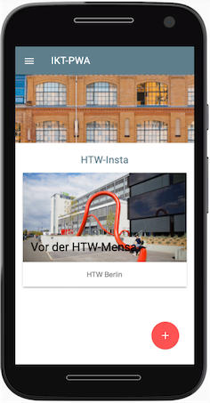

Schauen Sie in die `index.html`. In das folgende `<div id="shared-moments"></div>` fügen wir eine *Card* der Form `<div class="shared-moment-card mdl-card mdl-shadow--2dp"></div>` hinzu, welche das Foto und den Text enthält. Das passiert in einer Funktion `createCard()`:

=== "public/src/js/feed.js"
	```javascript linenums="1"
	let shareImageButton = document.querySelector('#share-image-button');
	let createPostArea = document.querySelector('#create-post');
	let closeCreatePostModalButton = document.querySelector('#close-create-post-modal-btn');
	let sharedMomentsArea = document.querySelector('#shared-moments');

	function openCreatePostModal() {
	  createPostArea.style.display = 'block';
	}

	function closeCreatePostModal() {
	  createPostArea.style.display = 'none';
	}

	shareImageButton.addEventListener('click', openCreatePostModal);

	closeCreatePostModalButton.addEventListener('click', closeCreatePostModal);

	function createCard() {
	  let cardWrapper = document.createElement('div');
	  cardWrapper.className = 'shared-moment-card mdl-card mdl-shadow--2dp';
	  let cardTitle = document.createElement('div');
	  cardTitle.className = 'mdl-card__title';
	  cardTitle.style.backgroundImage = 'url("/src/images/htw-gebaeude-h.jpg")';
	  cardTitle.style.backgroundSize = 'cover';
	  cardTitle.style.height = '180px';
	  cardWrapper.appendChild(cardTitle);
	  let cardTitleTextElement = document.createElement('h2');
	  cardTitleTextElement.className = 'mdl-card__title-text';
	  cardTitleTextElement.textContent = 'Vor der HTW-Mensa';
	  cardTitle.appendChild(cardTitleTextElement);
	  let cardSupportingText = document.createElement('div');
	  cardSupportingText.className = 'mdl-card__supporting-text';
	  cardSupportingText.textContent = 'HTW Berlin';
	  cardSupportingText.style.textAlign = 'center';
	  cardWrapper.appendChild(cardSupportingText);
	  componentHandler.upgradeElement(cardWrapper);
	  sharedMomentsArea.appendChild(cardWrapper);
	}

	fetch('https://jsonplaceholder.typicode.com/posts/1')
	    .then((res) => {
	      return res.json();
	    })
	    .then((data) => {
	      createCard();
	    });
	```

Zunächst wird in Zeile `4` auf das `div` mit der `id="shared-moments"` zugegriffen. In dieses `div` wird die *Card* eingefügt. Alles CSS-Klassen mit `mdl-` am Anfang sind Klassen von [Material Design Ligt](https://getmdl.io/). Für die CSS-Klasse `shared-moment-card` definieren wir in `public/src/css/feed.css` noch:

```css
.shared-moment-card.mdl-card {
  margin: 10px auto;
}
```

so, dass die *Card* einen Abstand vom Rand bekommt. Interessant ist vielleicht noch die Zeile `36` `componentHandler.upgradeElement(cardWrapper);`. Mit dieser Funktion müssen dynamisch erzeugte DOM-Elemente *registriert* werden, damit sie von Material Design Lite automatisch verwaltet werden. Siehe dazu [Uses MDL on dynamic websites](https://getmdl.io/started/).

### IKT-PWA-03 bei GitHub

Das Bild [htw-gebaeude-h.jpg](./files/htw-gebaeude-h.jpg) muss auch noch dem `public/src/images`-Ordner hinzugefügt werden. Die aktuelle Ausgangssituation unseres Projektes finden Sie [hier](https://github.com/jfreiheit/IKT-PWA-03).

Achten Sie bitte darauf, dass Sie (zumindest so lange wir uns mit dem Service-Worker-Cache beschäftigen) das Häkchen bei `Disable Cache` in den Developer Tools unter `Network` gesetzt haben: 

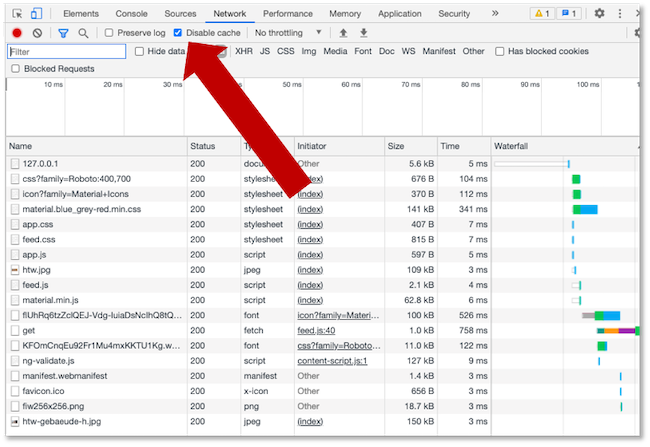

## Was soll in den Cache?

Zunächst überlegen wir uns, was überhaupt in den Cache soll und was nicht. Prinzipiell verfolgen wir mit dem Service-Worker-Cache die Idee, dass die Anwendung auch offline verwendbar bleiben soll. Wenn wir unsere aktuelle Anwendung betrachten, dann können wir unterscheiden zwischen 

- "statischen" und 
- "dynamischen" Inhalten.

Statisch ist im Prinzip der *Rahmen* unserer Anwendung, also im prinzip alles, was wir hatten vor unserem ersten Blog-Eintrag. Dieser *Rahmen* gibt uns das Gefühl, dass die Anwendung "läuft" - es fehlen nur die *dynamischen* Inhalte, also die Blog-Einträge. Stattdessen könnte man aber eine Meldung ausgeben, dass diese Inhalte derzeit nicht verfügbar sind. Das wäre alles jedenfalls besser als eine 404-Seite oder ein unendliches Warten oder das hier:

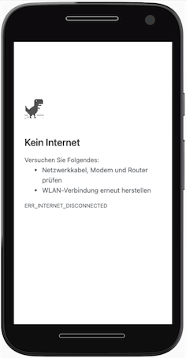

Der *Rahmen* einer Webanwendung wird auch *App-Shell* genannt. Wir wollen diese *App-Shell*  zunächst in unseren Service-Worker-Cache speichern. 

### Static caching/Precaching

Wir wollen zunächst die *statischen* Inhalte unserer Anwendung sin den Cache speichern. Dies geschieht beim Installieren (registrieren) des service workers. Das ist auch insofern praktisch, als dass der service worker ja nur dann neu registriert wird, wenn er geändert wurde. Ansonsten bleibt einfach der "alte" existent. 

Ziel ist es also, zunächst alles das in den Cache zu speichern, was unsere Webanwendung ausmacht:

- die `index.html`, 
- alle `*.css`-Dateien, die mittels `<link href="...">` in dieser `index.html` einegunden werden, 
- alle `*.js`-Dateien, die mittels `<script src="...">` in dieser `index.html` einegunden werden und 
- alle `*.png`-Dateien, die mittels `<link href="...">` in dieser `index.html` einegunden werden.

#### Den Service-Worker-Cache erstellen

Wir haben bereits eingangs festgelegt, dass wir den Cache in dem Moment anlegen wollen, in dem der service worker installiert wird. Das bedeutet, wir erstellen den Cache in der Ereignisbehandlung des Lebenszyklus-Event `install` des service workers, also hier (`sw.js`):

```javascript
self.addEventListener('install', event => {
    console.log('service worker --> installing ...', event);
    // hier soll der Cache "entstehen"
})
```

Den Service-Worker-Cache erstellen wir mithilfe der Anweisung `caches.open();`. Hierbei handelt es sich um eine Funktion von [CacheStorage](https://developer.mozilla.org/en-US/docs/Web/API/CacheStorage). Die Funktion `caches.open()` erzeugt ein `Cache`-Objekt, wenn es noch nicht existiert. Die Rückgabe (`response` der `Promise`) ist also ein `Cache`-Objekt. 

Man könnte nun annehmen, man schreibt einfach das hier:

```javascript linenums="1"
self.addEventListener('install', event => {
    console.log('service worker --> installing ...', event);
    caches.open(); 		// nicht gut!
})
```

Diese Idee ist aber nicht so gut, da wir immer im Hinterkopf behalten müssen, dass in einem service worker alles asynchron abgearbeitet wird. Das bedeutet, dass wir in diesem Fall bei der Baehandlung des `install`-Events zwei Anweisungen einfach "antriggern": die Ausgabe auf die Konsole (Zeile `2`) und das Erzeugen eines `Cache`-Objektes (Zeile `3`). Wie lange jedes einzelne braucht und wann etwas fertig ist, wissen wir nicht. Das bedeutet z.B. dass die Ereignisbehandlung des `install`-Events fertig ist, noch bevor die Ausgabe auf die Konsole und/oder das Erzeugen des `Cache`-Objektes abgeschlossen ist/sind. Das wiederum würde bedeuten, dass wir asynchron evtl. bereits `fetch`-Anfragen auslösen, noch bevor der `Cache` bereit ist. Um dieses Problem zu verhindern, betten wir die Erzeugung des `Cache`-Objektes in eine `event.waitUntil()`-Funktion ein. Erst wenn diese Funktion abgeschlossen ist, ist auch die Ereignisbehandlung des `install`-Events abgeschlossen (siehe auch [hier](https://developer.mozilla.org/en-US/docs/Web/API/CacheStorage#examples)). Das richtige Vorgehen ist also dieses:

```javascript linenums="1"
self.addEventListener('install', event => {
    console.log('service worker --> installing ...', event);
    event.waitUntil(
        caches.open('static')
            .then( cache => {
                console.log('Service-Worker-Cache erzeugt und offen');
            })
    );
})
```

`caches.open()` erzeugt also ein `Promise`, dessen `response` der erzeugte `Cache` ist. Wir konsumieren diesen `Cache` und geben zunächst nur eine Ausgabe auf der Konsole aus. 

Der Parameter `'static'` in `caches.open()` ist ein Name für den Cache. Die Namen sind frei wählbar und man kann verschiedene Namen vergeben. Das sind dann jeweils eine Art "Unter"-Caches (oder *sub caches*) im Service-Worker-Cache. 

#### Eine Ressource in den Cache speichern

Nun kann der Cache entsprechend mit `request`-`response`-Schlüssel-Werte-Paaren befüllt werden. Die auf den Cache anwenbaren Funktionen sind [hier](https://developer.mozilla.org/en-US/docs/Web/API/Cache) dokumentiert. Es sind `match(request, options)`,  `matchAll(request, options)`, `add(request)`, , `addAll(request)`, `put(request, response)`, `delete(request, options)` und , `keys(request, options)`. Alle liefern natürlich ein `Promise` zurück. 

Um die *statischen* Inhalte unserer Webanwendung in den Cache zu laden, verwenden wir die `add(request)`-Funktion. Diese Funktion macht folgendes:

- sie führt den `request` aus (`fetch(request)`) und 
- speichert die `response` (also die angefragte Ressource) --> dieses Speichern entspricht einem `put(request, response)` im Cache.

Wenn wir also folgendes implementieren:

```javascript linenums="1" hl_lines="7"
self.addEventListener('install', event => {
    console.log('service worker --> installing ...', event);
    event.waitUntil(
        caches.open('static')
            .then( cache => {
                console.log('Service-Worker-Cache erzeugt und offen');
                cache.add('/src/js/app.js');    // relativ vom public-Ordner
            })
    );
})
```

, dann wird beim Initialisieren des service workers die Ressource `public/src/js/app.js` beim Webserver angefragt und die `response`, also die `app.js` im Cache gespeichert. Wenn wir unsere Anwednung so ausführen, dann sehen wir in den DeveloperTools im Reiter `Application` im `Cache Storage` den Cache `static` und darin die gespeicherte Ressource `/src/js/app.js`. 

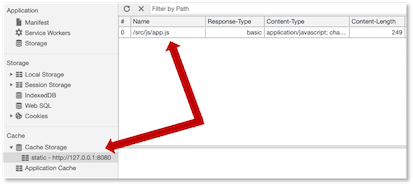

#### Eine Ressource aus dem Cache lesen

Jetzt haben wir einen Ressource in den Cache geladen, aber wir verwenden sie noch nicht, da wir in der bisherigen Behandlung des `fetch`-Events den Cache noch nicht nutzen. Zur Erinnerung: bei der Behandlung des `fetch`-Events wirkt der *service worker* wie ein Proxy. Er "schaltet" sich zwischen die Webanwendung und die Anfrage dieser an den Webserver. In unserer derzeitigen Implementierung des `fetch`-Events wird der `request` einfach an den Webserver durchgeschleust, ohne irgendetwas damit zu tun. Das wollen wir nun ändern:

```javascript linenums="1"
self.addEventListener('fetch', event => {
    event.respondWith(
        caches.match(event.request)
            .then( response => {
                if(response) {
                    return response;
                } else {
                    return fetch(event.request);
                }
            })
    );
})
```

Wir reagieren auf das `fetch`-Ereignis zunächst mit der `respondWith()`-Funktion, die wir bereits [oben](./#bereinigen-des-htw-insta-projektes) besprochen haben. Diese Funktion verhindert die Ausführung des Standardverhaltens beim `fetch`, nämlich die Anfrage an den Webserver. Stattdessen fragen wir mithilfe der `caches.match()`-Funktion alle *sub caches* unseres Caches nach dem als Parameter übergebenen `request` an. Im Cache sind die Einträge als Schlüssel-Werte-Paare `request`-`response` abgespeichert. Findet sich der `request` im Cache, dann liefert die `Promise` ein `response`-Objekt zurück. Wenn das so ist (Zeile `5`), dann geben wir dieses `response`-Objekt an die Webanwendung zurück (Zeile `6`). Das ist dann also die aus dem Cache geladene Ressource. 

Wenn die `match()`-Funktion jedoch den Schlüssel `request` nicht im Cache gefunden hat (und somit auch keine `response`), gibt sie zwar trotzdem ein `Promise` zurück, aber dann ist die `response` `null`. Das bedeutet, dass die `if`-Abfrage in Zeile `5` ein `false` zurückgibt und wir somit Zeile `8` ausführen. Darin wird die Anfrage einfach an den Webserver weitergeleitet, die Ressource also vom Webserver geladen.

Wir überprüfen die Funktionalität dieser `fetch`-Ereignisbehandlung:

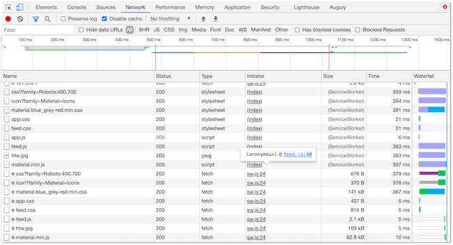

Unter dem Reiter `Network` in den DeveloperTools sehen wir, dass die `app.js` durch den Service Worker geladen wurde. Alle anderen Ressourcen wurden auch durch den Service Worker geladen, das liegt daran, dass wir im Service Worker die Anfrage an den Webserver durch den Service Worker durchschleusen. Wichtig ist aber, dass die `app.js` **nicht** vom Webserver geladen wurde. Das erkennen war daran, dass alle anderen Ressourcen mit ihren Größenangaben in der Tabelle stehen und dass damit gesagt, wurde, wieviel Bytes vom Webserver geladen wurden. Die `app.js` taucht dabei aber nicht auf. Sie wurde durch den Service Worker aus dem Service-Worker-Cache (`Cache Storage`) geladen!

Okay, das ist jetzt vielleicht noch nicht besonders eindrucksvoll, weil der Offline-Modus für unsere Webanwendung noch nicht funktioniert und wir bis jetzt nur die `app.js` in den Cache speichern und von dort bei einem `fetch()` laden. Dadurch sieht man noch nicht wirklich viel. Deshalb laden wir jetzt den *statischen* "Rest", insbesondere die `index.html` und die dazugehörigen `*.css`-Dateien. Zuvor jedoch noch eine kurze Anmerkung zu den Schlüssel-Werte-Paaren `request` und `response` im Cache:

### Schlüssel-Werte-Paare `request` und `response`

Wir laden jetzt unsere `index.html`-Datei in den Cache:

```javascript linenums="1" hl_lines="7"
self.addEventListener('install', event => {
    console.log('service worker --> installing ...', event);
    event.waitUntil(
        caches.open('static')
            .then( cache => {
                console.log('Service-Worker-Cache erzeugt und offen');             
                cache.add('/index.html');
                cache.add('/src/js/app.js');    // relativ vom public-Ordner
            })
    );
})
```

Wenn wir unsere Anwendung neu starten und den service worker erneut registrieren, dann sollte jetzt die `index.html` im Offline-Modus angezeigt werden (wenn auch ohne die CSS-Styles). Allerdings sieht die Anwendung nach dem Reload im Offline-Modus leider so aus wie auf der linken Seite der folgenden Abbildung gezeigt:

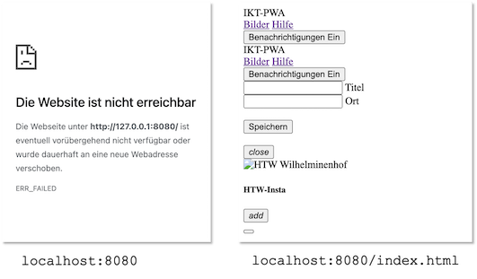

Der Grund dafür ist, dass wir die Anwendung mit `localhost:8080` (oder `127.0.0.1:8080`) aufrufen, der `request` also `/` ist. Im Cache gespeichert haben wir aber den `request` `/index.html`. Und tatsächlich, wenn wir `localhost:8080/index.html` (oder `127.0.0.1:8080/index.html`) aufrufen, dann wird der `request` `/index.html` im Cache gefunden und als `response` die `index.html` zurückgegeben (rechte Seite in der Abbildung). Wichtig ist also, dass wir bedenken, dass alle `requests`, für die wir `responses` im Cache hinterlegen wollen, auch tatsächlich in den Cache hinzugefügt werden. Unsere `sw.js` sollte also auch so aussehen:

```javascript linenums="1" hl_lines="7"
self.addEventListener('install', event => {
    console.log('service worker --> installing ...', event);
    event.waitUntil(
        caches.open('static')
            .then( cache => {
                console.log('Service-Worker-Cache erzeugt und offen'); 
                cache.add('/');            
                cache.add('/index.html');
                cache.add('/src/js/app.js');    // relativ vom public-Ordner
            })
    );
})
```

Dann erhalten wir auch das rechte Bild der Abbildung beim Aufruf von `localhost:8080` (oder `127.0.0.1:8080`) im Offline-Modus. Wir sollten also beachten, dass alle `requests`, die wir cachen wollen, auch tatsächlich in den Cache gespeichert werden.

### Alle statischen Ressourcen in den Cache laden

Wir laden jetzt alle *statischen* Ressourcen in den Cache, d.h. alles, was notwendig ist, um unsere Webanwendung auch im Offline-Modus so aussehen zu lassen, als würde sie "laufen". Dazu gehört natürlich die `index.html` und dann noch alle Ressourcen, die in der `index.html` eingebunden werden, also einige `*.js`-Dateien, einige `*.css`-Dateien und das Bild, das oben in der Webanwendung erscheint. 

Man könnte das alles mit einzelnen `cache.add()`-Funktionen erledigen, so wie oben. Dafür gibt es aber auch die `cache.addAll()`-Funktion, der ein Array aus lauter `requests` übergeben wird. Die Implementierung der `install`-Ereignisbehandlung in unserer `sw.js` sieht dann so aus:

```javascript linenums="1" hl_lines="7"
self.addEventListener('install', event => {
    console.log('service worker --> installing ...', event);
    event.waitUntil(
        caches.open('static')
            .then( cache => {
                console.log('Service-Worker-Cache erzeugt und offen'); 
                cache.addAll([
                    '/',
                    '/index.html',
                    '/src/js/app.js',
                    '/src/js/feed.js',
                    '/src/js/material.min.js',
                    '/src/css/app.css',
                    '/src/css/feed.css',
                    '/src/images/htw.jpg',
                    'https://fonts.googleapis.com/css?family=Roboto:400,700',
                    'https://fonts.googleapis.com/icon?family=Material+Icons',
                    'https://code.getmdl.io/1.3.0/material.blue_grey-red.min.css'
                ]);
            })
    );
})
```

Wenn wir nun unsere Anwendung neu starten und darauf achten, dass der neue Service Worker auch wirklich registriert wird und dann in den Offline-Modus schalten, dann sieht unsere Anwendung so aus:

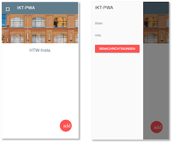

Wie auf der rechten Seite der Abbildung zu sehen ist, funktioniert auch das JavaScript, um zum Formular zu gelangen. Einige Sachen funktionieren im Offline-Modus nicht, weil wir sie nicht in den Cache geladen haben:

- die Hilfeseite (`/help/index.html` und die dazugehörige `help.css`) sowie
- den Blogeintrag, den wir bereits (statisch) vorgenommen haben (den binden wir gleich noch *dynamisch* ein).

Eine andere Sache fällt aber vielleicht auf: die Icons von Material Design Lite erscheinen nicht, d.h. das Menü links oben ist nur ein leeres Quadrat und auf dem roten runden Button fehlt das Plus, stattdessen steht dort `add`. 

Wenn wir diesem Problem nachgehen, dann sehen wir in den DeveloperTools unter dem Reiter `Network`, dass alle Ressourcen, die wir im Cache gespeichert haben, auch tatsächlich aus diesem Cache geladen werden:

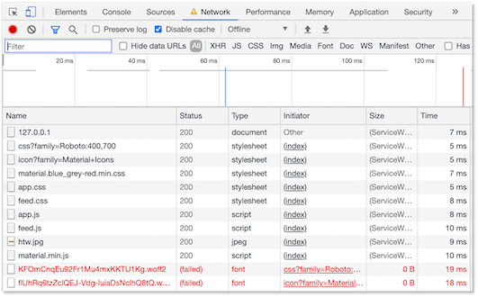

Zusätzlich schlagen aber noch "kryptische" GET-Anfragen fehl (die roten ganz unten in der Abbildung). Hier werden offensichtlich noch Anfragen an den Webserver gestellt, von denen wir gar nichts wussten und die wir nicht im Cache vorhalten. Wo kommen diese Anfragen her? Wenn wir dort in den DeveloperTools bspw. auf die Ressource `https://fonts.googleapis.com/icon?family=Material+Icons` klicken, dann erscheint daneben der Inhalt der geladenen Ressource und wir finden darin einen weiteren `request`, den wir aber nicht in unserem Cache hinterlegt haben (weil wir es gar nicht wussten):

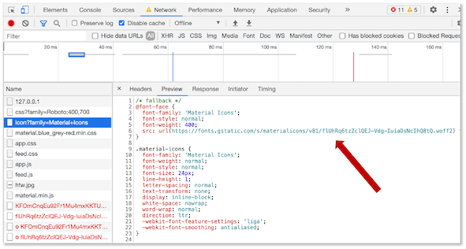

Diese Anfragen schlagen im Offline-Modus (natürlich) fehl und deshalb fehlen uns die Material Design Icons. Gut wäre es, wenn solche *dynamischen* Anfragen ebenfalls im Cache landen würden. Mit diesem *dynamischen* Caching beschäftigen wir uns deshalb jetzt:


## Dynamisches Caching

Bis jetzt haben wir mit `cache.add()` bzw. `cache.addAll()` vorab festgelegt, was in den Cache geladen werden soll. Das wird *statisches Caching* oder *pre-caching* genannt. Jetzt kümmern wir uns um sogenanntes *dynamisches Caching*. Manchmal möchte man gar nicht schon gleich zu Beginn alles in den Cache laden, um die "Installation", das erstmalige Aufrufen der Seite nicht zu aufwändig und somit zu langsam zu gestalten. Manchmal kennt man aber auch gar nicht die Ressourcen, die man noch zum Cache hinzufügen möchte, wie das obere Beispiel gezeigt hat, als wir die Material Icons nicht in den Cache geladen haben, weil wir diese Anfrage vorab gar nicht kannten. 

### Die Behandlung des fetch-Events erweitern

Wir schauen uns zunächst nochmal die aktuelle Behandlung des `fetch`-Events im *service worker* an:

```js linenums="1"
self.addEventListener('fetch', event => {
    event.respondWith(
        caches.match(event.request)
            .then( response => {
                if(response) {
                    return response;
                } else {
                    return fetch(event.request);
                }
            })
    );
})
```

Zur Erinnerung: mit dieser Behandlung schalten wir uns zwischen die Abfrage der Webseite an den Webserver. Diese Behandlung wirkt wie ein Proxy. Bei jeder Anfrage der Webseite an den Webserver wird diese Implementierung des `fetch`-Events aufgerufen. Wir erwidern den `request` mit einer `response`. 

Entweder kommt diese `response` aus dem Cache, nämlich dann, wenn `caches.match(event.request)` eine `response` zurückgibt. In diesem Fall wird die `response` zurück an die Webseite geschickt und der Webserver wird gar nicht mehr weiter angefragt. 

Oder wir leiten die Anfrage tatsächlich an den Webserver weiter (`return fetch(event.request);`), nämlich dann, wenn der `event.request` nicht als Schlüssel im Cache verfügbar ist und dieser deshalb keine `response` zurückgibt. An dieser Stelle fügen wir nun unser dynamisches Caching ein. Der Webserver wird mit einer `response` antworten und wir werden diese `response` in unseren Cache laden. 

Dazu benötigen wir zwei Dinge:

1. einen neuen, weiteren Cache, in dem wir den entsprechenden `request` und die `response` des Webservers speichern und
2. die `cache.put()`-Anweisung. `put()` unterscheidet sich von `add()` dahingehend, dass `add()` nur einen Parameter benötigt, nämlich den `request` und die `response` automatisch als ein Schlüssel-Werte-Paar (`request, response`) speichert, während `put()` beide Werte als Schlüssel-Werte-Paar speichert, d.h. zwei Parameter erwartet (`request`, `response`).

Ein erster Implementierungsversuch sieht so aus: 

```js linenums="7"
} else {
    return fetch(event.request)
        .then( res => {     		// nicht erneut response nehmen, haben wir schon
            caches.open('dynamic')      // neuer, weiterer Cache namens dynamic
                .then( cache => {
                    cache.put(event.request.url, res);		// hier die put-Anweisung
                })
        });
}
```

Die Zeilen `9-14` sind hinzugekommen. Die `fetch()`-Anweisung ist ein *Promise*, deshalb fügen wir ein `.then()` an. Die `response` müssen wir jetzt anders nennen, da es die Variable `response` ja bereits gibt und es jetzt um die `response` des Webservers geht, also nennen wir sie `res` (kann natürlich auch anders heißen). Dann öffnen wir einen neuen Cache, den wir `dynamic` nennen - kann auch anders heißen. Wenn der Cache noch nicht existiert, wird er durch `open()` erstellt. `open()` ist wiederum ein Promise, so dass wir `.then()` anknüpfen können und fügen in den Cache mithilfe von `put()` das Schlüssel-Werte-Paar (`event.request.url, res`) ein. 

Das wäre schon fast korrekt, aber es fehlt noch, dass wir die Response `res` natürlich an die Webseite zurückgeben wollen. Dazu fügen wir einerseits `return res;` ein, müssen aber auch dafür sorgen, dass die `res` auch an den `fetch()`-Aufruf zurückgegeben wird. Dehalb benötigen wir auch vor `caches.open()` noch ein `return`. 

Außerdem müssen wir noch einen weiteren Aspekt beachten. Wenn eine Response verwendet wird, wird sie *konsumiert*, d.h. verbraucht. Das ist so für Responses, auch wenn es nicht so wirklich nachvollziehbar und verständlich ist. Wir verwenden in unserem Code zwei Mal `res`, einmal um es in den Cache zu speichern und ein anderes Mal, um es an die Webseite zurückzugeben. In einer der beiden Verwendungen würde unsere `res` verbraucht/konsumiert werden und das andere Mal wäre sie leer. Kein Ahnung, warum das so ist ;-) . Aber wir benötigen an einer der beiden Stellen ein `res.clone()`, um den Clone der Response zu verwenden und die Response nicht zu "verbrauchen". Wir speichern den Clone der Response in den Cache (wir könnten auch die `res` in den Cache speichern und `res.clone()` zurückgeben). 

Die gesamte Implementierung sieht dann so aus: 

```js linenums="1"
self.addEventListener('fetch', event => {
    event.respondWith(
        caches.match(event.request)
            .then( response => {
                if(response) {
                    return response;
                } else {
                    return fetch(event.request)
                        .then( res => {     // nicht erneut response nehmen, haben wir schon
                            return caches.open('dynamic')      // neuer, weiterer Cache namens dynamic
                                .then( cache => {
                                    cache.put(event.request.url, res.clone());
                                    return res;
                                })
                        });
                }
            })
    );
})
```

Wenn wir nun die Anwendung ausführen ( `npm start`), dann in den `Offline`-Modus gehen und ein `Reload` im Browser durchführen, sehen wir, dass die Material-Icons nun auch im Offline-Modus vorhanden sind:


Wenn wir uns in den DeveloperTools unter `Application` auf der linken Seite unter `Cache` den `Cache Storage` anschauen, dann sehen wir, dass dort nun 2 Caches sind, der `static` und der `dynamic` Cache. 

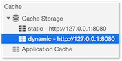

In dem `dynmic` Cache finden wir nun auch die Material Icons wieder

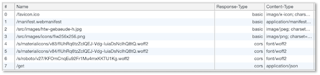

und unter dem `Network`-Reiter gibt es auch keine "Fehler" mehr, sondern alle Ressourcen werden vom Service Worker aus dem Cache geladen:

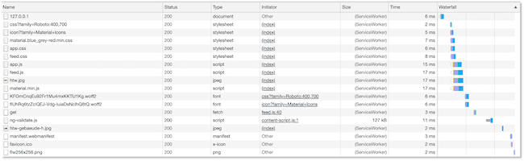

Als weiteres Zeichen, dass nun alle Inhalte dynamisch geladen werden, erkennen wir auch die "Mensa-Card" in unserer Anwendung im Offline-Modus. Diese hatten wir ja statisch nicht hinzugefügt. Probieren Sie auch einmal die "Hilfe-Seite" der Anwendung aus. Im Offline-Modus ist sie noch nicht verfügbar. Wenn wir aber wieder online gehen, die "Hilfe-Seite" aufrufen und dann wieder offline gehen, ist die Hilfe-Seite im Cache und wird angezeigt. 

### chrome.webRequest-API

Der Chromium-Browser hat eine eigene [API für Requests](https://developer.chrome.com/docs/extensions/reference/webRequest/) und schaltet sich bei Anfragen selbst dazwischen, um den Traffic zu analysieren und eventuelle Anfragen zu blockieren. Auch diese Anfragen lösen ein `fetch`-Event aus. Allerdings gibt es bei von Chromium ausgelösten Requests in dem `request` keine `url`-Eigenschaft. Vielleicht haben Sie einen solchen Fehler auch in Ihren DeveloperTools entdeckt. Eine Chromium-Anfrage unterscheidet sich von einer "normalen" Anfrage der Webseite an den Webserver dadurch, dass in einer "normalen" Anfrage die angefragte Ressource unter "`htttp://...`", also unter einer URL verfügbar ist. Um nun den fehlerhaften Zugriff auf die `url`-Eigenschaft von `request` bei einer Anfrage durch Chrome zu vermeiden, fügen wir ganz am Anfang der Ereignisbehandlung des `fetch`-Events noch die Abfrage ein, ob der `request` das Wort "`http`" enthält. Wenn nicht, verlassen wir die Behandlung des Events einfach:


```js linenums="1" hl_lines="2-4"
self.addEventListener('fetch', event => {
    // check if request is made by chrome extensions or web page
    // if request is made for web page url must contains http.
    if (!(event.request.url.indexOf('http') === 0)) return; // skip the request if request is not made with http protocol

    event.respondWith(
        caches.match(event.request)
            .then( response => {
                if(response) {
                    return response;
                } else {
                    return fetch(event.request)
                        .then( res => {     // nicht erneut response nehmen, haben wir schon
                            return caches.open('dynamic')      // neuer, weiterer Cache namens dynamic
                                .then( cache => {
                                    cache.put(event.request.url, res.clone());
                                    return res;
                                })
                        });
                }
            })
    );
})
```

### Versionierung von Caches

Wir haben nun sowohl statisch als auch dynamisch Ressourcen unserer Webanwendung geladen. Wenn wir eine Weile auf unserer Anwendung navigieren, laden wir nach und nach alle Ressourcen in den Cache, die unsere Anwendung ausmachen. Irgendwann können wir sie komplett offline betreiben. Alle Ressourcen sind im Cache und keine Ressourcen werden mehr vom Webserver geladen. 

Was passiert aber, wenn wir etwas ändern? Wenn wir den Service worker `sw.js` ändern, dann können wir dafür sorgen, dass er neu geladen wird. Der Service worker darf auch **niemals** in den Cache geladen werden, denn dann hätten wir eine unendliche Schleife, die immer wieder Ressourcen in den Cache lädt! Wenn wir irgendeine andere Datei, eine `*.html`-, `*.css`- oder `*.js`-Datei ändern, dann wird diese nie mehr in ihrer aktuellen Version vom Webserver geladen, da sie ja bereits im Cache ist und deshalb immer (in ihrer alten Version) aus dem Cache geladen wird. Um dieses problem zu beheben, *versionieren* wir unsere Caches.

#### Neue Cache-Versionen erstellen

Eine neue "Version" eines Caches erstellen wir dadurch, dass wir einen neuen Cache mit anderem Namen erstellen. Unsere beiden Caches (der statische und der dynamische) werden jeweils im Service Worker (`sw.js`) benannt:

=== "aktueller Stand sw.js"	
	```js linenums="1" hl_lines="4 42"
	self.addEventListener('install', event => {
	    console.log('service worker --> installing ...', event);
	    event.waitUntil(
	        caches.open('static')
	            .then( cache => {
	                console.log('Service-Worker-Cache erzeugt und offen');
	                cache.addAll([
	                    '/',
	                    '/index.html',
	                    '/src/js/app.js',
	                    '/src/js/feed.js',
	                    '/src/js/material.min.js',
	                    '/src/css/app.css',
	                    '/src/css/feed.css',
	                    '/src/images/htw.jpg',
	                    'https://fonts.googleapis.com/css?family=Roboto:400,700',
	                    'https://fonts.googleapis.com/icon?family=Material+Icons',
	                    'https://code.getmdl.io/1.3.0/material.blue_grey-red.min.css'
	                ]);
	            })
	    );
	})

	self.addEventListener('activate', event => {
	    console.log('service worker --> activating ...', event);
	    return self.clients.claim();
	})

	self.addEventListener('fetch', event => {
	    // check if request is made by chrome extensions or web page
	    // if request is made for web page url must contains http.
	    if (!(event.request.url.indexOf('http') === 0)) return; // skip the request. if request is not made with http protocol

	    event.respondWith(
	        caches.match(event.request)
	            .then( response => {
	                if(response) {
	                    return response;
	                } else {
	                    return fetch(event.request)
	                        .then( res => {     // nicht erneut response nehmen, haben wir schon
	                            return caches.open('dynamic')      // neuer, weiterer Cache namens dynamic
	                                .then( cache => {
	                                    cache.put(event.request.url, res.clone());
	                                    return res;
	                                })
	                        });
	                }
	            })
	    );
	})
	```

Mit wechselndem Namen wechseln wir auch die "Version" des Caches. Wenn wir die Implementierung des statischen Service Workers (mit dem dynamischen ist es gleich, wir zeigen es hier zunächst nur für den statischen) in der Zeile `4` bespielsweise auf 

```javascript
 caches.open('static-v1')
```

ändern, ensteht ein *neuer zusätzlicher* Caches `static-v1`. Mit solchen "Versionierungen" erreichen wir, dass der Service Worker neu ausgeführt und somit wirksam wird. Geänderte Dateien gelangen so neu in diesen neuen Caches. 

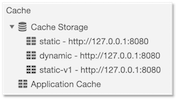

Leider bleiben aber auch die alten Caches noch bestehen und die Funktion `caches.match()` sucht in **allen** Caches nach dem passenden Request. Die Änderungen wären dann also trotzdem noch nicht sichtbar. Wir müssen jetzt noch dafür sorgen, dass die "alten" Caches gelöscht werden. 

Um uns zu überlegen, an welcher Stelle ein geeigneter Platz wäre, die alten Caches zu löschen, hier nochmal eine kurze Wiederholung des [Service-Worker-Lifecycles](https://developers.google.com/web/fundamentals/primers/service-workers/lifecycle): 

- **install**: Das `install`-Ereignis ist das erste Ereignis, das ein Service Worker auslöst. Es wird genau einmal ausgelöst. Die *Promise* in `installEvent.waitUntil()` gibt Auskunft darüber, ob das Installieren des Service Workers erfolgreich war oder nicht. So lange der Service Worker installiert wird, kann er keine `fetch`-Ereignisse empfangen und behandeln. 
- **activate**: Sobald die Installation erfolgreich abgeschlossen ist, wird das `activate`-Ereignis ausgelöst. 
- **waiting**: Wenn ein Service Worker `activated` ist, d.h. das `activate`-Event für diesen Service Worker ausgelöst wurde, kontrolliert er die Anfragen der Webseite (insb. wenn `clients.claim()` ausgeführt wurde, was dazu führt, dass auch alle Unterseiten der Seite "kontrolliert" werden). Wird der Service Worker geändert (aktualisiert) und erneut installiert, kann der geänderte Service Worker nicht sofort in den `activated` Zustand übergehen, so lange ein anderer Service Worker `active` ist. Der aktualisierte Service Worker ist dann `waiting`.


Das Bild zeigt einen aktualisierten Service Worker (`#877`) `waiting` solange der Service Worker `#875` noch `activated` ist. Erst, wenn `skipWaiting` geklickt wird (`self.skipWaiting()`), wird der aktualisierte Service Worker `activated`. 

Ein guter Punkt, existierende Caches zu löschen, die man nicht mehr verwenden möchte, ist, wenn ein (neuer/aktualisierter) Service Worker `activated` ist. Wir erweitern also die behandlung des `activate`-Ereignisses:

```javascript linenums="1"
self.addEventListener('activate', event => {
    console.log('service worker --> activating ...', event);
    event.waitUntil(
        caches.keys()
            .then( keyList => {
                return Promise.all(keyList.map( key => {
                    if(key !== 'static-v1' && key !== 'dynamic') {
                        console.log('service worker --> old cache removed :', key);
                        return caches.delete(key);
                    }
                }))
            })
    );
    return self.clients.claim();
})
```

Die ersten beiden und die letzten beiden Zeilen hatten wir bereits. Zeilen `3-13` sind neu. Betrachten wir den Code genauer:

- Die Funktion `waitUntil()` (Zeile `4`) gibt es sowohl für das `install`-Event als auch für das `activate`-Ereignis. Dieser Funktion wird ein Promise übergeben. Wir übergeben als Promise die Funktion `caches.keys()` (Zeile `5`).
- `caches.keys` gibt alle Namen der Service-Worker-Caches als Schlüssel zurück. In unserem Fall also `static`, `static-v1` und `dynamic`. 
- die Funktion `Promise.all()` wird, verwendet, wenn auf ein Array von Promises "gewartet" werden soll. Die Funktion ist also dann beendet, wenn alle Promises des Arrays beendet sind. 
- `Promise.all()` wartet auf ein Array von Promises. Wir haben aber mit `keyList` "nur" ein Array von Strings (die Namen der Caches). Mithilfe der `map()`-Funktion wandeln wir dieses Array von Strings in ein Array von Promises um. 
- die `map`-Funktion nimmt nun jeden einzelnen String aus dem Array `keyList` und "macht" damit etwas (Zeilen `7-10`)
- es wird geprüft, ob der `key` entweder dem dynamischen Cache entspricht (`'dynamic'`) oder dem neuen statischen Cache (`'static-v1'`). Wenn das **nicht** der Fall ist, dann wird der Cache mit dem Namen `key` gelöscht (Zeile `9`).
- `return caches.delete(key)` gibt somit ein Promise zurück (an die `map`-Funktion). Somit wird jeder Schlüssel aus der `keyList` in ein Promise umgewandelt (für `static-v1` und `dynamic` wird `null` zurückgegeben). 
- wenn alle dieses Promises beendet sind, ist auch die `Promise.all()`-Funktion beendet und somit auch die `event.waitUntil()`-Funktion.

Somit löschen wir alle "alten" statischen Caches und behalten nur die Caches `static-v1` und `dynamic`. 

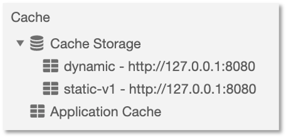

Wenn wir also etwas in unseren `*.html`, `*.css` und/oder `*.js`-Dateien ändern und das Geänderte wirksam werden lassen wollen, ändern wir einfach die Namen der Caches im Service Worker und sobald der Service Worker aktiviert ist, existieren nur noch die neuen Caches und die alten sind gelöscht. Damit wir das an zentraler Stelle im `sw.js` machen, lagern wir die aktuellen Namen der Caches in Konstanten aus. Die vollständige Implementierung unseres Service Workers sieht so aus:

```javascript linenums="1" hl_lines="1"
const CURRENT_STATIC_CACHE = 'static-v2';
const CURRENT_DYNAMIC_CACHE = 'dynamic-v2';

self.addEventListener('install', event => {
    console.log('service worker --> installing ...', event);
    event.waitUntil(
        caches.open(CURRENT_STATIC_CACHE)
            .then( cache => {
                console.log('Service-Worker-Cache erzeugt und offen');
                cache.addAll([
                    '/',
                    '/index.html',
                    '/src/js/app.js',
                    '/src/js/feed.js',
                    '/src/js/material.min.js',
                    '/src/css/app.css',
                    '/src/css/feed.css',
                    '/src/images/htw.jpg',
                    'https://fonts.googleapis.com/css?family=Roboto:400,700',
                    'https://fonts.googleapis.com/icon?family=Material+Icons',
                    'https://code.getmdl.io/1.3.0/material.blue_grey-red.min.css'
                ]);
            })
    );
})

self.addEventListener('activate', event => {
    console.log('service worker --> activating ...', event);
    event.waitUntil(
        caches.keys()
            .then( keyList => {
                return Promise.all(keyList.map( key => {
                    if(key !== CURRENT_STATIC_CACHE && key !== CURRENT_DYNAMIC_CACHE) {
                        console.log('service worker --> old cache removed :', key);
                        return caches.delete(key);
                    }
                }))
            })
    );
    return self.clients.claim();
})

self.addEventListener('fetch', event => {
    // check if request is made by chrome extensions or web page
    // if request is made for web page url must contains http.
    if (!(event.request.url.indexOf('http') === 0)) return; // skip the request. if request is not made with http protocol

    event.respondWith(
        caches.match(event.request)
            .then( response => {
                if(response) {
                    return response;
                } else {
                    return fetch(event.request)
                        .then( res => {     // nicht erneut response nehmen, haben wir schon
                            return caches.open(CURRENT_DYNAMIC_CACHE)      // neuer, weiterer Cache namens dynamic
                                .then( cache => {
                                    cache.put(event.request.url, res.clone());
                                    return res;
                                })
                        });
                }
            })
    );
})
```

### Zusammenfassung

Die Zusammanfassung für das Caching kann man im folgenden Bild darstellen. 

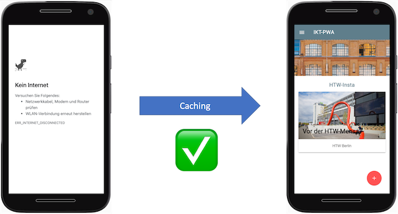

Mithilfe des Caching haben wir es geschafft, dass unsere Anwendung im **Offline-Modus** nicht mehr so aussieht, wie links, sondern wie rechts. Toll!

Noch einige nützliche Links:

- [Service Worker API](https://developer.mozilla.org/en-US/docs/Web/API/Service_Worker_API)
- [The offline cookbook](https://jakearchibald.com/2014/offline-cookbook/#cache-persistence)
- [Google: Service Worker](https://developers.google.com/web/fundamentals/primers/service-workers)


