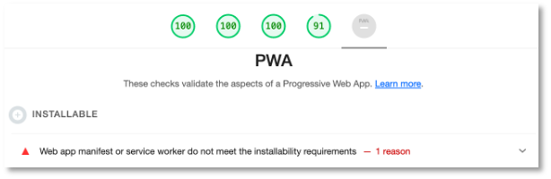

# Einführung

In diesem Semester geht es um **Progressive Web Apps (PWA)**. PWA sind Funktionen, die wir Webanwendungen hinzufügen können, um sie in ihrer Funktionalität zu erweitern. Die so werweiterten Webanwendungen kommen mit solchen Funktionen nativen Apps immer näher, d.h. das *Look and Feel* gleicht sich mit PWAs nativen Apps an. Dazu gehören Funktionalitäten, wie z.B. 

- die Möglichkeit, die Webanwendung auch offline zu verwenden,
- die Kamera zu nutzen, 
- den eigenen Standort zu verwenden, 
- Daten im Hintergrund zu synchronisieren. 

Das bedeutet aber nicht automatisch, dass wir ausschließlich auf moderne Browser angewiesen sind, die diese Funktionalitäten von PWAs unterstützen. Die Webanwendungen sollen auch weiterhin auf alten Webbrowsern laufen, dann jedoch eventuell ohne einige oder alle PWA-Funktionalitäten. 

Progressive Web Apps müssen 

- **zuverlässig** (*reliable*) sein, d.h. sie müssen schnelle Ladezeiten aufweisen und sogar (teilweise) offline funktionieren, 
- **schnell** sein, d.h. schnell auf Nutzerinteraktionen reagieren, 
- **motivierend** sein, die Webanwendung zu verwenden, d.h. einerseits intuitiv bedienbar und anderseits, z.B. über Push-Notifikationen, die Nutzerinnen animieren, die App zu nutzen.

Die prinzipielle Idee einer Progressive Web App lässt sich vereinfacht durch die folgenden Abbildung veranschaulichen:


Eine Progressive Web App ist eine Webanwendung, die sich wie eine native mobile App verhält. 

## Webanwendungen vs. native Apps

Die meisten Nutzerinnen verwenden die meiste Zeit native Apps auf ihrem Smartphone. Nur zu einem geringen Prozentsatz werden Web-Anwendungen (also der Browser) auf dem Smartphone verwendet. Das spricht eigentlich eher dafür, dass wir uns mit der Entwicklung nativer Apps beschäftigen sollten, als mit der Entwicklung von (mobilen) Webanwendungen. Die vorrangige Verwendung nativer Apps hat mehrere Gründe:

- **Push-Notifikationen**: Native Apps laufen im Hintergrund und die Nutzerinnen werden über Push-Notifikationen informiert, wenn etwas Neues passiert ist, z.B. neue Nachrichten , E-Mails, etc. Man muss also gar nicht aktiv die native App bedienen, um über Aktuelles informiert zu werden. 
- **App-Icons auf dem Home-Bildschirm**: ermöglichen einen schnellen, direkten Zugang zu den Apps. 
- **Gerätefunktionen**: wie z.B. Standortermittlung, Kameras und Mikrofine können leicht in native Apps eingebaut werden. Für Webanwendungen ist dies nur aufwändig möglich. 
- **Offline-Funktionalitäten**: viele native Apps können auch offline ganz oder teilweise verwendet werden, z.B. Spiele oder Musikapps, die heruntergeladene Musik abspielen. 

App-Icons auf dem Home-Bildschirm können wir auch für Links auf unsere Webanwendung erstellen und die anderen drei Argumente wollen wir ja genau mit Progressive Web Apps zunichte machen. Das heißt, mit Progressive Web Apps kommen die Vorteile nativer Apps im Vergleich zu Webanwendungen nicht mehr zum Tragen. 

Demgegenüber stahen zwei Gründe, warum Webanwendungen besser sind als native Apps:

- Native Apps müssen sowohl für iOS als auch für Android erstellt werden, um eine möglichst große Nutzerinnenzahl anzusprechen. Dazu müssen auch unterschiedliche programmiersprachen verwendet werden (Swift für iOS und Java/Kotlin für Android). Zwar versuchen Hybride Tools diesen Nachteil zu umgehen, aber es gelingt nicht wirklich. 
- Es werden so gut wie nie neue native Apps auf Smartphones geladen. Umfragen ergeben, dass Nutzerinnen die allermeiste Zeit am Smartphone mit höchstens drei Apps verbringen. Alle weiteren Apps werden am Anfang der Nutzung installiert. Es kommen im Laufe eines "Smartphone-Lebens" kaum welche hinzu. Die durchschnittliche Anzahl neuhinzugefügter Apps im Monat liegt bei nahe 0. 

Die Verwendung von Webanwendungen ist deutlich einfacher. Man muss nichts installieren. Man googlet einfach und öffnet dann die Seite. Die Bandbreite aller Webanwendungen ist deutlich schneller erreichbar als eine große Anzahl an nativen Apps. Die Reichweite einer Webanwendung ist deutlich größer als die Reichweite einer nativen App. 

| | Funktionalitäten | Nutzerinnen-Reichweite |
|----------|---------------|------------------|
|native App |Zugriff auf Gerätefunktionalitäten |nur sehr wenige Apps werden von sehr vielen Nutzerinnen die meiste Zeit verwendet |
|herkömmliche Webanwendungen |sehr eingeschränkter (gar kein) Zugriff auf Gerätefunktionalitäten |hohe Reichweite, sehr einfacher Zugang | 
|progressive Webanwendungen |Zugriff auf Gerätefunktionalitäten |hohe Reichweite, sehr einfacher Zugang | 


## Links und Videos

Hier zwei kurze Einführungsvideos zu PWAs:

- [Progressive Web Apps in 100 Seconds](https://www.youtube.com/watch?v=sFsRylCQblw)
- [Progressive Web Apps - PWA Roadshow](https://www.youtube.com/watch?v=z2JgN6Ae-Bo)

Hier einige interessante Links zu PWAs:

- [Learn PWA](https://web.dev/learn/pwa/)
- [Progressive Web-Apps: Was versprechen die progressiven Apps?](https://www.ionos.de/digitalguide/websites/web-entwicklung/progressive-web-apps-welche-vorteile-bieten-sie/)
- [Online Verzeichnis PWAs](https://pwa.bar/)


## PWAs vs. SPAs

Wir haben noch immer nicht unsere erste Progressive Web App erstellt ;-(. Bevor wir das tun, diskutieren wie zunächst noch die Unterschiede zwischen einer *Progressive Web App* und einer *Single Page Application*, wie wir sie im WebTech-Kurs erstellt haben. 

*Single Page Applications (SPAs)* sind Webanwendungen, die mit JavaScript erstellt werden, typischerweise mit einem JavaScript-Framewaork, wie [Angular](https://angular.io/), [React](https://reactjs.org/) oder [Vue.js](https://vuejs.org/). In SPAs wird das DOM ständig neu gerendert, welches sich durch Nutzereingaben oder Lifecycle-Events ändert. Das Grundgerüst einer SPA besteht aus genau einer `HTML`-Seite (typischerweise `index.html`), in die verschiedene Komponenten eingebunden wird. Eine Single Page Application ist vornehmlich hoch *reaktiv* auf Nutzereingaben, im Sinne von schneller Reaktion. 

*Progressive Web Applications (PWAs)* sind eine Sammlung verschiedener Technologien. Es ist völlig egal, ob diese Technologien in eine Single Page Application eingebunden werden oder in eine "herkömmliche" (Multi-Page-) Webanwendung. Die Idee einer PWA ist, dass sie hoch *reaktiv* im Sinne ständiger Verfügbarkeit ist. JavaScript spielt bei PWAs nicht die dominate Rolle, wie bei SPAs. Sie können eine oder mehrere *progressive* Funktionalitäten existierender Webanwendungen hinzufügen (service worker, caching, push notifivcations, ...) oder eine PWA von Grund auf neu implementieren. 

## Lighthouse

[Lighthouse](../tools/#lighthouse) ist ein Plugin für die Developertools von Chrome, mit dessen Hilfe gemessen werden kann, wie *progressive* eine Webanwendung ist. Die folgende Abbildung zeigt den Einsatz von Lighthouse für die PWA [https://2048.love2dev.com/](https://2048.love2dev.com/) - ein Spiel, das Sie wahrscheinlich kennen. 


Wechseln Sie in den Developertools auf die mobile Ansicht. Wählen Sie dann im Reiter `Lighthouse` die Analyse. Probieren Sie auch mal aus, die Anwendung im Offline-Modus zu verwenden. Wechseln Sie dazu in den Developertools auf den Reiter `Network` und dort in der Auswahlliste auf `Offline`. Selbst wenn Sie `Disable Cache` anklicken, werden Sie feststellen, dass sich das Spiel noch spielen lässt. Viel Spaß! ;-)

## PWA Checklist

Im Lighthouse-Plugin finden Sie auch einen Link zur **PWA Checklist**. Diese Checklist wird verwendet, um zu beurteilen, wie *progressive* eine Webanwendung ist. Eine gute Übersicht finden Sie auch [hier](https://web.dev/pwa-checklist/).

## Erstes kleines Beispiel

Wir erstellen uns in einem Ordner eine `index.html` mit 

=== "index.html"
	```html
	<!DOCTYPE html>
	<html lang="en">
	<head>
	    <meta charset="UTF-8">
	    <meta http-equiv="X-UA-Compatible" content="IE=edge">
	    <meta name="viewport" content="width=device-width, initial-scale=1.0">
	    <link rel="shortcut icon" href="favicon.ico" type="image/x-icon" /> <!-- muss nicht -->
	    
	    <title>IKT Start</title>
	</head>
	<body>
	    <h1>Willkommen zu den Aktuellen Trends der IKT</h1>
	    <p>Wir beschäftigen uns mit <i>Progressive Web Apps (PWA)</i>. 
	    	Ein wesentlicher Bestandteil von PWAs sind <i>Service Worker</i>.</p>
	</body>
	</html>
	```

Einen großen Teil unserer Untersuchungen in diesem Modul nehmen [Web APIs](https://developer.mozilla.org/en-US/docs/Web/API) ein. Wir werden einige von Ihnen näher beleuchten. 

Das zentrale Konzept von *PWAs* sind [ServiceWorker](https://developer.mozilla.org/en-US/docs/Web/API/Navigator/serviceWorker). Wir erstellen uns in unserem Ordner eine Datei `service-worker.js` und binden diese in unsere `index.html` ein:

=== "index.html"
	```html linenums="1" hl_lines="15-23"
	<!DOCTYPE html>
	<html lang="en">
	<head>
	    <meta charset="UTF-8">
	    <meta http-equiv="X-UA-Compatible" content="IE=edge">
	    <meta name="viewport" content="width=device-width, initial-scale=1.0">
	    <link rel="shortcut icon" href="favicon.ico" type="image/x-icon" /> <!-- muss nicht -->
	    
	    <title>IKT Start</title>
	</head>
	<body>
	    <h1>Willkommen zu den Aktuellen Trends der IKT</h1>
	    <p>Wir beschäftigen uns mit <i>Progressive Web Apps (PWA)</i>. 
	    	Ein wesentlicher Bestandteil von PWAs sind <i>Service Worker</i>.</p>
	   	<script>
	        // Check that service workers are supported
	        if ('serviceWorker' in navigator) {
	        // Use the window load event to keep the page load performant
	        window.addEventListener('load', () => {
	            navigator.serviceWorker.register('/service-worker.js');
	        });
	        }
	    </script>
	</body>
	</html>
	```

In die `service-worker.js` schreiben wir zunächst nur

=== "service-worker.js"
	```js
	console.log('service worker registriert');
	```

Wir starten die Anwendung (z.B. mit `npx serve`) und schalten die Entwicklertools ein. Auf der Konsole erscheint `service worker registriert`. Wir wechseln nach `Application --> Service Worker` und sehen den aktiven `service-worker.js`. Wenn wir die Anwendung im Browser erneut laden, erscheint die Ausgabe nicht erneut. Wir ändern den Service worker, z.B. auf `console.log('neuer service worker registriert`) und laden die Anwendung erneut. Die Ausgabe erscheint. Wechseln sie erneut nach `Application --> Service Worker`. 

Der Service worker läuft auch dann noch, wenn die Anwendung geschlossen ist!

### Installierbar

Wenn wir unter [Lighthouse](../tools/#lighthouse) einen Report generieren, dann sieht es zwar prinzipiell schon ganz gut aus, es handelt sich aber auch noch nicht um eine PWA, da sie (noch) nicht installierbar ist. 



Wir werden nächste Woche damit beginnen, unsere App installierbar zu machen. Hier "verraten" wir aber bereits, dass wir dazu eine `manifest.json` benötigen. Diese erstellen wir und binden sie in die `index.html` ein:

=== "index.html"
	```html linenums="1" hl_lines="8"
	<!DOCTYPE html>
	<html lang="en">
	<head>
	    <meta charset="UTF-8">
	    <meta http-equiv="X-UA-Compatible" content="IE=edge">
	    <meta name="viewport" content="width=device-width, initial-scale=1.0">
	    <link rel="shortcut icon" href="favicon.ico" type="image/x-icon" /> <!-- muss nicht -->
	    <link rel="manifest" href="manifest.json">

	    <title>IKT Start</title>
	</head>
	<body>
	    <h1>Willkommen zu den Aktuellen Trends der IKT</h1>
	    <p>Wir beschäftigen uns mit <i>Progressive Web Apps (PWA)</i>. 
	    	Ein wesentlicher Bestandteil von PWAs sind <i>Service Worker</i>.</p>
	   	<script>
	        // Check that service workers are supported
	        if ('serviceWorker' in navigator) {
	        // Use the window load event to keep the page load performant
	        window.addEventListener('load', () => {
	            navigator.serviceWorker.register('/service-worker.js');
	        });
	        }
	    </script>
	</body>
	</html>
	```

In die `manifest.json` tragen wir ein:

=== "manifest.json"
	```json linenums="1" hl_lines="8"
	{
	    "name": "IKT-PWA",
	    "start_url": "/",
	    "id": "/",
	    "icons": [],
	    "theme_color": "#000000",
	    "background_color": "#FFFFFF",
	    "display": "fullscreen",
	    "orientation": "portrait"
	}
	```

Wir kommen zu den einzelnen Eigenschaften nächste Woche noch ausführlich. Die `manifest.json` ist jedoch noch nicht vollständig, da das `icons`-Array noch befüllt werden muss. In dieses Array tragen wir alle Bilder ein, die als Icons auf dem Startbildschirm verwendet werden sollen, je nach Auflösung des Gerätes, auf dem die Anwendung gestartet werden soll. Die Generierung dieser Icons wird uns zum Glück abgenommen. Wir erstellen die Icons auf Basis eines Icons, das in recht großer Auflösung vorliegt. 

Fügen Sie dazu das [fiwlogo](./files/fiwlogo.png) in Ihren Projektordner ein. Wir nutzen den [pwa-asset-generator](https://www.npmjs.com/package/pwa-asset-generator). Im Terminal geben wir in unserem Projektordner ein:

```
npx pwa-asset-generator fiwlogo.png icons
```

Dabei ist `fiwlogo.png` das Icon, auf dessen Basis alle weiteren Icons erzeugt werden sollen und diese sollen in den Ordner `icons` erstellt werden. Die Ausgabe ist ungefähr wie folgt:

```
11:49:08 getSplashScreenMetaData Initialising puppeteer to load latest splash screen metadata 🤖
11:49:08 getAppleSplashScreenData Navigating to Apple Human Interface Guidelines website - https://developer.apple.com/design/human-interface-guidelines/ios/visual-design/adaptivity-and-layout/
11:49:10 getAppleSplashScreenData Waiting for the data table to be loaded
11:49:10 getAppleSplashScreenData Retrieved splash screen data
11:49:10 getSplashScreenMetaData Loaded metadata for iOS platform 🙌
11:49:11 generateImages Looks like folder icons doesn't exist. Created one for you 🤔
11:49:11 saveImages Initialising puppeteer to take screenshots 🤖
11:49:11 getShellHtml Generating shell html with provided image source
11:49:11 getShellHtml Providing shell html as page content
11:49:12 saveImages Saved image apple-splash-2388-1668 🙌
11:49:12 saveImages Saved image apple-splash-2732-2048 🙌
11:49:12 saveImages Saved image apple-splash-1536-2048 🙌
11:49:12 saveImages Saved image apple-splash-2048-1536 🙌
11:49:12 saveImages Saved image apple-splash-1668-2388 🙌
11:49:12 saveImages Saved image apple-splash-2048-2732 🙌
11:49:12 saveImages Saved image apple-splash-1668-2224 🙌
11:49:12 saveImages Saved image apple-splash-2224-1668 🙌
11:49:12 saveImages Saved image apple-splash-1620-2160 🙌
11:49:12 saveImages Saved image apple-splash-2436-1125 🙌
11:49:12 saveImages Saved image apple-splash-1242-2688 🙌
11:49:12 saveImages Saved image apple-splash-2532-1170 🙌
11:49:12 saveImages Saved image apple-splash-2160-1620 🙌
11:49:13 saveImages Saved image apple-splash-1125-2436 🙌
11:49:13 saveImages Saved image apple-splash-1284-2778 🙌
11:49:13 saveImages Saved image apple-splash-1242-2208 🙌
11:49:13 saveImages Saved image apple-splash-1792-828 🙌
11:49:13 saveImages Saved image apple-splash-1170-2532 🙌
11:49:13 saveImages Saved image manifest-icon-192 🙌
11:49:13 saveImages Saved image manifest-icon-512 🙌
11:49:13 saveImages Saved image apple-splash-2778-1284 🙌
11:49:13 saveImages Saved image apple-splash-2208-1242 🙌
11:49:13 saveImages Saved image apple-splash-1136-640 🙌
11:49:13 saveImages Saved image apple-splash-2688-1242 🙌
11:49:13 saveImages Saved image apple-splash-750-1334 🙌
11:49:13 saveImages Saved image apple-icon-180 🙌
11:49:13 saveImages Saved image apple-splash-640-1136 🙌
11:49:13 saveImages Saved image apple-splash-1334-750 🙌
11:49:13 saveImages Saved image apple-splash-828-1792 🙌
11:49:13 cli Web App Manifest file is not specified, printing out the content to console instead 🤔
11:49:13 cli Below is the icons content for your manifest.json file. You can copy/paste it manually 🙌

[
  {
    "src": "icons/manifest-icon-192.maskable.png",
    "sizes": "192x192",
    "type": "image/png",
    "purpose": "any"
  },
  {
    "src": "icons/manifest-icon-192.maskable.png",
    "sizes": "192x192",
    "type": "image/png",
    "purpose": "maskable"
  },
  {
    "src": "icons/manifest-icon-512.maskable.png",
    "sizes": "512x512",
    "type": "image/png",
    "purpose": "any"
  },
  {
    "src": "icons/manifest-icon-512.maskable.png",
    "sizes": "512x512",
    "type": "image/png",
    "purpose": "maskable"
  }
]


11:49:13 cli Index html file is not specified, printing out the content to console instead 🤔
11:49:13 cli Below is the iOS meta tags content for your index.html file. You can copy/paste it manually 🙌


<link rel="apple-touch-icon" href="icons/apple-icon-180.png">

<meta name="apple-mobile-web-app-capable" content="yes">

<link rel="apple-touch-startup-image" href="icons/apple-splash-2048-2732.jpg" media="(device-width: 1024px) and (device-height: 1366px) and (-webkit-device-pixel-ratio: 2) and (orientation: portrait)">
<link rel="apple-touch-startup-image" href="icons/apple-splash-2732-2048.jpg" media="(device-width: 1024px) and (device-height: 1366px) and (-webkit-device-pixel-ratio: 2) and (orientation: landscape)">
<link rel="apple-touch-startup-image" href="icons/apple-splash-1668-2388.jpg" media="(device-width: 834px) and (device-height: 1194px) and (-webkit-device-pixel-ratio: 2) and (orientation: portrait)">
<link rel="apple-touch-startup-image" href="icons/apple-splash-2388-1668.jpg" media="(device-width: 834px) and (device-height: 1194px) and (-webkit-device-pixel-ratio: 2) and (orientation: landscape)">
<link rel="apple-touch-startup-image" href="icons/apple-splash-1536-2048.jpg" media="(device-width: 768px) and (device-height: 1024px) and (-webkit-device-pixel-ratio: 2) and (orientation: portrait)">
<link rel="apple-touch-startup-image" href="icons/apple-splash-2048-1536.jpg" media="(device-width: 768px) and (device-height: 1024px) and (-webkit-device-pixel-ratio: 2) and (orientation: landscape)">
<link rel="apple-touch-startup-image" href="icons/apple-splash-1668-2224.jpg" media="(device-width: 834px) and (device-height: 1112px) and (-webkit-device-pixel-ratio: 2) and (orientation: portrait)">
<link rel="apple-touch-startup-image" href="icons/apple-splash-2224-1668.jpg" media="(device-width: 834px) and (device-height: 1112px) and (-webkit-device-pixel-ratio: 2) and (orientation: landscape)">
<link rel="apple-touch-startup-image" href="icons/apple-splash-1620-2160.jpg" media="(device-width: 810px) and (device-height: 1080px) and (-webkit-device-pixel-ratio: 2) and (orientation: portrait)">
<link rel="apple-touch-startup-image" href="icons/apple-splash-2160-1620.jpg" media="(device-width: 810px) and (device-height: 1080px) and (-webkit-device-pixel-ratio: 2) and (orientation: landscape)">
<link rel="apple-touch-startup-image" href="icons/apple-splash-1284-2778.jpg" media="(device-width: 428px) and (device-height: 926px) and (-webkit-device-pixel-ratio: 3) and (orientation: portrait)">
<link rel="apple-touch-startup-image" href="icons/apple-splash-2778-1284.jpg" media="(device-width: 428px) and (device-height: 926px) and (-webkit-device-pixel-ratio: 3) and (orientation: landscape)">
<link rel="apple-touch-startup-image" href="icons/apple-splash-1170-2532.jpg" media="(device-width: 390px) and (device-height: 844px) and (-webkit-device-pixel-ratio: 3) and (orientation: portrait)">
<link rel="apple-touch-startup-image" href="icons/apple-splash-2532-1170.jpg" media="(device-width: 390px) and (device-height: 844px) and (-webkit-device-pixel-ratio: 3) and (orientation: landscape)">
<link rel="apple-touch-startup-image" href="icons/apple-splash-1125-2436.jpg" media="(device-width: 375px) and (device-height: 812px) and (-webkit-device-pixel-ratio: 3) and (orientation: portrait)">
<link rel="apple-touch-startup-image" href="icons/apple-splash-2436-1125.jpg" media="(device-width: 375px) and (device-height: 812px) and (-webkit-device-pixel-ratio: 3) and (orientation: landscape)">
<link rel="apple-touch-startup-image" href="icons/apple-splash-1242-2688.jpg" media="(device-width: 414px) and (device-height: 896px) and (-webkit-device-pixel-ratio: 3) and (orientation: portrait)">
<link rel="apple-touch-startup-image" href="icons/apple-splash-2688-1242.jpg" media="(device-width: 414px) and (device-height: 896px) and (-webkit-device-pixel-ratio: 3) and (orientation: landscape)">
<link rel="apple-touch-startup-image" href="icons/apple-splash-828-1792.jpg" media="(device-width: 414px) and (device-height: 896px) and (-webkit-device-pixel-ratio: 2) and (orientation: portrait)">
<link rel="apple-touch-startup-image" href="icons/apple-splash-1792-828.jpg" media="(device-width: 414px) and (device-height: 896px) and (-webkit-device-pixel-ratio: 2) and (orientation: landscape)">
<link rel="apple-touch-startup-image" href="icons/apple-splash-1242-2208.jpg" media="(device-width: 414px) and (device-height: 736px) and (-webkit-device-pixel-ratio: 3) and (orientation: portrait)">
<link rel="apple-touch-startup-image" href="icons/apple-splash-2208-1242.jpg" media="(device-width: 414px) and (device-height: 736px) and (-webkit-device-pixel-ratio: 3) and (orientation: landscape)">
<link rel="apple-touch-startup-image" href="icons/apple-splash-750-1334.jpg" media="(device-width: 375px) and (device-height: 667px) and (-webkit-device-pixel-ratio: 2) and (orientation: portrait)">
<link rel="apple-touch-startup-image" href="icons/apple-splash-1334-750.jpg" media="(device-width: 375px) and (device-height: 667px) and (-webkit-device-pixel-ratio: 2) and (orientation: landscape)">
<link rel="apple-touch-startup-image" href="icons/apple-splash-640-1136.jpg" media="(device-width: 320px) and (device-height: 568px) and (-webkit-device-pixel-ratio: 2) and (orientation: portrait)">
<link rel="apple-touch-startup-image" href="icons/apple-splash-1136-640.jpg" media="(device-width: 320px) and (device-height: 568px) and (-webkit-device-pixel-ratio: 2) and (orientation: landscape)">
```

Wir hätten auch die `manifest.json` mit angeben können (Flag `m`) und auch die `index.html` (Flag `-i`), aber wir kopieren die Ausgaben händisch in die jeweiligen Dateien. Das JSON 

```
  {
    "src": "icons/manifest-icon-192.maskable.png",
    "sizes": "192x192",
    "type": "image/png",
    "purpose": "any"
  },
  {
    "src": "icons/manifest-icon-192.maskable.png",
    "sizes": "192x192",
    "type": "image/png",
    "purpose": "maskable"
  },
  {
    "src": "icons/manifest-icon-512.maskable.png",
    "sizes": "512x512",
    "type": "image/png",
    "purpose": "any"
  },
  {
    "src": "icons/manifest-icon-512.maskable.png",
    "sizes": "512x512",
    "type": "image/png",
    "purpose": "maskable"
  }
```

kopieren wir in das `icons`-Array der `manifest.json`:


=== "manifest.json"
	```json linenums="1" hl_lines="6-29"
	{
	    "name": "IKT-PWA",
	    "start_url": "/",
	    "id": "/",
	    "icons": [
	      {
		    "src": "icons/manifest-icon-192.maskable.png",
		    "sizes": "192x192",
		    "type": "image/png",
		    "purpose": "any"
		  },
		  {
		    "src": "icons/manifest-icon-192.maskable.png",
		    "sizes": "192x192",
		    "type": "image/png",
		    "purpose": "maskable"
		  },
		  {
		    "src": "icons/manifest-icon-512.maskable.png",
		    "sizes": "512x512",
		    "type": "image/png",
		    "purpose": "any"
		  },
		  {
		    "src": "icons/manifest-icon-512.maskable.png",
		    "sizes": "512x512",
		    "type": "image/png",
		    "purpose": "maskable"
		  }
		],
	    "theme_color": "#000000",
	    "background_color": "#FFFFFF",
	    "display": "fullscreen",
	    "orientation": "portrait"
	}
	```

und die *iOS meta tags* in die `index.html`:

=== "index.html"
	```html linenums="1" hl_lines="9-38"
	<!DOCTYPE html>
	<html lang="en">
	<head>
	    <meta charset="UTF-8">
	    <meta http-equiv="X-UA-Compatible" content="IE=edge">
	    <meta name="viewport" content="width=device-width, initial-scale=1.0">
	    <link rel="shortcut icon" href="favicon.ico"/>
	    <link rel="manifest" href="manifest.json">
	    <link rel="apple-touch-icon" href="icons/apple-icon-180.png">

		<meta name="apple-mobile-web-app-capable" content="yes">

		<link rel="apple-touch-startup-image" href="icons/apple-splash-2048-2732.jpg" media="(device-width: 1024px) and (device-height: 1366px) and (-webkit-device-pixel-ratio: 2) and (orientation: portrait)">
		<link rel="apple-touch-startup-image" href="icons/apple-splash-2732-2048.jpg" media="(device-width: 1024px) and (device-height: 1366px) and (-webkit-device-pixel-ratio: 2) and (orientation: landscape)">
		<link rel="apple-touch-startup-image" href="icons/apple-splash-1668-2388.jpg" media="(device-width: 834px) and (device-height: 1194px) and (-webkit-device-pixel-ratio: 2) and (orientation: portrait)">
		<link rel="apple-touch-startup-image" href="icons/apple-splash-2388-1668.jpg" media="(device-width: 834px) and (device-height: 1194px) and (-webkit-device-pixel-ratio: 2) and (orientation: landscape)">
		<link rel="apple-touch-startup-image" href="icons/apple-splash-1536-2048.jpg" media="(device-width: 768px) and (device-height: 1024px) and (-webkit-device-pixel-ratio: 2) and (orientation: portrait)">
		<link rel="apple-touch-startup-image" href="icons/apple-splash-2048-1536.jpg" media="(device-width: 768px) and (device-height: 1024px) and (-webkit-device-pixel-ratio: 2) and (orientation: landscape)">
		<link rel="apple-touch-startup-image" href="icons/apple-splash-1668-2224.jpg" media="(device-width: 834px) and (device-height: 1112px) and (-webkit-device-pixel-ratio: 2) and (orientation: portrait)">
		<link rel="apple-touch-startup-image" href="icons/apple-splash-2224-1668.jpg" media="(device-width: 834px) and (device-height: 1112px) and (-webkit-device-pixel-ratio: 2) and (orientation: landscape)">
		<link rel="apple-touch-startup-image" href="icons/apple-splash-1620-2160.jpg" media="(device-width: 810px) and (device-height: 1080px) and (-webkit-device-pixel-ratio: 2) and (orientation: portrait)">
		<link rel="apple-touch-startup-image" href="icons/apple-splash-2160-1620.jpg" media="(device-width: 810px) and (device-height: 1080px) and (-webkit-device-pixel-ratio: 2) and (orientation: landscape)">
		<link rel="apple-touch-startup-image" href="icons/apple-splash-1284-2778.jpg" media="(device-width: 428px) and (device-height: 926px) and (-webkit-device-pixel-ratio: 3) and (orientation: portrait)">
		<link rel="apple-touch-startup-image" href="icons/apple-splash-2778-1284.jpg" media="(device-width: 428px) and (device-height: 926px) and (-webkit-device-pixel-ratio: 3) and (orientation: landscape)">
		<link rel="apple-touch-startup-image" href="icons/apple-splash-1170-2532.jpg" media="(device-width: 390px) and (device-height: 844px) and (-webkit-device-pixel-ratio: 3) and (orientation: portrait)">
		<link rel="apple-touch-startup-image" href="icons/apple-splash-2532-1170.jpg" media="(device-width: 390px) and (device-height: 844px) and (-webkit-device-pixel-ratio: 3) and (orientation: landscape)">
		<link rel="apple-touch-startup-image" href="icons/apple-splash-1125-2436.jpg" media="(device-width: 375px) and (device-height: 812px) and (-webkit-device-pixel-ratio: 3) and (orientation: portrait)">
		<link rel="apple-touch-startup-image" href="icons/apple-splash-2436-1125.jpg" media="(device-width: 375px) and (device-height: 812px) and (-webkit-device-pixel-ratio: 3) and (orientation: landscape)">
		<link rel="apple-touch-startup-image" href="icons/apple-splash-1242-2688.jpg" media="(device-width: 414px) and (device-height: 896px) and (-webkit-device-pixel-ratio: 3) and (orientation: portrait)">
		<link rel="apple-touch-startup-image" href="icons/apple-splash-2688-1242.jpg" media="(device-width: 414px) and (device-height: 896px) and (-webkit-device-pixel-ratio: 3) and (orientation: landscape)">
		<link rel="apple-touch-startup-image" href="icons/apple-splash-828-1792.jpg" media="(device-width: 414px) and (device-height: 896px) and (-webkit-device-pixel-ratio: 2) and (orientation: portrait)">
		<link rel="apple-touch-startup-image" href="icons/apple-splash-1792-828.jpg" media="(device-width: 414px) and (device-height: 896px) and (-webkit-device-pixel-ratio: 2) and (orientation: landscape)">
		<link rel="apple-touch-startup-image" href="icons/apple-splash-1242-2208.jpg" media="(device-width: 414px) and (device-height: 736px) and (-webkit-device-pixel-ratio: 3) and (orientation: portrait)">
		<link rel="apple-touch-startup-image" href="icons/apple-splash-2208-1242.jpg" media="(device-width: 414px) and (device-height: 736px) and (-webkit-device-pixel-ratio: 3) and (orientation: landscape)">
		<link rel="apple-touch-startup-image" href="icons/apple-splash-750-1334.jpg" media="(device-width: 375px) and (device-height: 667px) and (-webkit-device-pixel-ratio: 2) and (orientation: portrait)">
		<link rel="apple-touch-startup-image" href="icons/apple-splash-1334-750.jpg" media="(device-width: 375px) and (device-height: 667px) and (-webkit-device-pixel-ratio: 2) and (orientation: landscape)">
		<link rel="apple-touch-startup-image" href="icons/apple-splash-640-1136.jpg" media="(device-width: 320px) and (device-height: 568px) and (-webkit-device-pixel-ratio: 2) and (orientation: portrait)">
		<link rel="apple-touch-startup-image" href="icons/apple-splash-1136-640.jpg" media="(device-width: 320px) and (device-height: 568px) and (-webkit-device-pixel-ratio: 2) and (orientation: landscape)">

	    <title>IKT Start</title>
	</head>
	<body>
	    <h1>Willkommen zu den aktuellen Trends der IKT</h1>
	    <script>
	        if ('serviceWorker' in navigator) {
	            navigator.serviceWorker.register('service-worker.js');
	        }
	    </script>
	</body>
	</html>
	```

Prinzipiell wäre jetzt alles da, damit unsere Anwendung *installiert* werden kann. Jedoch gibt es derzeit keine Möglichkeit, dass die Anwendung auch offline verwendbar ist. Dazu benötigt es eine Möglichkeit des *Cachings* von Daten. Ohne jetzt schon wirklich zu wissen, was wir tun, passen wir die `service-worker.js` wie folgt an:

=== "service-worker.js"
	```js
	importScripts(
	  'https://storage.googleapis.com/workbox-cdn/releases/6.4.1/workbox-sw.js'
	);

	workbox.routing.registerRoute(
	    ({request}) => request.destination === 'image',
	    new workbox.strategies.NetworkFirst()     // NetworkFirst() vs CacheFirst()
	)
	```

Wir haben also bereits mehrer Sachen identifiziert, mit denen wir uns beschäftigen wollen:

- *Manifest*,
- *Service worker* und
- *Caching*

und das sind auch genau die Themen der kommenden Wochen. 


!!! success
	Wir haben jetzt eine Idee davon, was *Progressive Web Apps* sind. Jetzt legen wir los und erstellen eigene PWAs!