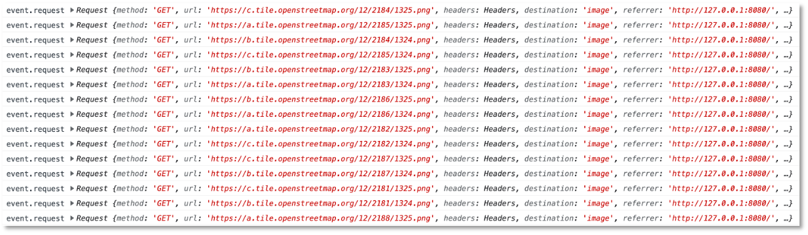

# Geolocation-API


!!! hint
    Aktueller Stand vor Geolocation-API:

    - [Frontend](https://github.com/jfreiheit/IKT-PWA-06)
    - [Backend](https://github.com/jfreiheit/IKT-PWA-BACKEND-01)
    - Collection [post](./files/posts.json)
    - Collection [post.files](./files/posts_files.json)
    - Collection [post.chunks](./files/posts_chunks.json)


Die Geolocation-API wird von allen Browsern unterstützt (sogar Internet Explorer). Es gibt viele Dokumentationen darüber, z.B. [hier](https://developer.mozilla.org/en-US/docs/Web/API/Geolocation), [hier](https://developer.mozilla.org/de/docs/Web/API/Geolocation_API) und [hier](https://developers.google.com/maps/documentation/geolocation/overview). Die Verwendung ist recht einfach. 

In der `index.html` haben wir uns bereits einen Button erstellt, für den wir "nur noch" das `click`-Ereignis behandeln müssen. 


=== "public/index.html"
	```html linenums="83"
    <div class="input-section">
        <button class="mdl-button mdl-js-button mdl-button--colored" type="button" id="location-btn">Location</button>
        <div class="mdl-spinner mdl-js-spinner is-active" id="location-loader"></div>
    </div>
	```

Zunächst vereinfachen wir uns in der `feed.js` wieder den Zugriff auf den Button und den Spinner (Loader) und erstellen noch eine globale Variable `fetchedLocation`:


=== "public/src/js/feed.js"
	```js linenums="1" hl_lines="17-19"
	let shareImageButton = document.querySelector('#share-image-button');
	let createPostArea = document.querySelector('#create-post');
	let closeCreatePostModalButton = document.querySelector('#close-create-post-modal-btn');
	let sharedMomentsArea = document.querySelector('#shared-moments');
	let form = document.querySelector('form');
	let titleInput = document.querySelector('#title');
	let locationInput = document.querySelector('#location');
	let videoPlayer = document.querySelector('#player');
	let canvasElement = document.querySelector('#canvas');
	let captureButton = document.querySelector('#capture-btn');
	let imagePicker = document.querySelector('#image-picker');
	let imagePickerArea = document.querySelector('#pick-image');
	let file = null;
	let titleValue = '';
	let locationValue = '';
	let imageURI = '';
	let locationButton = document.querySelector('#location-btn');
	let locationLoader = document.querySelector('#location-loader');
	let fetchedLocation;

	```

und wir setzen den `Loader` in der `feed.css` auf unsichtbar:


=== "public/src/js/feed.css"
	```css linenums="23" hl_lines="1"
	#create-post #pick-image, #create-post #location-loader {
	    display: none;
	}
	```

`create-post #pick-image` stand dort schon, wir haben nur noch den Selektor `#create-post #location-loader` hinzugefügt.


Wir fügen in der `feed.js` die Behandlung des `click`-Ereignisses für den `Location`-Button hinzu und auch noch, wie für die Kamera, eine `initializeLocation()`-Funktion, in der geprüft wird, ob die `Geolocation`-API überhaupt im Browser verfügbar ist: 


=== "public/src/js/feed.js"
	```js linenums="21"
	locationButton.addEventListener('click', event => {
	    if(!('geolocation' in navigator)) {
	        return;
	    }

	    locationButton.style.display = 'none';
	    locationLoader.style.display = 'block';

	    navigator.geolocation.getCurrentPosition( position => {
	        locationButton.style.display = 'inline';
	        locationLoader.style.display = 'none';
	        fetchedLocation = { latitude: position.coords.latitude, longitude: position.coords.longitude };
	        console.log('current position: ', fetchedLocation);
	        locationInput.value = 'In Berlin';
	        document.querySelector('#manual-location').classList.add('is-focused');
	    }, err => {
	        console.log(err);
	        locationButton.style.display = 'inline';
	        locationLoader.style.display = 'none';
	        alert('Couldn\'t fetch location, please enter manually!');
	        fetchedLocation = null;
	    }, { timeout: 5000});
	});

	function initializeLocation() {
	    if(!('geolocation' in navigator)) {
	        locationButton.style.display = 'none';
	    }
	}
	```

In der `initializeLocation()`-Funktion wird geprüft, ob der Browser die `Geolocation`-API unterstützt. Wenn nicht, wird der `Location`-Button versteckt. Wir haben trotzdem, sicherheitshalber, die Abfrage nochmal in die Behandlung des `click`-Ereignisses für diesen Button eingefügt (Zeilen `22-24`), obwohl dies nicht wirklich notwendig ist, da der Button nicht angeklickt werden kann, wenn die `Geolocation`-API nicht unterstützt wird, da er nicht angezeigt wird. 

Wenn auf den Button geklickt wurde, setzen wir den Button selbst auf unsichtbar (Zeile `26`) und den Spinner (Loader) auf sichtbar (Zeile `27`). Zeile `29` zeigt den eigentlichen Zugriff auf die aktuelle Position. Dort wird die Funktion `getCurrentPosition()` der `Geolocation`-API aufgerufen. Wir übergeben drei Parameter:

- der erste Parameter ist die (Callback-)Funktion, die die aktuelle Position zurückgibt. Wenn diese Funktion ausgeführt wird, setzen wir den Button wieder auf sichtbar (Zeile `30`) und den Loader auf unsichtbar (Zeile `31`). Die aktuelle Position `position` enthält die Eigenschaft `coords`, die die `latitude` und `longitude` als Werte enthält (siehe [GeolocationPosition](https://developer.mozilla.org/en-US/docs/Web/API/GeolocationPosition) und [GeolocationCoordinates](https://developer.mozilla.org/en-US/docs/Web/API/GeolocationCoordinates)).  Diese Position geben wir auf der Konsole aus (Zeile `33`). Wir befüllen das `locationInput`-Eingabefeld noch mit einem Dummy-Wert und fokussieren auf das Eingabefeld (Zeilen `34-35`).
- der zweite Parameter ist eine Funktion, die ausgeführt wird, wenn ein Fehler auftritt. Mögliche Fehler sind, dass im Browser der Zugriff auf die Position deaktiviert wurde, dass die Nutzerin den Zugriff auf die aktuelle Position blockiert hat oder dass die Position nicht "schnell genug" ermittelt werden konnte. Im Fehlerfall geben wir den Fehler auf der Konsole aus und schalten den Button wieder ein und den Loader wieder aus (Zeilen `37-39`).
- der dritte Parameter ist ein JavaScript-Objekt mit `options`. Wir wählen hier nur eine einzige Option, nämlich wie lange nach der aktuellen Position gesucht werden soll. In der Einstellung erfolgt der `timeout` nach `5 sek`. 

Wir passen nun in der `feed.js` noch die beiden Funktionen `openCreatePostModal()` und `closeCreatePostModal()` an:


=== "public/src/js/feed.js"
	```js linenums="80" hl_lines="4 12-13"
	function openCreatePostModal() {
	    createPostArea.style.transform = 'translateY(0)';
	    initializeMedia();
	    initializeLocation();
	}

	function closeCreatePostModal() {
	    createPostArea.style.transform = 'translateY(100vH)';
	    imagePickerArea.style.display = 'none';
	    videoPlayer.style.display = 'none';
	    canvasElement.style.display = 'none';
	    locationButton.style.display = 'inline';
	    locationLoader.style.display = 'none';
	}
	```


Wenn Sie die Anwendung nun starten, werden Sie gefragt, ob Sie die Abfrage nach Ihrem Standort zulassen oder blockieren wollen. Die meisten von Ihnen werden aber die **Ortungsdienste ausgeschaltet** haben. Dann ist auch die Abfrage zunächst egal. Im Mac kann man diese (kurzzeitig, dann wieder ausschalten) über `Systemeinstellungen --> Sicherheit & Datenschutz --> Reiter Datenschutz --> Ortungsdienste` für `Google Chrome` aktivieren. 

Wenn Sie die Positionsbestimmung zulassen, dann wird nach dem Klicken auf den `Location`-Button die aktuelle Position auf der Konsole eingegeben und im Formular erscheint unter Ort `In Berlin`.

Wir machen nichts weiter mit der aktuellen Position. Es gibt viele Möglichkeiten, die jetzt noch ausprobiert werden könnten. Dazu gehören beisielsweise:

- Wir könnten mithilfe der [Google-Geolocation-API](https://developers.google.com/maps/documentation/geolocation/overview) die Adresse ermitteln, die Google für eine gegebene Position (`longitude` und `latitude`) zurückgibt. Dazu bräuchten wir aber auch einen [API-Key](https://developers.google.com/maps/documentation/geolocation/get-api-key) von Google.
- Wir könnten das Gleiche mit der [Nominatim-API](https://nominatim.org/) für Open Street Map machen. Sie können den Service [hier einmal ausprobieren](https://nominatim.openstreetmap.org/ui/reverse.html), indem Sie Ihre `latitude` und `longitude` aus der Konsolenausgabe eingeben.
- Wir könnten [OpenLayers](https://openlayers.org/en/latest/doc/quickstart.html) verwenden, um die Position auf einer Karte anzuzeigen.
- Wir könnten die Datenbank erweitern und für alle Posts auch noch die Koordinaten der Position abspeichern und dann alle Posts auf einer Karte (mithilfe von OpenLayers + OpenStreetMap) visualisieren.

## Beispiel nominatim.org

Die oben genannten Verwendungsbeispiele sind alle relativ einfach, da die jeweiligen APIs wirklich gut sind. Wir zeigen hier exemplarisch die Verwendung der [Nominatim-API](https://nominatim.org/), mit deren Hilfe wir für gegebene Breiten- und Längengrade ein Adress-Objekt zurückbekommen. Genauer gesagt, handelt es sich um ein *Open Street Map (OSM)*-Objekt. Einen groben Überblick über die Endpunkte der [Nominatim-API](https://nominatim.org/) erhalten Sie [hier](https://nominatim.org/release-docs/develop/api/Overview/). Uns interessiert dabei insbesondere der [/reverse-Endpunkt](https://nominatim.org/release-docs/develop/api/Reverse/), der ein OSM-Objekt für eine gegebene Lokation zurückgibt. 

Prinzipiell sieht die Anfrage wie folgt aus:

```bash
https://nominatim.openstreetmap.org/reverse?format=<value>&lat=<value>&lon=<value>&<params>
```

- Als Rückgabe-`format` kann einer der folgenden Werte verwendet werden: `[xml|json|jsonv2|geojson|geocodejson]`. Der Standard ist `xml`. Wir sollten am besten `jsonv2` verwenden.  
- Für `lat` und `long` setzen wir die `latitude` und `longitude` ein, die wir in `fetchedLocation` speichern.
- Für mögliche weitere Parameter `<params>`, wie z.B. `zoom`, `extratags` oder `namedetails`, schauen Sie [hier](https://nominatim.org/release-docs/latest/api/Reverse/#parameters).

Wenn wir z.B. folgende Anfrage stellen: 

```bash
GET https://nominatim.openstreetmap.org/reverse?format=jsonv2&lat=52.457310&lon=13.526877
```

erhalten wir als Response folgendes JSON:

```json
{
    "place_id": 106322469,
    "licence": "Data © OpenStreetMap contributors, ODbL 1.0. https://osm.org/copyright",
    "osm_type": "way",
    "osm_id": 25346348,
    "lat": "52.45699635",
    "lon": "13.526577702867113",
    "place_rank": 30,
    "category": "building",
    "type": "university",
    "importance": 0,
    "addresstype": "building",
    "name": "Gebäude C",
    "display_name": "Gebäude C, Johannes-Kraaz-Straße, Oberschöneweide, Treptow-Köpenick, Berlin, 12459, Deutschland",
    "address": {
        "building": "Gebäude C",
        "road": "Johannes-Kraaz-Straße",
        "suburb": "Oberschöneweide",
        "borough": "Treptow-Köpenick",
        "city": "Berlin",
        "state": "Berlin",
        "postcode": "12459",
        "country": "Deutschland",
        "country_code": "de"
    },
    "boundingbox": [
        "52.4561412",
        "52.4577257",
        "13.5255179",
        "13.5274139"
    ]
}
```

Wir könnten nun einen ausgewählten Wert in unser Formular übernehmen, z.B. `display_name` oder `suburb` oder `city`. Wir zeigen im Folgenden die Übernahme von `display_name` in das Eingabeformular:


=== "public/src/js/feed.js"
	```js linenums="21"
	locationButton.addEventListener('click', event => {
	    if(!('geolocation' in navigator)) {
	        return;
	    }

	    locationButton.style.display = 'none';
	    locationLoader.style.display = 'block';

	    navigator.geolocation.getCurrentPosition( position => {
	        locationButton.style.display = 'inline';
	        locationLoader.style.display = 'none';
	        fetchedLocation = { latitude: position.coords.latitude, longitude: position.coords.longitude };
	        console.log('current position: ', fetchedLocation);

	        let nominatimURL = 'https://nominatim.openstreetmap.org/reverse'; 
	        nominatimURL += '?format=jsonv2';   // format=[xml|json|jsonv2|geojson|geocodejson]
	        nominatimURL += '&lat=' + fetchedLocation.latitude;
	        nominatimURL += '&lon=' + fetchedLocation.longitude;

	        fetch(nominatimURL)
	            .then((res) => {
	                console.log('nominatim res ...', res);
	                return res.json();
	            })
	            .then((data) => {
	                console.log('nominatim res.json() ...', data);
	                locationInput.value = data.display_name;
	            })
	            .catch( (err) => {
	                console.error('err', err)
	                locationInput.value = 'In Berlin';
	            });

	        document.querySelector('#manual-location').classList.add('is-focused');
	    }, err => {
	        console.log(err);
	        locationButton.style.display = 'inline';
	        locationLoader.style.display = 'none';
	        alert('Couldn\'t fetch location, please enter manually!');
	        fetchedLocation = null;
	    }, { timeout: 5000});
	});
	```

- In den Zeilen `35-38` setzen wir die URL zusammen, unter der wir `nominatim.org` anfragen. In Zeile `40` erfolgt die Anfrage mithilfe der `fetch`-API. Wir erhalten ein `Response`-Objekt zurück, das wir mithilfe von `res.json()` so extrahieren, dass es dem oben gezeigten JSON entspricht. 


## Beispiel OpenLayers.org

[OpenLayers](https://openlayers.org/) stellt eine Bibliothek von JavaScript- und CSS-Funktionalitäten bereit, um Landkarten in die Webanwendung einzubinden. Wir zeigen die Anwendung hier an einer sehr einfachen Einführung, die im Prinzip dem [Einführungsbeispiel](https://openlayers.org/en/latest/doc/quickstart.html) von OpenLayers entspricht. 

### Einbinden in die index.html

Zunächst kann die CSS- und JavaScript-Bibliothek über ein CDN eingebunden werden:

=== "Auszug index.html"
	```html linenums="1" hl_lines="12-13"
	<!doctype html>
	<html lang="en">
	<head>
	  <meta charset="UTF-8">
	  <meta name="viewport"
	        content="width=device-width, user-scalable=no, initial-scale=1.0, maximum-scale=1.0, minimum-scale=1.0">
	  <meta http-equiv="X-UA-Compatible" content="ie=edge">
	  <title>IKT-PWA</title>
	  <link rel="stylesheet" href="https://fonts.googleapis.com/css?family=Roboto:400,700">
	  <link rel="stylesheet" href="https://fonts.googleapis.com/icon?family=Material+Icons">
	  <link rel="stylesheet" href="https://code.getmdl.io/1.3.0/material.blue_grey-red.min.css">
	  <link rel="stylesheet" href="https://cdn.jsdelivr.net/gh/openlayers/openlayers.github.io@master/en/v6.15.1/css/ol.css" type="text/css">
	  <script src="https://cdn.jsdelivr.net/gh/openlayers/openlayers.github.io@master/en/v6.15.1/build/ol.js"></script>
	  <link rel="stylesheet" href="/src/css/app.css">
	  <link rel="stylesheet" href="/src/css/feed.css">
	  <link rel="manifest" href="manifest.webmanifest">

	  <!-- und hier der Rest -->
	```

Dann integrieren wir ein `<div>`-Element, in dem später die Landkarte erscheint:


=== "Auszug index.html"
	```html linenums="84" hl_lines="6"
          <div class="input-section">
            <button class="mdl-button mdl-js-button mdl-button--colored" type="button" id="location-btn">Location</button>
            <div class="mdl-spinner mdl-js-spinner is-active" id="location-loader"></div>
          </div>
          
          <div id="map" class="map"></div>

          <br>
          <div>
            <button class="mdl-button mdl-js-button mdl-button--raised mdl-button--colored mdl-color--accent"
                    type="submit" id="post-btn">Speichern
            </button>
          </div>
	```


### Anpassen der feed.css

Zunächst müssen wir in der `feed.js` einen Selektor ändern. Wir haben die `map` innerhalb des `div` mit der `id="create-post"` angelegt. In der `feed.js` befindet sich folgender Eintrag:

=== "feed.css"
```css linenums="16" 
#create-post video, #create-post canvas {
    width: 512px;
    max-width: 100%;
    display: none;
    margin: auto;
}
```

Wir sprechen also alle HTML-Elemente `video` und `canvas` an, die sich im `div` mit der `id="create-post"` befinden. Allerdings wird unsere `map` auch ein `canvas`-Element enthalten, welches ebenfalls mit angesprochen (und auf `display: none` gesetzt) werden würde. Wir spezialisieren diese Selektoren nun, indem wir jeweils die `id`s des `video`- und des `canvas`-Elementes verwenden, die sich um die Aufnahme des Fotos kümmern:

=== "feed.css"
```css linenums="16" hl_lines="1"
#create-post #player, #create-post #canvas {
    width: 512px;
    max-width: 100%;
    display: none;
    margin: auto;
}
```

Nun können wir die Eigenschaften hinzufügen, die für die `map` relevant sind:

=== "feed.css"
```css linenums="62"
#create-post .map {
  height: 400px;
  width: 400px;
  display: none;
  margin: 10px auto;
}
```

Sie können für Höhe und Breite auch relative oder auch andere absolute Werte setzen. Zunächst ist das `div` mit der CSS-Klasse `map` aber auf nicht sichtbar gesetzt.


### Anpassen der feed.js

In der `feed.js` erweitern wir die `fetch()`-Anfrage an `nominatim.org`. Diese sieht bis jetzt so aus:


=== "public/src/js/feed.js"
```js linenums="40"
		fetch(nominatimURL)
			.then((res) => {
			    console.log('nominatim res ...', res);
			    return res.json();
			})
			.then((data) => {
			    console.log('nominatim res.json() ...', data);
			    locationInput.value = data.display_name;
			})
			.catch( (err) => {
			    console.error('err', err)
			    locationInput.value = 'In Berlin';
			});
```

Siehe die `feed.js` aus [Beispiel nominatim.org](http://127.0.0.1:8000/ikt/geolocation/#beispiel-nominatimorg) oben. 
Unter Verwendung der Variablen `fetchedLocation`, die die `longitude` und `latitude` unseres Standortes enthält, fügen wir nun die Erstellung einer Map mithilfe von OpenLayers hinzu:


=== "public/src/js/feed.js"
```js linenums="40"
        fetch(nominatimURL)
            .then((res) => {
                console.log('nominatim res ...', res);
                return res.json();
            })
            .then((data) => {
                console.log('nominatim res.json() ...', data);
                locationInput.value = data.display_name;
                return data;
            })
            .then( d => {
                locationButton.style.display = 'none';
                locationLoader.style.display = 'none';
                mapDiv.style.display = 'block';

                const map = new ol.Map({
                    target: 'map',
                    layers: [
                    new ol.layer.Tile({
                        source: new ol.source.OSM()
                    })
                    ],
                    view: new ol.View({
	                    center: ol.proj.fromLonLat([fetchedLocation.longitude, fetchedLocation.latitude]),
	                    zoom: 12
                    })
                });

                const layer = new ol.layer.Vector({
                    source: new ol.source.Vector({
                        features: [
                            new ol.Feature({
                                geometry: new ol.geom.Point(ol.proj.fromLonLat([fetchedLocation.longitude, fetchedLocation.latitude]))
                            })
                        ]
                    })
                });
 
                map.addLayer(layer);

                console.log('map', map)
            })
            .catch( (err) => {
                console.error('err', err)
                locationInput.value = 'In Berlin';
            });
```

- In Zeile `53` wird das `div`, das die `map` enthält, auf sichtbar gesetzt (Definieren Sie dazu `let mapDiv = document.querySelector('#map');`). Der `locationButton` und der Spinner werden unsichtbar.
- Mit `new ol.Map()` wird eine neue Map erstellt (Zeile `55`). 
- Dieses `Map`-Objekt wird mit `target: 'map'` dem `div` mit der `id="map"` zugewiesen (Zeile `56`).
- Das `layers`-Array enthält alle Schichten, die zur Map hinzugefügt werden (Zeile `57`).
- In unserem Fall wird eine Schicht hinzugefügt, nämlich eine Kachel (*Tile*)-Schicht, die die Landkarte enthält. Diese wird in unserem Fall von der Quelle *OSM* (also *Open Street Map*) geholt. Beachten Sie Ihre Konsole. Sie werden Einträge in der folgenden Art darin finden:



Das sind die Bilder, aus denen die Landkarte zusammengesetzt wird.  

- Die eigentliche Ansicht wird mit `view` definiert. Wir erstellen ein einfaches `View`-Objekt, das durch den `center`-Punkt (`[fetchedLocation.longitude, fetchedLocation.latitude]`) und ein `zoom`-Level beschrieben wird (hier `zoom:12`). Je höher das `zoom`-Level, je höher wird hineingezoomt. Zoom-Level `0` zeigt die Welt. (Zeilen `62-65`)

Die Zeilen `55-65` genügen bereits, um die Karte anzuzeigen. Wir haben aber hier auch noch einen Marker für den aktuellen Standort hinzugefügt. Dazu wird eine weitere `Layer` definiert und der Map mithilfe von `map.addLayer()` hinzugefügt. Dies geschieht hier in den Zeilen `68-78`. Bei dem Marker handelt es sich hier um einen `Point`, der wiederum auf `[fetchedLocation.longitude, fetchedLocation.latitude]` gesetzt wird. Beachten Sie, dass die Reihenfolge sowohl in der `View` als auch beim `Feature` zunächst `longitude` und dann `latitude` ist!

!!! success
	Wir haben erfolgreich den Zugriff auf die Kamera (MediaDevices-API) und die Geolocation-API ausprobiert und in unsere Anwendung eingebunden. Die MediaDevices-API bietet neben der `video`-Eigenschaft auch noch die `audio`-Eigenschaft, um das Mikrofon zu verwenden. Neben der Geolocation-API haben wir auch zwei weitere Services bzw. Bibliotheken verwendet, nämlich nomination.org und OpenLayers. Der Umgang mit den Karten kann beliebig erweitert werden. Beispielsweise könnten auch alle Blogs auf einer Landkarte angezeigt werden, je nachdem, wo sie erstellt wurden. Sie könnten anklickbar sein und dann detailliert angezeigt werden. Das ist alles relativ leicht möglich. Ihrer Phantasie und Ihren Möglichkeiten sind hier keine Grenzen gesetzt. Wir könnten hier auch noch auf die Sensoren der Mobilgeräte eingehen (z.B. Beschleunigungssensor). Das machen wir aber in diesem Semester nicht.  
