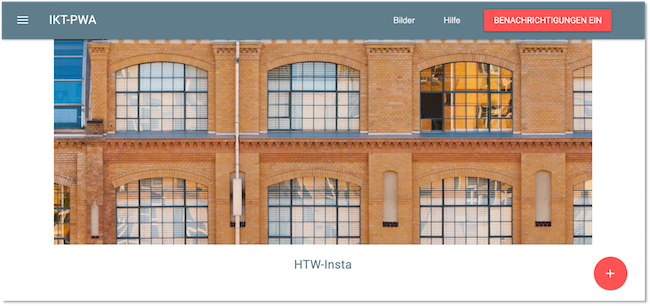
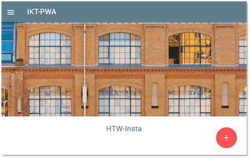
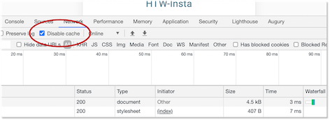

# Grundgerüst unserer PWA

Wir beginnen jetzt mit der Implementierung von *progressive* Funktionalitäten. Das machen wir, indem wir sukzessive eine Progressive Web App erstellen, die viele der derzeit verfügbaren Funktionalitäten enthält, die derzeit für *Progressive Web Apps* verfügbar sind. Das Grundgerüst (oder der Ausgangspunkt) unserer PWA wird deshalb zur Verfügung gestellt, weil wir uns nicht um die Implementierung von HTML, CSS und JavaScript, sondern nur um die *progressive* Funktionalitäten kümmern wollen. Auf Basis dieses Grundgerüstes werden sukzessive Funktionalitäten, wie Push-Notifikationen, Offline-Verwendung, Geolocation, Kameranutzung usw. hinzufügen. Die Idee ist, dass wir eine Art HTW-Instagram erstellen. Ich habe Instagram aber noch nie genutzt, deshalb weiß ich nicht, ob wir dem "Original" nahe kommen werden. Wahrscheinlich nicht, aber dafür behalten wir unsere Daten auch bei uns. 

## Installation

Den Quellcode für das Grundgerüst finden Sie [hier (GitHub)](https://github.com/jfreiheit/IKT-PWA-01). Clonen Sie sich das Projekt in einem Ordner Ihrer Wahl und folgen Sie dann der `README.MD`: 

- Zum Ausführen des Projektes wird [Node.js](https://nodejs.org) verendet. Sie müssen es auf Ihren Rechner installieren. 

- In der Wahl Ihrer IDE sind Sie völlig frei. Empfehlungen finden Sie unter [Integrated Development Environment (IDE)](https://freiheit.f4.htw-berlin.de/ikt/tools/#integrated-development-environment-ide)

- Zum Starten des Projektes wechseln Sie im Terminal (Terminal Ihres Rechners oder das Terminal in der IDE) in den Projektordner (`cd IKT-PWA-01`) und führen dort 

	`npm install` 

	aus. Damit werden alle erforderlichen Abhängigkeiten installiert.

- Nach erfolgreicher Installation der Abhängigkeiten, geben Sie  

	`npm start` 

	ein (oder genereller: `npm run start`), um Ihr Projekt auszuführen. Klicken Sie danach auf [localhost:8080](http://localhost:8080) oder geben Sie die URL direkt in Ihren Browser ein.


## Starten

Starten Sie das Projekt mit `npm start` (nachdem Sie einmalig `npm install` ausgeführt haben) und öffnen Sie dann den Browser mit der URL `http://localhost:8080/`. Es erscheint



bzw. wenn Sie die Viewport-Breite verkleinern

. 

Sie erkennen wahrscheinlich schon, dass wir [Material Design Lite](https://getmdl.io/) verwenden. Die Navigationskomponente kennen wir auch schon aus WebTech. Wenn Sie auf den `+`-Button klicken, erscheint ein kleines Menü. Dort können Sie zwar schon etwas eintragen, aber der `SPEICHERN`-Button funktioniert noch nicht. Auch beim `BENACHRICHTIGUNGEN EIN`-Button ist noch keine Ereignisbehandlung hinterlegt. Wenn Sie im Menü `Hilfe`klicken, öffnet sich die (fast leere) Hilfe-Seite. 

Schalten Sie beim Betrachten der Anwendung stets die `DeveloperTools` ein. Sie können dort sehr leicht auf die mobile Ansicht wechseln. Wichtig ist, dass Sie - zum besseren Ausprobieren der Anwendung - in den DeveloperTools unter dem Reiter `Network` ein Häkchen bei `Disable Cache` setzen. Wir wollen in Zukunft das Caching unseren *Service workern* überlassen und nicht den Cache des Browsers verwenden. 



## Projekt

Bevor wir loslegen, werfen wir noch einen kurzen Blick auf die bisherigen Dateien im Projekt. Wir beginnen mit der `index.html` aus dem `public`-Ordner.

=== "public/index.html"
	```html linenums="1"
	<!doctype html>
	<html lang="en">
	<head>
	  <meta charset="UTF-8">
	  <meta name="viewport"
	        content="width=device-width, user-scalable=no, initial-scale=1.0, maximum-scale=1.0, minimum-scale=1.0">
	  <meta http-equiv="X-UA-Compatible" content="ie=edge">
	  <title>IKT-PWA</title>
	  <link href="https://fonts.googleapis.com/css?family=Roboto:400,700" rel="stylesheet">
	  <link rel="stylesheet" href="https://fonts.googleapis.com/icon?family=Material+Icons">
	  <link rel="stylesheet"
	        href="https://code.getmdl.io/1.3.0/material.blue_grey-red.min.css">
	  <link rel="stylesheet" href="/src/css/app.css">
	  <link rel="stylesheet" href="/src/css/feed.css">
	</head>
	<body>

	<div id="app">
	  <div class="mdl-layout mdl-js-layout mdl-layout--fixed-header">
	    <header class="mdl-layout__header">
	      <div class="mdl-layout__header-row">
	        <!-- Title -->
	        <span class="mdl-layout-title">IKT-PWA</span>
	        <!-- Add spacer, to align navigation to the right -->
	        <div class="mdl-layout-spacer"></div>
	        <!-- Navigation. We hide it in small screens. -->
	        <nav class="mdl-navigation mdl-layout--large-screen-only">
	          <a class="mdl-navigation__link" href="/">Bilder</a>
	          <a class="mdl-navigation__link" href="/help">Hilfe</a>
	          <div class="drawer-option">
	            <button class="enable-notifications mdl-button mdl-js-button mdl-button--raised mdl-button--colored mdl-color--accent">
	              Benachrichtigungen Ein
	            </button>
	          </div>
	        </nav>
	      </div>
	    </header>
	    <div class="mdl-layout__drawer">
	      <span class="mdl-layout-title">IKT-PWA</span>
	      <nav class="mdl-navigation">
	        <a class="mdl-navigation__link" href="/">Bilder</a>
	        <a class="mdl-navigation__link" href="/help">Hilfe</a>
	        <div class="drawer-option">
	          <button class="enable-notifications mdl-button mdl-js-button mdl-button--raised mdl-button--colored mdl-color--accent">
	            Benachrichtigungen Ein
	          </button>
	        </div>
	      </nav>
	    </div>
	    <main class="mdl-layout__content mat-typography">
	      <div id="create-post">
	        <form>
	          <div class="input-section mdl-textfield mdl-js-textfield mdl-textfield--floating-label">
	            <input class="mdl-textfield__input" type="text" id="title">
	            <label class="mdl-textfield__label" for="title" name="title">Titel</label>
	          </div>
	          <div class="input-section mdl-textfield mdl-js-textfield mdl-textfield--floating-label" id="manual-location">
	            <input class="mdl-textfield__input" type="text" id="location">
	            <label class="mdl-textfield__label" for="location" name="location">Ort</label>
	          </div>
	          <br>
	          <div>
	            <button class="mdl-button mdl-js-button mdl-button--raised mdl-button--colored mdl-color--accent"
	                    type="submit" id="post-btn">Speichern
	            </button>
	          </div>
	          <br>
	          <div>
	            <button class="mdl-button mdl-js-button mdl-button--fab" id="close-create-post-modal-btn" type="button">
	              <i class="material-icons">close</i>
	            </button>
	          </div>
	        </form>
	      </div>
	      
	      <div class="page-content">
	        <h5 class="text-center mdl-color-text--primary">HTW-Insta</h5>
	        <div id="shared-moments"></div>
	      </div>
	      <div class="floating-button">
	        <button class="mdl-button mdl-js-button mdl-button--fab mdl-button--colored"
	                id="share-image-button">
	          <i class="material-icons">add</i>
	        </button>
	      </div>
	      <div id="confirmation-toast" aria-live="assertive" aria-atomic="true" aria-relevant="text" class="mdl-snackbar mdl-js-snackbar">
	        <div class="mdl-snackbar__text"></div>
	        <button type="button" class="mdl-snackbar__action"></button>
	      </div>
	    </main>
	  </div>
	</div>
	<script defer src="/src/js/material.min.js"></script>
	<script src="/src/js/app.js"></script>
	<script src="/src/js/feed.js"></script>
	</body>
	</html>
	```

Sie sieht recht umfangreich aus. Tatsächlich ist aber das meiste darin für das Navigationstemplate. Die Zeilen `21-36` und `38-49` beschreiben das gleiche, nämlich die Navigationsleiste. Der obere Block ist für breite Viewports (Klasse `mdl-layout--large-screen-only`). Alle `mdl`-Klassen sind von Material. Einen guten Überblick über die einzelnen Material-Komponenten finden Sie [hier](https://getmdl.io/components/index.html). Näheres zu den Navigationen finden Sie darin z.B. [hier](https://getmdl.io/components/index.html#layout-section/layout). Dann kommt das Bild (Zeilen `75-77`), dann der Text `HTW Insta` (Zeilen `78-81`) und dann der `+`-Button (Zeilen `82-87`). In den Zeilen `88-91` ist bereits eine Bestätigungsnachricht hinterlegt, derzeit aber noch `hidden`. 

In den eingebundenen eigenen Stylesheets `app.css` und `feed.css` steht nicht viel: 

=== "public/src/css/app.css"
	```css linenums="1"
	.text-center {
	  text-align: center;
	}

	.drawer-option {
	  padding: 16px;
	}
	```

=== "public/src/css/feed.css"
	```css linenums="1"
	#create-post {
	  z-index: 1001;
	  position: fixed;
	  width: 100%;
	  min-height: 100vh;
	  overflow-y: scroll;
	  bottom: 0;
	  top: 56px;
	  background: white;
	  text-align: center;
	  display: none;
	}

	.main-image {
	  max-width: 100%;
	  margin: auto;
	  display: block;
	}

	.floating-button {
	  z-index: 1000;
	  position: fixed;
	  bottom: 0;
	  right: 0;
	  padding: 30px;
	}

	.input-section {
	  display: block;
	  margin: 10px auto;
	}
	```

Kurze Erinnerung an CSS: Punktselektoren beschreiben Klassen (z.B. `.input-selection`) und #-Selektoren beschreiben Ids (z.B. `#create-post`). Sie können die Anwendung der Klassen und der Ids ja mal in der `index.html` suchen, wenn Sie möchten. 

Die `public/help/index.html` enthält noch weniger als die `public/index.html`. Erwähnenswert ist hier, dass wir mit einem Framework wie z.B. Angular natürlich der Navigation eine eigenen Komponente spendiert und diese nicht in beiden Dateien wiederholt hätten.

=== "public/help/index.html"
	```html linenums="1"
	<!doctype html>
	<html lang="en">
	<head>
	  <meta charset="UTF-8">
	  <meta name="viewport"
	        content="width=device-width, user-scalable=no, initial-scale=1.0, maximum-scale=1.0, minimum-scale=1.0">
	  <meta http-equiv="X-UA-Compatible" content="ie=edge">
	  <title>Help</title>
	  <link href="https://fonts.googleapis.com/css?family=Roboto:400,700" rel="stylesheet">
	  <link rel="stylesheet" href="https://fonts.googleapis.com/icon?family=Material+Icons">
	  <link rel="stylesheet"
	        href="https://code.getmdl.io/1.3.0/material.blue_grey-red.min.css">
	  <link rel="stylesheet" href="/src/css/help.css">
	</head>
	<body>

	<div id="app">
	  <div class="mdl-layout mdl-js-layout mdl-layout--fixed-header">
	    <header class="mdl-layout__header">
	      <div class="mdl-layout__header-row">
	        <!-- Title -->
	        <span class="mdl-layout-title">IKT-PWA</span>
	        <!-- Add spacer, to align navigation to the right -->
	        <div class="mdl-layout-spacer"></div>
	        <!-- Navigation. We hide it in small screens. -->
	        <nav class="mdl-navigation mdl-layout--large-screen-only">
	          <a class="mdl-navigation__link" href="/">Bilder</a>
	          <a class="mdl-navigation__link" href="/settings">Einstellungen</a>
	          <div class="drawer-option">
	            <button class="enable-notifications mdl-button mdl-js-button mdl-button--raised mdl-button--colored mdl-color--accent">
	              Benachrichtigungen Ein
	            </button>
	          </div>
	        </nav>
	      </div>
	    </header>
	    <div class="mdl-layout__drawer">
	      <span class="mdl-layout-title">IKT-PWA</span>
	      <nav class="mdl-navigation">
	        <a class="mdl-navigation__link" href="/">Feed</a>
	        <a class="mdl-navigation__link" href="/help">Help</a>
	        <div class="drawer-option">
	          <button class="enable-notifications mdl-button mdl-js-button mdl-button--raised mdl-button--colored mdl-color--accent">
	            Benachrichtigungen Ein
	          </button>
	        </div>
	      </nav>
	    </div>
	    <main class="mdl-layout__content mat-typography">
	      <div class="mdl-grid">
	        <div class="mdl-cell mdl-cell--12-col text-center">
	         <h3>Brauchst Du Hilfe?</h3>
	          <p>Hier erfährst Du, wie Du die App benutzen und neue Bildeinträge erstellen kannst.</p>
	        </div>
	      </div>
	      <div class="mdl-grid">
	        <div class="mdl-cell mdl-cell--12-col text-center">
	          <h3>Kontakt</h3>
	          <div>
	            <button class="mdl-button mdl-js-button mdl-button--fab mdl-button--colored">
	              <i class="material-icons">call</i>
	            </button>
	            <button class="mdl-button mdl-js-button mdl-button--fab mdl-button--colored">
	              <i class="material-icons">email</i>
	            </button>
	            <button class="mdl-button mdl-js-button mdl-button--fab mdl-button--colored">
	              <i class="material-icons">chat_bubble</i>
	            </button>
	          </div>
	        </div>
	      </div>
	    </main>
	  </div>
	</div>

	<script defer src="/src/js/material.min.js"></script>
	<script src="/src/js/app.js"></script>
	</body>
	</html>
	```

Von den beiden JavaScript-Dateien `public/src/js/app.js` und `public/src/js/feed.js` steht derzeit nur etwas in der `feed.js`. Das schauen wir uns aber erst dann an, wenn wir neue Bildeinträge speichern wollen. 

## Ngrok

Beachten Sie, dass eine Anforderung an eine PWA ist, dass sie entweder unter `localhost` oder unter `https` läuft. Das Werkzeug [ngrok](https://ngrok.com/) bietet sichere Tunnel an und simuliert so einen sicheren Webserver. Angenommen, Ihre Anwendung läuft unter Port `8080`, dann geben Sie im Terminal einfach 

```
ngrok http 8080
```

ein und es erscheint in etwa: 

```
ngrok by @inconshreveable                                                                                                          (Ctrl+C to quit)
                                                                                                                                                   
Session Status                online                                                                                                               
Account                       Jörn Freiheit (Plan: Free)                                                                                           
Version                       2.3.40                                                                                                               
Region                        United States (us)                                                                                                   
Web Interface                 http://127.0.0.1:4040                                                                                                
Forwarding                    http://039a-141-45-155-245.ngrok.io -> http://localhost:8080                                                         
Forwarding                    https://039a-141-45-155-245.ngrok.io -> http://localhost:8080                                                        
                                                                                                                                                   
Connections                   ttl     opn     rt1     rt5     p50     p90                                                                          
                              11      0       0.00    0.01    0.33    6.43                                                                         
                                                                                                                                                   
HTTP Requests                                                                                                                                      
-------------                                                                                                                                      
                                                                                                                                                   
GET /favicon.ico                     200 OK                                                                                                        
GET /src/js/feed.js                  200 OK                                                                                                        
GET /manifest.json                   200 OK                                                                                                        
GET /src/js/material.min.js          200 OK                                                                                                        
GET /src/js/app.js                   200 OK                                                                                                        
GET /src/images/htw.jpg              200 OK                                                                                                        
GET /src/css/feed.css                200 OK                                                                                                        
GET /                                200 OK                                                                                                        
GET /src/css/app.css                 200 OK                                                                                                        
GET /src/images/icons/fiw256x256.png 200 OK    
```

Sie haben nun unter der Adresse `https://039a-141-45-155-245.ngrok.io` (bei Ihnen anders!) eine `https`-Verbindung zum Webserver. Sie können die Anwendung somit unter dieser Adresse auch in Ihrem Smartphone aufrufen. Lassen Sie sich dazu am besten von Ihrem Browser einen QR-Code erzeugen und fotografieren ihn mit der Kamera ab.

Schauen Sie sich auch ruhig einmal das Web-Interface von ngrok an, das unter `http://127.0.0.1:4040` verfügbar ist. 

Noch besser ist es (und ngrok empfiehlt das), Sie verwenden

```
ngrok http 8000 --basic-auth 'ngrok:issecure'
```

Damit sichern Sie die Seite durch einen `account:password`-Zugriff. Sie werden beim Starten Seite aufgefordert, einen Nutzerinnennamen und ein Passwort einzugeben. In diesem Fall wären das `ngrok` und `issecure`. Natürlich können Sie bei Aufruf von `ngrok` auch eine frei wählbare Kombination `'account:password'` verwenden (anstelle von `'ngrok:issecure'`).
