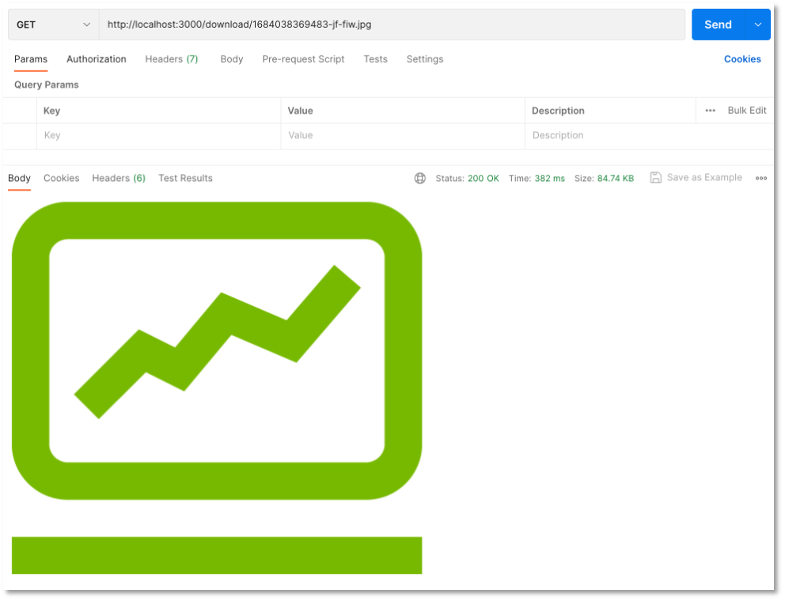

# Backend-Erweiterung um das Speichern von Bildern

??? "Video zur Vorlesung"
    <iframe src="https://mediathek.htw-berlin.de/media/embed?key=d8fa2b88c13485fe6ea0730f8dd0f75b&width=720&height=467&autoplay=false&controls=true&autolightsoff=false&loop=false&chapters=false&playlist=false&related=false&responsive=false&t=0&loadonclick=true&thumb=true" data-src="https://mediathek.htw-berlin.de/media/embed?key=d8fa2b88c13485fe6ea0730f8dd0f75b&width=720&height=467&autoplay=false&controls=true&autolightsoff=false&loop=false&chapters=false&playlist=false&related=false&responsive=false&t=0&loadonclick=true" class="" width="720" height="467" title="IKT_SpeichernVonBildern" frameborder="0" allowfullscreen="allowfullscreen" allowtransparency="true" scrolling="no" aria-label="media embed code" style=""></iframe>

Bis jetzt haben wir nur Daten im JSON-Format zwischen Frontend und Backend ausgetauscht und auch nur solche Daten in der MongoDB gespeichert. Bilder (und auch andere Dateien) sind [FormData-Objects](https://developer.mozilla.org/en-US/docs/Web/API/FormData/Using_FormData_Objects) im `multipart/form-data`-Format. Zur Behandlung solcher Daten verwenden wir ein *Middleware* für unser Backend, namens [Multer](https://www.npmjs.com/package/multer). 

!!! hint
		Wenn Sie nur am Code für unser Backend interessiert sind, dann können Sie auch direkt zu [Zusammenführen der Funktionalitäten](./#zusammenfuhren-der-funktionalitaten) springen. Im Folgenden werden die Entstehung aber näher erläutert und verschiedene Varianten diskutiert. 

MongoDB speichert Daten bis zu einer Größe von `16Mb` im Binärformat. Um auch größere Dateien (Bilder, Videos, pdf, ...) speichern zu können, werden die Dateien in *chunks* zerlegt und können dann aus diesen Stücken wieder zusammengesetzt werden. Dafür gibt es in der MongoDB eine [GridFS](https://docs.mongodb.com/manual/core/gridfs/)-Spezifikation (siehe auch [hier](https://medium.com/@kavitanambissan/uploading-and-retrieving-a-file-from-gridfs-using-multer-958dfc9255e8) oder [hier](https://www.topcoder.com/thrive/articles/storing-large-files-in-mongodb-using-gridfs)). Zur Verwendung von GridFS gibt es die beiden Pakte [multer-gridfs-storage](https://www.npmjs.com/package/multer-gridfs-storage) und [gridfs-stream](https://www.npmjs.com/package/gridfs-stream). 

Wir installieren im Backend-Projekt alle drei Pakete und zeigen im Folgenden deren Verwendung:

```bash
npm install multer multer-gridfs-storage gridfs-stream
```

Die `package.json` sollte nun ungefähr so aussehen:

=== "package.json"
	```js linenums="1"
	{
	  "name": "backend",
	  "version": "1.0.0",
	  "description": "Backend REST-API",
	  "main": "server.js",
	  "scripts": {
	    "watch": "nodemon ./server.js",
	    "test": "echo \"Error: no test specified\" && exit 1"
	  },
	  "keywords": [
	    "rest",
	    "api",
	    "backend",
	    "mongodb"
	  ],
	  "repository": {
	    "type": "git",
	    "url": "https://github.com/jfreiheit/IKT-PWA-Backend.git"
	  },
	  "author": "J. Freiheit",
	  "license": "ISC",
	  "dependencies": {
	    "cors": "^2.8.5",
	    "dotenv": "^16.0.3",
	    "express": "^4.18.2",
	    "gridfs-stream": "^1.1.1",
	    "mongodb": "^5.4.0",
	    "mongoose": "^7.1.1",
	    "multer": "^1.4.4-lts.1",
	    "multer-gridfs-storage": "5.0.2"
	  },
	  "devDependencies": {
	    "nodemon": "^2.0.22"
	  }
	}
	```

Wir kümmern uns nun zunächst darum, Bilder in die MongoDB *hochzuladen*.


### Upload von Bildern

Für den Upload der Bilder erstellen wir zunächst einen Ordner `middleware` und darin eine Datei `upload.js`. In dieser Datei wird unter Verwendung von `Multer` ein `GridFsStorage` eingerichtet. Die zu verwendende *Collection* benennen wir hier `posts` (siehe `bucketName`). Die Datenbank heißt `image` (siehe `dbName`). Sie können diese Namen frei wählen. Beachten Sie dann aber im Folgenden überall die Verwendung von `posts` (in der MongoDB entstehen die Collections `posts.files` und `posts.chunks` - siehe z.B. [hier](https://medium.com/@kavitanambissan/uploading-and-retrieving-a-file-from-gridfs-using-multer-958dfc9255e8) oder [hier](https://www.topcoder.com/thrive/articles/storing-large-files-in-mongodb-using-gridfs)).

=== "middleware/upload.js"
```js linenums="1"
const multer = require("multer");
const {
    GridFsStorage
} = require("multer-gridfs-storage");
const mongoose = require('mongoose');
require('dotenv').config();


const credentials = process.env.PATH_TO_PEM

const storage = new GridFsStorage({
    //db: connection,
    url: process.env.DB_CONNECTION,
    options: { 
    sslKey: credentials,        // nur falls ein Zertifikat zur Autorisierung
    sslCert: credentials,       // für MongoDB Atlas verwendet wird
    dbName: "images" },
    file: (req, file) => {
        const match = ["image/png", "image/jpeg"];

        if (match.indexOf(file.mimetype) === -1) {
            console.log('file.mimetype === -1')
            return `${Date.now()}-jf-${file.originalname}`;
        }
        console.log('store');
        return {
            bucketName: 'posts',
            filename: `${Date.now()}-jf-${file.originalname}`,
        };
    },
});

module.exports = multer({ storage });
```

Beachten Sie, dass wir beim Upload der Bilder für diese Bilder Dateinamen mithilfe von `${Date.now()}-jf-${file.originalname}` erstellen bzw. festlegen. Damit diese Dateinamen eindeutig sind, wird mithilfe von `Date.now()` der aktuelle Zeitstempel verwendet. Der String `-jf-` in der Mitte kann natürlich auch durch Ihre Initialen ersetzt (oder weggelassen) werden. Außerdem wird auch noch der originale Dateiname verwendet. Insgesamt sollte sichergestellt werden, dass die Dateinamen eindeutig sind (deshalb auch `Date.now()`). 

In Zeile `19` werden die Dateitypen festgelegt, die akzeptiert werden, hier `png` und `jpeg`. Diese Liste kann erweitert oder eingegrenzt werden.

Diese *Middleware* nutzen wir nun für den `POST`-Request des Bildes und erstellen einen Ordner `routes` und darin eine Datei `upload.routes.js` mit folgendem Inhalt:

=== "routes/upload.route.js"
```js linenums="1"
const express = require('express');
const upload = require('../middleware/upload');
const router = express.Router();

router.post('/', upload.single('file'), (req, res) => {
    if (req.file === undefined) {
        return res.send({
            "message": "no file selected"
        });
    } else {
        console.log('req.file', req.file);
        const imgUrl = `http://localhost:3000/download/${req.file.filename}`;
        return res.status(201).send({
            url: imgUrl
        });
    }
})

module.exports = router;

```

In Zeile `5` wird die *multer-Middleware* mit `update.single('file')` aufgerufen. Neben der Funktion `.single(fieldname)` stehen auch die Funktionen `.array(fieldname[, maxCount])` und `.fields(field)` zur Verfügung, um gleichzeitig mehrere Dateien hochzuladen (siehe [multer](https://www.npmjs.com/package/multer)). 

Als *Response* wird die URL zurückgegeben, unter der das Bild heruntergeladen werden kann (`http://localhost:3000/download/${req.file.filename}`). Beachten Sie, dass die Backend-URL und auch der Port hier hart kodiert sind. Das sollte besser in die `.env`-Datei ausgelagert werden. 

### Routen ändern und einbinden


In der ursprünglichen Implementierung hatten wir die Datei `routes.js` noch im Projektordner gehabt. Wir benennen diese in `posts.routes.js` um und schieben sie ebenfalls in den `routes`-Ordner. Beachten Sie, dass Sie dadurch in der `server.js` auch den Import auf `const routes = require('./routes/posts.routes');` ändern müssen.

Da wir nun aber auch die `upload`-Route einbinden, ändern wir gleich mehrere Sachen. Zunächst wird der ursprüngliche `routes` zu `postRoutes` und die generelle Route dafür wird `/posts`:

=== "server.js"
```js linenums="1" hl_lines="3-4 15-16"
const express = require('express')
const cors = require('cors')
const postsRoutes = require('./routes/posts.routes')
const uploadRoutes = require('./routes/upload.routes');
const mongoose = require('mongoose');
require('dotenv').config();

const credentials = process.env.PATH_TO_PEM

const app = express()
const PORT = 3000;

app.use(express.json());
app.use(cors())
app.use('/posts', postsRoutes);
app.use('/upload', uploadRoutes);

// connect to mongoDB
mongoose.connect(process.env.DB_CONNECTION, { 
    sslKey: credentials,
    sslCert: credentials,
    dbName: process.env.DATABASE });
    
const db = mongoose.connection;
db.on('error', err => {
  console.log(err);
});
db.once('open', () => {
    console.log('connected to DB');
});

app.listen(PORT, (error) => {
    if(error) {
        console.log('error', error)
    } else {
        console.log(`server running on http://localhost:${PORT}`)
    }
})
```

In der `posts.routes.js` kann nun aus den URLs der Endpunkte jeweils das `/posts` entfernt werden:

=== "routes/posts.routes.js"
```js linenums="1" hl_lines="6 13 24 38 63"
const express = require('express');
const router = express.Router();
const Post = require('../models/posts');

// GET all posts
router.get('/', async(req, res) => {
    const allPosts = await Post.find();
    console.log(allPosts);
    res.send(allPosts);
});

// POST one post
router.post('/', async(req, res) => {
    const newPost = new Post({
        title: req.body.title,
        location: req.body.location,
        image_id: req.body.image_id
    })
    await newPost.save();
    res.send(newPost);
});

// POST one post via id
router.get('/:id', async(req, res) => {
    try {
        const post = await Post.findOne({ _id: req.params.id });
        console.log(req.params);
        res.send(post);
    } catch {
        res.status(404);
        res.send({
            error: "Post does not exist!"
        });
    }
});

// PATCH (update) one post
router.patch('/:id', async(req, res) => {
    try {
        const post = await Post.findOne({ _id: req.params.id })

        if (req.body.title) {
            post.title = req.body.title
        }

        if (req.body.location) {
            post.location = req.body.location
        }

        if (req.body.image_id) {
            post.image_id = req.body.image_id
        }

        await Post.updateOne({ _id: req.params.id }, post);
        res.send(post)
    } catch {
        res.status(404)
        res.send({ error: "Post does not exist!" })
    }
});

// DELETE one post via id
router.delete('/:id', async(req, res) => {
    try {
        await Post.deleteOne({ _id: req.params.id })
        res.status(204).send()
    } catch {
        res.status(404)
        res.send({ error: "Post does not exist!" })
    }
});

module.exports = router;
```

### Upload mithilfe von Postman

Das Hochladen der Bilder kann nun bereits getestet werden. Starten Sie das Backend. Öffnen Sie Postman und geben Sie als URL `http://localhost:3000/upload` ein und wählen als Anfragemethode `POST`. Klicken Sie auf `Body` und markieren dann `form-data`:


Geben Sie unter `KEY` den Schlüssel `file` ein (das wird manchmal vergessen und dann bekommen Sie einen `multer`-Fehler `unexpected field`!) und wählen Sie aus dem Dropdown-Menü `File`. Unter `VALUE` erscheint der Button `Select Files`. Klicken Sie darauf und wählen ein `png`- oder ein `jpeg`-Bild (kann auch `.jpg` sein) aus, das Sie hochladen wollen. Klicken Sie dann auf `Send`. Es erscheint:


Ich habe in diesem Beispiel die Datei `fiw.jpg` hochgeladen. 

Wenn Sie sich die MongoDB anschauen (in Compass), dann finden Sie darin die beiden Collections `posts.files` und `posts.chunks`. In `posts.files` sind die Metadaten des hochgeladenen Bildes zu finden, z.B. 

```json
{
  "_id": {
    "$oid": "646062e135cc14afbf5fd29b"
  },
  "length": 86584,
  "chunkSize": 261120,
  "uploadDate": {
    "$date": "2023-05-14T04:26:10.472Z"
  },
  "filename": "1684038369483-jf-fiw.jpg",
  "contentType": "image/jpeg"
}
```

Die dazugehörige `_id` finden Sie auch in `posts.chunks` (können Sie sich in der `mongosh` mit `db.posts.chunks.find({ _id: "646062e135cc14afbf5fd29b" })` anschauen). Darin ist das Bild im Binary-Format gespeichert. 


### Download von Bildern

Für den Download der gespeicherten Bilder gehen wir ähnlich vor, wie beim Upload, benötigen dafür aber nicht mehr die *multer-Middleware*, dafür aber `gridfs-stream`. Wir erstellen im Ordner `routes` die Datei `download.routes.js` mit folgendem Inhalt:


=== "routes/download.routes.js"
```js linenums="1"
const express = require('express');
const mongoose = require('mongoose');
const Grid = require("gridfs-stream");
const router = express.Router();
require('dotenv').config();

const credentials = process.env.PATH_TO_PEM

const connection = mongoose.createConnection(process.env.DB_CONNECTION, { 
    sslKey: credentials,
    sslCert: credentials,
    dbName: "images" });

let gfs, gfsb;
connection.once('open', () => {
    // initialize stream
    gfsb = new mongoose.mongo.GridFSBucket(connection.db, {
        bucketName: "posts"
    });

    gfs = Grid(connection.db, mongoose.mongo);
});

router.get('/:filename', async(req, res) => {
    try {
        const cursor = await gfs.collection('posts').find({ filename: req.params.filename });
        cursor.forEach(doc => {
            console.log('doc', doc);
            gfsb.openDownloadStream(doc._id).pipe(res);
        })
    } catch (error) {
        console.log('error', error);
        res.send("not found");
    }
});

module.exports = router;
```


[GridFSBucket](https://mongodb.github.io/node-mongodb-native/3.2/api/GridFSBucket.html) ist eine Klasse aus der [Node.js-MongoDB-API](https://mongodb.github.io/node-mongodb-native/3.2/api/index.html). Diese hätten wir auch schon für das Upload verwenden können (siehe z.B. [hier](https://edupeeth.com/all-courses/nodejs/mongodb-gridfs-bucket)). 

Da wir über den Dateinamen auf die Datei zugreifen wollen, benötigen wir zunächst die entsprechende `_id` der Datei in der `posts.chunks`-Collection. Dazu greifen wir mithilfe von `find()` auf die `posts.files`-Collection zu und ermitteln die `_id`. Die `find()`-Funktion gibt einen sogenannten [Cursor](https://docs.mongodb.com/drivers/node/current/fundamentals/crud/read-operations/cursor/) auf das Array aller gefundenen Datensätze zurück. Mithilfe von `forEach()` durchlaufen wir dieses Array (enthält aber nur einen Datensatz) und ermitteln die `_id`. Mit der `openDownloadStream()`-Funktion der `GridFSBucket()`-Klasse öffnen wir den Download-Stream des Bildes und geben ihn als *response* `res` zurück. 

Wir binden die `download`-Route nun noch in unsere `server.js` ein:

=== "server.js"
```js linenums="1" hl_lines="5 18"
const express = require('express')
const cors = require('cors')
const postsRoutes = require('./routes/posts.routes')
const uploadRoutes = require('./routes/upload.routes');
const downloadRoute = require('./routes/download.routes');
const mongoose = require('mongoose');
require('dotenv').config();

const credentials = process.env.PATH_TO_PEM

const app = express()
const PORT = 3000;

app.use(express.json());
app.use(cors())
app.use('/posts', postsRoutes);
app.use('/upload', uploadRoutes);
app.use('/download', downloadRoute);

// connect to mongoDB
mongoose.connect(process.env.DB_CONNECTION, { 
    sslKey: credentials,
    sslCert: credentials,
    dbName: process.env.DATABASE });
    
const db = mongoose.connection;
db.on('error', err => {
  console.log(err);
});
db.once('open', () => {
    console.log('connected to DB');
});

app.listen(PORT, (error) => {
    if(error) {
        console.log('error', error)
    } else {
        console.log(`server running on http://localhost:${PORT}`)
    }
})
```


### Download mithilfe von Postman

Der Test des `GET http://localhost:3000/download/:filename`-Endpunktes ist einfach. Dazu verwenden wir einfach die URL, die durch den Upload als *Response*  zurückgegeben wurde (im obigen Beispiel also `"http://localhost:3000/download/1684038369483-jf-fiw.jpg"`):

Geben Sie in Postman also Ihre URL ein, wählen `GET` und klicken `Send`. Es erscheint das Bild:



Da es sich um die GET-Methode handelt, können Sie die URL `http://localhost:3000/download/1684038369483-jf-fiw.jpg` natürlich auch in den Browser eingeben und das Bild erscheint. 

### Download als base64-String

Im oberen Beispiel wurde das Bild beim Download gestreamt. Wir betrachten nun die Möglichkeit, dass es als base64-String gesendet wird. Base64 ist ein Verfahren zur Kodierung von 8-Bit-Binärdaten (z.B. Bilder) in eine Zeichenfolge, die nur aus lesbaren, Codepage-unabhängigen ASCII-Zeichen besteht. Der String ist für ein Bild sehr lang. Er lässt sich aber leicht in eine Bildquelle umwandeln, damit das Bild dann im Frontend dargestellt werden kann. 

Wir werden in der `download.routes.js` beide Möglichkeiten lassen (also sowohl den Stream als auch den base64-String). Deshalb passen wir die Routen der Endpunkte an. Die `/show/:filename`-Route ist für den Stream und die `/send/:filename`-Route für den `base64`-String. Wir präsentieren zunächst den Code und erläutern ihn dann. Die `download.routes.js` sieht dann so aus:


=== "routes/download.routes.js"
```js linenums="1"
const express = require('express');
const mongoose = require('mongoose');
const Grid = require("gridfs-stream");
const router = express.Router();
require('dotenv').config();

const credentials = process.env.PATH_TO_PEM

const connection = mongoose.createConnection(process.env.DB_CONNECTION, { 
    sslKey: credentials,
    sslCert: credentials,
    dbName: "images" });

let gfs, gfsb;
connection.once('open', () => {
    // initialize stream
    gfsb = new mongoose.mongo.GridFSBucket(connection.db, {
        bucketName: "posts"
    });

    gfs = Grid(connection.db, mongoose.mongo);
});

router.get('/show/:filename', async(req, res) => {
    try {
        const cursor = await gfs.collection('posts').find({ filename: req.params.filename });
        cursor.forEach(doc => {
            console.log('doc', doc);
            gfsb.openDownloadStream(doc._id).pipe(res);
        })
    } catch (error) {
        console.log('error', error);
        res.send("not found");
    }
});

router.get('/send/:filename', async(req, res) => {
    let fileName = req.params.filename;

    const files = connection.collection('posts.files');
    const chunks = connection.collection('posts.chunks');

    const cursorFiles = files.find({filename: fileName});
    const allFiles = await cursorFiles.toArray();
    const cursorChunks = chunks.find({files_id : allFiles[0]._id});
    const sortedChunks = cursorChunks.sort({n: 1});
    let fileData = [];
    for await (const chunk of sortedChunks) {
        fileData.push(chunk.data.toString('base64'));
    }
    let finalFile = 'data:' + allFiles[0].contentType + ';base64,' + fileData.join('');
    res.send({title: 'Image File', message: 'Image loaded from MongoDB GridFS', imgurl: finalFile});
}) // get

module.exports = router;

```

Wir stellen eine Verbindung zur `posts.files`-Collection (`files` - siehe Zeile `40`) und zur `posts.chunks`-Collection (`chunks` - siehe Zeile `41`) her (siehe [GridFS](https://www.mongodb.com/docs/drivers/node/v3.6/fundamentals/gridfs/)). Dann suchen wir in der `posts.files`-Collection nach dem Dateinamen und ermitteln die zugehörige `_id` (speichern als `files_id`, erhalten wir aus `allFiles[0]._id` - siehe Zeile `45`). Nun suchen wir alle `chunks` mit dieser `files_id` und erhalten ein `chunks`-Array. Dieses Array enthält die `data` des jeweiligen `chunk`. Mithilfe der JavaScript-Funktion `toString('base64)` wandeln wir diese Daten in einen String um und speichern die String in das Array `fileData`. Dieses Array ist also ein Array aus Strings. Unter der Verwendung der `join('')`-Funktion von JavaScript werden alle diese String-Einträge zu einem String verbunden. Vor diesen String setzen wir noch `"data:image/jpeg;base64,"` (siehe z.B. [hier](https://elmah.io/tools/base64-image-encoder/)). 

Wenn wir nun ein Bild downloaden wollen, geben wir in Postman z.B. `http://localhost:3000/download/send/1684038369483-jf-fiw.jpg` ein und erhalten den sehr langen base64-String des Bildes. Die gleiche Funktionalität haben Sie auch, wenn Sie einen Online-Encoder verwenden, z.B. [base64-image.de](https://www.base64-image.de/).


### Delete von Bildern

Das Löschen der Bilder ist ganz ähnlich zum Download. Erstellen Sie die Datei `routes/delete.route.js`:

=== "routes/delete.routes.js"
```js linenums="1"
const express = require('express');
const mongoose = require('mongoose');
const Grid = require("gridfs-stream");
const router = express.Router();

const credentials = process.env.PATH_TO_PEM

const connection = mongoose.createConnection(process.env.DB_CONNECTION, { 
    sslKey: credentials,
    sslCert: credentials,
    dbName: "images" });
    
let gfs;
connection.once('open', () => {
    gfs = Grid(connect.db, mongoose.mongo);
    gfs.collection('posts');
});

router.delete('/:filename', async(req, res) => {
    try {
        await gfs.collection('posts').deleteOne({ filename: req.params.filename });
        res.send({
            "message": "deleted"
        });
    } catch (error) {
        console.log('error', error);
        res.send("An error occured.");
    }
});

module.exports = router;
```

und binden diese in die `server.js` ein:

=== "server.js"
```js linenums="1" hl_lines="6 17"
const express = require('express');
const cors = require('cors');
const postsRoutes = require('./routes/posts.routes');
const uploadRoutes = require('./routes/upload.routes');
const downloadRoute = require('./routes/download.routes');
const deleteRoute = require('./routes/delete.routes');
const mongoose = require('mongoose');
require('dotenv').config();

const app = express();
app.use(express.json());
app.use(cors());

app.use('/posts', postsRoutes);
app.use('/image', uploadRoutes);
app.use('/download', downloadRoute);
app.use('/delete', deleteRoute);

app.listen(process.env.PORT, (error) => {
	if (error) {
		console.log(error);
	} else {
		console.log(`server running on http://localhost:${process.env.PORT}`);
	}
});

// connect to mongoDB
mongoose.connect(process.env.DB_CONNECTION, { useNewUrlParser: true, useUnifiedTopology: true });
const db = mongoose.connection;
db.on('error', console.error.bind(console, 'connection error:'));
db.once('open', () => {
	console.log('connected to DB');
});
```


### Delete mithilfe von Postman

Zum Testen verwenden Sie den gleichen Dateinamen wie beim Download und wählen als Anfragemethode `DELETE`. 


## Zusammenführen der Funktionalitäten

Wir haben nun recht viele Routen und Endpunkte in unserem Backend. Wir wollen aber gerne, dass es nur die fünf genannten Endpunkte gibt:

| Methode | URL | Bedeutung |
|---------|-----|-----------|
| GET     | /posts | hole alle Datensätze |
| GET     | /posts/11 | hole den Datensatz mit der id=11 |
| POST    | /posts | füge einen neuen Datensatz hinzu |
| PUT     | /posts/11 | ändere den Datensatz mit der id=11 |
| DELETE  | /posts/11 | lösche den Datensatz mit der id=11 |

Das bedeutet, wir binden den Upload und Download von Bildern nun in unsere `posts`-Routen ein. Die Funktionen werden dabei "etwas" umfangreicher. 

### Zum Verständnis

Wir verwenden [Multer](https://www.npmjs.com/package/multer) und [GridFs storage](https://www.npmjs.com/package/multer-gridfs-storage). Multer ist eine *Middleware* für Node.js, um Daten im `multipart/form-data`-Format zu verwalten. Die grundsätzliche Idee ist, dass im *Request* nicht nur ein `body`, sondern auch eine `file`-Eigenschaft enthalten ist (neben dem `header`). Multer verwendet einen `storage`, um Bilder (oder andere Dateien) zu speichern. Einen solchen `storage` bietet `GridFs storage`. Dieser kann sogar Dateien größer als 16 MB speichern und die Idee dabei ist, dass die Datei in zwei Collections gespeichert wird, in der `files`-Collection, welche die (Meta-)Informationen der Datei speichert und der `chunks`-Collection, die die eigentliche Datei (als Binärdaten) speichert. Eine Datei kann dabei in mehrere `chunks` unterteilt werden. Die folgende Abbildung zeigt das Prinzip von `GridFS`:


Für unser Datenmodell sieht die Aufteilung der Daten somit wie folgt aus:

- in der `posts`-Collection speichern wir
	- die `_id` des Posts,
	- den `title` eines Posts,
	- die `location` und 
	- die `image_id`. Die `image_id` enthält den Dateinamen `filename` des Bildes.

- in der `posts.files`-Collection speichern wir (GridFs)
	- die `_id` der Datei,
	- die `length` der Datei,
	- die `chunkSize`, 
	- das `uploadDate`, 
	- den `filename` (siehe in `posts` die `image_id`) und 
	- den `contenType` (z.B. `image/jpeg`)

- in der `posts.chunks`-Collection speichern wir (GridFs)
	- die `_id` des Chunks,
	- die `files_id` (diese entspricht der `_id` der Datei in der `posts.files`-Collection),
	- ein `n` (fortlaufende Nummerierung der Chunks einer Datei beginnend mit `0`),
	- die `data` der Datei (in diesem Chunk)

Chunks kann es zu einer Datei mehrere geben. Alle `data` aller Chunks einer Datei bilden zusammen die Datei als Binär- (bzw. base64-) Daten. Die folgende Abbildung zeigt unser Datenmodell in der Datenbank `posts`:


Um z.B. einen Datensatz (einen Post) anzulegen, speichern wir also die zugehörigen Daten in der `posts`-Collection (inkl. dem `filename` der Datei), speichern die Meta-Informationen der Datei in der `posts.files`-Collection und die zugehörigen Binärdaten der Datei in `posts.chunks`. 

### POST - kompletter Datensatz

Die `POST`-Funktion für einen Datensatz ist nicht viel umfangreicher als zuvor:

=== "aus routes/posts.routes.js"
```js linenums="27"
  // POST one post
router.post('/', upload.single('file'), async(req, res) => {
    // req.file is the `file` file
    if (req.file === undefined) {
        return res.send({
            "message": "no file selected"
        });
    } else {
		console.log('req.body', req.body);
		const newPost = new Post({
			title: req.body.title,
			location: req.body.location,
			image_id: req.file.filename
		})
		await newPost.save();
		return res.send(newPost);
    }
})
``` 

Wichtig ist, dass `posts.routes.js` nun auch die `upload.js` einbindet:


=== "aus routes/posts.routes.js"
```js linenums="4"
const upload = require('../middleware/upload');
``` 
Achten Sie darauf, dass Sie in `upload.js` die korrekte Datenbank verwenden (siehe `dbName`)!

Beachten Sie, dass die Daten nun nicht mehr als JSON übergeben werden, sondern als `form-data`. Der Test mithilfe von Postman sieht deshalb nun so aus:

 

Als Response bekommen Sie aber wieder ein JSON zurück, z.B.:

```json
{
    "title": "HTW Gebäude C",
    "location": "Campus Wilhelminenhof",
    "image_id": "1652166642127-jf-htwbild5.jpg",
    "_id": "627a0ff2305433d805b6b437",
    "__v": 0
}
```

Das Bild ist nun in der Collection `posts` einerseits in `posts.files` mit den Daten

 

und in `posts.chunks` mit den Daten

 

gespeichert. Beachten Sie, dass das Bild so klein ist, dass es in nur einem `chunk` gespeichert werden kann. Größere Dateien werden in mehrer `chunks` aufgeteilt. Alle diese `chunks`, die zu einem Bild gehören, haben dann dieselbe `files_id` (aber fortlaufende `_id`s).

In der `posts`-Collection sieht der Datensatz dann wie folgt aus:

 

### GET - ein kompletter Datensatz

Jetzt den kompletten Datensatz mit einer bestimmten `_id` zu laden, ist etwas aufwendiger:

1. Wir laden zunächst aus der `posts`-Collection den Datensatz mit der `_id`. 
2. Aus diesem Datensatz lesen wir die `image_id` aus. Das ist der `filename` mit dem wir in der `posts.files`-Collection suchen. 
3. Aus der `posts.files`-Collection lesen wir den Datensatz mit dem `filename` aus und identifizieren dessen `_id`. 
4. Nach dieser `_id` suchen wir unter `files_id` in der `posts.chunks`-Collection und lesen alle zugehörigen `chunks` aus. 

Dazu schreiben wir uns zunächst eine Funktion `getOnePost(id)`, die ein `Promise` zurückgibt.

=== "aus routes/posts.routes.js"
```js linenums="23"
require('dotenv').config();

const credentials = process.env.PATH_TO_PEM

const connection = mongoose.createConnection(process.env.DB_CONNECTION, { 
    sslKey: credentials,
    sslCert: credentials,
    dbName: "htwinsta" });

function getOnePost(id) {

    return new Promise( async(resolve, reject) => {
        try {
            
            const post = await Post.findOne({ _id: id });
            let fileName = post.image_id;
            const files = connection.collection('posts.files');
            const chunks = connection.collection('posts.chunks');
            
            const cursorFiles = files.find({filename: fileName});
            const allFiles = await cursorFiles.toArray();
            const cursorChunks = chunks.find({files_id : allFiles[0]._id});
            const sortedChunks = cursorChunks.sort({n: 1});
            let fileData = [];
            for await (const chunk of sortedChunks) {
                fileData.push(chunk.data.toString('base64'));
            }
            let base64file = 'data:' + allFiles[0].contentType + ';base64,' + fileData.join('');
            let getPost = new Post({
                "title": post.title,
                "location": post.location, 
                "image_id": base64file
            });
            //console.log('getPost', getPost)
            resolve(getPost)
        } catch {
            reject(new Error("Post does not exist!"));
        }
    })
}
``` 

Die Konsolenausgaben können natürlich auch alle entfernt werden, aber es lohnt sich vielleicht auch zu sehen, was an den einzelnen Stellen passiert. In Zeile `37` erfolgt der Zugriff auf die `posts`-Collection und es wird der Datensatz mit der `_id` ermittelt, welche als Parameter der URL übergeben wurde. Aus dem Ergebnis `post` wird dann der Dateiname des Bildes in Zeile `37` mithilfe von `post.image_id` ermittelt. 

In der `post.files`-Collection wird in Zeile `42` nach dem Datensatz mit dem entsprechenden `filename` gesucht. Die `_id` dieses Datensatzes ist der Wert von `files_id` in der Collection `posts.chunks`. Nach all diesen Einträgen wird in Zeile `44` gesucht. Aus allen `chunks` wird dann der `base64`-String erzeugt und dem `Post`-Objekt übergeben, welches als `resolve` der `Promise` zurückgeschickt wird. 

Diese Funktion können wir nun für unseren `get('/:id')`-Endpunkt verwenden. Die Funktion sieht dann wie folgt aus:

=== "aus routes/posts.routes.js"
```js linenums="102"
// GET one post via id
router.get('/:id', async(req, res) => {
    getOnePost(req.params.id)
    .then( (post) => {
        console.log('post', post);
        res.send(post);
    })
    .catch( () => {
        res.status(404);
        res.send({
            error: "Post does not exist!"
        });
    })
});
``` 

Wir übergeben der `getOnePost()`-Funktion die als Parameter übergebene `id` und senden den `resolve`-Wert der `Promise` als Response zurück. 


### GET - alle Datensätze

Der Ansatz, um alle Datensätze aus der MongoDB zu lesen, ist der gleiche, wie für einen Datensatz. Wir ermitteln sukzessive die `_id` alle Datensätze in der `posts`-Collection. Dazu schreiben wir uns eine Funktion `getAllPosts()`. In dieser laden wir zunächst alle `posts` und rufen dann für jeden einzelnen die `getOnePost(id`-Funktion auf:

=== "aus routes/posts.routes.js"
```js linenums="65"
function getAllPosts() {
	return new Promise( async(resolve, reject) => {
		const sendAllPosts = [];
		const allPosts = await Post.find();
		try {
			for(const post of allPosts) {
				console.log('post', post)
				const onePost = await getOnePost(post._id);
				sendAllPosts.push(onePost);
			}
			console.log('sendAllPosts', sendAllPosts)
			resolve(sendAllPosts)
		} catch {
				reject(new Error("Posts do not exist!"));
    }
	});
}
``` 

Die Verwendung dieser Funktion ist wie oben:


=== "aus routes/posts.routes.js"
```js linenums="12"
// GET all posts
router.get('/', async(req, res) => {
	
	getAllPosts()
	.then( (posts) => {
		res.send(posts);
	})
	.catch( () => {
		res.status(404);
        res.send({
            error: "Post do not exist!"
        });
	})
});
``` 

### DELETE - einen Datensatz

Wird ein Post gelöscht, müssen wir auch dafür sorgen, dass das zugehörige Bild aus der `posts.files` und der `posts.chunks` gelöscht wird. Das Löschen ist also dreistufig:

=== "aus routes/posts.routes.js"
```js linenums="12"
// DELETE one post via id
router.delete('/:id', async(req, res) => {
    try {
        const post = await Post.findOne({ _id: req.params.id })
        let fileName = post.image_id;
        await Post.deleteOne({ _id: req.params.id });
        await files.find({filename: fileName}).toArray( async(err, docs) => {
            await chunks.deleteMany({files_id : docs[0]._id});
        })
        await files.deleteOne({filename: fileName});
        res.status(204).send()
    } catch {
        res.status(404)
        res.send({ error: "Post does not exist!" })
    }
});
```

### Zusammenfassung - Code des Backends

Hier nochmal alle wichtigen Dateien unseres Backends:


=== "server.js"
```js linenums="1"
const express = require('express')
const cors = require('cors')
const postsRoutes = require('./routes/posts.routes')
const uploadRoutes = require('./routes/upload.routes');
const downloadRoute = require('./routes/download.routes');
const deleteRoute = require('./routes/delete.routes');
const mongoose = require('mongoose');
require('dotenv').config();

const credentials = process.env.PATH_TO_PEM

const app = express()
const PORT = 3000;

app.use(express.json());
app.use(cors())
app.use('/posts', postsRoutes);
app.use('/upload', uploadRoutes);
app.use('/download', downloadRoute);
app.use('/delete', deleteRoute);

// connect to mongoDB
mongoose.connect(process.env.DB_CONNECTION, { 
    sslKey: credentials,
    sslCert: credentials,
    dbName: process.env.DATABASE });
    
const db = mongoose.connection;
db.on('error', err => {
  console.log(err);
});
db.once('open', () => {
    console.log('connected to DB');
});

app.listen(PORT, (error) => {
    if(error) {
        console.log('error', error)
    } else {
        console.log(`server running on http://localhost:${PORT}`)
    }
})
```
=== "middleware/upload.js"
```js linenums="1"
const multer = require("multer");
const {
    GridFsStorage
} = require("multer-gridfs-storage");
const mongoose = require('mongoose');
require('dotenv').config();


const credentials = process.env.PATH_TO_PEM

const storage = new GridFsStorage({
    //db: connection,
    url: process.env.DB_CONNECTION,
    options: { 
    sslKey: credentials,        // nur falls ein Zertifikat zur Autorisierung
    sslCert: credentials,       // für MongoDB Atlas verwendet wird
    dbName: "htwinsta" },
    file: (req, file) => {
        const match = ["image/png", "image/jpeg"];

        if (match.indexOf(file.mimetype) === -1) {
            console.log('file.mimetype === -1')
            return `${Date.now()}-jf-${file.originalname}`;
        }
        console.log('store');
        return {
            bucketName: 'posts',
            filename: `${Date.now()}-jf-${file.originalname}`,
        };
    },
});

module.exports = multer({ storage });
```
=== "routes/posts.routes.js"
```js linenums="1"
const express = require('express')
const router = express.Router()
const mongoose = require('mongoose');
const Post = require('../models/posts');
const upload = require('../middleware/upload');
require('dotenv').config();

/* ----------------- POST ---------------------------- */

// POST one post
router.post('/', upload.single('file'), async(req, res) => {
    const newPost = new Post({
        title: req.body.title,
        location: req.body.location,
        image_id: req.file.filename
    })
    await newPost.save();
    res.send(newPost);
});

/* ----------------- GET ---------------------------- */

const credentials = process.env.PATH_TO_PEM

const connection = mongoose.createConnection(process.env.DB_CONNECTION, { 
    sslKey: credentials,
    sslCert: credentials,
    dbName: "htwinsta" });

function getOnePost(id) {
    return new Promise( async(resolve, reject) => {
        try {
            
            const post = await Post.findOne({ _id: id });
            let fileName = post.image_id;
            const files = connection.collection('posts.files');
            const chunks = connection.collection('posts.chunks');

            const cursorFiles = files.find({filename: fileName});
            const allFiles = await cursorFiles.toArray();
            const cursorChunks = chunks.find({files_id : allFiles[0]._id});
            const sortedChunks = cursorChunks.sort({n: 1});
            let fileData = [];
            for await (const chunk of sortedChunks) {
                fileData.push(chunk.data.toString('base64'));
            }
            let base64file = 'data:' + allFiles[0].contentType + ';base64,' + fileData.join('');
            let getPost = new Post({
                "title": post.title,
                "location": post.location, 
                "image_id": base64file
            });
            //console.log('getPost', getPost)
            resolve(getPost)
        } catch {
            reject(new Error("Post does not exist!"));
        }
    })
}

function getAllPosts() {
    return new Promise( async(resolve, reject) => {
        const sendAllPosts = [];
        const allPosts = await Post.find();
        try {
            for(const post of allPosts) {
                console.log('post', post)
                const onePost = await getOnePost(post._id);
                sendAllPosts.push(onePost);
            }
            console.log('sendAllPosts', sendAllPosts)
            resolve(sendAllPosts)
        } catch {
                reject(new Error("Posts do not exist!"));
    }
    });
}

// GET one post via id
router.get('/:id', async(req, res) => {
    getOnePost(req.params.id)
    .then( (post) => {
        console.log('post', post);
        res.send(post);
    })
    .catch( () => {
        res.status(404);
        res.send({
            error: "Post does not exist!"
        });
    })
});

// GET all posts
router.get('/', async(req, res) => {
    getAllPosts()
    .then( (posts) => {
        res.send(posts);
    })
    .catch( () => {
        res.status(404);
        res.send({
            error: "Post do not exist!"
        });
    })
});

/* ----------------- DELETE ---------------------------- */

// DELETE one post via id
router.delete('/:id', async(req, res) => {
    try {
        const post = await Post.findOne({ _id: req.params.id })
        let fileName = post.image_id;
        await Post.deleteOne({ _id: req.params.id });
        await files.find({filename: fileName}).toArray( async(err, docs) => {
            await chunks.deleteMany({files_id : docs[0]._id});
        })
        await files.deleteOne({filename: fileName});
        res.status(204).send()
    } catch {
        res.status(404)
        res.send({ error: "Post does not exist!" })
    }
});

module.exports = router;
```
=== ".env"
```
DB_CONNECTION = mongodb+srv://ikt-pwa.0elr1ih.mongodb.net/?authSource=%24external&authMechanism=MONGODB-X509&retryWrites=true&w=majority
DATABASE = htwinsta
PATH_TO_PEM = assets/X509-cert-3298914405631471913.pem
PORT = 3000
```

### Zusammenfassung - die MongoDB `posts`

Hier einige Datensätze für die Datenbank `posts`:

=== "Collection posts"
```json linenums="1"
{"_id":{"$oid":"6278e79c6664ce70884dd0b0"},"title":"WH Eingang","location":"Campus Wilhelminenhof","image_id":"1652090780364-jf-htwbild4.jpg","__v":0}
{"_id":{"$oid":"627a0ff2305433d805b6b437"},"title":"HTW Gebäude C","location":"Campus Wilhelminenhof","image_id":"1652166642127-jf-htwbild5.jpg","__v":0}
{"_id":{"$oid":"627a7cad8ae16b1ba5f62f76"},"title":"Mensastrand","location":"Campus Wilhelminenhof Mensa","image_id":"1652194477890-jf-htwbild1.jpg","__v":0}
{"_id":{"$oid":"627a7cdf8ae16b1ba5f62f80"},"title":"Wiese Campus WH","location":"Campus Wilhelminenhof Gebäude C","image_id":"1652194527176-jf-htwbild2.jpg","__v":0}
{"_id":{"$oid":"627a7d0b8ae16b1ba5f62f84"},"title":"Berühmt wegen FIW","location":"Campus Wilhelminenhof Gebäude C","image_id":"1652194571822-jf-htwbild3.jpg","__v":0}
{"_id":{"$oid":"627a7d398ae16b1ba5f62f8b"},"title":"Haupttor HTW","location":"Wilhelminenhofstraße HTW","image_id":"1652194617191-jf-htwbild4.jpg","__v":0}
{"_id":{"$oid":"627a7d608ae16b1ba5f62f8f"},"title":"Gebäude C","location":"HTW Berlin","image_id":"1652194656102-jf-htwbild5.jpg","__v":0}
```

=== "Collection posts.files"
```json linenums="1"
{"_id":{"$oid":"6278d47e96a41858d66f1621"},"length":984341,"chunkSize":261120,"uploadDate":{"$date":"2022-05-09T08:44:46.239Z"},"filename":"1652085886102-jf-htwbild1.jpg","contentType":"image/jpeg"}
{"_id":{"$oid":"6278d5f902370f2c675993e9"},"length":1601800,"chunkSize":261120,"uploadDate":{"$date":"2022-05-09T08:51:05.478Z"},"filename":"1652086265414-jf-htwbild2.jpg","contentType":"image/jpeg"}
{"_id":{"$oid":"6278db738d2b5bc5968f453e"},"length":1601800,"chunkSize":261120,"uploadDate":{"$date":"2022-05-09T09:14:27.957Z"},"filename":"1652087667872-jf-htwbild2.jpg","contentType":"image/jpeg"}
{"_id":{"$oid":"6278db918d2b5bc5968f4546"},"length":1601800,"chunkSize":261120,"uploadDate":{"$date":"2022-05-09T09:14:57.113Z"},"filename":"1652087697071-jf-htwbild2.jpg","contentType":"image/jpeg"}
{"_id":{"$oid":"6278dd057c648b9e8e3bbb74"},"length":117492,"chunkSize":261120,"uploadDate":{"$date":"2022-05-09T09:21:09.873Z"},"filename":"1652088069823-jf-htwbild3.jpg","contentType":"image/jpeg"}
{"_id":{"$oid":"6278e74458477bf1223fa286"},"length":1038579,"chunkSize":261120,"uploadDate":{"$date":"2022-05-09T10:04:53.07Z"},"filename":"1652090692995-jf-htwbild4.jpg","contentType":"image/jpeg"}
{"_id":{"$oid":"6278e79c6664ce70884dd0ab"},"length":1038579,"chunkSize":261120,"uploadDate":{"$date":"2022-05-09T10:06:20.437Z"},"filename":"1652090780364-jf-htwbild4.jpg","contentType":"image/jpeg"}
{"_id":{"$oid":"627a0ff2305433d805b6b435"},"length":25449,"chunkSize":261120,"uploadDate":{"$date":"2022-05-10T07:10:42.191Z"},"filename":"1652166642127-jf-htwbild5.jpg","contentType":"image/jpeg"}
{"_id":{"$oid":"627a7cad8ae16b1ba5f62f71"},"length":984341,"chunkSize":261120,"uploadDate":{"$date":"2022-05-10T14:54:37.954Z"},"filename":"1652194477890-jf-htwbild1.jpg","contentType":"image/jpeg"}
{"_id":{"$oid":"627a7cdf8ae16b1ba5f62f78"},"length":1601800,"chunkSize":261120,"uploadDate":{"$date":"2022-05-10T14:55:27.23Z"},"filename":"1652194527176-jf-htwbild2.jpg","contentType":"image/jpeg"}
{"_id":{"$oid":"627a7d0b8ae16b1ba5f62f82"},"length":117492,"chunkSize":261120,"uploadDate":{"$date":"2022-05-10T14:56:11.84Z"},"filename":"1652194571822-jf-htwbild3.jpg","contentType":"image/jpeg"}
{"_id":{"$oid":"627a7d398ae16b1ba5f62f86"},"length":1038579,"chunkSize":261120,"uploadDate":{"$date":"2022-05-10T14:56:57.214Z"},"filename":"1652194617191-jf-htwbild4.jpg","contentType":"image/jpeg"}
{"_id":{"$oid":"627a7d608ae16b1ba5f62f8d"},"length":25449,"chunkSize":261120,"uploadDate":{"$date":"2022-05-10T14:57:36.11Z"},"filename":"1652194656102-jf-htwbild5.jpg","contentType":"image/jpeg"}
```

Die Collection `posts.chunks` ist sehr groß, deshalb [hier zum Download](./files/posts_chunks.json).