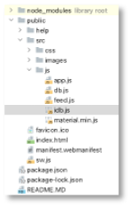
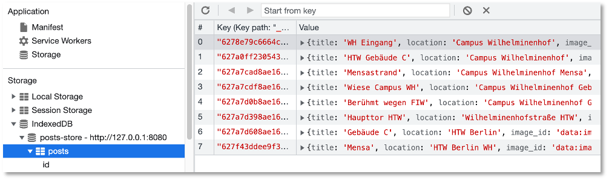
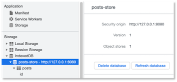

# IndexedDB 

!!! hint
    Aktueller Stand vor IndexedDB:

    - [Frontend](https://github.com/jfreiheit/IKT-PWA-04)
    - [Backend](https://github.com/jfreiheit/IKT-PWA-BACKEND-01)
    - Collection [post](./files/posts.json)
    - Collection [post.files](./files/posts_files.json)
    - Collection [post.chunks](./files/posts_chunks.json)

Wir haben nun ein funktionierendes Backend (siehe [hier](https://github.com/jfreiheit/IKT-PWA-BACKEND-01)) und verschiedene Ressourcen in statischen und dynamischen Caches gespeichert. Unsere *HTW-Insta*-Anwendung sieht nun [so aus](https://github.com/jfreiheit/IKT-PWA-04). Diese Ressourcen lagen als Dateien vor, die wir über eine URL abrufen konnten, also `*.html`-, `*.js`-, `*.css`- Dateien und Bilder. Jetzt wollen wir dynamisch *Daten* speichern, sogenannten *dynamischen Inhalt*. Diese Daten können ausgelesen und den unterschiedlichen Dateien hinzugefügt bzw. durch Dateien hinzugefügt werden. Wir können uns das wirklich wie eine Datenbank vorstellen, aus der wir diese Daten ziehen, nur dass diese Datenbank nicht extern in einem Datenbankmanagementsystem verwaltet wird, sondern durch den Browser. Wir haben unter den Developer Tools diese "Datenbank" vielleicht schon im `Application`-Reiter auf der linken Seite unter `Storage` entdeckt. Es handelt sich um die `IndexedDB`. 

Bei der `IndexedDB` handelt es sich um eine *transaktionsbasierte* Datenbank, die Schlüssel-Werte-Paare im Browser speichert. *Transaktionsbasiert* bedeutet dabei, dass ganze *Transaktionen* ausgeführt werden, die aus einzelnen Aktionen bestehen können. Wenn nur eine Aktion einer Transaktion fehlschlägt, dann wird keine der Aktionen dieser Transaktion ausgeführt. Das bedeutet, eine *Transaktion*  wird entweder ganz oder gar nicht ausgeführt. Unsere Transaktionen bestehen aber typischerweise nur aus wenigen Aktionen, das Transaktionskonzept spielt deshalb keine große Rolle. 

Wir können beliebige Daten in die `IndexedDB` speichern, also auch Bilder, Dateien, Arrays, Objekte, usw. Ein wichtiger Unterschied zum `Lokal Storage` ist, dass wir sowohl über den "normalen" JavaScript-Thread unserer Webanwendung als auch über den Service Worker auf die `IndexedDB` zugreifen können. 

### Das Backend nutzen

Ehe wir aber mit der `IndexedDB` loslegen, wollen wir zunächst einige Anpassungen in unserer `HTW Insta`-Anwendung durchführen, damit sich unsere Mühen mit dem [Backend](../backend/#backend-rest-server) und dem [Frontend](../caching/) auch gelohnt haben. 

Wir wollen die Daten für unsere `Cards` aus der Datenbank holen. Dazu muss das **Backend gestartet sein**! Öffnen Sie die `feed.js`. Die `fetch`-Funktion passen wir nun so an, dass sie auf unser Backend zugreift (den Zugriff auf `httpbin.org` benötigen wir nicht mehr):

```js
fetch('http://localhost:3000/posts')
    .then((res) => {
        return res.json();
    })
    .then((data) => {
        updateUI(data);
    });
```

Wir nutzen also den `GET http://localhost:3000/posts`-Endpunkt, um uns **alle** Daten aus der Datenbank zu holen. Wir fügen einen Funktionsaufruf einer neuen Funktion `updateUI(data)` ein. Diese Funktion macht nichts weiter, als die `createCard()`-Funktion für jeden einzelnen Datensatz aufzurufen: 

```js
function updateUI(data) {

    for(let card of data)
    {
       createCard(card);
    }

}
```

Die `createCard()`-Funktion war allerdings bis jetzt parameterlos. Nun übergeben wir unseren Datensatz und nutzen die einzelnen Werte daraus für die Erstellung einer `Card`:

```js linenums="1" hl_lines="1 6-8 14 18"
function createCard(card) {
    let cardWrapper = document.createElement('div');
    cardWrapper.className = 'shared-moment-card mdl-card mdl-shadow--2dp';
    let cardTitle = document.createElement('div');
    cardTitle.className = 'mdl-card__title';
    let image = new Image();
    image.src = card.image_id;
    cardTitle.style.backgroundImage = 'url('+ image.src +')';
    cardTitle.style.backgroundSize = 'cover';
    cardTitle.style.height = '180px';
    cardWrapper.appendChild(cardTitle);
    let cardTitleTextElement = document.createElement('h2');
    cardTitleTextElement.className = 'mdl-card__title-text';
    cardTitleTextElement.textContent = card.title;
    cardTitle.appendChild(cardTitleTextElement);
    let cardSupportingText = document.createElement('div');
    cardSupportingText.className = 'mdl-card__supporting-text';
    cardSupportingText.textContent = card.location;
    cardSupportingText.style.textAlign = 'center';
    cardWrapper.appendChild(cardSupportingText);
    componentHandler.upgradeElement(cardWrapper);
    sharedMomentsArea.appendChild(cardWrapper);
}
```

Für das Darstellen der Bilder benötigen wir ein `Image`-Objekt, dem wir als Wert des `src`-Attributes den base64-String aus `image_id` übergeben. Dann wird der `src`-Wert des `Image`-Objektes als eine `URL` für das Hintergrundbild einer `Card` verwendet (Zeilen `6-8`).

!!! warning
    Beachten Sie, dass wir alle Ressourcen *cachen*. Das bedeutet, dass sich Änderungen an z.B. der `feed.js` gar nicht automatisch in der Webanwendung auswirken, da ja die `feed.js` aus dem Cache verwendet wird. Damit wir die Änderungen auch testen können, müssen wir den Cache neu befüllen. Wir haben dazu Cache-Versionen eingeführt: 
    === "sw.js"
    ```js linenums="1" hl_lines="1-3 8 34"
    const CACHE_VERSION = 3;
    const CURRENT_STATIC_CACHE = 'static-v'+CACHE_VERSION;
    const CURRENT_DYNAMIC_CACHE = 'dynamic-v'+CACHE_VERSION;

    self.addEventListener('install', event => {
        console.log('service worker --> installing ...', event);
        event.waitUntil(
            caches.open(CURRENT_STATIC_CACHE)
                .then( cache => {
                    console.log('Service-Worker-Cache erzeugt und offen');
                    cache.addAll([
                        '/',
                        '/index.html',
                        '/src/js/app.js',
                        '/src/js/feed.js',
                        '/src/js/material.min.js',
                        '/src/css/app.css',
                        '/src/css/feed.css',
                        '/src/images/htw.jpg',
                        'https://fonts.googleapis.com/css?family=Roboto:400,700',
                        'https://fonts.googleapis.com/icon?family=Material+Icons',
                        'https://code.getmdl.io/1.3.0/material.blue_grey-red.min.css'
                    ]);
                })
        );
    })

    self.addEventListener('activate', event => {
        console.log('service worker --> activating ...', event);
        event.waitUntil(
            caches.keys()
                .then( keyList => {
                    return Promise.all(keyList.map( key => {
                        if(key !== CURRENT_STATIC_CACHE && key !== CURRENT_DYNAMIC_CACHE) {
                            console.log('service worker --> old cache removed :', key);
                            return caches.delete(key);
                        }
                    }))
                })
        );
        return self.clients.claim();
    })

    self.addEventListener('fetch', event => {
        // check if request is made by chrome extensions or web page
        // if request is made for web page url must contains http.
        if (event.request.url.indexOf('http') !== 0) return; // skip the request. if request is not made with http protocol

        event.respondWith(
            caches.match(event.request)
                .then( response => {
                    if(response) {
                        return response;
                    } else {
                        return fetch(event.request)
                            .then( res => {     // nicht erneut response nehmen, haben wir schon
                                return caches.open(CURRENT_DYNAMIC_CACHE)      // neuer, weiterer Cache namens dynamic
                                    .then( cache => {
                                        cache.put(event.request.url, res.clone());
                                        return res;
                                    })
                            });
                    }
                })
        );
    })
    ```
    Das Testen der neuen Implementierung erfordert nun also immer das Ändern der Cache-Versionsnummer (`CACHE_VERSION`) und dann das Aktivieren des neuen Service Workers! 

Je nachdem, welche Daten Sie alle in Ihrer Datenbank haben, sieht die Anwendung nun so aus: 


Beachten Sie auch, dass sowohl der statische als auch der dynamische Service-Worker-Cache funktioniert. Das heißt, wenn Sie Ihre Anwendung offline schalten, dann ist immer noch alles da. 

### Warum dynamische Inhalte "cachen"?

Wenn wir nun bereits alle Ressourcen (html-Dateien, js-Dateien, css-Dateien und Bilddateien) im Service-Worker-Cache gespeichert haben (statisch und oder dynamisch), dann stellt sich natürlich die Frage, warum wir überhaupt noch eine In-Browser-Datenbank verwenden sollen und wollen. Die beiden Terme, die dabei unterschieden werden, sind *dynamic caching* und *caching dynamic content*, also dynamische Inhalte speichern. Beides hat *caching* im Namen und *dynamic*, ist auch nicht so viel anders. 

*Dynamic caching* haben wir bis jetzt durchgeführt. Die Webanwendung stellt eine Anfrage an den Webserver, der Service Worker schaltet sich jedoch als Proxy dazwischen. Wenn der Service Worker die Anfrage selbst aus dem Cache beantworten kann, wird sie gar nicht erst an den Webserver weitergeleitet. Wenn nicht, dann geht die Anfrage zum Webserver, der schickt eine Antwort zurück, die der Service Worker aber auch in seinen dynamischen Cache ablegt, um sie beim nächsten Mal aus dem Cache beantworten zu können. Beim *dynamic caching* werden also dynamisch Ressourcen im Cache abgelegt. 

Beim Speichern von dynamischen Inhalten mithilfe der In-Browser-IndexedDB spielt die Fetch-API keine Rolle. Es geht auch nicht darum, Ressourcen, wie html-, css, oder js-Dateien zu speichern. Vielmehr werden in der Datenbank strukturierte (aber auch unstrukturierte) Daten, wie JSON- oder XML-Daten gespeichert. Prinzipiell geht es um das Speichern von *Schlüssel-Werte-Paaren*. Primär handelt es sich bei den Daten in der IndexedDB aber um dynamische, sich häufig ändernde Daten - *dynamic content*. Während wir beim *dynamic caching* eher davon ausgehen, Ressourcen zu speichern, die sich nicht häufig ändern, ist das bei der IndexedDB anders. Dort gehen wir davon aus, dass sich diese Daten häufig ändern. Ein weiterer Unterschied liegt darin, dass wir mit *dynamic caching* stets nur vollständige *Responses* speichern, also eine Ressource ganz oder gar nicht. Das muss in der IndexedDB nicht sein. Wir könnten in der IndexedDB z.B. von einem `Post` immer nur `post.title` und `post.location` speichern, nicht aber `post.image_id` (oder umgekehrt). Außerdem lassen sich die Daten in der IndexedDB auch ändern oder in ein anderes Format umwandeln. Wir haben in Bezug auf die gespeicherten Ressourcen in der IndexedDB mehr Flexibilität.  

### Das idb-Paket

Da die API zur `IndexedDB` sehr umständlich zu handhaben ist und viele *Callbacks* erfordert, wird die Verwendung anderer Pakete empfohlen, die sich als *Wrapper* um die API legen und die Verwendung von Promises ermöglichen. Oft wird z.B. [Dexie](https://dexie.org/) verwendet. Wir verwenden zunächst den [idb-Wrapper](https://github.com/jakearchibald/idb) von Jake Archibald. Ich verwende im Folgenden dieses [idb.js](./files/idb.js), das Sie sich <a href="../files/idb.js" download>hier</a> herunterladen und einfach in Ihren `/public/src/js`-Ordner kopieren können. 



Diese Datei binden wir zunächst über die `index.html`-Datei ein:


=== "index.html"
    ```html linenums="107" hl_lines="3"
    </div>
    <script defer src="/src/js/material.min.js"></script>
    <script src="/src/js/idb.js"></script>
    <script src="/src/js/app.js"></script>
    <script src="/src/js/feed.js"></script>
    </body>
    </html>
    ```


Im Service Worker haben wir normalerweise keinen direkten Zugriff auf die Skripte und Dateien unserer Webanwendung. Dafür gibt es jedoch die `importScripts()`-Anweisung. Wir importieren damit unsere `idb.js`-Datei in den Service Worker und wir laden diese Datei auch in den Cache:

=== "public/sw.js"
    ```js linenums="1" hl_lines="1 18"
    importScripts('/src/js/idb.js');

    const CACHE_VERSION = 3;
    const CURRENT_STATIC_CACHE = 'static-v'+CACHE_VERSION;
    const CURRENT_DYNAMIC_CACHE = 'dynamic-v'+CACHE_VERSION;

    self.addEventListener('install', event => {
        console.log('service worker --> installing ...', event);
        event.waitUntil(
            caches.open(CURRENT_STATIC_CACHE)
            .then(cache => {
                console.log('Service-Worker-Cache erzeugt und offen');
                cache.addAll([
                    '/',
                    '/index.html',
                    '/src/js/app.js',
                    '/src/js/feed.js',
                    '/src/js/material.min.js',
                    '/src/js/idb.js',
                    '/src/css/app.css',
                    '/src/css/feed.css',
                    '/src/images/htw.jpg',
                    'https://fonts.googleapis.com/css?family=Roboto:400,700',
                    'https://fonts.googleapis.com/icon?family=Material+Icons',
                    'https://code.getmdl.io/1.3.0/material.blue_grey-red.min.css'
                ]);
            })
        );
    })

    self.addEventListener('activate', event => {
        console.log('service worker --> activating ...', event);
        event.waitUntil(
            caches.keys()
            .then(keyList => {
                return Promise.all(keyList.map(key => {
                    if (key !== CURRENT_STATIC_CACHE && key !== CURRENT_DYNAMIC_CACHE) {
                        console.log('service worker --> old cache removed :', key);
                        return caches.delete(key);
                    }
                }))
            })
        );
        return self.clients.claim();
    })

    self.addEventListener('fetch', event => {
        // check if request is made by chrome extensions or web page
        // if request is made for web page url must contains http.
        if (!(event.request.url.indexOf('http') === 0)) return; // skip the request. if request is not made with http protocol

        event.respondWith(
            caches.match(event.request)
            .then(response => {
                if (response) {
                    return response;
                } else {
                    return fetch(event.request)
                        .then(res => { // nicht erneut response nehmen, haben wir schon
                            return caches.open(CURRENT_DYNAMIC_CACHE) // neuer, weiterer Cache namens dynamic
                                .then(cache => {
                                    cache.put(event.request.url, res.clone());
                                    return res;
                                })
                        });
                }
            })
        );
    })
    ```

Wir führen zunächst noch einige Änderungen in unserer Service Worker Datei `sw.js` durch. Zunächst lagern wir alle Dateien, die wir in dem statischen Cache speichern wollen, in ein eigenes Array `STATIC_FILES` aus:

=== "public/sw.js"
    ```js linenums="1" hl_lines="5 18 26"
        importScripts('/src/js/idb.js');

        const CACHE_VERSION = 3;
        const CURRENT_STATIC_CACHE = 'static-v'+CACHE_VERSION;
        const CURRENT_DYNAMIC_CACHE = 'dynamic-v'+CACHE_VERSION;
        const STATIC_FILES = [
            '/',
            '/index.html',
            '/src/js/app.js',
            '/src/js/feed.js',
            '/src/js/material.min.js',
            '/src/js/idb.js',
            '/src/css/app.css',
            '/src/css/feed.css',
            '/src/images/htw.jpg',
            'https://fonts.googleapis.com/css?family=Roboto:400,700',
            'https://fonts.googleapis.com/icon?family=Material+Icons',
            'https://code.getmdl.io/1.3.0/material.blue_grey-red.min.css'
        ];

        self.addEventListener('install', event => {
            console.log('service worker --> installing ...', event);
            event.waitUntil(
                caches.open(CURRENT_STATIC_CACHE)
                .then(cache => {
                    console.log('Service-Worker-Cache erzeugt und offen');
                    cache.addAll(STATIC_FILES);
                })
            );
        })

    // hier der Rest
    ```

Das hat keine weitere Bedeutung und strukturiert nur den Code besser. Wichtiger aber ist es, die Behandlung des `fetch`-Ereignisses zu überdenken. Derzeit sieht die Behandlung so aus:

```js linenums="1"
self.addEventListener('fetch', event => {
    // check if request is made by chrome extensions or web page
    // if request is made for web page url must contains http.
    if (!(event.request.url.indexOf('http') === 0)) return; // skip the request. if request is not made with http protocol

    event.respondWith(
        caches.match(event.request)
            .then( response => {
                if(response) {
                    return response;
                } else {
                    return fetch(event.request)
                        .then( res => {     // nicht erneut response nehmen, haben wir schon
                            return caches.open(CURRENT_DYNAMIC_CACHE)      // neuer, weiterer Cache namens dynamic
                                .then( cache => {
                                    cache.put(event.request.url, res.clone());
                                    return res;
                                })
                        });
                }
            })
    );
})
```

Das heißt, dass jeder Request überprüft wird, ob er aus dem Cache beantwortet werden kann und wenn ja, dann wird die `response` aus dem Cache zurückgegeben (Zeile `10`). Wenn nicht, dann wird der Request an den Webserver weitergeleitet, die Antwort in den dynamischen Cache gelegt und an die Webanwendung weitergereicht (Zeilen `12-20`). Das betrifft **jeden** Request. Wir wollen nun aber die Anfragen, die an `http//localhost:3000/posts` gestellt werden, anders behandeln. Dazu speichern wir dieses `url` und prüfen, ob diese Anfrage an diese URL geht. Wenn ja, behandeln wir sie anders, wenn nicht, dann so, wie bisher:

```js linenums="1" hl_lines="6-15 32"
self.addEventListener('fetch', event => {
    // check if request is made by chrome extensions or web page
    // if request is made for web page url must contains http.
    if (!(event.request.url.indexOf('http') === 0)) return; // skip the request. if request is not made with http protocol

    const url = 'http://localhost:3000/posts';
    if(event.request.url.indexOf(url) >= 0) {
        event.respondWith(
            fetch(event.request)
                .then ( res => {
                    // hier Anfrage an http://localhost:3000/posts behandeln
                    return res;
                })
        )
    } else {
        event.respondWith(
        caches.match(event.request)
            .then( response => {
                if(response) {
                    return response;
                } else {
                    return fetch(event.request)
                        .then( res => {     // nicht erneut response nehmen, haben wir schon
                            return caches.open(CURRENT_DYNAMIC_CACHE)      // neuer, weiterer Cache namens dynamic
                                .then( cache => {
                                    cache.put(event.request.url, res.clone());
                                    return res;
                                })
                        });
                }
            })
    )}
})
```

Wie wir diese Anfragen an `http://localhost:3000/posts` behandeln, schauen wir uns gleich an. Wir haben jetzt nur eine Unterscheidung hinzugefügt, ob die Anfrage an  `http://localhost:3000/posts` geht oder nicht. Wenn ja, leiten wir die Anfrage an den Webserver weiter (Zeile `9`) und geben die Response zurück (Zeile `12`). Wenn nicht, dann behandeln wir die Anfrage wir bisher. Zunächst erstellen wir aber die IndexedDB. 


### Erstellen und Öffnen einer IndexedDB

Nachdem wir für den Service Worker die `importScripts()`-Anweisung kennengelernt haben, könnten wir nun verschiedene Skripts erstellen und diese in den Service Worker einbinden, also z.B. ein Skript für die Behandlung des `fetch`-Ereignisses und ein Skript für die Verwaltung der `IndexedDB`. Wir lassen aber hier alles in der `sw.js` und erstellen und öffnen zunächst eine neue IndexedDB, die wir `posts-store` nennen. Dies geht mit der `openDB()`-Funktion aus dem `idb`-Paket (siehe [README.md](https://github.com/jakearchibald/idb)):

=== "public/sw.js"
    ```js linenums="1" hl_lines="31-43"
    importScripts('/src/js/idb.js');

    const CACHE_VERSION = 3;
    const CURRENT_STATIC_CACHE = 'static-v'+CACHE_VERSION;
    const CURRENT_DYNAMIC_CACHE = 'dynamic-v'+CACHE_VERSION;

    self.addEventListener('install', event => {
        console.log('service worker --> installing ...', event);
        event.waitUntil(
            caches.open(CURRENT_STATIC_CACHE)
            .then(cache => {
                console.log('Service-Worker-Cache erzeugt und offen');
                cache.addAll([
                    '/',
                    '/index.html',
                    '/src/js/app.js',
                    '/src/js/feed.js',
                    '/src/js/material.min.js',
                    '/src/js/idb.js',
                    '/src/css/app.css',
                    '/src/css/feed.css',
                    '/src/images/htw.jpg',
                    'https://fonts.googleapis.com/css?family=Roboto:400,700',
                    'https://fonts.googleapis.com/icon?family=Material+Icons',
                    'https://code.getmdl.io/1.3.0/material.blue_grey-red.min.css'
                ]);
            })
        );
    })

    const db = idb.openDB('posts-store', 1, {
        upgrade(db) {
            // Create a store of objects
            const store = db.createObjectStore('posts', {
                // The '_id' property of the object will be the key.
                keyPath: '_id',
                // If it isn't explicitly set, create a value by auto incrementing.
                autoIncrement: true,
            });
            // Create an index on the '_id' property of the objects.
            store.createIndex('_id', '_id');
        },
    });

    self.addEventListener('activate', event => {
        console.log('service worker --> activating ...', event);
        event.waitUntil(
            caches.keys()
            .then(keyList => {
                return Promise.all(keyList.map(key => {
                    if (key !== CURRENT_STATIC_CACHE && key !== CURRENT_DYNAMIC_CACHE) {
                        console.log('service worker --> old cache removed :', key);
                        return caches.delete(key);
                    }
                }))
            })
        );
        return self.clients.claim();
    })

    self.addEventListener('fetch', event => {
        // check if request is made by chrome extensions or web page
        // if request is made for web page url must contains http.
        if (!(event.request.url.indexOf('http') === 0)) return; // skip the request. if request is not made with http protocol

        const url = 'http://localhost:3000/posts';
        if(event.request.url.indexOf(url) >= 0) {
            event.respondWith(
                fetch(event.request)
                    .then ( res => {
                        // hier Anfrage an http://localhost:3000/posts behandeln
                        return res;
                    })
            )
        } else {
            event.respondWith(
            caches.match(event.request)
                .then( response => {
                    if(response) {
                        return response;
                    } else {
                        return fetch(event.request)
                            .then( res => {     // nicht erneut response nehmen, haben wir schon
                                return caches.open(CURRENT_DYNAMIC_CACHE)      // neuer, weiterer Cache namens dynamic
                                    .then( cache => {
                                        cache.put(event.request.url, res.clone());
                                        return res;
                                    })
                            });
                    }
                })
        )}
    })
    ```

Wir haben nun eine "eigene" IndexDB namens `post-store` erstellt. Der `store` darin heißt `posts`. In diesem `store` speichern wir alle Daten der Posts. Mit der Eigenschaft `keyPath` definieren wir den Schlüssel für diesen `store`. Über diesen Schlüssel gelangen wir an unserer Daten. Mithilfe der Funktion `createIndex()` verbinden wir das Attribut `_id` unserer Posts-Datensätze mit diesem Schlüssel. Für uns bedeutet das schlicht, dass `_id` der Schlüssel sowohl in der IndexedDB als auch in unserer MongoDB für alle Posts ist. Wenn wir die Anwendung nun ausführen, dann sehen wir in den Developer Tools im Reiter `Application` links im Menü unter `Storage --> IndexedDB` diese Datenbank.


Diese ist noch leer, wir machen ja noch nichts damit. 

### Behandlung `fetch`-Event anpassen

Nun passen wir die Behandlung des `fetch`-Ereignisses für die Anfragen an `http://localhost:3000/posts` an. Wir haben derzeit folgende Ausgangssituation (siehe oben):

```js linenums="60"
self.addEventListener('fetch', event => {
    // check if request is made by chrome extensions or web page
    // if request is made for web page url must contains http.
    if (!(event.request.url.indexOf('http') === 0)) return; // skip the request. if request is not made with http protocol

    const url = 'http://localhost:3000/posts';
    if(event.request.url.indexOf(url) >= 0) {
        event.respondWith(
            fetch(event.request)
                .then ( res => {
                    // hier Anfrage an http://localhost:3000/posts behandeln
                    return res;
                })
        )
    } else {
        // dynamischer Cache
})
```

Wir behandeln die Anfrage an das Backend nun wie folgt:


```js linenums="60" hl_lines="11-24"
self.addEventListener('fetch', event => {
    // check if request is made by chrome extensions or web page
    // if request is made for web page url must contains http.
    if (!(event.request.url.indexOf('http') === 0)) return; // skip the request. if request is not made with http protocol

    const url = 'http://localhost:3000/posts';
    if(event.request.url.indexOf(url) >= 0) {
        event.respondWith(
            fetch(event.request)
                .then ( res => {
                    const clonedResponse = res.clone();
                    clonedResponse.json()
                        .then( data => {
                            for(let key in data)
                            {
                                db
                                    .then( dbPosts => {
                                        let tx = dbPosts.transaction('posts', 'readwrite');
                                        let store = tx.objectStore('posts');
                                        store.put(data[key]);
                                        return tx.done;
                                    })
                            }
                        })
                    return res;
                })
        )
    } else {
        // dynamischer Cache
})
```

- Wir clonen zunächst die Response, da sie nur einmal "verbraucht" werden kann (Zeile `70`).
- Dann wird diese geclonte Response in ein JSON umgewandelt (Zeile `71`).
- Dieses JSON beschreibt ein JavaScript-Objekt mit den Schlüsseln `id`, `title`, `location` und `image` - so, wie es unser Backend zurückgibt. Wir gehen nun in einer `for`-Schleife durch alle diese Schlüssel-Werte-Paare durch (Zeile `73`). 
- In Zeile `75` greifen wir auf das Promise-Objekt zu, das die Datenbank verwaltet, die wir zuvor mittels `openDB()` geöffnet haben. 
- Dieser Promise verwaltet sich selbst. Das bedeutet, dass `dbPosts` genau für die von uns geöffnete IndexedDB steht. Wir können nur nicht erneut `db` benutzen, deshalb `dbPosts` (Zeile `76`). 
- Als erstes erstellen wir eine *Transaktion*. Wie bereits gesagt, ist die IndexedDB *transaktionsbasiert*. Jede Operation ist somit eine *Transaktion*. Wir erstellen eine Transaktion `tx` (Zeile `77`). Diese Transaktion wird durch die Funktion `transaction()` erzeugt. Die Funktion erwartet zwei Parameter:
    - der erste Parameter beschreibt den `store`, auf den die Transaktion zugreift (bei uns `posts`).
    - der zweite Parameter beschreibt, ob wir nur lesend auf diesen `store` zugreifen wollen (`'readonly'`) oder auch schreibend (`'readwrite'`).
- Nach der Definition der Transaktion muss für die Transaktion nochmal die Eigenschaft `store` aufgerufen werden (siehe [README.md des idb-Paketes](https://github.com/jakearchibald/idb#idbtransaction-enhancements)). Darin steht aber auch, dass man `tx.objectStore(storeName)` aufrufen soll, wenn die Transaktion mehrere Stores verwendet. Deshalb rufen wir einfach immer `tx.objectStore(storeName)` auf, da das auch funktioniert, wenn nur ein `store` verwendet wird (Zeile `78`). 
- In Zeile `79` werden die einzelnen Schlüssel-Werte-Paare dann in die IndexedDB gespeichert. 

Nach Ausführen der Anwendung sieht die IndexedDB nun (je nachdem, welche Daten Sie bereits in Ihrer Datenbank gespeichert haben) so aus:




Wir haben nun die IndexedDB des Browsers mit unseren Datensätzen befüllt. Nun überlegen wir uns, wie wir diese Datensätze aus der IndexedDB auslesen können, wenn wir sie dort gespeichert haben und dann gar nicht mehr an das Backend Anfragen schicken müssen. 

### Datensätze aus der IndexedDB auslesen

Zunächst einmal stellen wir fest, dass ein geeigneter Ort, die Datensätze aus der IndexedDB auszulesen, die `feed.js` ist, da dort ja die Daten zum Erstellen der `Cards` verwendet werden. 

Schauen wir uns deshalb dort die `fetch()`-Funktion an (siehe auch [Das Backend nutzen](./#das-backend-nutzen)). 

```js linenums="1"
fetch('http://localhost:3000/posts')
    .then((res) => {
        return res.json();
    })
    .then((data) => {
        updateUI(data);
    });
```

Wir stellen dort eine Anfrage an das Backend und verwenden die vom Backend übergebenen Daten (`data`), um die `Cards` zu erstellen (`updateUI(data)`). Das heißt, dass wir nun die IndexedDB auch in `feed.js` verwenden wollen - also in unserer "Webanwendung" (und nicht "nur" im Service Worker). Das heißt aber auch, dass wir nun auch in der Webanwendung die IndexedDB öffnen müssen usw. und wir dort ähnlichen Code hätten, wie auch bereits im Service Worker. Um doppelten Code zu vermeiden, lagern wir deshalb einigen Code in eine `db.js` aus. Wir **bewegen** (move) zunächst den Code zum Öffnen der IndexedDB aus der `sw.js` nach `db.js`:

=== "/public/src/js/db.js"
    ```js linenums="1"
        const db = idb.openDB('posts-store', 1, {
            upgrade(db) {
                // Create a store of objects
                const store = db.createObjectStore('posts', {
                    // The 'id' property of the object will be the key.
                    keyPath: 'id',
                    // If it isn't explicitly set, create a value by auto incrementing.
                    autoIncrement: true,
                });
                // Create an index on the '_id' property of the objects.
                store.createIndex('id', '_id');
            },
        });
    ```

Dann erstellen wir uns in der `db.js` eine Funktion `writeData()`, die in die IndexedDB die Daten schreibt. Dazu bewegen wir den folgenden Block aus der `sw.js` nach `db.js`:

=== "sw.js"
    ```js linenums="1" hl_lines="16-22"
    self.addEventListener('fetch', event => {
        // check if request is made by chrome extensions or web page
        // if request is made for web page url must contains http.
        if (!(event.request.url.indexOf('http') === 0)) return; // skip the request. if request is not made with http protocol

        const url = 'http://localhost:3000/posts';
        if(event.request.url.indexOf(url) >= 0) {
            event.respondWith(
                fetch(event.request)
                    .then ( res => {
                        const clonedResponse = res.clone();
                        clonedResponse.json()
                            .then( data => {
                                for(let key in data)
                                {
                                    db
                                        .then( dbPosts => {
                                            let tx = dbPosts.transaction('posts', 'readwrite');
                                            let store = tx.objectStore('posts');
                                            store.put(data[key]);
                                            return tx.done;
                                        })
                                }
                            })
                        return res;
                    })
            )
        } else {
            event.respondWith(
            caches.match(event.request)
                .then( response => {
                    if(response) {
                        return response;
                    } else {
                        return fetch(event.request)
                            .then( res => {     // nicht erneut response nehmen, haben wir schon
                                return caches.open(CURRENT_DYNAMIC_CACHE)      // neuer, weiterer Cache namens dynamic
                                    .then( cache => {
                                        cache.put(event.request.url, res.clone());
                                        return res;
                                    })
                            });
                    }
                })
        )}
    })
    ```

Die `db.js` sieht dann so aus:

=== "/public/src/js/db.js"
    ```js linenums="1" hl_lines="20"
        const db = idb.openDB('posts-store', 1, {
            upgrade(db) {
                // Create a store of objects
                const store = db.createObjectStore('posts', {
                    // The 'id' property of the object will be the key.
                    keyPath: 'id',
                    // If it isn't explicitly set, create a value by auto incrementing.
                    autoIncrement: true,
                });
                // Create an index on the 'id' property of the objects.
                store.createIndex('id', 'id');
            },
        });

        function writeData() {
            db
                .then( dbPosts => {
                    let tx = dbPosts.transaction('posts', 'readwrite');
                    let store = tx.objectStore('posts');
                    store.put(data);
                    return tx.done;
                })
        }
    ```

Beachten Sie, dass aus `store.put(data[key])` nun `store.put(data)` wurde, da wir hier keinen `key` verwalten. Damit die `writeData()`-Funktion möglichst generisch ist, übergeben wir als Parameter den `store` (`posts`) und wir müssen natürlich auch `data` übergeben:

=== "/public/src/js/db.js"
    ```js linenums="1" hl_lines="15 16 18-20"
        const db = idb.openDB('posts-store', 1, {
            upgrade(db) {
                // Create a store of objects
                const store = db.createObjectStore('posts', {
                    // The 'id' property of the object will be the key.
                    keyPath: 'id',
                    // If it isn't explicitly set, create a value by auto incrementing.
                    autoIncrement: true,
                });
                // Create an index on the 'id' property of the objects.
                store.createIndex('id', 'id');
            },
        });

        function writeData(st, data) {
            return db
                .then( dbPosts => {
                    let tx = dbPosts.transaction(st, 'readwrite');
                    let store = tx.objectStore(st);
                    store.put(data);
                    return tx.done;
                })
        }
    ```

**Wichtig** ist, dass wir das `db`-Promise-Objekt in `writeData()` nun zurückgeben müssen, d.h. wir benötigen ein `return` in Zeile `16`. Nun müssen wir diese `db.js` natürlich importieren, sowohl in den Service Worker als auch in die Webanwendung (da sie ja `feed.js` zur Verfügung stehen soll). Beide Importe müssen **hinter** dem Import der `idb.js` stehen, da die `db.js` Funktionen der `idb.js` verwendet.


=== "sw.js"
    ```js linenums="1" hl_lines="2"
    importScripts('/src/js/idb.js');
    importScripts('/src/js/db.js');

    const CACHE_VERSION = 1;
    const CURRENT_STATIC_CACHE = 'static-v'+CACHE_VERSION;
    const CURRENT_DYNAMIC_CACHE = 'dynamic-v'+CACHE_VERSION;

    // ... und hier der Rest
    ```

sowie für die `/public/src/js/*.js`-Datein in der `index.html`:


=== "index.html"
    ```html linenums="107" hl_lines="4"
    </div>
    <script defer src="/src/js/material.min.js"></script>
    <script src="/src/js/idb.js"></script>
    <script src="/src/js/db.js"></script>
    <script src="/src/js/app.js"></script>
    <script src="/src/js/feed.js"></script>
    </body>
    </html>
    ```

In die `sw.js` setzen wir noch den Aufruf von `writeData('posts', data[key])` an der richtigen Stelle ein (jetzt wieder `data[key]`, da das hier für einen Post steht):


=== "sw.js"
    ```js linenums="54" hl_lines="16"
    self.addEventListener('fetch', event => {
        // check if request is made by chrome extensions or web page
        // if request is made for web page url must contains http.
        if (!(event.request.url.indexOf('http') === 0)) return; // skip the request. if request is not made with http protocol

        const url = 'http://localhost:3000/posts';
        if(event.request.url.indexOf(url) >= 0) {
            event.respondWith(
                fetch(event.request)
                    .then ( res => {
                        const clonedResponse = res.clone();
                        clonedResponse.json()
                            .then( data => {
                                for(let key in data)
                                {
                                    writeData('posts', data[key]);
                                }
                            })
                        return res;
                    })
            )
        } else {
    ```

**Übrigens:** Da wir für die Behandlung des `fetch`-Events nun zwischen den Aufrufen an den Webserver und an das Backend unterscheiden, werden die Requests der Backend-Aufrufe nun nicht mehr im (dynamischen) Cache gespeichert. Das bedeutet, dass unsere Anwendung in dem derzeitigen Zustand *offline* nicht funktioniert, da dann die `Cards` nicht angezeigt werden. Deshalb wollen wir ja in die `feed.js` nun die Abfrage an die IndexedDB einbauen, damit die Daten von dort geholt werden können. 

Dazu erweitern wir die `db.js` zunächst um eine `readAllData(store)`-Funktion, in der wir alle Daten aus der IndexedDB auslesen.

=== "/public/src/js/db.js"
    ```js linenums="1" hl_lines="26-33"
        const db = idb.openDB('posts-store', 1, {
            upgrade(db) {
                // Create a store of objects
                const store = db.createObjectStore('posts', {
                    // The '_id' property of the object will be the key.
                    keyPath: '_id',
                    // If it isn't explicitly set, create a value by auto incrementing.
                    autoIncrement: true,
                });
                // Create an index on the '_id' property of the objects.
                store.createIndex('_id', '_id');
            },
        });

        function writeData(st, data) {
            return db
                .then( dbPosts => {
                    let tx = dbPosts.transaction(st, 'readwrite');
                    let store = tx.objectStore(st);
                    store.put(data);
                    return tx.done;
                })
        }


        function readAllData(st) {
            return db
                .then( dbPosts => {
                    let tx = dbPosts.transaction(st, 'readonly');
                    let store = tx.objectStore(st);
                    return store.getAll();
                })
        }
    ```

Im Gegensatz zur `writeData()`-Funktion müssen wir beim Lesen der Daten (`readonly`) nicht darauf warten, dass die Transaktion vollständig abgearbeitet ist (`tx.done`), sondern wir können die Funktion mit dem Promise verlassen, in dem alle Daten zur Verfügung gestellt sind. Rein lesende Transaktionen können auf der Datenbank keinen "Schaden" anrichten. Deshalb können wir auf das `tx.done` verzichten. Alles andere ist im Prinzip wie bei `writeData()`, nur dass wir nun nur `readonly` Zugriff haben und die `getAll()`-Funktion aufrufen. 

Diese `readAllData()`-Funktion bauen wir nun in die `feed.js` ein. Dazu betrachten wir die `fetch`-Funktion darin zunächst noch einmal:


=== "/public/src/js/feed.js"
    ```js linenums="55"
    fetch('http://localhost:3000/posts')
        .then((res) => {
            return res.json();
        })
        .then((data) => {
            console.log(data);
            updateUI(data);
        });
    ```

Diese Funktion führt ein `GET` auf das Backend durch und holt sich von dort alle Daten. Wir ändern diese Funktion zunächst leicht, um zu erkennen, wann die Daten tatsächlich vom Backend geholt wurden. 


=== "/public/src/js/feed.js"
    ```js linenums="55" hl_lines="1 8-9"
    let networkDataReceived = false;

    fetch('http://localhost:3000/posts')
        .then((res) => {
            return res.json();
        })
        .then((data) => {
            networkDataReceived = true;
            console.log('From backend ...', data);
            updateUI(data);
        });
    ```

Dazu erstellen wir uns eine Variable `networkDataReceived`, die auf `true` gesetzt wird, falls wir die Daten vom Backend holen. Dazu eine passende Ausgabe auf die Konsole. 

Nun erweiteren wir die `feed.js` um das Lesen der Daten aus der IndexedDB. Dazu fügen wir folgende Anweisung hinzu:


=== "/public/src/js/feed.js"
    ```js linenums="55" hl_lines="13-21"
    let networkDataReceived = false;

    fetch('http://localhost:3000/posts')
        .then((res) => {
            return res.json();
        })
        .then((data) => {
            networkDataReceived = true;
            console.log('From backend ...', data);
            updateUI(data);
        });

    if('indexedDB' in window) {
        readAllData('posts')
            .then( data => {
                if(!networkDataReceived) {
                    console.log('From cache ...', data);
                    updateUI(data);
                }
            })
    }
    ```

In Zeile `67` überprüfen wir zunächst, ob der Browser überhaupt die IndexedDB-API unterstützt. Wenn ja, dann lesen wir mithilfe der `readAllData()`-Funktion aus der `db.js` alle Daten aus dem `posts`-Store. Sollten die Daten **nicht** vom Backend geholt worden sein (sonst wäre `networkDataReceived === true`), dann werden die aus der IndexedDB geholten Daten verwendet, um die `Cards` zu erstellen (`updateUI(data)` in Zeile `72`). 

Das heißt, wir haben hier eine *network first*-Strategie implemntiert. Wenn der Zugriff auf das Backend möglich ist, dann werden die Daten von dort geholt und auch dazu verwendet, um die `Cards` zu erstellen. Nur für den Fall, dass das Netzwerk nicht verfügbar ist, werden die aus der IndexedDB geholten Daten verwendet, um die `Cards` zu erstellen. 

Wir testen diese Implementierung. **Achten Sie darauf**, die Versionsnummern der Caches in der `sw.js` zu ändern, denn wir haben ja die `index.html` und die `feed.js` geändert. Diese Änderungen würden nicht wirksam sein, ohne Versionsänderungen der Caches, da ansonsten die Dateien aus dem statischen Cache und nicht vom Webserver gelesen würden. 

1. Stellen Sie auch sicher, dass Ihr Backend gestartet ist.
2. Reloaden Sie die Anwendung im Browser. 
3. `skipWaiting` den neuen Service Worker
4. checken, ob der neuen statische Cache unter `Cache --> Cache-Storage` verwendet wird
5. checken, ob die IndexedDB befüllt ist (sollte durch `writeData()` im Service Worker passieren)
6. In der Console steht `From backend ...` mit dem dazugehörigen Data-Array
7. Schalten Sie im Service Worker die Anwendung nun **offline** und reloaden Sie die Anwendung
8. In der Console erscheint `Fetch failed loading GET http://localhost:3000/posts` mit dem dazugehörigen Fehler, aber es erscheint auch `From cache ...` mit dem dazugehörigen Daten-Array. Es werden alle `cards` erstellt und angezeigt.

Die Anwendung ist nun auch insofern *offline*-fähig geworden, dass nun die dynamischen Daten in die IndexedDB geschrieben und aus der IndexedDB gelesen werden. 

### Löschen der IndexedDB

Wir schreiben unsere Daten in die IndexedDB mithilfe der `put()`-Funktion (siehe Funktion `writeDate()` in der `db.js` und darin `store.put(data)`). Diese Funktion schreibt ein Schlüssel-Werte-Paar in den entsprechenden `store`. Existiert der übergebene Schlüssel noch nicht, wird das Schlüssel-Werte-Paar der IndexedDB hinzugefügt. Existiert der Schlüssel bereits, wird der alte Wert mit dem neuen Wert überschrieben. Dadurch, dass es sich um lauter Schlüssel-Werte-Paare in der IndexedDB handelt, werden "alte" Schlüssel-Werte-Paare jedoch nicht gelöscht. Angenommen, wir rufen die `writeData()`-Funktion für alle Datensätze auf, die in unserer Datenbank gespeichert haben und angenommen, wir haben aus dieser Datenbank einen Datensatz gelöscht, der aber noch in der IndexedDB gespeichert ist. Dann würde dieser Datensatz auch in der IndexedDB verbleiben.

Wir schreiben uns deshalb eine Funktion, die zunächst alle Daten in der Datenbank löscht. Diese führen wir dann immer aus, bevor wir die neuen Daten hinzufügen. In der `db.js` fügen wir dazu die Funktion `clearAllData()` hinzu:


=== "/public/src/js/db.js"
    ```js linenums="1" hl_lines="35-43"
        const db = idb.openDB('posts-store', 1, {
            upgrade(db) {
                // Create a store of objects
                const store = db.createObjectStore('posts', {
                    // The '_id' property of the object will be the key.
                    keyPath: '_id',
                    // If it isn't explicitly set, create a value by auto incrementing.
                    autoIncrement: true,
                });
                // Create an index on the '_id' property of the objects.
                store.createIndex('_id', '_id');
            },
        });

        function writeData(st, data) {
            return db
                .then( dbPosts => {
                    let tx = dbPosts.transaction(st, 'readwrite');
                    let store = tx.objectStore(st);
                    store.put(data);
                    return tx.done;
                })
        }


        function readAllData(st) {
            return db
                .then( dbPosts => {
                    let tx = dbPosts.transaction(st, 'readonly');
                    let store = tx.objectStore(st);
                    return store.getAll();
                })
        }

        function clearAllData(st) {
            return db
                .then( dbPosts => {
                    let tx = dbPosts.transaction(st, 'readwrite');
                    let store = tx.objectStore(st);
                    store.clear();
                    return tx.done;
                })
        }
    ```

Diese rufen wir nun in der `sw.js` auf, bevor wir die neuen Daten in die IndexedDB schreiben:


=== "sw.js"
    ```js linenums="54" hl_lines="12-13 22"
    self.addEventListener('fetch', event => {
        // check if request is made by chrome extensions or web page
        // if request is made for web page url must contains http.
        if (!(event.request.url.indexOf('http') === 0)) return; // skip the request. if request is not made with http protocol

        const url = 'http://localhost:3000/posts';
        if(event.request.url.indexOf(url) >= 0) {
            event.respondWith(
                fetch(event.request)
                .then ( res => {
                    const clonedResponse = res.clone();
                    clearAllData('posts')
                    .then( () => {
                        clonedResponse.json()
                        .then( data => {
                            for(let key in data)
                            {
                                console.log('write data', data[key]);
                                writeData('posts', data[key]);
                            }
                        })
                    });
                    return res;
                })
            )
        } else {
    ```


Die Funktion `clearAllData()` gibt ein Promise-Objekt zurück. Nach dem erfolgreichen Löschen der Datenbank, können die neuen Daten hinzugefügt werden. Deshalb wird das komplette `clonedResponse`-Promise-Objekt in die `then()`-Funktion des `clearAllData()`-Promise-Objektes geschoben. Aus dieser Verschachtelung können wir aber auch eine `.then()`-Verkettung machen, die vielleicht besser zu lesen ist (dann aber nicht das `return` vor `clonedResponse.json();` vergessen):


=== "sw.js"
    ```js linenums="54" hl_lines="15-16"
    self.addEventListener('fetch', event => {
        // check if request is made by chrome extensions or web page
        // if request is made for web page url must contains http.
        if (!(event.request.url.indexOf('http') === 0)) return; // skip the request. if request is not made with http protocol

        const url = 'http://localhost:3000/posts';
        if(event.request.url.indexOf(url) >= 0) {
            event.respondWith(
                fetch(event.request)
                .then ( res => {
                    const clonedResponse = res.clone();
                    clearAllData('posts')
                    .then( () => {
                        return clonedResponse.json();
                    })
                    .then( data => {
                        for(let key in data)
                        {
                            console.log('write data', data[key]);
                            writeData('posts', data[key]);
                        }
                    });
                    return res;
                })
            )
        } else {
    ```


### Löschen einzelner Einträge

Es können auch einzelne Einträge aus der IndexedDb gelöscht werden. Der Zugriff auf die Datensätze erfolgt über den `keyPath` `_id` (siehe [Erstellen der Datenbank](./#erstellen-und-offnen-einer-indexeddb) und dort `openDB()`). Wir fügen der `db.js` eine weitere Funktion `deleteOneData()` hinzu. Diese Funktion benötigt als Parameter neben dem `store` auch die `_id` des Datensatzes, den wir löschen wollen. 

=== "/public/src/js/db.js"
    ```js linenums="45"
    function deleteOneData(st, id) {
        db
        .then( dbPosts => {
            let tx = dbPosts.transaction(st, 'readwrite');
            let store = tx.objectStore(st);
            store.delete(id);
            return tx.done;
        })
        .then( () => {
            console.log('Data deleted ...');
            });
    }
    ```

Wir geben das promise-Objekt `db` nicht zurück, sondern "verwerten" es gleich hier, indem wir nach dem Löschen eine Ausgabe auf die Konsole erzeugen. 

Das Testen dieser Funktion in unserer Anwendnung ist derzeit nur "Spielerei". Wir werden diese Funktion aber später noch sinnvoll einsetzen. **Beachten Sie**, dass Sie nach Änderungen an der IndexedDB diese zunächst "refreshen" müssen (Button `Refresh database` - siehe Abbildung).





!!! success
    Wir können nun die In-Browser-Datenbank IndexedDB verwenden, um dynamische Daten zu speichern, auszulesen und zu löschen. Somit bleibt unsere Anwendung auch dann noch aktiv, auch wenn das Backend (und/oder die Datenbank) nicht erreichbar ist. Die IndexedDB kann für alle Arten von Schlüssel-Werte-Paaren verwendet werden. Weitere Informationen finden Sie unter [IndexedDB API](https://developer.mozilla.org/en-US/docs/Web/API/IndexedDB_API).


