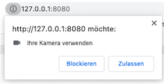
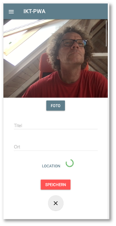
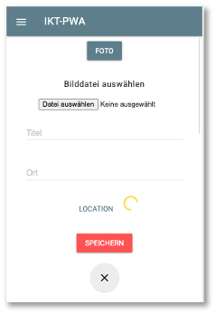

# Gerätezugriffe - Kamera


!!! hint
    Aktueller Stand vor Gerätezugriffe:

    - [Frontend](https://github.com/jfreiheit/IKT-PWA-05)
    - [Backend](https://github.com/jfreiheit/IKT-PWA-BACKEND-01)
    - Collection [post](./files/posts.json)
    - Collection [post.files](./files/posts_files.json)
    - Collection [post.chunks](./files/posts_chunks.json)


Nun wollen wir noch auf Geräteschnittstellen zugreifen. Dazu gehören die Kamera und auch die Geolocation-API, um unseren Standort zu ermitteln. Früher war JavaScript eine "SandBox", d.h. JavaScript-Code war vollständig innerhalb des Browsers gekapselt und hatte keinerlei Zugriff nach außen. Das änderte sich mit dem `Upload File`-Button. JavaScript bekam (sehr eingeschränkten) Zugriff auf das Dateisystem (nur lesend). In der Zwischenzeit hat sich das komplett gewandelt. JavaScript läuft erstens auch auf Servern und hat zweitens über eine Vielzahl von APIs Zugriff auf unterschiedlichste Schnittstellen zum System. Wir wollen hier zunächst betrachten, wie JavaScript auf die Kamera zugreifen kann. Später ermitteln wir auch noch den eigenen Standort. 


### Zunächst ein bisschen mehr responsive

Unser *HTW Insta* entwickelt sich langsam. Deshalb ist hier vielleicht ein guter Zeitpunkt, um die Anwendung noch etwas mehr *responsive* zu gestalten. 

#### Media Queries

Zum Beispiel sind die `Cards` stets in fester Größe, unabhängig davon, ob wir die Anwendung am Desktop betrachten oder am Mobilgerät. 

Dazu können wir in unsere `feed.css` ein paar *Media queries* einfügen:

=== "/src/css/feed.css"
	```css
	#create-post {
	    z-index: 1001;
	    position: fixed;
	    width: 100%;
	    min-height: 100vh;
	    overflow-y: scroll;
	    bottom: 0;
	    top: 56px;
	    background: white;
	    text-align: center;
	    visibility: hidden;
	}

	.main-image {
	    max-width: 100%;
	    margin: auto;
	    display: block;
	}

	.whiteText {
	    color: white;
	}

	.floating-button {
	    z-index: 1000;
	    position: fixed;
	    bottom: 0;
	    right: 0;
	    padding: 30px;
	}

	.input-section {
	    display: block;
	    margin: 10px auto;
	}

	.shared-moment-card.mdl-card {
	    margin: 10px auto;
	    width: 80%;
	}

	@media (min-width: 600px) {
	    .shared-moment-card.mdl-card {
	        width: 60%;
	    }
	}

	@media (min-width: 1200px) {
	    .shared-moment-card.mdl-card {
	        width: 45%;
	    }
	}

	.shared-moment-card .mdl-card__title {
	    height: 250px;
	}

	@media (min-height: 600px) {
	    .shared-moment-card .mdl-card__title {
	        height: 300px;
	    }
	}

	@media (min-height: 1200px) {
	    .shared-moment-card .mdl-card__title {
	        height: 380px;
	    }
	}		
	```

Wir haben sowohl für die Viewport-Höhe als auch für die Viewport-Breite zwei *Breakpoints* eingebaut. Bei jeweils `600px` bzw. `1200px` ändern sich die Angaben zur Höhe bzw. Breite der Bilder in den `Cards`. **Achtung:** In `feed.js` muss dazu die Zeile 

```
cardTitle.style.height = '180px';
```

gelöscht werden! Die Höhe und Breite der Bilder in den `Cards` passt sich jetzt (besser)  der Viewport-Breite und -Höhe an. Bei den Breiten haben wir sogar %-Angaben verwendet (gut), bei den Höhen nur feste Pixel-Werte (nicht so gut). Sie können gerne damit herumspielen und es an Ihre Bedürfnisse anpassen. Mehr zu Media Queries finden Sie z.B. [hier](https://www.w3schools.com/css/css_rwd_mediaqueries.asp) und [hier]()https://wiki.selfhtml.org/wiki/CSS/Media_Queries.


#### srcset-Attribut für img

Die Verwendung der Bilder können wir noch auf eine andere Art *responsive* gestalten. Je nach Viewport-Größe können die Bilder eingebunden werden, deren Auflösung "ausreicht". In dem `/public/src/images/`-Ordner haben wir für unser Hauptbild oben drei verschiedene Versionen:

- `htw.jpg`, mit der Auflösung `898 x 343` Pixel,
- `htw-lg.jpg`, mit der Auflösung `1199 x 457` Pixel und
- `htw-sm.jpg`, mit der Auflösung `480 x 183` Pixel.

Es wäre unsinnig, beisielsweise das `htw-lg.jp` auf einem schmalen Viewport anzuzeigen, da dafür die Auflösung des `htw-sm.lpg` völlig genügt. Da Letzteres auch noch deutlich kleiner ist (`43 KB`), als das `htw-lg.jpg`-Bild (`170 KB`), ließe sich auch die Ladezeit verringern, wenn für mobile Geräte das kleiner Bild verwendet würde. Auf der anderen Seite sieht dieses Bild aufgrund seiner niedrigen Auflösung in großen Viewports (also am Desktop-Monitor) nicht gut aus. Dort benötigen wir das `htw-lg.jpg`. Um diesen Wechsel der Bilder je nach Viewport-Größe zu vereinfachen, wurde in HTML5 für das `img`-Element das Attribut `srcset` hinzugefügt (siehe z.B. [hier](https://developer.mozilla.org/en-US/docs/Learn/HTML/Multimedia_and_embedding/Responsive_images)  oder [hier](https://html.com/attributes/img-srcset/)). In unserer `index.html` können wir also das Einbinden des `img`-Elementes wie folgt erweitern:


=== "/index.html"
	```html linenums="88"
	
	```

Zuvor stand dort einfach nur: ``. Wir haben also das `srcset`-Attribut hinzugefügt. Das generelle Template dafür sieht so aus:

```html

```

Das heißt, nach den URLs auf die jeweiligen Bilder schreiben wir noch die Größe des Viewports, ab denen die Bilder verwendet werden sollen, also `1200w, 900w, 480w`. Dabei steht `w` für `width`. Möglich wäre auch noch, dass man statt `w` ein `x` angibt und dann die Anzahl der Pixel verwendet für die Viewportgröße. Das Laden der unterschiedlichen Images kann in den DeveloperTools unter `Network` beobachtet werden. 


#### Animationen

Wenn wir auf der Hauptseite auf den `+`-Button klicken, dann "erscheint" das Formular zur Dateneingabe einfach. Das liegt daran, dass wir in der `feed.js` bei den Funktionen `openCreatePostModal()` und `closeCreatePostModal()` die Sichtbarkeit einfach an- und ausschalten. Wir könnten das aber auch etwas "netter" durch eine Animation gestalten. Dazu verwenden wir [translateY](https://developer.mozilla.org/de/docs/Web/CSS/transform-function/translateY()) und [transition](https://developer.mozilla.org/de/docs/Web/CSS/transition). `translateY()` verschiebt ein Element in `y`-Richtung (also rauf oder runter) und `transition` kann eine Zeit übergeben werden, die angibt, wie lange der Wechsel von Werten einer Eigenschaft dauern soll - also eine Animation. 

In der `feed.ccs` ändern wir für die `id=create-post`:

```css linenums="1" hl_lines="11 13-14"
#create-post {
    z-index: 1001;
    position: fixed;
    width: 100%;
    min-height: 100vh;
    overflow-y: scroll;
    bottom: 0;
    top: 56px;
    background: white;
    text-align: center;
    /* visibility: hidden; */

    transform: translateY(100vH);
    transition: transform 0.3s;
}
```

Die Zeile `11` kann natürlich ganz raus. In der `feed.js` ändern wir für die beiden Methoden:

```js linenums="1" hl_lines="2 6"
function openCreatePostModal() {
    createPostArea.style.transform = 'translateY(0)';
}

function closeCreatePostModal() {
    createPostArea.style.transform = 'translateY(100vH)';
}
```

und danach "slided" das Formular von unten nach oben ein. `vH` ist eine Einheit in Relation zum Viewport. `100vH` ist die gesamte Viewporthöhe, `1vH` ist der 100te Teil der Viewporthöhe (siehe z.B. [hier](https://wiki.selfhtml.org/wiki/CSS/Wertetypen/Zahlen,_Ma%C3%9Fe_und_Ma%C3%9Feinheiten)).


Wir wollen nun die Kamera verwenden, um Bilder aufzunehmen. Außerdem wollen wir einen `titel` und eine `location` eingeben können und alles zusammen als Post versenden.  

## Einen Post an das Backend senden

Um die eingegebenen Daten zu senden, wollen wir den `Speichern`-Button aus der `index.html` 

```html linenums="76"
<button class="mdl-button mdl-js-button mdl-button--raised mdl-button--colored mdl-color--accent"
        type="submit" id="post-btn">Speichern
</button>
```

mit der `feed.js` verbinden. Dazu definieren wir uns zunächst mithilfe von jQuery weitere Variablen für den direkten Zugriff auf Stuerelemente. Wir erweiteren die `feed.js` um die hervorgehobenen Zeilen:

=== "/src/js/feed.js" 
	```js linenums="1" hl_lines="5-7"
	let shareImageButton = document.querySelector('#share-image-button');
	let createPostArea = document.querySelector('#create-post');
	let closeCreatePostModalButton = document.querySelector('#close-create-post-modal-btn');
	let sharedMomentsArea = document.querySelector('#shared-moments');
	let form = document.querySelector('form');
	let titleInput = document.querySelector('#title');
	let locationInput = document.querySelector('#location');
	```

Nun können wir einfacher auf das `submit`-Ereignis des `Speichern`-Buttons reagieren. Wir melden dazu das Formular an den Ereignislistener für das `submit`-Ereignis in der `feed.js` an:

=== "/src/js/feed.js" 
	```js linenums="79"
	form.addEventListener('submit', event => {
	    event.preventDefault(); // nicht absenden und neu laden

	    if (titleInput.value.trim() === '' || locationInput.value.trim() === '') {
	        alert('Bitte Titel und Location angeben!')
	        return;
	    }

	    closeCreatePostModal();
	});
	```


Wir verhindern zunächst das Standardverhalten beim `submit`-Ereignis, nämlich das Absenden der Daten und das Neuladen der Seite (Zeile `80`). In Zeile `82` prüfen wir, ob beide `input`-Elemente, also sowohl für `title`, als auch für `location` einen Wert enthalten. Die JavaScript-`trim()`-Funktionen entfernt "Leerzeichen" aller Art am Ende des Strings (auch Tabs, Zeilenumbrüche etc.). Sollte eines der beiden (oder beide) Eingabefelder leer sein, beenden wir die Funktion mit einem `alert` und bleiben in dem Formular. `alert` ist natürlich nicht so toll, ein `toast` wäre viel besser, aber wir haben in unserer `index.html` nur einen `toast` für das erfolgreiche Speichern vordefiniert. Wenn beide Eingabefelder befüllt sind, wird das Formularfenster verlassen. 


Um die Daten an das Backend zu senden, verwenden wir die `fetch()`-Funktion und die `POST`-Methode. Hätten wir nur Textdaten, die wir übertragen wollen, könnten wir ein einfaches JSON senden (und wieder empfangen). Die `fetch()`-Funktion könnte dann so aussehen:

=== "Beispiel fetch für POST" 
	```js 
    fetch('http://localhost:3000/posts', {
        method: 'POST',
        headers: {
            'Content-Type': 'application/json',
            'Accept': 'application/json',
        },
        body: JSON.stringify({
            title: titleInput.value,
            location: locationInput.value,
            image_id: '',
            })
    })
    .then( response => {
        console.log('Data sent to backend ...', response);
        return response.json();
    })
    .then( data => {
        console.log('data ...', data);
        updateUI(Object.entries(data));
    });
	```

Wir versenden jedoch `form-data`. Dazu erstellen wir ein `FormData`-Objekt (siehe [FormData](https://developer.mozilla.org/en-US/docs/Web/API/FormData)). Wir fügen dazu eine Funktion `sendDataToBackend()` in die `feed.js` ein und rufen diese für die Behandlung des `submit`-Ereignisses auf:


=== "/src/js/feed.js" 
	```js linenums="79" hl_lines="45"
	function sendDataToBackend() {
	    const formData = new FormData();
	    formData.append('title', titleValue);
	    formData.append('location', locationValue);
	    formData.append('file', file);

	    console.log('formData', formData)
	   
	    fetch('http://localhost:3000/posts', {
	        method: 'POST',
	        body: formData
	    })
	    .then( response => {
	        console.log('Data sent to backend ...', response);
	        return response.json();
	    })
	    .then( data => {
	        console.log('data ...', data);
	        const newPost = {
	            title: data.title,
	            location: data.location,
	            image_id: imageURI
	        }
	        updateUI([newPost]);
	    });
	}

	form.addEventListener('submit', event => {
	    event.preventDefault(); // nicht absenden und neu laden

	    if (file == null) {
	        alert('Erst Foto aufnehmen!')
	        return;
	    }
	    if (titleInput.value.trim() === '' || locationInput.value.trim() === '') {
	        alert('Bitte Titel und Location angeben!')
	        return;
	    }

	    closeCreatePostModal();

	    titleValue = titleInput.value;
	    locationValue = locationInput.value;

	    sendDataToBackend();
	});
	```

In dieser Funktion werden mehrere Variablen verwendet, die in der `feed.js` deklariert werden müssen:


=== "/src/js/feed.js" 
	```js linenums="13" 
	let file = null;
	let titleValue = '';
	let locationValue = '';
	let imageURI = '';
	```

Wir sehen, dass die Werte der Variablen `titleValue` und `locationValue` durch das `submit`-Ereignisses des Eingabeformulars (des `Speichern`-Buttons) gesetzt werden (siehe oben `feed.js` Zeilen `120` und `121`). Die Werte der Variablen `file` und `imageURI` erhalten wir jedoch erst, wenn wir ein Foto mit der Kamera aufnehmen. Das schauen wir uns im Folgenden an:


### Aufnehmen von Fotos

In der `feed.js` haben wir den Wert von `image_id` zunächst noch leer gelassen. Wir wollen nun die Kamera anbinden und damit ein Foto aufnehmen, das wir mitversenden. Dazu erweiteren wir die Anwendung zunächst, um neben `title` und `location` auch noch ein drittes Eingabefeld für die Bilder zu erhalten. 

Dazu erweiteren wir zunächst die `public/index.html`: 


=== "public/index.html"
	```html linenums="65" hl_lines="3-9"
    <form>
      <div id="create-post">
	      <video id="player" autoplay></video>
	      <canvas id="canvas" width="320px" height="240px"></canvas>
	      <button class="mdl-button mdl-js-button mdl-button--raised mdl-button--colored" id="capture-btn">Foto</button>
	      <div id="pick-image">
	          <h6>Bild auswählen</h6>
	          <input type="file" accept="image/*" id="image-picker">
	      </div>
	      <div class="input-section mdl-textfield mdl-js-textfield mdl-textfield--floating-label">
	        <input class="mdl-textfield__input" type="text" id="title">
	        <label class="mdl-textfield__label" for="title" name="title">Titel</label>
	      </div>
	      <div class="input-section mdl-textfield mdl-js-textfield mdl-textfield--floating-label" id="manual-location">
	        <input class="mdl-textfield__input" type="text" id="location">
	        <label class="mdl-textfield__label" for="location" name="location">Ort</label>
	      </div>
	      <!-- 
	      <div class="input-section">
	        <button class="mdl-button mdl-js-button mdl-button--colored" type="button" id="location-btn">Location</button>
	        <div class="mdl-spinner mdl-js-spinner is-active" id="location-loader"></div>
	      </div>
	      -->
	      <br>
	      <div>
	        <button class="mdl-button mdl-js-button mdl-button--raised mdl-button--colored mdl-color--accent"
	                type="submit" id="post-btn">Speichern
	        </button>
	      </div>
	      <br>
	      <div>
	        <button class="mdl-button mdl-js-button mdl-button--fab" id="close-create-post-modal-btn" type="button">
	          <i class="material-icons">close</i>
	        </button>
	      </div>
	  </div>
    </form>
	```

Das `<video>`- (Zeile `67`) und das `<canvas>`-Element (Zeile `68`) werden verwendet, um mit der Kamera Bilder aufzunehmen, die mit dem `<button>` (Zeile `69`) gespeichert werden. Der `image-picker` (Zeilen `70-73`) wird benötigt, falls das Gerät über keine Kamera (oder keinen Kamerazugriff) verfügt. Außerdem fügen wir noch eine weitere Eingabesection für die `Location` hinzu mit einem Button und einem `spinner`, der anzeigen soll, dass etwas passiert. Diese Eingabesection haben wir aber zunächst auskommentiert, da wir diese erst beim Thema *Geo-Location* verwenden. 

Wir verwenden die CSS-Klassen und -Ids auch noch, um die Eingabe etwas "schöner" aussehen zu lassen und erweiteren dazu die `feed.css`:


=== "public/src/css/feed.css"
	```css linenums="1" hl_lines="5 16-21 23-25 27-29 31-33"
	#create-post {
	    z-index: 1001;
	    position: fixed;
	    width: 100%;
	    min-height: calc(100vh - 56px);
	    overflow-y: scroll;
	    bottom: 0;
	    top: 56px;
	    background: white;
	    text-align: center;
	    /* visibility: hidden; */
	    transform: translateY(100vH);
	    transition: transform 0.3s;
	}

	#create-post video, #create-post canvas {
	    width: 512px;
	    max-width: 100%;
	    display: none;
	    margin: auto;
	}

	#create-post #pick-image {
	    display: none;
	}

	#create-post #capture-btn {
	    margin: 10px auto;
	}

	.mdl-spinner {
	    margin: auto;
	}

	/* hier der Rest */
	```

Die CSS-Definitionen sorgen insbesondere dafür, dass das Video- , Canvas- und File-Picker-Element zunächst versteckt ist. 

Wir wollen uns zunächst darum kümmern, ein Live-Bild der Kamera in das Canvas-Element zu integrieren, d.h. wir kümmern uns zunächst um den Kamerazugriff. 

### Kamera-Zugriff

Für den Kamerazugriff benötigen wir etwas JavaScript-Code. Wir erweitern die `feed.js`. Zunächst vereinfachen wir die Zugriffe auf die einzelnen Elemente und fügen eine Funktion hinzu, mit der wir den Zugriff auf die Kamera prüfen und herstellen wollen:


=== "public/src/js/feed.js"
	```js linenums="1" hl_lines="8-12 18-20 24"
	let shareImageButton = document.querySelector('#share-image-button');
	let createPostArea = document.querySelector('#create-post');
	let closeCreatePostModalButton = document.querySelector('#close-create-post-modal-btn');
	let sharedMomentsArea = document.querySelector('#shared-moments');
	let form = document.querySelector('form');
	let titleInput = document.querySelector('#title');
	let locationInput = document.querySelector('#location');
	let videoPlayer = document.querySelector('#player');
	let canvasElement = document.querySelector('#canvas');
	let captureButton = document.querySelector('#capture-btn');
	let imagePicker = document.querySelector('#image-picker');
	let imagePickerArea = document.querySelector('#pick-image');
	let file = null;
	let titleValue = '';
	let locationValue = '';
	let imageURI = '';

	function initializeMedia() {

	}

	function openCreatePostModal() {
	    createPostArea.style.transform = 'translateY(0)';
	    initializeMedia();
	}
	```

In der neuen Funktion `initializeMedia()` wollen wir die [MediaDevices](https://developer.mozilla.org/en-US/docs/Web/API/MediaDevices)-API verwenden. Ein Blick in die [Dokumentation](https://developer.mozilla.org/en-US/docs/Web/API/MediaDevices) dieser API zeigt, dass die Browser-Unterstützung noch nicht besonders gut ist, zumindest für einige der Methoden darin. Wir wollen aber insbesondere die `getUserMedia()`-Funktion verwenden und dafür ist die Browser-Unterstützung wiederum doch [sehr gut](https://developer.mozilla.org/en-US/docs/Web/API/MediaDevices/getUserMedia) (Chrom, Firefox, Edge und alle mobilen Geräte). 

Für den Fall, dass die `MediaDevices`-API nicht unterstützt werden, erstellen wir uns im `navigator` ein eigenes `mediaDevices`-Objekt und prüfen, ob die `getUserMedia()`-Funktion unterstützt wird. Wenn dies nicht der Fall ist, erstellen wir uns für das neue `mediaDevices`-Objekt eine neue Eigenschaft `getUserDevices` und definieren es als eine Funktion. Diese Funktion nutzt dann *alte* Funktionen, die in den jeweiligen Browsern angeboten wurden (und werden). Wie gesagt, das ist nur ein *Fallback* für den Fall, dass ein Browser verwendet wird, der die `getUserMedia()`-Funktion in der `MediaDevices`-API **nicht** unterstützt (was, wie wir oben erläutert haben, nur noch selten der Fall ist). Wir erweitern für diesen seltenen Fall die `initializeMedia()`-Funktion:  


=== "public/src/js/feed.js"
	```js linenums="14"
	function initializeMedia() {
	    if(!('mediaDevices' in navigator)) {
	        navigator.mediaDevices = {};
	    }

	    if(!('getUserMedia' in navigator.mediaDevices)) {
	        navigator.mediaDevices.getUserMedia = function(constraints) {
	            let getUserMedia = navigator.webkitGetUserMedia || navigator.mozGetUserMedia;

	            if(!getUserMedia) {
	                return Promise.reject(new Error('getUserMedia is not implemented'));
	            }

	            return new Promise( (resolve, reject) => {
	                getUserMedia.call(navigator, constraints, resolve, reject);
	            })
	        }
	    }
	}
	```

Wenn also die `MediaDevices`-API nicht unterstützt wird (Zeile `15`), dann erstellen wir einen eigenes `MediaDevices`-Objekt (Zeile `16`). Für dieses eigene `MediaDevices`-Objekt erstellen wir eine `getUserMedia()`-Funktion (Zeile `20`). Diese Funktion gibt eine `Promise` zurück. Entweder, eine Promise mit dem Zustand `rejected` (Zeile `24`), nämlich genau dann, wenn der Browser auch nicht die *alten* Funktionen `webkitUserMedia` und `mozGetUserMedia` unterstützt. Dann können wir wirklich nichts mehr machen. Oder die Promise verwendet eine der beiden Funktionen und gibt die Promise nach Anwendung zurück - kann natürlich trotzdem noch sein, dass sie `rejected` wird, aber vielleicht auch `resolved`. Jedenfalls bezieht sich dieser gesamte Code auf den Fall, dass `getUserMedia()` in `navigator.mediaDevices` nicht unterstützt wird. Es handelt sich bei diesem Code um ein sogenanntes [Polyfill](https://developer.mozilla.org/de/docs/Glossary/Polyfill).

Wir kümmern uns jetzt darum, tatsächlich Zugriff zur Kamera zu bekommen. Das kann nun entweder über die *moderne* `getUserMedia()`-Funktion aus `navigator.mediaDevices` geschehen oder über das *Polyfill* unter Verwendung von `webkitGetUserMedia()` oder `mozGetUserMedia()`. Nur für den Fall, dass wir keinen Zugriff auf die Kamera erhalten, wollen wir den `File-Picker` verwenden, um eine Bilddatei hochzuladen. 


=== "public/src/js/feed.js"
	```js linenums="14" hl_lines="20-27"
	function initializeMedia() {
	    if(!('mediaDevices' in navigator)) {
	        navigator.mediaDevices = {};
	    }

	    if(!('getUserMedia' in navigator.mediaDevices)) {
	        navigator.mediaDevices.getUserMedia = function(constraints) {
	            let getUserMedia = navigator.webkitGetUserMedia || navigator.mozGetUserMedia;

	            if(!getUserMedia) {
	                return Promise.reject(new Error('getUserMedia is not implemented'));
	            }

	            return new Promise( (resolve, reject) => {
	                getUserMedia.call(navigator, constraints, resolve, reject);
	            })
	        }
	    }

	    navigator.mediaDevices.getUserMedia({video: true})
	        .then( stream => {
	            videoPlayer.srcObject = stream;
	            videoPlayer.style.display = 'block';
	        })
	        .catch( err => {
	            imagePickerArea.style.display = 'block';
	        });
	}
	```


Ab Zeile `32` können wir auf jeden Fall auf die `getUserMedia()`-Funktion zugreifen und genau das tun wir auch in Zeile `33`. Dieser Funktion wird ein JavaScript-Objekt übergeben. Dieses Objekt hat zwei Eigenschaften: `video` und `audio`. Beide sind auf `false` gesetzt, wir können sie jedoch mit `true` einschalten und erledigen das für `video` ebefalls in Zeile `33`. Diese Funktion gibt eine `promise` zurück. Im `resolve`-Fall erhalten wir einen Video- und/oder Audio-`Stream`. Wir verwenden diesen `stream` als Quelle für unseren Videplayer (der aufgrund der Funktion `autoplay` den Stream sofort anzeigt). Wir setzen dafür den Videoplayer auf sichtbar - `display: 'block'`. 

Der `reject`-Fall der Promise kann verschiedene Gründe haben. Ein Grund wäre, wie oben erläutert, dass wir selbst mit dem *Polyfill* keinen Zugriff auf die Kamera bekommen. Ein anderer wäre, dass unser Gerät gar nicht mit einer Kamera verbunden ist und ein dritter Fall wäre, dass der Zugriff auf die Kamera von der Nutzerin blockiert wird. Wenn die `getUserMedia()`-Funktion das erste Mal aufgerufen wird, erfolgt eine Abfrage, ob der Zugriff auf die Kamera zugelassen oder blockiert wird:



Die Entscheidung lässt sich auch nachträglich ändern, indem man auf das `i` links neben der URL klickt. Wenn Sie die Anwendung ausführen und den Zugriff auf die Kamera erlauben, wird das Video sofort angezeigt.




Wird die Promise `rejected`, soll die gesamte `imagePickerArea` (wieder) auf `display: 'block'` gesetzt werden. In der Funktion `closeCreatePostModal()` setzen wir die Video- und File-Picker-Elemente ebenaflls alle (wieder) auf `display: 'block'`. 


=== "public/src/js/feed.js"
	```js linenums="48" hl_lines="3-5"
	function closeCreatePostModal() {
	    createPostArea.style.transform = 'translateY(100vH)';
	    imagePickerArea.style.display = 'none';
	    videoPlayer.style.display = 'none';
	    canvasElement.style.display = 'none';
	}
	```

Wird der Zugriff auf die Kamera blockiert, wird stattdessen der File-Picker angezeigt: 




### Das Click-Ereignis des Foto-Buttons behandeln

Nun wollen wir den `Foto`-Button implementieren, damit wir ein Foto von dem Kamerastream erzeugen können. Dazu implementieren wir für diesen Button die Behandlung des `click`-Ereignisses:


=== "public/src/js/feed.js"
	```js linenums="43" 
	captureButton.addEventListener('click', event => {
	    event.preventDefault(); // nicht absenden und neu laden
	    canvasElement.style.display = 'block';
	    videoPlayer.style.display = 'none';
	    captureButton.style.display = 'none';
	    let context = canvasElement.getContext('2d');
	    context.drawImage(videoPlayer, 0, 0, canvas.width, videoPlayer.videoHeight / (videoPlayer.videoWidth / canvas.width));
	    videoPlayer.srcObject.getVideoTracks().forEach( track => {
	        track.stop();
	    })
	    imageURI = canvas.toDataURL("image/jpg");
	    // console.log('imageURI', imageURI)       // base64-String des Bildes
	    
	    fetch(imageURI)
	    .then(res => {
	        return res.blob()
	    })
	    .then(blob => {
	        file = new File([blob], "myFile.jpg", { type: "image/jpg" })
	        console.log('file', file)
	    })
	});
	```

Die Grundidee dabei ist die, dass wir das aktuelle Bild des `videoPlayers` in unser `canvasElement` einfügen, das `canvasElement` sichtbar gestalten, den `videoPlayer` unsichtbar (und den Button dann auch gleich noch) und außerdem den Videoplayer stoppen. 

Das `Canvas`-Element verfügt über einen Grafikkontext, den wir in Zeile `48` als `2d` auswählen. Siehe dazu auch [HTMLCanvasElement.getContext()](https://developer.mozilla.org/en-US/docs/Web/API/HTMLCanvasElement/getContext). Für diesen `context` rufen wir die `drawImage()`-Funktion auf (siehe [CanvasRenderingContext2D.drawImage()](https://developer.mozilla.org/en-US/docs/Web/API/CanvasRenderingContext2D/drawImage)). 

- der erste Parameter der `drawImage()`-Funktion ist das Bild. Wir übergeben dazu den `videoPlayer`. 
- der zweite und dritte Parameter ist die Koordinate des linken oberen Punktes innerhalb des Canvas-Elementes, hier `x=0` und `y= 0`.
- der dritte Parameter gibt die Breite des Bildes an. Wir nehmen hier die gesamte Breite des Canvas-Elementes.
- der vierte Parameter gibt die Höhe des Bildes an. Da wir der Breite einen festen Wert zugewiesen haben (die Canvas-Breite), müssen wir die Höhe in Abhängigkeit der Relation des Videos berechnen. 

Wenn wir dieses Bild erstellt haben, können wir den Videoplayer stoppen. Die Funktion `getVideoTracks()` gibt ein Array allerlaufenden Streams auf der Webseite zurück. Wir laufen durch dieses Array mithilfe der `forEach`-Schleife (Zeile `50`) und stoppen alle laufenden Streams (Zeile `51`). 

Wenn wir nun den `Foto`-Button klicken, sehen wir das (Stand-)Bild im `canvasElement`, der `videoPlayer` und der Button sind unsichtbar und der `videoPlayer` ist gestoppt. 

#### Bild in base64 umwandeln

Das `canvas`-Element (siehe [HTMLCanvasElement](https://developer.mozilla.org/en-US/docs/Web/API/HTMLCanvasElement) aus der [Canvas-API](https://developer.mozilla.org/en-US/docs/Web/API/Canvas_API)) besitzt eine Funktion `toDataURL()`, die ein Bild im angegebenen Format zurückgibt (siehe [HTMLCanvasElement.toDataURL()](https://developer.mozilla.org/en-US/docs/Web/API/HTMLCanvasElement/toDataURL)). Wir geben an, dass das Bild im `image/jpg`-Format zurückgegeben werden soll (siehe Zeile `53`). Es wird ein `base64`-String erzeugt, den wir in der globalen Variablen `imageURI` speichern. 

#### File-Objekt erzeugen

Wir verfügen nun über eine `Data-URL` (siehe [Data URLs](https://developer.mozilla.org/en-US/docs/Web/HTTP/Basics_of_HTTP/Data_URLs)) unseres Bildes. Mit dieser `Data-URL` können wir mithilfe der `fetch()`-Funktion ein `File`-Objekt erzeugen. Wir weisen unserem `File`-Objekt den Dateinamen `myFile.jpg` zu. Die Referenz auf dieses `File`-Objekt speichern wir in der globalen Variablen `file` (siehe Zeilen `56-63`). 

### Speichern des Bildes im Backend

Nun können wir bereits Fotos aufnehmen und diese speichern. Wenn wir nun die Funktion `sendDataToBackend()` aufrufen, werden die `title`-, `location`- und `file`-Werte als `FormData` an das Backend gesendet. Schauen wir uns dazu die `sendDataToBackend()`-Funktion nochmals genauer an:

```js linenums="115"
function sendDataToBackend() {
    const formData = new FormData();
    formData.append('title', titleValue);
    formData.append('location', locationValue);
    formData.append('file', file);

    console.log('formData', formData)
   
    fetch('http://localhost:3000/posts', {
        method: 'POST',
        body: formData
    })
    .then( response => {
        console.log('Data sent to backend ...', response);
        return response.json();
    })
    .then( data => {
        console.log('data ...', data);
        const newPost = {
            title: data.title,
            location: data.location,
            image_id: imageURI
        }
        updateUI([newPost]);
    });
}
```

Mithilfe der `fetch()`-Funktion werden die `formData` an das Backend gesendet. Wir erhalten den neu angelegten Datensatz zurück, z.B.:

```json
{
    "title": "Eingang",
    "location": "Tor WH",
    "image_id": "1652973765918-jf-htwbild4.jpg",
    "_id": "628660c55619a5a107acb19d",
    "__v": 0
}
```

Wir wollen den neuen Post sofort in unserer Anwendung anzeigen. Dazu rufen wir die `updateUI()`-Funktion auf und übergeben den neuen Datensatz als Array (die Funktion `updateUI()` erwartet ein Array). Allerdings erwarten wir ja eigentlich für die Eigenschaft `image_id` einen `base64`-String. Allerdings gibt uns die POST-Anfrage an das Backend nicht diesen String zurück, sondern den Dateinamen des Bildes in der Datenbank. Dazu haben wir uns aber den `base64`-String in `imageURI` gespeichert und verwenden ihn nun bei dem Datensatz, der an die `updateUI()`-Funktion übergeben wird. 

Das war es schon, wir können nun die Daten an das Backend senden. Zum Testen nehmen Sie ein Foto auf, geben einen Titel und eine Location ein und klicken den `Speichern`-Button. Dann landnet - hoffentlich - alles im Backend. 

Für den Fall, dass die Kamera nicht zur Verfügung steht oder die `MediaDevices`-API oder der Kamerazugriff blockiert wurde, muss das Hochladen einer Bilddatei über das `input`-Element vom Typ `file` implementiert werden. Dazu wird das `change`-Event des `Upload`-Buttons behandelt:


### Bilddatei hochladen

Das Hochladen einer Bilddatei kennen wir ja bereits von unserem anderen Frontend. Hier ist nun auch schon alles vorbereitet und wir müssen in der `feed.js` nur noch das `change`-Event für den `upload`-Button behandeln. Das sieht im Prinzip genau so aus, wie die Umwandlung des Canvas-Bildes, nur dass `picture` hier die hochgeladene Datei ist: 


=== "public/src/js/feed.js"
	```js linenums="104" hl_lines="20"
	imagePicker.addEventListener('change', event => {
	    file = event.target.files[0];
	});
	```


### Letzte Verbesserungen

Ein Nachteil in unserer Anwendung ist noch, dass die Kamera die ganze Zeit läuft, wenn wir einmal den modalen Dialog zur Eingabe von daten geöffnet hatten. Wir sollten sie beim Ausschalten des modalen Dialoges schließen. Das Stoppen aller Videostreams hatten wir bereits für die Aufnahme des Fotos gemacht. Weil jedoch das Schließen und erneutes Öffnen der Kamera sehr ressourcenverbrauchend ist, laufen die Animationen für das Öffnen und Schließen des modalen Dialogs nicht mehr flüssig. Wir lagern diese Animationen deshalb in einen asynchronen "Thread" aus (ist nicht wirklich ein neuer Thread): 


=== "public/src/js/feed.js"
	```js linenums="80" hl_lines="2-4 15-20"
	function openCreatePostModal() {
	    setTimeout( () => {
	        createPostArea.style.transform = 'translateY(0)';
	    }, 1);
	    initializeMedia();
	}

	function closeCreatePostModal() {
	    imagePickerArea.style.display = 'none';
	    videoPlayer.style.display = 'none';
	    canvasElement.style.display = 'none';
	    if(videoPlayer.srcObject) {
	        videoPlayer.srcObject.getVideoTracks().forEach( track => track.stop());
	    }
	    setTimeout( () => {
	        createPostArea.style.transform = 'translateY(100vH)';
	    }, 1);
	}
	```

Mithilfe des `timeout`-"Tricks" wird der modale Dialog fließend geschlossen und das Kamerazeichen im Tab des Browsers schließt asynchron etwas später. 

!!! success
	Wir können nun Fotos mit der Kamera aufnehmen und die Bilder als Post an das Backend senden, wo es in die Datenbank gespeichert wird!

