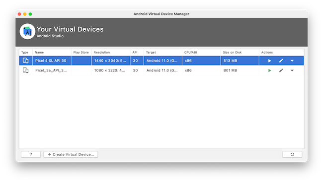

# Web-App-Manifest

Das *Web-App-Manifest* ist zunächst einmal eine Datei, nämlich `manifest.json`. Sie wird also in der *JavaScript Object Notation (JSON)* geschrieben. Diese Datei dient als Information für den Browser. Sie wird also vom Browser ausgelesen. Beispielsweise kann in der `manifest.json` vereinbart werden, dass sich die Webanwendung selbst auf dem Startbildschirm Ihres Mobilgerätes installiert. Dann genügt ein Klick auf das Icon auf dem Startbildschirm und die Webanwendung wird durch den Browser geöffnet. Somit hätten wir schonmal eine wesentliche Gemeinsamkeit zu einer nativen App geschaffen, welche ja auch durch ein Klick auf ein Icon auf dem Startbildschirm gestartet werden können. 

Wir lernen kennen, wie wir ein solches Manifest unserer PWA hinzufügen, wie es konfiguriert werden kann und wie wir die Auswirkungen eines solchen Manifestes auf mobilen Geräten sehen können. 

## Installierbar

Mithilfe eines Web-App-Manifestes machen wir unsere Webanwendung *installierbar* auf einem mobilen Gerät. Die Anwendung muss nicht einem App-Store hinzugefügt werden, sondern wird einfach über das Web durch einen Browser geladen. Normalerweise kann eine Webanwendung ja nur dadurch gestartet werden, dass ihre URL in den Browser eingetragen wird (oder Sie haben ein lesezeichen auf die Webanwendung in Ihrem Browser gesetzt). Nun wollen wir auf den Startbildschirm des Smartphones ein Icon setzen (genau wie für native Apps) und darüber die Anwendung starten. 

Dafür fügen wir im Projektordner in dem Ordner `/public` die Datei `manifest.json` hinzu:


Diese Datei sollte genau so heißen und es ist günstig, sie in den `/public`-Ordner zu legen. Achten Sie darauf, wohin Sie die Datei legen. Wenn Sie sie direkt in den Projektordner legen, dann gelten alle Pfadangaben in dieser Datei ausgehend von dieser Position. Wenn Sie sie in den `public`-Ordner legen, so wie wir, dann betrachten Sie die relativen Pfade, die Sie angeben, immer von diesem Ordner aus. 

Nun müssen wir diese Datei **jeder** HTML-Seite unserer Anwendung bekannt machen. In unserer Anwendung existieren zwei `*.html`-Dateien, die `public/index.html` und die `public/help/index.html`. In **beide** Datein tragen wir im `<head>` folgenden Eintrag ein:

```html
  <link rel="manifest" href="/manifest.json">
```

Aber **Achtung!** : Die `public/help/index.html` liegt ja im Unterordner `/help`. Das bedeutet, dass von der Datei `public/help/index.html` aus gesehen, muss der `help`-Ordner erst verlassen werden, um die `manifest.json`-Datei zu erreichen. In die `public/help/index.html` schreiben wir also 

```html
  <link rel="manifest" href="../manifest.json">
```

Das heißt, der `<head>`-Bereich der `public/index.html` sieht dann wie folgt aus (und der von `public/help/index.html` sehr ähnlich - achten Sie auf den korrekten relativen Pfad!):

```html linenums="1" hl_lines="13"
<head>
  <meta charset="UTF-8">
  <meta name="viewport"
        content="width=device-width, user-scalable=no, initial-scale=1.0, maximum-scale=1.0, minimum-scale=1.0">
  <meta http-equiv="X-UA-Compatible" content="ie=edge">
  <title>IKT-PWA</title>
  <link href="https://fonts.googleapis.com/css?family=Roboto:400,700" rel="stylesheet">
  <link rel="stylesheet" href="https://fonts.googleapis.com/icon?family=Material+Icons">
  <link rel="stylesheet"
        href="https://code.getmdl.io/1.3.0/material.blue_grey-red.min.css">
  <link rel="stylesheet" href="/src/css/app.css">
  <link rel="stylesheet" href="/src/css/feed.css">
  <link rel="manifest" href="/manifest.json">
</head>
```

In einer Single Page Application muss der Eintrag nur einmal erfolgen - in der single page, der `index.html`. 


### Mögliche Eigenschaften in der `manifest.json`

Einträge in einer JSON-Datei sind *key-value-Paare*, d.h. ein Eintrag hat die folgende Form:

```json
"property": value
```

oder auf Deutsch `"eigenschaft": wert`. JSON-Dateien beginnen und enden immer mit einer geschweiften Klammer und die einzelnen *key-value-Paare* sind durch Komma getrennt. `value` kann selbst ein JSON sein oder ein Array oder ein String oder eine Zahl. 

Wir betrachten nun einige ausgewählte *properties*, die in einer `manifest.json` definiert werden können. Einen vollständigen Überblick über alle möglichen Eigenschaften und deren Umsetzung in den einzelnen Browsern finden Sie [hier](https://developer.mozilla.org/de/docs/Mozilla/Add-ons/WebExtensions/manifest.json). Eine kurze Einführung zu `manifest.json` finden Sie auch [hier](https://web.dev/add-manifest/). Die Spezifikation für das Web-App-Manifest vom W3C finden Sie [hier](https://www.w3.org/TR/appmanifest/).

#### `name` 

Mit der Eigenschaft `name` geben wir unserer Webanwendung eine Beschreibung. In der `package.json` haben wir unserer Anwendung bereits einen Namen gegeben, aber `name` aus der `manifest.json` beschreibt zum Beispiel den Namen der App auf dem Begrüßungsschrim, wie wir gleich sehen werden. Es ist ratsam, den Namen nicht länger als 45 Zeichen zu wählen (das ist die Begrenzung, die Google Chrome und Microsoft Edge für sich festgelegt haben). Wir sagen mal:

```json
"name": "HTW-Insta Erweiterung"
```

Die Eigenschaft `name` ist in der `manifest.json` verpflichtend, d.h. sie **muss** angegeben werden (außerdem noch `version` und `manifest_version`, alle anderen Eigenschaften sind optional.)

#### `short_name` 

Der Wert von `short_name` wird z.B. verwendet als Name unserer App unter dem Icon auf dem Startbildschirm (falls der Name dort mit erscheint). Der `short_name` sollte nicht länger als 12 Zeichen sein. Ist kein `short_name` in der `manifest.json` angegeben, wird der Wert von `name` verwendet und, falls nötig, einfach gekürzt. 

```json
"short_name": "HTW-Insta"
```


#### `start_url` 

Der Wert von `start_url` gibt den Pfad und die Datei an, die beim Starten unserer Anwendung geladen werden soll. In unserem Fall soll die `/public/index.html` geladen werden. Die `manifest.json`-Datei befindet sich im `/public`-ordner, also ist der Pfad zur Datei nur `/`.:

```json
"start_url": "/index.html"
```

Beachten Sie (nochmal): der Pfad ist immer relativ zur `manifest.json`. Anegenommen, der Wert von `start_url` ist `../start_point.html` und die URL der `manifest.json` ist `https://example.com/resources/manifest.json`, dann würde die Anwendung unter `https://example.com/start_point.html` starten.


#### `display` 

Der Wert von `display` gibt an, wie die Anwendung beim Start aussehen soll. Wir haben die Auswahl zwischen den folgenden Werten:

-  `"fullscreen"`,
-  `"standalone"`,
-  `"minimal-ui"`

Nähere Erläuterungen zu den einzelnen Werten finden Sie [hier](https://www.w3.org/TR/appmanifest/#dom-displaymodetype), aber am besten ist, Sie probieren die unterschiedlichen Werte einfach mal aus. 

```json
"display": "standalone"
```

Bei `"standalone"` wird das Browser-fenster ausgeblendet, d.h. wir sehen die URL-Leiste nicht und auch nicht die Steuerelemente des Browsers. Die Anwendung wirkt wie eine native App. 


#### `background_color` 

Der Wert von `background_color` ist eine Farbe, die wir typischerweise in hexadezimaler Schreibweise angeben. Ob wir diese Farbe überhaupt sehen, hängt davon ab, wie lange unsere Anwendung zum Laden bracuht, denn mit `background_color` geben wir die Hintergrundfarbe des Bildschirms an, der gezeigt wird, während die Anwendung lädt. Meistens sieht man das nicht, weil der Ladevorgang so schnell ist. 

```json
"background_color": "#76B900"
```

Wir wählen natürlich das HTW-Grün.  


#### `theme_color` 

Der Wert von `theme_color` ist eine Farbe, die z.B. die Farbe der Werkzeugleiste auf dem Smartphone bestimmt. 
```json
"theme_color": "#FF5F00"
```

Wir wählen mal das HTW-Orange.  


#### `description` 

Wenn der Browser eine Beschreibung der App speichert, dann nutzt er den Wert von `description`, z.B. wenn Sie die App als Lesezeichen speichern.

```json
"description": "Eine tolle HTW-Insta-PWA"
```


#### `lang` 

Mit der `lang`uage-Eigeneschaft definieren Sie die Sprache Ihrer App. Der Wert ist der 4-buchstabige Ländercode, z.B. "en-US", "en-UK" oder "de-DE". 

```json
"lang": "de-DE"
```

Diese Eigenschaft wird vom Browser als Meta-Eigenschaft verwendet, kennen Sie schon aus den HTML-Dokumenten.

#### `dir` 

Mit der `dir`ection-Eigeneschaft definieren Sie die Textrichtung Ihrer App. Die Werte sind einer der drei:

- `"ltr"` (*left to right*)
- `"rtl"` (*right to left*)
- `"auto"`

Der Wert ist der 4-buchstabige Ländercode, z.B. "en-US", "en-UK" oder "de-DE". 

```json
"dir": "ltr"
```

#### `orientation` 

Mit der `orientation`-Eigeneschaft definieren Sie, in welchem Bildschirmmodus die App betrieben (geffnet) werden soll. Bei den Werten haben Sie die Wahl zwischen:

- `"any"` 
- `"natural"` 
- `"landscape"`
- `"landscape-primary"`
- `"landscape-secondary"`
- `"portrait"` 
- `"portrait-primary"`
- `"portrait-secondary"` 

Die Angaben `primary` und `secondary` beziehen sich jeweils auf eine 180-Grad-Dreheung des Gerätes. `secondary` öffnet es also jeweils "auf dem Kopf". 

```json
"orientation": "portrait-primary"
```

Die Web-App sollte aber so gebaut werden, dass sie sowohl im Portrait- als auch im Landscape-Modus gut bedient werden kann (responsive). 


#### `icons` 

Die `icons`-Eigenschaft enthält ein Array aus Icons, die als das Icon der App auf dem Startbildschirm verwendet werden können. Typischerweise gibt man hier mehrere an, die sich in ihrer Auflösung unterscheiden, um das geeignete Icon auswählen zu können, das zur Auflösung des Ausgabegerätes passt. Gute Dimensionen sind z.B. 48X48 Pixel bis hin zu 512x512 Pixel.

Die Beschreibung eines Icons ist selbst ein JSON und enthält drei Eigenschaften:

- `"src"` (der Pafd zum Icon und die Datei)
- `"type"` (der Typ des Bildes, z.B. `image/png`)
- `"sizes"` (die Größe des Bildes in Pixeln)

Der Browser sucht sich in Abhängigkeit von der Auflösung des Ausgabegerätes das am besten geeignete Icon selbständig aus. 

```json
  "icons": [
    {
        "src": "/src/images/icons/fiw48x48.png",
        "type": "image/png",
        "sizes": "48x48"
    },
    {
        "src": "/src/images/icons/fiw72x72.png",
        "type": "image/png",
        "sizes": "72x72"
    },
    {
        "src": "/src/images/icons/fiw96x96.png",
        "type": "image/png",
        "sizes": "96x96"
    },
    {
        "src": "/src/images/icons/fiw128x128.png",
        "type": "image/png",
        "sizes": "128x128"
    },
    {
        "src": "/src/images/icons/fiw256x256.png",
        "type": "image/png",
        "sizes": "256x256"
    },
    {
        "src": "/src/images/icons/fiw484x484.png",
        "type": "image/png",
        "sizes": "484x484"
    }
  ]
```

Auch hier sind wieder die korrekten relativen Pfade zu beachten.

Es ist ziemlich mühsam, alle benötigten Icons und auch die obige JSON zu erzeugen. Zum Glück gibt es aber ein Werkzeug, das das für uns übernimmt: [pwa-asset-generator](https://www.npmjs.com/package/pwa-asset-generator). Sie benötigen nur das Ausgangsicon in Originalgröße und alles andere wird für Sie erledgt. Bitte unbedingt verwenden, um sich mühsame Arbeit zu sparen!


## Testen der `manifest.json`

Insgesamt sieht unsere `manifest.json` nun so aus:

=== "public/manifest.json" 
	```json
	{
	  "name": "HTW-Insta Erweiterung",
	  "short_name": "HTW-Insta",
	  "start_url": "/index.html",
	  "id": "/index.html",
	  "display": "standalone",
	  "background_color": "#76B900",
	  "description": "Eine tolle HTW-Insta-PWA",
	  "lang": "de-DE",
	  "dir": "ltr",
	  "orientation": "portrait-primary",
	  "icons": [
	    {
	        "src": "/src/images/icons/fiw48x48.png",
	        "type": "image/png",
	        "sizes": "48x48"
	    },
	    {
	        "src": "/src/images/icons/fiw72x72.png",
	        "type": "image/png",
	        "sizes": "72x72"
	    },
	    {
	        "src": "/src/images/icons/fiw96x96.png",
	        "type": "image/png",
	        "sizes": "96x96"
	    },
	    {
	        "src": "/src/images/icons/fiw128x128.png",
	        "type": "image/png",
	        "sizes": "128x128"
	    },
	    {
	        "src": "/src/images/icons/fiw256x256.png",
	        "type": "image/png",
	        "sizes": "256x256"
	    },
	    {
	        "src": "/src/images/icons/fiw484x484.png",
	        "type": "image/png",
	        "sizes": "484x484"
	    }
	  ]
	}
	```

Wir rufen unsere Anwendung im Browser (Verwenden Sie Google Chrome!) auf und öffnen außerdem die DevTools:


Wählen Sie für die Darstellung der App eine Mobilansicht aus () und klicken Sie auf den Reiter `Application` in den DevTools. Klicken Sie in den DevTools unter dem Reiter `Application` im linken `Application`-Menü auf `Manifest`. Dort sehen Sie, dass Ihre Konfiguration korrekt eingelesen wird. Es sollte nur eine einzige Warnung erscheinen, dass wir (noch) keine *service worker* eingerichtet haben. 

Mit dem Web-Manifest ist unsere Anwendung installierbar - leider noch nicht ganz, da wir noch keinen Service worker haben und die Anwendung nicht offline verwendbar ist. Die Installierbarkeit lässt sich aber trotzdem testen, dazu müssen wir die Anwendung jedoch simulieren. Diese Schritte sind unter [Optional - für Interessierte](./#optional-fur-interessierte) beschrieben. Sie müssen das aber nicht machen, Sie können stattdessen auch einfach einen ganz einfachen Service worker implementieren. 

Dazu erstellen wir eine `public/sw.js` und binden diese wie folgt in die `public/index.html` ein (siehe auch [Einführung](../einfuehrung/#erstes-kleines-beispiel)):

```html
<script>
    // Check that service workers are supported
    if ('serviceWorker' in navigator) {
    // Use the window load event to keep the page load performant
    window.addEventListener('load', () => {
        navigator.serviceWorker.register('/sw.js');
    });
    }
</script>
```

und in die `public/sw.js` schreiben wir:

```js
importScripts(
  'https://storage.googleapis.com/workbox-cdn/releases/6.4.1/workbox-sw.js'
);

workbox.routing.registerRoute(
    ({request}) => request.destination === 'image',
    new workbox.strategies.NetworkFirst()     // NetworkFirst() vs CacheFirst()
)
```

Unsere Anwendung simuliert nun eine Offline-Fähigkeit und ist nun installierbar. Wenn wir die Anwendung mit `npm start` starten, dann erscheint:


Sie können die Anwendung über das Icon installieren oder auch über das Options-Menü (die drei vertikalen Punkte neben der URL-Leiste). Es erscheint ein Confirmation-Menü:


Nach der Installation der App ist diese (unter Mac) einerseits unter `Programme/Chrome-Apps`zu finden, aber z.B. auch im Launchpad. 


## Das `beforeinstallprompt`-Ereignis

Das [BeforeInstallPromptEvent](https://developer.mozilla.org/en-US/docs/Web/API/BeforeInstallPromptEvent) wird ausgelöst, wenn Ihre Anwendung **installierbar** ist und Sie diese das erste Mal ausführen. Es wird ausgelöst, um Ihre Anwendung zu installieren. Ein typisches Vorgehen für die Behandlung des Ereignisses schlägt vor, die Anwendung nicht sofort, d.h. nicht durch die Behandlung des `beforeinstallprompt`-Ereignisses, zu installieren, sondern zunächst abzuwarten, ob die Anwendung auch tatsächlich so genutzt wird, dass sich eine Installation lohnt. 

Für unsere Anwendung könnte das z.B. bedeuten, dass diese nicht beim ersten Aufruf installiert wird, sondern dass gewartet wird, bis die Nutzerin zum ersten Mal den `+`-Button klickt.  Ein solches typisches Vorgehen ist z.B. [hier](https://web.dev/customize-install/) beschrieben oder [hier](https://developers.google.com/web/updates/2018/06/a2hs-updates). 

Wir zeigen hier einmal die Auswertung dieses Ereignisses, indem wir das Installieren durch einen Klick auf einen Installationsbutton erledigen lassen. Wie gesagt, die Behandlung des Klick-Ereignisses dieses Installationsbuttons gehört eigentlich woanders hin, je nachdem, was in der Anwendung gewünscht ist, also wann die Anwendung tatsächlich installiert werden soll. 

Wir fügen zunächst den Button in die `index.html` ein:

```html
<button id="install" style="display:none;" class="mdl-button mdl-js-button mdl-button--raised mdl-button--accent">
  Installieren
</button>
```

Außerdem fügen wir folgendes Script in die `index.html` hinzu:

```js
<script>
  const installButton = document.getElementById('install');
  console.log('installButton', installButton)
  let deferredPrompt;
  
  window.addEventListener('beforeinstallprompt', evt => {
    console.log(evt.platforms); // e.g., ["web", "android", "windows"]
    evt.preventDefault();
    deferredPrompt = evt;
    installButton.style.display = 'block';
  })

  installButton.addEventListener('click', async () => {
    await deferredPrompt.prompt();
    const choiceResult = await deferredPrompt.userChoice;
    console.log(choiceResult.outcome);
  });

  window.addEventListener('appinstalled', () => {
    installButton.style.display = 'none';
  })

</script>
```

Der Button ist zunächst auf `display:none` gestellt, also nicht sichtbar. Wird das `beforeinstallprompt`-Ereignis ausgelöst, wird zunächst der "normale" Ablauf der Ereignisbehandlung ausgesetzt (`preventDefault()`). Stattdessen wird diese Aufforderung in `deferredPrompt` zwischengespeichert. Der Button wird auf sichtbar gesetzt (`style.display = 'block'`). Durch Klick auf den Button wird nun die Aufforderung, die in `deferredPrompt` zwischengespeichert ist, mithilfe von `prompt()` angezeigt. 

Klicken wir nun auf den Button, erscheint die Aufforderung. Entscheiden wir uns dafür, die App zu installieren, wird diese installiert, was wiederum das Ereignis `appinstalled` aufruft. Als Ereignisnehandlung dieses Ereignisses können wir den Button wieder auf unsichtbar setzen. 

Beachten Sie, dass das `BeforeInstallPromptEvent` nicht von allen Browsern unterstützt wird. Hier die aktuelle Übersicht aus [BeforeInstallPromptEvent](https://developer.mozilla.org/en-US/docs/Web/API/BeforeInstallPromptEvent):


## Optional - für Interessierte

Um die Funktionsweise des Web-App-Manifestes tatsächlich zu testen, benötigen wir jedoch ein Smartphone (oder Tablet). Wir wollen ein solches emulieren (ein Android-Smartphone) und starten dazu [Android Studio](../tools/#android-studio). Wenn wir Android Studio öffnen, wählen wir zunächst `+ Create New Project`. Durch die folgenden Vorschläge können wir einfach stets mit `Next` und dann mit `Finish` navigieren, ohne irgendetwas zu ändern. Wir sind gar nicht am Projekt interessiert, sondern nur am `AVD Manager` (*Android Virtual Device Manaager*), den wir unter dem Menüpunkt `Tools` finden. 

Nach dem Öffnen des AVD-Managers haben Sie die Möglichkeit, weitere Android-Phones zur Liste Ihrer virtuellen Geräte hinzuzufügen. 



Das können Sie ruhig machen, um geräte mit verschiedenen Auflösungen ausprobieren zu können. Wählen Sie dann ein Gerät Ihrer Wahl und klicken Sie für das Gerät unter der Spalte `Actions` auf den Play-Button:


Das dauert dann eine ganze Weile, aber am Ende erscheint ein Smartphone auf Ihrem Bildschirm:


Auf diesem Android-Gerät ist Google Chrome verfügbar. Starten Sie Google Chrome dort durch Mausklick und geben Sie als URL `10.0.2.2.:8080` ein. Unsere Webanwendung wird geöffnet:


Klicken Sie jetzt auf die drei vertikalen Punkte neben der URL-Leiste und wählen Sie `Add to Home screen`:


Es wird uns eines unserer Icons angeboten und der unter `name` gewählte Name:


Klicken Sie `Add` und dann `Add automatically`. Das Icon erscheint auf dem Homescreen (Startbildschirm). Eventuell müssen Sie den Browser zuvor schließen. Klicken Sie auf das Icon, um unsere Anwendung zu starten. Sie sehen kurz den *Splashscreen* mit der von uns gewählten Hintergrundfarbe HTW-Grün. 

Beachten Sie auch, dass um unsere Anwendung herum kein Browser-Fenster zu sehen ist. Sie läuft *standalone* (natürlich im Browser, aber der ist nicht zu sehen).  Das sieht man insbesondere, wenn man sich alle geöffneten Anwendungen anschaut:


Sobald wir für unserer PWA auch noch einen *service worker* registriert haben, kommen wir nochmal hierher zurück und werden dafür sorgen, dass der Browser uns sogar fragt, ob wir ein Icon auf dem Startbildschirm ablegen wollen.


## Erstaz für `manifest.json` für Safari

Leider unterstützt Safari (Apple) das `manifest.json` (noch) nicht, obwohl es eine Spezifikation des W3C ist. Über die Browser-Untertützung für das Web-App-Manifest können Sie sich z.B. [hier](https://developer.mozilla.org/de/docs/Web/Manifest) informieren. Die Seite enthält auch eine gute Zusammenfassung aller Eigenschaften des Web-App-Manifestes. Es lohnt sich auch ein Blick [hierauf](https://developers.google.com/web/updates/2018/07/pwacompat).

Um für Safari eine ähnliche Funktionalität zur Verfügung zu stellen, wie das Web-App-Manifest, müssen in den HTML-Dateien unserer Anwendung ein paar Meta-Angaben erfolgen:

```html linenums="1"
<meta name="apple-mobile-web-app-capable" content="yes">
<meta name="apple-mobile-web-app-status-bar-style" content="black">
<meta name="apple-mobile-web-app-title" content="HTW-Insta">
<link rel="apple-touch-icon" href="/src/images/icons/ios-fiw57x57.png" sizes="57x57">
<link rel="apple-touch-icon" href="/src/images/icons/ios-fiw60x60.png" sizes="60x60">
<link rel="apple-touch-icon" href="/src/images/icons/ios-fiw72x72.png" sizes="72x72">
<link rel="apple-touch-icon" href="/src/images/icons/ios-fiw76x76.png" sizes="76x76">
<link rel="apple-touch-icon" href="/src/images/icons/ios-fiw114x114.png" sizes="114x114">
<link rel="apple-touch-icon" href="/src/images/icons/ios-fiw120x120.png" sizes="120x120">
<link rel="apple-touch-icon" href="/src/images/icons/ios-fiw144x144.png" sizes="144x144">
<link rel="apple-touch-icon" href="/src/images/icons/ios-fiw152x152.png" sizes="152x152">
<link rel="apple-touch-icon" href="/src/images/icons/ios-fiw180x180.png" sizes="180x180">
```

So wirklich klar ist es allerdings nicht, inwieweit Apple tatsächlich PWAs unterstützt und unterstützen möchte. Es scheint eher so, dass Apple volle Kontrolle darüber behalten möchte, welche Apps auf iPhones oder iOS-Tablets laufen dürfen, nämlich solche, die (nur) über den App-Store verfügbar sind. Siehe dazu z.B. [hier](https://publishingblog.ch/progressive-web-apps-pwas-auf-ios-14-etwas-besser-doch-fehlt-noch-viel/) und [hier](https://firt.dev/ios-14/). Sollten Sie ein iPhone haben und sollte Ihre Anwendung mithilfe von `npm start` ausgeführt sein, so können Sie allerdings mal `http://141.45.57.28:8080` in Ihren Browser im Handy eingeben. Es muss nichts weiter installiert werden. Sie können aber kein Icon auf den Startbildschirm ablegen :-(.

Eine weitere Unterstützung für iOS Safari bietet [PWACompat](https://developer.chrome.com/blog/pwacompat/). Sie müssten dann entweder in die `index.html` unterhalb des Einbindens der `manifest.json` noch 

```html
<script async src="https://unpkg.com/pwacompat" crossorigin="anonymous"></script>
```

statisch hinzufügen oder dynamisch für den folgenden Fall:


```html
<script type="module">
  // detect iOS Safari
  if (('standalone' in navigator) && (!navigator.standalone)) {
    import('https://unpkg.com/pwacompat');
  }
</script>
```


!!! success
    Wir haben unsere Webanwendung *installierbar* gemacht. Zumindest auf Android-Geräten. Dies geschieht mithilfe der Datei `manifest.json`, die wir in alle `html`-Seiten unserer Anwendung einbinden. Wir haben viele Eigenschaften kennengelernt, die wir in diesem Web-App-Manifest definieren können. Mithilfe des Emulators von Android Studio können wir die Anwendung des Web-App-Manifestes auf Android-Geräten ausprobieren. Wir schauen uns nun einen weiteren zentralen Funktionsblock an, nämlich *Service Worker*. 


