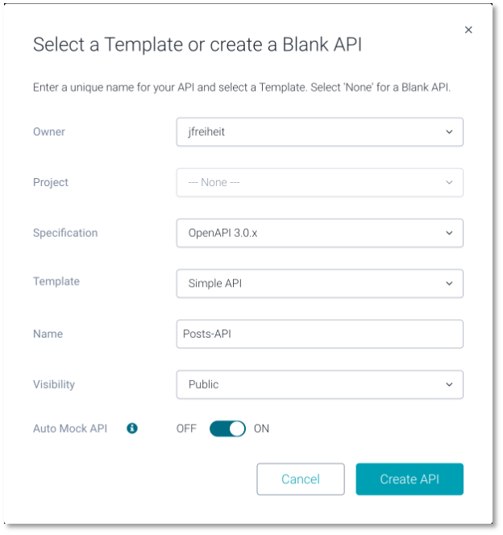
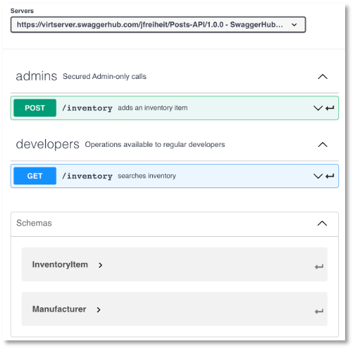
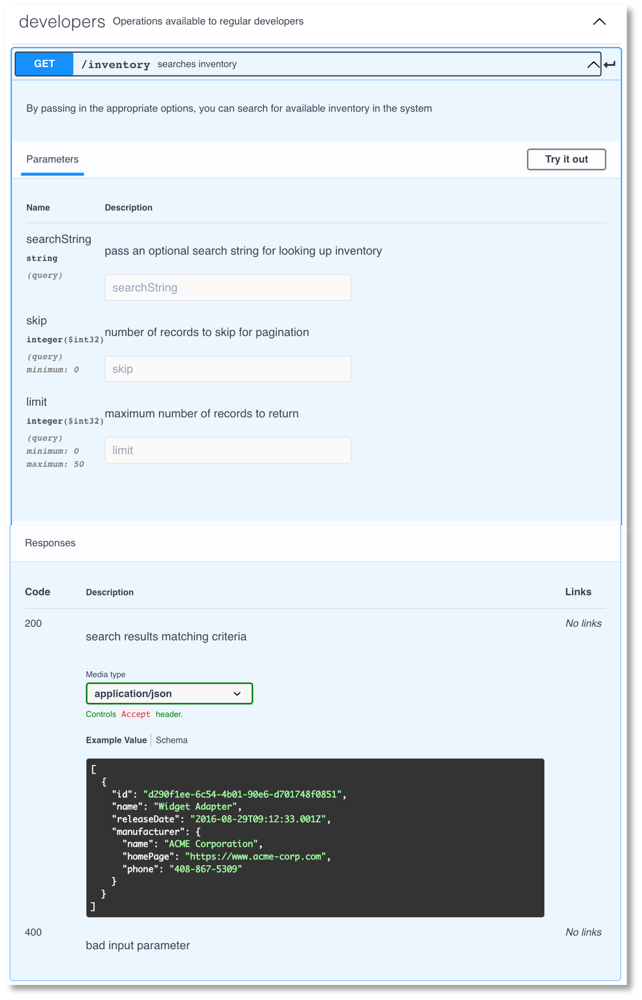
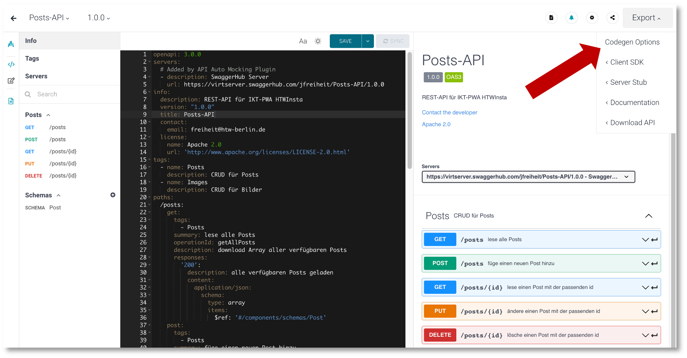
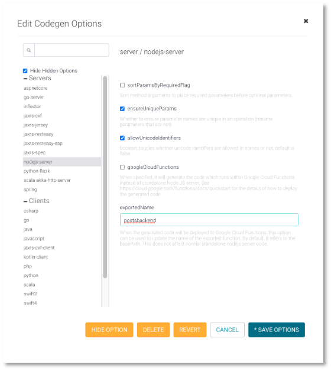

# OpenAPI

Folgende Endpunkte:

- `GET /posts`	(lade alle Posts)
- `GET /posts/:id`	(lade einen Post mit der entsprechenden `id`)
- `POST /posts` (erstelle einen neuen Post)
- `PUT /posts/:id` (ändere den Post mit der entsprechenden `id`)
- `DELETE /posts/:id` ( lösche den Post mit der entsprechenden `id`)

Unser Datenmodell ( Typ `Post`) soll zunächst so aussehen:

```js
    title: String,
    location: String,
    image_id: String
```


- öffne [https://app.swaggerhub.com/home](https://app.swaggerhub.com/home)
- registrieren und einloggen
- `Create New`

<figure markdown>
  { width="300" }
  <figcaption>Eingabemaske für neue REST-API</figcaption>
</figure>


Es wird automatisch erstellt:

=== "Simple Inventory API"

```yaml linenums="1"
openapi: 3.0.0
servers:
  # Added by API Auto Mocking Plugin
  - description: SwaggerHub API Auto Mocking
    url: https://virtserver.swaggerhub.com/jfreiheit/Posts-API/1.0.0
info:
  description: This is a simple API
  version: "1.0.0"
  title: Simple Inventory API
  contact:
    email: you@your-company.com
  license:
    name: Apache 2.0
    url: 'http://www.apache.org/licenses/LICENSE-2.0.html'
tags:
  - name: admins
    description: Secured Admin-only calls
  - name: developers
    description: Operations available to regular developers
paths:
  /inventory:
    get:
      tags:
        - developers
      summary: searches inventory
      operationId: searchInventory
      description: |
        By passing in the appropriate options, you can search for
        available inventory in the system
      parameters:
        - in: query
          name: searchString
          description: pass an optional search string for looking up inventory
          required: false
          schema:
            type: string
        - in: query
          name: skip
          description: number of records to skip for pagination
          schema:
            type: integer
            format: int32
            minimum: 0
        - in: query
          name: limit
          description: maximum number of records to return
          schema:
            type: integer
            format: int32
            minimum: 0
            maximum: 50
      responses:
        '200':
          description: search results matching criteria
          content:
            application/json:
              schema:
                type: array
                items:
                  $ref: '#/components/schemas/InventoryItem'
        '400':
          description: bad input parameter
    post:
      tags:
        - admins
      summary: adds an inventory item
      operationId: addInventory
      description: Adds an item to the system
      responses:
        '201':
          description: item created
        '400':
          description: 'invalid input, object invalid'
        '409':
          description: an existing item already exists
      requestBody:
        content:
          application/json:
            schema:
              $ref: '#/components/schemas/InventoryItem'
        description: Inventory item to add
components:
  schemas:
    InventoryItem:
      type: object
      required:
        - id
        - name
        - manufacturer
        - releaseDate
      properties:
        id:
          type: string
          format: uuid
          example: d290f1ee-6c54-4b01-90e6-d701748f0851
        name:
          type: string
          example: Widget Adapter
        releaseDate:
          type: string
          format: date-time
          example: '2016-08-29T09:12:33.001Z'
        manufacturer:
          $ref: '#/components/schemas/Manufacturer'
    Manufacturer:
      required:
        - name
      properties:
        name:
          type: string
          example: ACME Corporation
        homePage:
          type: string
          format: url
          example: 'https://www.acme-corp.com'
        phone:
          type: string
          example: 408-867-5309
      type: object
```

Zur Erläuterung:

- Unter dem Schlüssel `paths` (Zeile `20`) ist ein Pfad (eine *Route*) definiert, nämlich `/inventory`. Bei diesem Pfad handelt es sich um ein sogenanntes [*Path Item Object*](https://swagger.io/specification/#path-item-object)
- Der Pfad `/inventory` enthält zwei sogenannte [*Operation Objects*](https://swagger.io/specification/#operation-object), nämlich `GET` (Zeile `22`) und `POST` (Zeile `63`). Ein *Operation Object* kann verschiedene Eigenschaften beinhalten:

	- `tags`: Schlüsselwörter, um die API-Dokumentation zu gruppieren (siehe unten im Bild `Dokumentation der REST-API` die Gruppen `admins` und `developers`)
	- `summary`: dient der Erläuterung eines Endpunktes (siehe unten im Bild `Dokumentation der REST-API` die Erläuterungen `searches inventory` und `adds an inventory item`)
	- `description`: beschreibt die Funktionalität des Endpunktes detaillierter. Erscheint in der Dokumentation bei den Details eines Endpunktes (siehe unten im Bild `Get /inventroy-Endpunkt im Detail`)
	- `responses`: beschreibt die Rückgabe des Endpunktes. Es handelt sich um ein [*Responses Object*](https://swagger.io/specification/#responses-object). Diese können nach HTTP-Statuscodes unterteilt werden. Neben der `description` für den Statuscode kann dabei insbesondere der Typ der `responses` definiert werden. In der `content`-Eigenschaft wird zunächst der Typ der akzeptierten Response definiert, z.B. `application/json` oder `image/png`. Dann wird spezifiziert, welcher Datentyp zurückgeben wird. Die Zeilen `57-60` beschrieben bspw., dass ein Array von `InventoryItems` zurückgegeben wird. Ein solches `InventoryItem` ist unter der Eigenschaft `schemas` definiert. Mithilfe von `$ref: '#/components/schemas/InventoryItem'` wird auf dieses Schema referenziert. 
- Unter dem Schlüssel `components` können `schemas`, `responses`, `parameters`, `examples`, `requestBodies`, `headers` usw. spezifiziert werden. Mithilfe von `$ref` kann dann auf jede dieser Komponenten referenziert werden. In obigem Beispiel wurde das Schema `InventoryItem` und das Schema `Manufacturer` definiert. Diese Schemen entsprechen den verwendeten Datenmodellen. 


<figure markdown>
  { width="300" }
  <figcaption>Dokumentation der REST-API</figcaption>
</figure>


<figure markdown>
  { width="300" }
  <figcaption>GET /inventory-Endpunkt im Detail</figcaption>
</figure>

## YAML

Die obige Beschreibung ist übrigens in [YAML](https://yaml.org/). Ursprünglich stand YAML für *Yet Anaother Markup Language*. Jetzt sagt die Spezifikation von YAML aber *YAML Ain't Markup Language*. Es hat Ähnlichkeiten zu JSON, kommt allerdings ohne Klammerung aus. Dafür spielt das Einrücken eine Rolle. OpenAPI unterstützt sowohl JSON als auch YAML. 

## Die '/posts'-Routen

Wir spezifizieren zunächst die `/posts`-Routen, also `GET /posts` und `POST /posts`.

=== "Posts-API"

```yaml linenums="1"
openapi: 3.0.0
servers:
  # Added by API Auto Mocking Plugin
  - description: SwaggerHub Server
    url: https://virtserver.swaggerhub.com/jfreiheit/Posts-API/1.0.0
info:
  description: REST-API für IKT-PWA HTWInsta
  version: "1.0.0"
  title: Posts-API
  contact:
    email: freiheit@htw-berlin.de
  license:
    name: Apache 2.0
    url: 'http://www.apache.org/licenses/LICENSE-2.0.html'
tags:
  - name: Posts
    description: CRUD für Posts
  - name: Images
    description: CRUD für Bilder
paths:
  /posts:
    get:
      tags:
        - Posts
      summary: lese alle Posts
      operationId: getAllPosts
      description: download Array aller verfügbaren Posts
      responses:
        '200':
          description: alle verfügbaren Posts geladen
          content:
            application/json:
              schema:
                type: array
                items:
                  $ref: '#/components/schemas/Post'
    post:
      tags:
        - Posts
      summary: füge einen neuen Post hinzu
      operationId: createNewPost
      description: neuen Post erzeugen und speichern
      responses:
        '201':
          description: Post created
        '409':
          description: Post existiert bereits
      requestBody:
        content:
          application/json:
            schema:
              $ref: '#/components/schemas/Post'
        description: neuer Post
components:
  schemas:
    Post:
      type: object
      required:
        - title
        - location
        - image_id
      properties:
        title:
          type: string
          example: H-Gebäude
        location:
          type: string
          example: Campus Wilhelminenhof
        image_id:
          type: string
          example: Campus Wilhelminenhof
```


## Die '/posts/{id}'-Routen

Nun fügen wir noch die `/posts/{id}`-Routen hinzu, also `GET /posts/{id}`, `PUT /posts/{id}` und `DELETE /posts/{id}`.


=== "Posts-API"

```yaml linenums="54"
  /posts/{id}:
    get:
      tags:
        - Posts
      summary: lese einen Post mit der passenden id
      operationId: getOnePost
      description: download entsprechenden Post
      parameters:
        - name: id
          in: path
          required: true
          description: Post-ID
          schema:
            type : string
      responses:
        '200':
          description: Post mit entsprechender id geladen
          content:
            application/json:
              schema:
                type: object
                items:
                  $ref: '#/components/schemas/Post'
        '404':
          description: Post bzw. id nicht gefunden
    put:
      tags:
        - Posts
      summary: ändere einen Post mit der passenden id
      operationId: updateOnePost
      description: aktualisiere entsprechenden Post
      parameters:
        - name: id
          in: path
          required: true
          description: Post-ID
          schema:
            type : string
      responses:
        '200':
          description: Post mit entsprechender id aktualisiert
          content:
            application/json:
              schema:
                type: object
                items:
                  $ref: '#/components/schemas/Post'
        '404':
          description: Post bzw. id nicht gefunden
      requestBody:
        content:
          application/json:
            schema:
              $ref: '#/components/schemas/Post'
        description: zu aktualisierender Post
    delete:
      tags:
        - Posts
      summary: lösche einen Post mit der passenden id
      operationId: deleteOnePost
      description: lösche entsprechenden Post
      parameters:
        - name: id
          in: path
          required: true
          description: Post-ID
          schema:
            type : string
      responses:
        '200':
          description: Post mit entsprechender id gelöscht
          content:
            application/json:
              schema:
                type: object
                items:
                  $ref: '#/components/schemas/Post'
        '404':
          description: Post bzw. id nicht gefunden
```

## Codegenerierung


<figure markdown>
  { width="300" }
  <figcaption>Dokumentation der REST-API</figcaption>
</figure>


<figure markdown>
  { width="300" }
  <figcaption>GET /inventory-Endpunkt im Detail</figcaption>
</figure>
