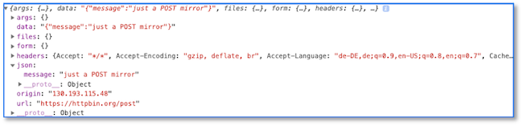

# Promises und die Fetch-API

Wir haben es bereits eingangs des Abschnitts über [Service Workers](../serviceworker/#service-workers) angesprochen: JavaScript ist *sinhle threaded*, d.h. JavaScript läuft auf einem einzelnen Thread. Das bedeutet im Prinzip, dass drei Funktionen `functionA()`, `functionB()`, `functionC()` nacheinander auf dem einzelnen Thread ausgeführt werden würden, wenn sie nacheinander aufgerufen werden:


Das zieht natürlich nach sich, dass sich diese Funktionen in ihrer Ausführung *blockieren*. Wenn also `functionB()`bspw. sehr lange braucht, um ausgeführt werden zu können, dann blockiert diese Funktion die Ausführung von `functionC()`. Um dies zu vermeiden, wurden in JavaScript sogenannte *Callbacks* eingeführt. 

## Callbacks

Zunächst einmal sind *Callbacks* Funktionen, die anderen Funktionen als Parameter übergeben werden. Wir betrachten folgendes Beispiel:

```javascript linenums="1"
let x = function () {
    console.log ("Ausgabe der Funktion x");
}

let y = function () {
    console.log ("Ausgabe der Funktion y");
}

let z = function (callback) {
    console.log("Ausgabe der Funktion z - vor Aufruf von callback");
    callback();
    console.log("Ausgabe der Funktion z - vor Aufruf von callback");
}
```

Wir haben drei Funktionen. Diese werden als anonyme Funktionen definiert, aber die Funktionsdefinitionen werden sofort einer Variablen zugewiesen. Das bedeutet, dass z.B. der Wert der Variablen `x` die Funktionsdefinition 
```js
function () {
    console.log ("Ausgabe der Funktion x");
}
```
ist. Wenn wir nun z.B. `console.log(x)` aufrufen, dann erhalten wir folgende Ausgabe auf der Konsole:
```bash
ƒ () {
    console.log ("Ausgabe der Funktion x");
}
```
Wenn wir aber `x();`, also sozusagen, die Variable als Funktion aufrufen, dann wird die Funktion ausgeführt und wir erhalten auf der Konsole die Ausgabe
```bash
Ausgabe der Funktion x
```

Wenn wir nun `z(x);` aufrufen, dann wird die in den Zeilen `9-12` definierte Funktion aufgerufen, wobei der Parameter `callback` als Wert die Funktionsdefinition von `x` übergeben wird. In Zeile `11` erfolgt dann mithilfe von `callback();` eigentlich der Aufruf `x();`. 

Wir können aber auch z.B. `z(y);` aufrufen. Dann wird `z` nicht die Funktion `x`, sondern die Funktion `y` übergeben und der Aufruf `callback();` in Zeile `11` entspricht somit dem Aufruf `y();`. 

Ein großer Vorteil dieser *Callbacks*  bestehen darin, dass der Aufruf *asynchron* erfolgt. Schauen wir uns z.B. einmal an, wie die mögliche Ausgabe der Aufrufe 
```javascript
z(x);
z(y);
```
aussehen **könnte**:
```bash
Ausgabe der Funktion z - vor Aufruf von callback
Ausgabe der Funktion x
Ausgabe der Funktion z - vor Aufruf von callback
Ausgabe der Funktion z - vor Aufruf von callback
Ausgabe der Funktion y
Ausgabe der Funktion z - vor Aufruf von callback
```

Wichtig ist, dass *Callbacks* die aufrufende Funktion nicht blockieren, sondern *asynchron* ausgeführt werden. Dieses einfache Beispiel soll das demonstrieren:
```javascript linenums="1"
setTimeout( function() {
    console.log('Ausgabe A');
}, 3000);

console.log('Ausgabe B');
```
Wir haben zwei Anweisungen: eine `setTimeout()`-Anweisung und eine `console.log('Ausgabe B');`-Anweisung, die nacheinander aufgerufen werden (`setTimeout()` vor `console.log()`). Innerhalb der `setTimeout()`-Anweisung wird eine Funktion als *Callback* übergeben. Innerhalb dieser Funktion erfolgt der Aufruf von `console.log('Ausgabe A');`.

Das Ausführen des Programms ergibt folgende Ausgabe:
```bash
Ausgabe B
Ausgabe A
```

Die Ausgabe von `Ausgabe A` erfolgt ca. 3 Sekunden nach `Ausgabe B`. Das liegt daran, dass die *Callback*-Funktion asynchron ausgeführt wird und alle weiteren Ausführungen nicht blockiert. Das bedeutet, dass wir mithilfe von *Callbacks* eine asynchrone Ausführung unseres JavaScript-Codes erreichen. Der einzelne JavaScript-Thread wird also für den Aufruf der *Callbacks* verwendet und irgendwann sind diese *Callback*-Aufrufe beendet. Ein gegenseitiges Blockieren findet nicht statt, sondern es bleibt sogar noch Platz für weitere Aufrufe (hellgrüne Bereiche im folgenden Bild):


Das problem mit diesen *Callback* ist, dass sie sehr schnell sehr unübersichtlich werden. Man spricht von der *Callback-Hölle*, in der man sehr schnell ist, sobald genügend viele *Callbacks* asynchron (nebenläufig) ausgeführt werden, diese sogar ineinander verschachtelt sind (*Callbacks* in *Callbacks*) und man gar nicht weiß, wann welche *Callbacks* beendet sind. Sobald man aber erst die Ausführung eines *Callbacks* abwarten **muss**, weil man die Resultate dieses *Callbacks* weiterverarbeiten möchte, entstehen wieder synchrone Aufrufe und der Vorteil der asynchronen Abarbeitung ist dahin. Um dieses Problem zu lösen, wurden *Promises* entwickelt. 

## Promises

Ein *Promise* ist zunächst einmal ein JavaScript-Objekt. Es enthält einerseits den Code zum Erzeugen eines *Promise*-Objektes (*producing code*) und anderseits auch den Code zum Verarbeiten eines solchen *Promise*-Objektes (*consuming code*). Dabei können zwei Sachen verarbeitet werden:

- entweder das `Promise`-Objekt wurde erfolgreich abgearbeitet (`resolve`) oder
- das `Promise`-Objekt wurde **nicht** erfolgreich abgearbeitet (`reject`). 

Die allgemeine Syntax eines solchen `Promise`-Objektes sieht so aus (siehe z.B. [w3scool](https://www.w3schools.com/js/js_promise.asp)):

```javascript linenums="1"
let myPromise = new Promise(function(myResolve, myReject) {
// "Producing Code" (May take some time)

  myResolve(); // when successful
  myReject();  // when error
});

// "Consuming Code" (Must wait for a fulfilled Promise)
myPromise.then(
  function(value) { /* code if successful */ },
  function(error) { /* code if some error */ }
);
```

Betrachten wir das obere Beispiel genauer:

- in Zeile `1` erstellen wir eine Variable `myPromise`, die wir natürlich nennen können, wie wir möchten
- diese Variable zeigt auf ein `Promise`-Objekt, das ebenfalls in Zeile `1` mithilfe von `new` und dem Aufruf des Konstruktors erzeugt wird
- einem `Promise`-Objekt (dem Konstruktor) wird immer eine Funktion übergeben, der wiederum zwei *Callback*-Funktionen als Parameter übergeben werden
- die erste *Callback*-Funktion, die hier `myResolve` heißt (aber meistens nur `resolve`), wird aufgerufen, wenn das `Promise`-Objekt erfolgreich abgearbeitet wurde (Zeile `4`)
- die zweite *Callback*-Funktion, die hier `myReject` heißt (aber meistens nur `reject`), wird aufgerufen, wenn das `Promise`-Objekt **nicht** erfolgreich abgearbeitet wurde (Zeile `5`)
- den Aufruf des `promise`-Objektes sehen wir in Zeile `9`. Ein `Promise`-Objekt durchläuft durch den Aufruf 2 der folgenden 3 Zustände:
	
	- `pending`: das `Promise`-Objekt wird abgearbeitet und hat noch kein Resultat (`undefined`),
	- `fulfilled`: das `Promise`-Objekt wurde erfolgreich abgearbeitet und liefert den entsprechenden Resultatwert zurück **oder**
	- `rejected`: das `Promise`-Objekt wurde nicht erfolgreich abgearbeitet und liefert ein `Error`-Objekt zurück

- es gibt aber keine Möglichkeiten, auf diese Zustände eines `Promise`-Objektes zuzugreifen und auch nicht direkt auf den Resultatwert oder das Fehlerobjekt; stattdessen muss eine entsprechende Funktion des `Promise`-Objektes aufgerufen werden, die selbst wieder ein `Promise`-Objekt zurückgibt, nämlich `then()`
- der Aufruf von `then()` ist ebenfalls in Zeile `9` gezeigt; diese Funktion hat zwei Parameter: dem ersten Parameter wird der Resultatwert übergeben (wenn das `Promise`-Objekt den `fulfilled`-Zustand erreicht hat) und dem zweiten Parameter wird das Fehlerobjekt übergeben (wenn das `Promise`-Objekt den `rejected`-Zustand erreicht hat). Beide Parameter sind wiederum *Callbacks*.

Wir werden sehen, dass wir den `rejected`-Zustand auch mit `catch()` abfangen können, aber dazu kommen wir später. Zunächst noch einmal zur Vertiefung unser obiges *Callback*-Beispiel mit `setTimeout()` als *Promise*:

```javascript linenums="1"
let promise = new Promise(function(resolve, reject) {
    setTimeout( function() {
        resolve('resolve -- Ausgabe A');
    }, 3000);
});

promise.then(
    function(value) {
        console.log(value);
    }
    // (noch) keine Funktion für error
);

console.log('Ausgabe B');
```

Die Ausgabe in Zeile `14` hat nichts mit dem `Promise` zu tun, aber wir lassen sie mal im Code, um das gleiche Beispiel wie oben zu haben. Es erfolgt zunächst die Ausgabe `Ausgabe B` auf der Konsole und 3 Sekunden später die Ausgabe `resolve -- Ausgabe A`. Rein funktional hat sich also nichts geändert. Wie Sie den Parameter für den `resolve`-Fall (und dann auch für den `reject`-Fall) nennen, bleibt ganz Ihnen überlassen; hier `value` (Zeile `8`).

Dieses Mal heißt unser `Promise`-Objekt `promise` und die beiden *Callback* -Funktionen `resolve` und `reject` (Zeile `1`). Der *producing code*  enthält nur die Implementierung von `resolve`. In dem Beispiel gibt es also (noch) kein `reject`. In den Zeilen `7`-`12` sehen wir den *consuming code* der *Promise*, auch hier wieder nur für `resolve`. Es erfolgt die Ausgabe des Wertes, den `resolve` übergeben hat. 

### Promises in Arrow-Notation

Weil wir es mitlerweile häufig sehen und weil wir uns auch angewöhnen wollen, diese selbst zu benutzen, hier das gleiche Beispiel nochmal in [Arrow-Notation](../serviceworker/#arrow-notation-verwenden):

```javascript linenums="1"
let promise = new Promise((resolve, reject) => {
    setTimeout( () => {
        resolve('resolve -- Ausgabe A');
    }, 3000);
});

promise.then(
    value => {
        console.log(value);
    }
    // (noch) keine Funktion für error
);

console.log('Ausgabe B');
```

Es ist auch noch zu erwähnen, dass Sie nur selten selbst *Promises* erstellen, sondern diese viel häufiger nutzen werden. Das heißt, Sie werden nicht so häufig *producing code*, sondern viel häufiger *consuming code* schreiben. Beispielsweise gibt die [Registrierung](../serviceworker/#registrierung-eines-service-workers) eines *service workers* ein *Promise* zurück:

```javascript linenums="1"
// scope defaults to the path the script sits in
// "/" in this example
navigator.serviceWorker.register("/serviceworker.js").then(registration => {
  console.log("success!");
  if (registration.installing) {
    registration.installing.postMessage("Howdy from your installing page.");
  }
}, err => {
  console.error("Installing the worker failed!", err);
});
```

Ein großer Vorteil von *Promises* ist, dass Sie die Verarbeitung *verketten* können. Die `then()`-Funktion liefert selbst wieder ein `Promise` zurück, so dass Sie erneut dieses `Promise` mit `then()` behandeln können. Wir kommen darauf in den Anwendungen nochmal zurück. 

### Der `reject`-Fall

Wir schauen uns jetzt an, wie wir den Fall am besten behandeln, wenn das `Promise` nicht in den `fulfilled`, sondern in den `rejected`-Zustand übergeht, wenn also nicht `resolve`, sondern `reject` ausgeführt wird. Wir ändern unser Beispiel einmal entsprechend:

```javascript linenums="1" hl_lines="3 4"
let promise = new Promise((resolve, reject) => {
    setTimeout( () => {
        // resolve('resolve -- Ausgabe A');
        reject({code: 500, message: 'An error occurred'});
    }, 3000);
});

promise.then(
    value => {
        console.log(value);
    }
    // (noch) keine Funktion für error
);

console.log('Ausgabe B');
```

Wir haben also Zeile `3` auskommentiert (`resolve`) und stattdessen `reject` eingefügt (Zeile `4`). Im Gegensatz zu `resolve` geben wir jetzt mal keinen einfachen `string`, sondern ein JavaScript-Objekt zurück (erkennbar an `{ }`). Wir sind darin völlig frei, was zurückgegeben wird, aber es bietet sich an, ein Error-Objekt zu erzeugen. Die `then()`-Behandlung des `Promise`-Objekt lassen wir zunächst unverändert (Zeilen `8-13`). 

Wenn wir diesen Code ausführen, dann wird erneut `Ausgabe B` ausgegeben (Zeile `15` - hat nichts mit dem `Promise` zu tun), aber nach 3 Sekunden erfolgt keine Ausgabe auf der Konsole, sondern stattdessen erscheint auf der Konsole:


#### Error-Behandlung in der `then()`-Funktion

Wir behandeln den geworfenen Fehler nicht, da wir in unserer `then()`-Behandlung bis jetzt nur den `resolve`-Fall behandeln (Zeilen `9-11`). Das ändern wir nun:

```javascript linenums="1" hl_lines="12-14"
let promise = new Promise((resolve, reject) => {
    setTimeout( () => {
        // resolve('resolve -- Ausgabe A');
        reject({code: 500, message: 'An error occurred'});
    }, 3000);
});

promise.then(
    value => {
        console.log(value);
    },
    err => {
        console.log(err.code, err.message);
    }
);

console.log('Ausgabe B');
```

In den Zeilen `12-14` wurde die Behandlung des Fehlerfalls hinzugefügt (beachten Sie auch das zusätzliche Komma in Zeile `11`). Wie Sie die Variable `err` nennen, bleibt Ihnen überlassen. Sie bekommt den Wert, den das `Promise` für den `reject`-Fall übergibt, in unserem Beispiel also ein JavaScript-Objekt:

```json
{
	code: 500, 
	message: 'An error occurred'
}
```

weil wir das in Zeile `4` so definiert haben. Wir greifen also auf die Werte der Schlüssel `code` und `message` zu und lassen diese auf die Konsole ausgeben (Zeile `13`). Auf der Konsole erscheint 3 Sekunden nach der Ausgabe `Ausgabe B` die Ausgabe `500 An error occurred`. 

#### Error-Behandlung im `catch()`-Block

Es ist ungewöhnlich, den Fehlerfall in der `then()`-Funktion zu behandeln, obwohl es, wie wir gesehen haben, möglich ist. Stattdessen verwendet man für den Fehlerfall besser `catch()`:

```javascript linenums="1" hl_lines="14-18"
let promise = new Promise((resolve, reject) => {
    setTimeout( () => {
        // resolve('resolve -- Ausgabe A');
        reject({code: 500, message: 'An error occurred'});
    }, 3000);
});

promise
    .then(
        value => {
            console.log(value);
        }
    )
    .catch(
        err => {
            console.log(err.code, err.message);
        }
    );

console.log('Ausgabe B');
```

Mit diesen Wissen können wir jetzt auch unsere [Registrierung eines *service workers*](../serviceworker/#registrierung-eines-service-workers-in-htw-insta) etwas zuverlässiger gestalten und fügen dort ebenfalls einen `catch()`-Block ein, auch wenn der Fehlerfall nicht all zu häufig eintreffen dürfte:

```javascript linenums="1" hl_lines="7-9"
if ('serviceWorker' in navigator) {
    navigator.serviceWorker
        .register('/sw.js')
        .then(() => {
            console.log('service worker registriert')
        })
        .catch(
            err => { console.log(err); }
        );
}
```


## Fetch API

Die [Fetch API](https://developer.mozilla.org/de/docs/Web/API/Fetch_API) bietet einen bequemeren und leistungsfähigeren Ersatz für [XMLHttpRequest](https://developer.mozilla.org/de/docs/Web/API/XMLHttpRequest). Es geht also darum, Ressourcen vom Web-Server zu holen (*to fetch*). Die Fetch API ist vollständig auf Promises aufgebaut. Die zentrale Methode der Fetch API ist `fetch()`. Das Gute an dieser Methode ist, dass sie *gloabl* ist im Sinne, dass sie nicht nur von einer Webanwendung selbst, sondern auch z.B. von einem Service Worker verwendet werden kann (sie ist im [WindowOrWorkerGlobalScope](https://developer.mozilla.org/en-US/docs/Web/API/WindowOrWorkerGlobalScope)). Einführungen zu `fetch()` finden Sie z.B. [hier](https://developers.google.com/web/updates/2015/03/introduction-to-fetch), [hier](https://jakearchibald.com/2015/thats-so-fetch/) oder [hier](https://www.mediaevent.de/javascript/fetch.html).

### GET-Anfragen mit fetch()

Wir starten mit einem einfachen Beispiel und nutzen dafür [https://httpbin.org](https://httpbin.org/), eine Webseite, die viele REST-Endpunkte zum Ausprobieren anbietet. Nach dem Öffnen dieser Seite im Browser, können Sie z.B. mal auf `Request inspection` klicken - dort sehen wir den Endpunkt `/ip`, den wir über ein `GET` abfragen werden:

```javascript linenums="1"
fetch('https://httpbin.org/ip')
    .then(
            response => {
                console.log(response);
            }
    );
```

Wir rufen also einmal `fetch()` auf und übergeben dieser Funktion den Endpunkt, von dem eine Ressource geholt werden soll. Die `fetch()`-Funktion liefert ein `Promise`-Objekt zurück. Deshalb können wir auch direkt die `then()`-Funktion aufrufen und die `response` (ist egal, wie Sie diesen Parameter nennen) auf die Konsole ausgeben. Wenn wir diesen Code ausführen, erscheint in der Konsole:


Wir bekommen also ein JavaScript-Objekt zurück. Wirklich interessiert sind wir aber hauptsächlich an dem `body` dieses Objektes. Um darauf geeignet zuzugreifen, konvertieren wir das Objekt zunächst in das JSON-Format mithilfe der Anweisung `response.json();`. Die `json()`-Funktion ist eine Standard-JavaScript-Funktion, welche ein JavaScript-Objekt in einen JSON umwandelt. Da `then()` selbst ein `Promise`-Objekt zurückgibt. wollen wir darauf `then()` erneut anwenden, um das Prinzip verketteter `then()`-Funktionen (verketteter asynchroner Verarbeitungen) zu zeigen:

```javascript linenums="1"
fetch('https://httpbin.org/ip')
    .then(
        response => {
            return response.json();
        }
    )
    .then(
        data => {
            console.log(data);
        }
    );
```

In der ersten `then()`-Funktion (Zeilen `2-6`) wird also die Response der asynchronen `GET https://httpbin.org/ip`-Anfrage behandelt und darin wird diese Response in eine JSON umgewandelt (Zeile `4`). Die Rückgabe dieser `then()`-Funktion ist erneut ein `Promise`. Für dieses `Promise` ist die zweite `then()`-Funktion (Zeilen `7-11`). Diese Funktion behandelt das asynchrone Streamen des Response-Body und dessen Umwandlung in ein JSON. Das durch dieses `Promise` zurückgegebene `resolve` bezeichnen wir in unserem Beispiel als `data` und geben es auf die Konsole aus. Auf der Konsole erscheint die `IP`, von der die Anfrage erfolgte, z.B. 

```bash
{origin: "130.193.115.48"}
```

Noch zwei kleine Verbesserungen am Code: wenn in der Arrow-Notation Ihre Funktion nur aus einer einzigen `return`-Anweisung besteht, dann können Sie die geschweiften Klammern Ihres Funktionskörpers weglassen und auch das `return`. D.h. aus

```javascript
    response => {
        return response.json();
    }
```
wird 

```javascript
    response => response.json()
```
Auch das Semikolon entfällt. Das gilt aber nur für `return`-Anweisungen, nicht z.B. wenn die Funktion nur aus einer einzigen Konsolenausgabe besteht. Außerdem sollten wir auch noch ein `catch()`-Block einfügen, für den Fall, dass ein Fehler auftritt:

```javascript linenums="1"
fetch('https://httpbin.org/ip')
    .then(
        response => response.json()
    )
    .then(
        data => {
            console.log(data);
        }
    )
    .catch(
        err => {
            console.log(err);
        }
    );
```

Den Fehlerfall können Sie ausprobieren, indem Sie einfach einen Fehler in die URL einbauen.

### POST-Anfragen mit fetch()

`POST`-Anfragen werden verwendet, um Daten an den Webserver zu senden. Typischerweise sind das Formulardaten, die z.B. in eine Datenbank eingefügt werden sollen. Wenn wir also mithilfe von `fetch()` eine `POST`-Anfrage stellen wollen, dann müssen wir zwei Dinge beachten:

- wir müssen `fetch()` explizit mitteilen, dass die verwendete HTTP-Anfrage-Methode `POST` ist und
- wir müssen die Daten mitschicken.

Für ein einfaches Beispiel verwenden wir erneut [https://httpbin.org](https://httpbin.org/), dieses Mal aber den Endpunkt [/post](https://httpbin.org/#/HTTP_Methods/post_post), der uns einfach die gesendeten Daten wieder als Response unserer Abfrage zurückschickt, also einfach als "Spiegel" fungiert. Eine entsprechende `fetch()`-Anweisung könnte so aussehen:

```javascript linenums="1"
fetch('https://httpbin.org/post', {
	    method: 'POST',
	    header: {
	        'Content-Type': 'application/json',
	        'Accept': 'application/json'
	    },
	    body: JSON.stringify({
	        message: 'just a POST mirror'
	    })
	})
    .then(
        response => response.json()
    )
    .then(
        data => {
            console.log(data);
        }
    )
    .catch(
        err => {
            console.log(err);
        }
    );
```

Die Zeilen `11-23` sind dabei zunächst unverändert geblieben und sehen genauso aus wie die Zeilen `2-14` aus dem obigen `GET`-Beispiel. Nur die Parameter in der `fetch()`-Funktion haben sich geändert. Der erste Parmeter lautet nun `'https://httpbin.org/post'`, da wir die Anfrage an diese URL (diesen Endpunkt) stellen. Hinzugekommen ist ein zweiter Parameter, ein JSON:

```json
{
    method: 'POST',
    header: {
        'Content-Type': 'application/json',
        'Accept': 'application/json'
    },
    body: JSON.stringify({
        message: 'just a POST mirror'
    })
}
```

darin legen wir zunächst mithilfe von `method` die HTTP-Anfrage-Methode fest. Standard ist `GET`, deshalb brauchten wir das in unserem ersten Beispiel nicht zu tun. Nun geben wir `POST` an. 

Außerdem definieren wir noch Eigenschaften für den `header`. Wir legen mithilfe von `Content-Type` fest, welches Format unsere Daten haben, die wir übermitteln, nämlich `application/json`. Außerdem legen wir mithilfe von `Accept` fest, in welchem Format wir die Daten empfangen wollen, nämlich ebenfalls im JSON-Format. Diese `Accept`-Angabe ist nicht immer notwendig. Die meisten REST-Endpunkte liefern so oder so ein JSON zurück. Das hängt von der Definition der REST-API ab. 

In der `body`-Eigenschaft definieren wir die Daten, die wir übertragen wollen. In diesem Fall im JSON-Format. `{ message: 'just a POST mirror' }` ist ein JavaScript-Objekt, das eine einzige Eigenschaft enthält, nämlich `message`. Mithilfe der JavaScript-Standardfunktion `JSON.stringify()` wandeln wir dieses JavaScript-Objekt in ein JSON um. Somit wird ein JSON versendet, genau wie wir es im `header` unter `Content-Type` angegeben haben. 

Führen wir diesen Code aus, erhalten wir auf der Konsole folgende Ausgabe: 



Man könnte jetzt meinen, dass der Zugriff auf das Response-JSON (`{message: "just a POST mirror"}`) einfach über `response.data` oder über `response.json` erfolgen kann. Dem ist aber nicht so, da es sich bei dem `body` der `response` um ein Objekt vom Typ [ReadableStream](https://developer.mozilla.org/en-US/docs/Web/API/ReadableStream) handelt. Das ist einerseits gut, denn die Daten vom Server werden asynchron als Stream empfangen, andererseits ist der Zugriff auf die Daten recht aufwendig. Wir werden darauf nochmal intensiver eingehen, wenn wir Bilder vom Backend laden. Ansonsten können Sie sich auch schonmal [hier](https://developer.mozilla.org/en-US/docs/Web/API/Streams_API/Using_readable_streams) informieren oder sich [hier](https://github.com/mdn/dom-examples/tree/master/streams/simple-pump) und [hier](https://github.com/mdn/dom-examples/tree/master/streams). Aber, wie gesagt, wir kommen eh nochmal darauf zurück. Wenn Sie sich das zurückgelieferte JSON schonmal anschauen wollen, dann ginge das z.B. so:

```javascript linenums="1"
fetch('https://httpbin.org/post', {
        method: 'POST',
        header: {
            'Content-Type': 'application/json',
            'Accept': 'application/json'
        },
        body: JSON.stringify({
            message: 'just a POST mirror'
        })
    })
    .then(
        response => {
            console.log(response);
            return response;
        }
        )
    .then(
        response => {
            console.log(response.body);		// show the body, ReadableStream
            return response.body;
        }
    )
    .then(
        body => {
            const reader = body.getReader();
            return new ReadableStream({
                start(controller) {
                    return pump();
                    function pump() {
                        return reader.read().then(({ done, value }) => {
                            // When no more data needs to be consumed, close the stream
                            if (done) {
                                controller.close();
                                return;
                            }
                            // Enqueue the next data chunk into our target stream
                            controller.enqueue(value);	// Uint8Array
                            return pump();
                        });
                    }
                }
            })
        })
    .then(stream => new Response(stream))
    .then(response => response.json())	// also possible: text(), blob(), ...
    .then(response => { console.log(response.json); })
    .catch(
        err => {
            console.log(err);
        }
    );
```

### Fetch vs. XMLHttpRequest

Wir haben eingangs erwähnt, dass die Fetch API einen bequemeren und leistungsfähigeren Ersatz für [XMLHttpRequest](https://developer.mozilla.org/de/docs/Web/API/XMLHttpRequest) darstellt. Das sieht man einerseits bereits an der Code-Länge. Das ist die Implementierung mit `fetch()`:

```javascript linenums="1"
fetch('https://httpbin.org/ip')
    .then(
        response => response.json()
    )
    .then(
        data => {
            console.log(data);
        }
    )
    .catch(
        err => {
            console.log(err);
        }
    );
```

und das hier macht genau das Gleiche mithilfe von `XMLHttpRequest()`:

```javascript linenums="1"
let xhr = new XMLHttpRequest();
xhr.open('GET', 'https://httpbin.org/ip');
xhr.responseType = 'json';

xhr.onload = function() {
    console.log(xhr.response);
}

xhr.onerror = function() {
    console.log('error');
}

xhr.send();
```

Ein ganz wesentlicher Unterschied liegt aber darin, dass bei Verwendung von `XMLHttpRequest()` deutlich mehr Sachen im Hintergrund synchron ablaufen, als bei der Fetch API. Das ist der Grund, dass wir bei der Implementierung von *service workern* die Fetch API verwenden **müssen** und nicht auf das (alte) `XMLHttpRequest()` zugreifen können.  

### fetch() und unser service worker

Alle Code-Beispiele von oben (also die Promises und die `fetch()`-Beispiele) habe ich einfach in die `app.js` unseres *HTW Insta*-Beispiels eingetragen und ausprobiert. Das heißt, die `app.js` sieht jetzt gerade so aus:

??? "app.js"
	```javascript linenums="1"
	if ('serviceWorker' in navigator) {
	    navigator.serviceWorker
	        .register('/sw.js')
	        .then(() => {
	            console.log('service worker registriert')
	        })
	        .catch(
	            err => { console.log(err); }
	        );
	}

	let promise = new Promise((resolve, reject) => {
	    setTimeout( () => {
	        // resolve('resolve -- Ausgabe A');
	        reject({code: 500, message: 'An error occurred'});
	    }, 3000);
	});

	promise
	    .then(
	        value => {
	            console.log(value);
	        }
	    )
	    .catch(
	        err => {
	            console.log(err.code, err.message);
	        }
	    );

	console.log('Ausgabe B');

	fetch('https://httpbin.org/ip')
	    .then(
	        response => response.json()
	    )
	    .then(
	        data => {
	            console.log(data);
	        }
	    )
	    .catch(
	        err => {
	            console.log(err);
	        }
	    );

	let xhr = new XMLHttpRequest();
	xhr.open('GET', 'https://httpbin.org/ip');
	xhr.responseType = 'json';

	xhr.onload = function() {
	    console.log(xhr.response);
	}

	xhr.onerror = function() {
	    console.log('error');
	}

	xhr.send();

	fetch('https://httpbin.org/post', {
	        method: 'POST',
	        header: {
	            'Content-Type': 'application/json',
	            'Accept': 'application/json'
	        },
	        body: JSON.stringify({
	            message: 'just a POST mirror'
	        })
	    })
	    .then(
	        response => {
	            console.log(response);
	            return response;
	        }
	        )
	    .then(
	        response => {
	            console.log(response.body);
	            return response.body;
	        }
	    )
	    .then(
	        body => {
	            const reader = body.getReader();
	            return new ReadableStream({
	                start(controller) {
	                    return pump();
	                    function pump() {
	                        return reader.read().then(({ done, value }) => {
	                            // When no more data needs to be consumed, close the stream
	                            if (done) {
	                                controller.close();
	                                return;
	                            }
	                            // Enqueue the next data chunk into our target stream
	                            controller.enqueue(value);
	                            return pump();
	                        });
	                    }
	                }
	            })
	        })
	    .then(stream => new Response(stream))
	    .then(response => response.json())
	    .then(response => { console.log(response.json); })
	    .catch(
	        err => {
	            console.log(err);
	        }
	    );
	```	


Außerdem haben wir ja in unserer Anwendung bereits einen *service worker* registriert und auch in schon in Ansätzen implementiert: 

??? "sw.js"
	```javascript linenums="1"
	self.addEventListener('install', event => {
	    console.log('service worker --> installing ...', event);
	})

	self.addEventListener('activate', event => {
	    console.log('service worker --> activating ...', event);
	    return self.clients.claim();
	})

	self.addEventListener('fetch', event => {
	    console.log('service worker --> fetching ...', event);
	})
	```	

Ich erwähne das nur deshalb, weil unsere Konsole bei Ausführung der Anwendung jetzt ungefähr so aussieht:


Es erscheint also ganz oft die Ausgabe des `fetch`-Events, genau wie in der `sw.js` in den Zeilen `10-12` implementiert. Das `fetch`-Event wird immer dann ausgelöst, wenn die Anwendung etwas vom Webserver lädt. Das sind einerseits alle Ressourcen, die wir in der `index.html`-datei definiert haben (alle `*.js` und alle `*.css` und alle `*.png`-Dateien), aber auch die `fetch()`-Anweisungen, die wir in der `app.js` implementiert haben! Wir werden auf der Konsole auch die `fetch`-Ereignisse finden, die den Zugriff auf `https://httpbin.org/ip` bzw. `https://httpbin.org/post` ausführen. Wir merken uns also

- `fetch`-Ereignisse werden *automatisch* ausgelöst durch das Laden von ressourcen, so wie in den `*.html`-Dateien der Anwendung definiert, 
- aber auch durch *manuell* ausgelöste (implementierte) `fetch()`-Anfragen. 

Das ist wichtig, wenn wir in unserem *service worker* die `fetch`-Ereignisse behandeln werden. 

!!! success
	Wir kennen nun Promises und die Fetch API und können beides anwenden. Wir werden Promises von nun an permanent verwenden. Insbesondere den *consuming code* für Promises, als `.then().catch()`. Mithilfe der Fetch API werden wir alle HTTP-Anfragen an den Server stellen können, also `GET`, `POST`, `PUT` und `DELETE` und dabei das asynchrone Prinzip dieser API bestmöglich ausnutzen.  
