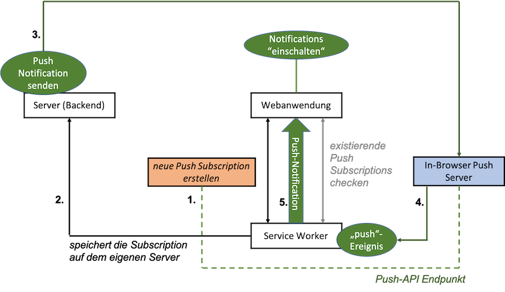
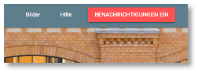

# Push Notifications


!!! hint
    Aktueller Stand vor Push Notifications:

    - [Frontend](https://github.com/jfreiheit/IKT-PWA-08)
    - [Backend](https://github.com/jfreiheit/IKT-PWA-BACKEND-01)
    - Collection [post](./files/posts.json)
    - Collection [post.files](./files/posts_files.json)
    - Collection [post.chunks](./files/posts_chunks.json)


*Push Notifications* sind sinnvoll, um die Nutzerin einer App über Neuigkeiten zu informieren, sogar dann, wenn die Anwendung (und der Browser!) geschlossen ist (sind). Mit *Push Notifications* können Nutzerinnen wieder "zurück an die App geholt" werden, d.h. mithilfe von *Push Notifications* kann man dafür sorgen, dass Nutzerinnen die App wieder öffnen, um sich die Neuigkeiten genauer anzuschauen. Die Neuigkeiten können neue Tweets, E-Mails, Nachrichten, Anrufe usw. sein. 

Das Prinzip, das für die Push-Benachrichtungen umgesetzt wird, sieht auf den ersten Blick etwas kompliziert aus:



Im Zentrum stehen zunächst die Webanwendung und der Service Worker. Die Webanwendung meldet sich bei den Push-Benachrichtigungen an und der Service Worker verwaltet diese. Jeder Browser hat eine eigenen "eingebauten" *Push Server*. Eine *Push-Anmeldung* (*Push Subscription*) erlaubt den Zugriff auf einen *Push-API-Endpunkt* auf den Push-Server. Die eigentliche *Push-Benachrichtigung* kommt jedoch vom eigenen Server. Er sendet die Push-Nachricht an den *In-Browser Push Server*, dieser löst damit ein `push`-Ereignis beim Service Worker aus und der Service Worker schickt die *Push-Benachrichtigung* an die Webanwendung. Wir schauen uns im Folgenden alle diese Schritte im Detail an. 

## Anzeigen von Benachrichtigungen

Wir beginnen mit dem Anzeigen (der Darstellung) von Push-Benachrichtigungen in einer Webanwendung. Dieser Abschnitt hat **noch nichts** mit dem `push`-Ereignis zu tun! Wir benötigen zum Anzeigen nicht mal einen Service Worker. Es geht aber auch über den Service Worker - und das wird später auch bei der Verwendung der *Push-API* notwendig. Die hier verwendete [Notification-API](https://developer.mozilla.org/en-US/docs/Web/API/notification) wird von fast allen Browsern unterstützt. [Hier](https://developer.mozilla.org/en-US/docs/Web/API/Notifications_API/Using_the_Notifications_API) ist auch eine gute Übersicht darüber, wie diese *Notification-API* verwendet wird. 

### Benachrichtigungen einschalten

Bevor wir das Anzeigen von *(Push-)Benachrichtigungen* betrachten, müssen wir diese zuerst erlauben. In unserer Anwendung gibt es dazu den Button `BENACHRICHTIGUNGEN EIN`. 



In der `index.html` ist dieser Button zwei Mal definiert, einmal für einen schmalen Viewport und einmal für einen breiten. Für beide Varianten sieht die Implementierung so aus: 

```html
<div class="drawer-option">
      	<button class="enable-notifications mdl-button mdl-js-button mdl-button--raised mdl-button--colored mdl-color--accent">
  			Benachrichtigungen Ein
		</button>
</div>
```

Für einen schmalen Viewport ist der Button dann unter dem Hamburger Menü in der linken oberen Ecke erreichbar. Beiden Buttons ist die CSS-Klasse `enable-notifications` zugewiesen. Wir sorgen zuerst dafür, dass dieser Button nur angezeigt wird, wenn der Browser die *Notification-API* unterstützt. Wenn nicht, dann wäre der Button funktionslos und wir bräuchten ihn nicht. Wir schalten ihn deshalb in der `app.css` zunächst im Standartwert aus:

=== "/src/css/app.css"
	```css linenums="1" hl_lines="9-11"
	.text-center {
	  text-align: center;
	}

	.drawer-option {
	  padding: 16px;
	}

	.enable-notifications {
	  display: none;
	}
	```

In der `app.js` prüfen wir, ob der Browser die *Notification-API* unterstützt und schalten für diesen Fall die Buttons wieder ein. 


=== "/src/js/app.js"
	```js linenums="1" hl_lines="1 14-23 25-30"
	let enableNotificationsButtons = document.querySelectorAll('.enable-notifications');

	if ('serviceWorker' in navigator) {
	    navigator.serviceWorker
	        .register('/sw.js')
	        .then(() => {
	            console.log('service worker registriert')
	        })
	        .catch(
	            err => { console.log(err); }
	        );
	}

	function askForNotificationPermission() {
	    Notification.requestPermission( result => {
	        console.log('User choice', result);
	        if(result !== 'granted') {
	            console.log('No notification permission granted');
	        } else {
	            // notifications granted
	        }
	    });
	}

	if('Notification' in window) {
	    for(let button of enableNotificationsButtons) {
	        button.style.display = 'inline-block';
	        button.addEventListener('click', askForNotificationPermission);
	    }
	}
	```

- In Zeile `1` erstellen wir uns eine Variable `enableNotificationsButtons`, die auf ein Array aller Buttons mit der CSS-Klasse `enable-notifications` zeigt. 
- In Zeile `25` prüfen wir nun, ob der Browser die `Notification`-API unterstützt. Wenn ja, dann schalten wir alle Buttons aus dem `enableNotificationsButtons`-Array wieder auf sichtbar (von `display: none` auf `display: inline-block`) und wir melden jeden dieser Buttons an die Ereignisbehandlung des `click`-Ereignisses an (Zeile `28`). 
- Die Behandlung des `click`-Ereignisses erfolgt in der Methode `askForNotificationPermission()`, die in den Zeilen `14-23` definiert ist. Da diese Methode nur dann aufgerufen wird, wenn der Browser die `Notification`-API unterstützt, kann diese API darin verwendet werden. 
- Mit der Funktion [requestPermission()](https://developer.mozilla.org/en-US/docs/Web/API/Notification/requestPermission) wird die Nutzerin gefragt, ob sie Benachrichtigungen zulassen möchte. Diese Methode gibt ein Promise zurück, dessen `result` die Werte `granted`, `denied` oder `default` haben kann. Werden Benachrichtigungen nicht erlaubt (Zeile `17`), können wir nichts weiter tun. Die Nutzerin wird dann auch nicht erneut gefragt. Die Benachrichtigungen bleiben für die Webanwendung ausgeschaltet (Zeile `18`). 

Wenn wir die Anwendung nun ausführen (Reload nach `Application --> Storage --> Clear Storage` oder die Versionsnummern der Caches im Service Worker ändern), dann erhalten wir nach dem Klicken auf den `BENACHRICHTIGUNGEN EIN`-Button folgende Abfrage:


Wenn wir auf `Zulassen` klicken, dann erscheint in der Konsole `User Chaice granted` (Zeile `16`). Beachten Sie, dass Sie nicht erneut gefragt werden, ob Benachrichtungen zugelassen werden sollen oder nicht. Erneutes Klicken auf den Button bewirkt (selbst nach einem Reload der Anwendung) keine erneute Abfrage. Deshalb wäre es eigentlich auch sinnvoll, den Button wieder zu verstecken, d.h. auf `display: none` zu setzen. 

Um die Benachrichtigungen zu verwalten, können Sie in Chrome `chrome://settings/content/notifications` eingeben. Dort sehen Sie eine Auflistung aller Webanwendungen, die Sie besucht haben und die von Ihnen eine Erlaubnis zur Benachrichtung gewollt haben. Sie können dort die jeweiligen Einstellungen wieder änder, z.B. auch für die hier entwickelte Anwendung.


### Benachrichtigungen anzeigen

Jetzt erstellen wir unsere erste Benachrichtigung mithilfe der `Notification`-API. Die einfachste Form der `Notification` wird durch die Verwendung des parametrisierten Konstruktors von `Notification` (`new Notification('Nachricht')`) erstellt. Wir fügen die `app.js` eine solche einfache Benachrichtigung für den Fall, dass Benachrichtigungen erlaubt werden, ein:


=== "/src/js/app.js"
	```js linenums="1" hl_lines="14-16 24"
	let enableNotificationsButtons = document.querySelectorAll('.enable-notifications');

	if ('serviceWorker' in navigator) {
	    navigator.serviceWorker
	        .register('/sw.js')
	        .then(() => {
	            console.log('service worker registriert')
	        })
	        .catch(
	            err => { console.log(err); }
	        );
	}

	function displayConfirmNotification() {
	    new Notification('Successfully subscribed!');
	}

	function askForNotificationPermission() {
	    Notification.requestPermission( result => {
	        console.log('User choice', result);
	        if(result !== 'granted') {
	            console.log('No notification permission granted');
	        } else {
	            displayConfirmNotification();
	        }
	    });
	}

	if('Notification' in window) {
	    for(let button of enableNotificationsButtons) {
	        button.style.display = 'inline-block';
	        button.addEventListener('click', askForNotificationPermission);
	    }
	}
	```


Wenn wir die Anwendung nun erneut ausführen und auf den Button klicken, dann werden wir zwar nicht erneut gefragt, ob wir Benachrichtigungen zulassen oder blockieren wollen, aber da wir Benachrichtungen bereits zugelassen haben, erscheint nun die folgende Benachrichtigung:


Der einfache Aufruf des `Notification`-Konstruktors mit einer einfachen Nachricht (Zeile `15`) erzeugt auch die einfachste Form der Benachrichtigung. Dem Konstruktor lassen sich aber als zweiten Parameter noch JavaScript-Objekt für `options` übergeben. Darin kann ein weiterer Text (`body`) definiert werden und z.B. auch ein eigenes `icon`. Wir betrachten das später noch etwas genauer, erstmal nur eine weitere Nachricht: 


=== "/src/js/app.js"
	```js linenums="14" hl_lines="2-3"
	function displayConfirmNotification() {
	    let options = { body: 'You successfully subscribed to our Notification service!'};
	    new Notification('Successfully subscribed!', options);
	}
	```

ergibt dann die Benachrichtigung:


### Benachrichtigungen im Service Worker erstellen

Im jetzigen Stand werden die Benachrichtungen aus der Webanwendung heraus erstellt. Das ist auch völlig ok. Die `Notification`-API lässt sich sowohl in der Webanwendung verwenden, als auch im Service Worker. Da später aber die *Push-Benachrichtigungen* vom Service Worker verwaltet werden, wechseln wir jetzt auch für die einfachen Benachrichtigungen zum Service Worker, d.h. wir lassen die Benachrichtigungen nun nicht mehr durch die Webanwendung erstellen, sondern durch den Service Worker. Dazu passen wir unsere `app.js` wie folgt an:


=== "/src/js/app.js"
	```js linenums="14" hl_lines="2-3"
	function displayConfirmNotification() {
	    if('serviceWorker' in navigator) {
	        let options = { body: 'You successfully subscribed to our Notification service!'};

	        navigator.serviceWorker.ready
	            .then( sw => {
	                sw.showNotification('Successfully subscribed (from SW)!', options);
	            });
	    }
	}
	```

Der Service Worker besitzt eine eigene Funktion `showNotification()`, die intern ein `Notification`-Objekt erzeugt und der die gleiche Parameterliste übergeben werden kann, wie dem `Notification`-Konstruktor. Nach Reload und Klicken des Buttons sehen wir nun folgende Benachrichtigung:


Die Nachricht wurde extra um `(from SW)` ergänzt, um kenntlich zu machen, dass die Benachrichtigung nun vom Service Worker angestoßen wird. 


### Weitere Optionen für die Benachrichtigungen

Benachrichtigungen sind ein *System-Feature*, d.h. ihre Gestaltung hat etwas mit dem Gerät zu tun, in dem diese Benachrichtigungen erscheinen. Es ist kein *Browser-Feature*. Benachrichtigungen sehen auf dem Mac anders aus, als unter Windows oder unter Linux und auf dem iPhone anders, als auf einem Android-Gerät. Es gibt ziemlich viele mögliche Optionen für eine solche Benachrichtigung, aber die unterschiedlichen Systeme beachten diese Optionen mal mehr und mal weniger. 

Wir werden hier der Vollständigkeit halber einige Optionen benennen, aber am meisten sieht man von diesen Optionen auf einem Android-Gerät. 


=== "/src/js/app.js"
	```js linenums="14" hl_lines="5-15"
	function displayConfirmNotification() {
	    if('serviceWorker' in navigator) {
	        let options = {
	            body: 'You successfully subscribed to our Notification service!',
	            icon: '/src/images/icons/fiw96x96.png',
	            image: '/src/images/htw-sm.jpg',
	            lang: 'de-DE',
	            vibrate: [100, 50, 200],
	            badge: '/src/images/icons/fiw96x96.png',
	            tag: 'confirm-notification',
	            renotify: true,
	            actions: [
	                { action: 'confirm', title: 'Ok', icon: '/src/images/icons/fiw96x96.png' },
	                { action: 'cancel', title: 'Cancel', icon: '/src/images/icons/fiw96x96.png' },
	            ]
	        };

	        navigator.serviceWorker.ready
	            .then( sw => {
	                sw.showNotification('Successfully subscribed (from SW)!', options);
	            });
	    }
	}
	```

Auf dem Mac hat neben der `icon`-Option nur noch die `actions`-Option eine Auswirkung. Die Benachrichtigung sieht nun so aus (auf dem Mac):


Man sieht das icon und unter dem Icon wird durch das Hovern mit der Maus ein Menü sichtbar, das die definierten `actions` enthält. 

- mit `image` kann die gesamte Benachrichtigung mit einem Bild unterlegt werden (sieht man bei Android),
- mit `vibrate` kann die Benachrichtigung durch das Vibrieren des Gerätes signalisiert werden. In unserem Beispiel vibriert das Gerät 100 Millisekunden, dann ist 50 Millisekunden Pause und dann vibriert es nochmal für 200 Millisekunden. 
- mit `tag` können Benachrichtigungen mit einer Art `id` versehen werden. Wenn meherere Benachrichtigungen mit demselben `tag` vorliegen, dann wird nur die zuletzt eingegangene Benachrichtigung angezeigt. Ansonsten erscheinen alle Benachrichtigungen untereinander. 
- `renotify` gehört zu `tag`. Wenn der Wert true ist, dann wird die Nutzerin auch dann informiert, wenn eine neue Nachricht zum selben `tag` angekommen ist. Sonst nicht.

Eine Übersicht über alle Optionen findet sich [hier](https://developer.mozilla.org/en-US/docs/Web/API/Notification/Notification).

Wenn Sie ein Android-Gerät besitzen, dann können Sie es an den Rechner andocken (USB-Anschluss - dazu müssen Sie den USB-Zugriff erlauben) und in den Devloper Tools rechts oben unter den drei senkrechten Punkten den Menüpunkt `More tools` und dort `Remote devices` auswählen und können dann ausprobieren, wie die Benachrichtigungen unter einem Android-Gerät aussehen. [Anleitung für Edge](https://docs.microsoft.com/de-de/microsoft-edge/devtools-guide-chromium/remote-debugging/), [Anleitung für Chrome](https://raygun.com/blog/debug-android-chrome/), [Anleitung für Firefox](https://developer.mozilla.org/de/docs/Tools/Remote_Debugging/Firefox_for_Android).


Auf die unter `actions` definierten Aktionen kann innerhalb des Service Workers sogar reagiert werden:


=== "/sw.js"
	```js linenums="140"
	self.addEventListener('notificationclick', event => {
	    let notification = event.notification;
	    let action = event.action;

	    console.log(notification);

	    if(action === 'confirm') {
	        console.log('confirm was chosen');
	        notification.close();
	    } else {
	        console.log(action);
	    }
	});
	```

Der Service Worker kann das `notificationclick`-Ereignis behandeln. Ebenso kann der Service Worker das Ereignis behandeln, das ausgelöst wird, wenn eine Benachrichtigung geschlossen wird: 


=== "/sw.js"
	```js linenums="155"
	self.addEventListener('notificationclose', event => {
	    console.log('notification was closed', event);
	});
	```

Wir wollen uns aber mit den Benachrichtigungen gar nicht weiter im Detail beschäftigen, sondern lieber mit Push-Notationen. Kenntnisse über Benachrichtigungen sind aber eine gute Voraussetzung, um zu den Push-Notifikationen überzugehen. 

## Push-Benachrichtigungen 

Das Konzept der Benachrichtigung wird auch bei den Push-Nachrichten verwendet. Um Push-Nachrichten zu empfangen, muss man sich jedoch zunächst für den Empfang registrieren (siehe in der Abbildung oben *neue Push Subscription erstellen*).  

### Anmelden an Push-Nachrichten (Subscription)

Die Anmeldung an die Push-Nachrichten geschieht in der Webanwendung. Wir passen dazu unsere `app.js` an und fügen eine Funktion `configurePushSubscription()` ein. 


=== "/src/js/app.js"
	```js linenums="1" hl_lines="38-54 62-63 68"
	let enableNotificationsButtons = document.querySelectorAll('.enable-notifications');

	if ('serviceWorker' in navigator) {
	    navigator.serviceWorker
	        .register('/sw.js')
	        .then(() => {
	            console.log('service worker registriert')
	        })
	        .catch(
	            err => { console.log(err); }
	        );
	}

	function displayConfirmNotification() {
	    if('serviceWorker' in navigator) {
	        let options = {
	            body: 'You successfully subscribed to our Notification service!',
	            icon: '/src/images/icons/fiw96x96.png',
	            image: '/src/images/htw-sm.jpg',
	            lang: 'de-DE',
	            vibrate: [100, 50, 200],
	            badge: '/src/images/icons/fiw96x96.png',
	            tag: 'confirm-notification',
	            renotify: true,
	            actions: [
	                { action: 'confirm', title: 'Ok', icon: '/src/images/icons/fiw96x96.png' },
	                { action: 'cancel', title: 'Cancel', icon: '/src/images/icons/fiw96x96.png' },
	            ]
	        };

	        navigator.serviceWorker.ready
	            .then( sw => {
	                sw.showNotification('Successfully subscribed (from SW)!', options);
	            });
	    }
	}

	function configurePushSubscription() {
	    if(!('serviceWorker' in navigator)) {
	        return
	    }

	    navigator.serviceWorker.ready
	        .then( sw => {
	            return sw.pushManager.getSubscription();
	        })
	        .then( sub => {
	            if(sub === null) {
	                // create a new subscription
	            } else {
	                // already subscribed
	            }
	        });
	}

	function askForNotificationPermission() {
	    Notification.requestPermission( result => {
	        console.log('User choice', result);
	        if(result !== 'granted') {
	            console.log('No notification permission granted');
	        } else {
	            // displayConfirmNotification();
	            configurePushSubscription();
	        }
	    });
	}

	if('Notification' in window && 'serviceWorker' in navigator) {
	    for(let button of enableNotificationsButtons) {
	        button.style.display = 'inline-block';
	        button.addEventListener('click', askForNotificationPermission);
	    }
	}
	```

Die Methode `configurePushSubscription()` wird nun anstelle von `displayConfirmNotifivcation()` in der `askForNotificationPermission()` aufgerufen (Zeilen `62-63`). Das liegt daran, dass die `Notification.requestPermission()`-Funktion auch für die Erlaubnis von *Push-Nachrichten* verwendet wird. Mit der Erlaubnis von *Benachrichtigungen* wird also auch gleichzeitig die Erlaubnis von *Push-Nachrichten* erteilt. 

Da die *Push-Benachrichtigungen* über den Service Worker verwaltet werden, wird in `configurePushSubscription()` zunächst geprüft, ob der Browser überhaupt Service Worker unterstützt (Zeile `39`). Wenn nicht, wird die Methode sofort verlassen (Zeile `40`). Da wir aber auch in die Abfrage nach der `Notification-API` (Zeile `68`) noch die Abfrage nach dem `serviceWorker` hinzugefügt haben, wäre der Button `BENACHRICHTUNGEN EIN` gar nicht sichtbar, wenn der Service Worker nicht im Browser unterstützt würde. Dann würde auch nie die Funktion `configurePushSubscription()` aufgerufen. Wir lassen Zeilen `39-41` trotzdem sicherheitshalber drin.

In Zeile `45` verwendet der Service Worker die [PushManager-API](https://developer.mozilla.org/en-US/docs/Web/API/PushManager). Eine der drei Methoden, die diese API zur Verfügung stellt, ist die `getSubscription()`-Methode. Diese Methode gibt eine Promise mit einer existierenden Subscription zurück. Wenn keine Subscription existiert, ist der Rückgabewert `null`. Ist der Rückgabewert `null`, dann erzeugen wir eine neue Subscription (Zeile `49`). 

### Erzeugen einer neuen Subscription

Das Erezugen einer Subscription ist zunächst einfach. Dafür gibt es in der *PushManager-API* die Methode `subscribe()`. 


=== "/src/js/app.js"
	```js linenums="38" hl_lines="6 9 15"
	function configurePushSubscription() {
	    if(!('serviceWorker' in navigator)) {
	        return
	    }

	    let swReg;
	    navigator.serviceWorker.ready
	        .then( sw => {
	            swReg = sw;
	            return sw.pushManager.getSubscription();
	        })
	        .then( sub => {
	            if(sub === null) {
	                // create a new subscription
	                swReg.pushManager.subscribe();
	            } else {
	                // already subscribed
	            }
	        });
	}
	```

Da wir in dem zweiten `then()`-Block keinen Zugriff mehr auf die Variable `sw` haben (wir geben die Promise von `getSubscription()` zurück, nicht aber `sw`), benötigen wir eine Variable, in der wir die Referenz auf den Service Worker speichern und auf die wir in der gesamten Funktion Zugriff haben. Die Promise `navigator.serviceWorker.ready` gibt etwas mehr als den Service Worker zurück, eine sogenannte *Service Worker Registration* (siehe [ready](https://developer.mozilla.org/en-US/docs/Web/API/ServiceWorkerContainer/ready) und [Srvice Worker Registration](https://developer.mozilla.org/en-US/docs/Web/API/ServiceWorkerRegistration)). Wir nennen unsere Variable deshalb `swReg` (Zeile `43`). Die `subscribe()`-Funktion wird in Zeile `52` aufgerufen. 

Wir haben nun eine neue Subscription erstellt. Eine solche Subscription enthält den Endpunkt (*Push-API Endpunkt* in der Abbildung ganz oben) des *In-Browser Push Servers*, an den die Push-Nachrichten gesendet werden und der für eine neue Push-Nachricht das `push`-Ereignis beim Service Worker auslöst. Mit der Kenntnis des Endpunktes kann nun aber jede beliebige Anwendung eine Push-Nachricht an den *In-Browser Push Server* senden. Damit kann es passieren, dass Push-Nachrichten erstellt werden, die gar nicht von dem eigenen Backend kommen. Deshalb müssen wir diese Informationen über den Endpunkt **schützen**. 


### Schutz der Subscription

Der `subscribe()`-Methode können Optionen (als JavaScript-Objekt) übergeben werden, welche zwei Eigenschaften enthalten können:

- `userVisibleOnly`; kann `true` oder `false` sein. Wenn `true`, dann können nur Nachrichten gesendet werden, die "sichtbar" für den User sind, d.h. es können keine Aktionen (Java-Skripte o.ä.) als Nachrichten gesendet werden und
- `applicationServerKey`: das ist ein Base64-ArrayBuffer, der einen Schlüssel enthält. Das Vorgehen dafür ist z.B. [hier](https://developers.google.com/web/fundamentals/push-notifications/web-push-protocol), aber auch [hier](https://blog.mozilla.org/services/2016/04/04/using-vapid-with-webpush/) gut beschrieben.  


Die Grundidee dabei ist, dass wir sicherstellen wollen, dass nur Nachrichten, die von **unserem** Backend kommen, von dem *In-Browser Push Server* an unsere Webanwendung weitergeleitet werden. Dazu müssen wir unser Backend erweitern.


#### Backend erweitern

Um unser Backend für das Senden von *Push-Nachrichten* einzurichten, benötigen wir das Modul [web-push](https://www.npmjs.com/package/web-push). Wir wechesln im Terminal in unseren Backend-Ordner und führen dort

```bash
npm install --save web-push
```

aus. Die `--save`-Option wird seit `npm 5.0.0` nicht mehr benötigt. Die Abhängigkeiten werden auch so in der `package.json` gespeichert. In diese `package.json` des Backends fügen wir ein weiteres `script` hinzu: 

=== "package.json"
	```json linenums="1" hl_lines="9"
	{
	  "name": "backend",
	  "version": "1.0.0",
	  "description": "Backend REST-API",
	  "main": "server.js",
	  "scripts": {
	    "watch": "nodemon ./server.js",
	    "test": "echo \"Error: no test specified\" && exit 1",
	    "web-push": "web-push"
	  },
	  "keywords": [
	    "rest",
	    "api",
	    "backend",
	    "mongodb"
	  ],
	  "repository": {
	    "type": "git",
	    "url": "https://github.com/jfreiheit/IKT-PWA-Backend.git"
	  },
	  "author": "J. Freiheit",
	  "license": "ISC",
	  "dependencies": {
	    "cors": "^2.8.5",
	    "dotenv": "^16.0.0",
	    "express": "^4.18.0",
	    "gridfs-stream": "^1.1.1",
	    "mongoose": "^6.3.1",
	    "multer": "^1.4.4",
	    "multer-gridfs-storage": "^5.0.2",
	    "web-push": "^3.5.0"
	  },
	  "devDependencies": {
	    "nodemon": "^2.0.16"
	  }
	}
	```

Das ermöglicht uns, 

```bash
npm run web-push
```

auszuführen. Das führt allerdings zu einem Fehler, zeigt uns aber an, welche Optionen wir nutzen könnten: 

```bash
Usage: 

  web-push send-notification --endpoint=<url> [--key=<browser key>] [--auth=<auth secret>] [--payload=<message>] [--ttl=<seconds>] [--encoding=<encoding type>] [--vapid-subject=<vapid subject>] [--vapid-pubkey=<public key url base64>] [--vapid-pvtkey=<private key url base64>] [--gcm-api-key=<api key>]

  web-push generate-vapid-keys [--json]

```

Die `send-notification`-Option in Verbindung mit dem `endpoint` werden wir später verwenden, um *Push-Nachrichten* zu senden. Zunächst benötigen wir den öffentlichen und den privaten Schlüssel zur Verschlüsselung der Kommunikation mit dem *In-Browser Push Server*. Dazu verwenden wir die Option `generate-vapid-keys` und geben in das Terminal 


```bash
npm run web-push generate-vapid-keys
```

ein. Wir erhalten eine Ausgabe in der Form

```bash
=======================================

Public Key:
BCGnTHY7-DB07ySIj5hAYQBd5J3lXskcLMuAkqTTkneKB21tXyUP7uCaWJUjIPRpfecn73lMHpwANFw-0LsXEtY

Private Key:
TNVDKlHHGBZ66aKyCTxru630t6RL_xictOKA3n0lgM4

=======================================
```


#### Public Key in der app.js

Wir kopieren zunächst den öffentlichen (`public`) Schlüssel und speichern in in unsere `app.js` der Webanwendung:


=== "/src/js/app.js"
	```js linenums="38" hl_lines="15-18"
	function configurePushSubscription() {
	    if(!('serviceWorker' in navigator)) {
	        return
	    }

	    let swReg;
	    navigator.serviceWorker.ready
	        .then( sw => {
	            swReg = sw;
	            return sw.pushManager.getSubscription();
	        })
	        .then( sub => {
	            if(sub === null) {
	                // create a new subscription
	                let vapidPublicKey = 'BCGnTHY7-DB07ySIj5hAYQBd5J3lXskcLMuAkqTTkneKB21tXyUP7uCaWJUjIPRpfecn73lMHpwANFw-0LsXEtY';
	                swReg.pushManager.subscribe({
	                    userVisibleOnly: true,
	                });
	            } else {
	                // already subscribed
	            }
	        });
	}
	```

Hier können wir auch schonmal die Option `userVisibleOnly: true` definieren (Zeile `54` - geschweifte Klammern nicht vergessen). Wie oben bereits erwähnt, stellen wir den öffentlichen Schlüssel als ein Base64- ArrayBuffer zur Verfügung. Dazu benötigen wir eine Funktion `urlBase64ToUint8Array(base64String)`, die wir z.B. [hier](https://www.npmjs.com/package/web-push) oder auch [hier](https://gist.github.com/Klerith/80abd742d726dd587f4bd5d6a0ab26b6) finden (es gibt dafür auch node-Paket, z.B. [hier](https://www.npmjs.com/package/convert-vapid-public-key) oder [hier](https://www.npmjs.com/package/base64-u8array-arraybuffer)) und die wir z.B. ebenfalls in die `app.js` einfügen können (wenn Ihnen die `app.js`zu voll wird, können Sie sie auch in die `db.js` einfügen): 


=== "/src/js/app.js"
	```js linenums="38" hl_lines="31 34"
	function urlBase64ToUint8Array(base64String) {
	    var padding = '='.repeat((4 - base64String.length % 4) % 4);
	    var base64 = (base64String + padding)
	        .replace(/\-/g, '+')
	        .replace(/_/g, '/');

	    var rawData = window.atob(base64);
	    var outputArray = new Uint8Array(rawData.length);

	    for (var i = 0; i < rawData.length; ++i) {
	        outputArray[i] = rawData.charCodeAt(i);
	    }
	    return outputArray;
	}

	function configurePushSubscription() {
	    if(!('serviceWorker' in navigator)) {
	        return
	    }

	    let swReg;
	    navigator.serviceWorker.ready
	        .then( sw => {
	            swReg = sw;
	            return sw.pushManager.getSubscription();
	        })
	        .then( sub => {
	            if(sub === null) {
	                // create a new subscription
	                let vapidPublicKey = 'BCGnTHY7-DB07ySIj5hAYQBd5J3lXskcLMuAkqTTkneKB21tXyUP7uCaWJUjIPRpfecn73lMHpwANFw-0LsXEtY';
	                let convertedVapidPublicKey = urlBase64ToUint8Array(vapidPublicKey);
	                swReg.pushManager.subscribe({
	                    userVisibleOnly: true,
	                    applicationServerKey: convertedVapidPublicKey,
	                });
	            } else {
	                // already subscribed
	            }
	        });
	}
	```

In Zeile `68` verwenden die neue Funktion, um den öffentlichen Schlüssel in ein Base64-ArrayBuffer zu konvertieren und weisen diesen `convertedVapidPublicKey` der Eigenschaft `applicationServerKey` in den Optionen der `subscribe()`-methode zu (Zeile `71`). 

Damit ist die Konfiguration der Subscription im Prinzip abgeschlossen. Allerdings müssen wir diese Subscription nun auch noch unserem Backend mitteilen. Dazu sorgen wir zunächst dafür, dass die Subscription an den nächsten `then()`-Block weitergegeben wird (`return swReg`) und senden diese im `then()`-Block an das Backend:


=== "/src/js/app.js"
	```js linenums="53" hl_lines="17 25-39"
	function configurePushSubscription() {
	    if(!('serviceWorker' in navigator)) {
	        return
	    }

	    let swReg;
	    navigator.serviceWorker.ready
	        .then( sw => {
	            swReg = sw;
	            return sw.pushManager.getSubscription();
	        })
	        .then( sub => {
	            if (sub === null) {
	                // create a new subscription
	                let vapidPublicKey = 'BCGnTHY7-DB07ySIj5hAYQBd5J3lXskcLMuAkqTTkneKB21tXyUP7uCaWJUjIPRpfecn73lMHpwANFw-0LsXEtY';
	                let convertedVapidPublicKey = urlBase64ToUint8Array(vapidPublicKey);
	                return swReg.pushManager.subscribe({
	                    userVisibleOnly: true,
	                    applicationServerKey: convertedVapidPublicKey,
	                })
	            } else {
	                // already subscribed
	            }
	        })
	        .then( newSub => {
	            return fetch('http://localhost:3000/subscription', {
	                method: 'POST',
	                headers: {
	                    'Content-Type': 'application/json',
	                    'Accept': 'application/json'
	                },
	                body: JSON.stringify(newSub)
	            })
	            .then( response => {
	                if(response.ok) {
	                    displayConfirmNotification();
	                }
	            })
	        });
	}
	```


Den Aufbau einer solchen `POST-fetch()`-Anfrage kennen wir schon. Wenn das Backend ein `ok` zurücksendet, dann rufen wir die `displayConfirmNotatification()` auf, die wir für Benachrichtigungen erstellt hatten. 

Aber diesen Endpunkt, den wir beim Backend verwenden, nämlich `POST http://localhost:3000/subscription`, den müssen wir erst noch im Backend einrichten. 

#### Neuer Endpunkt im Backend

Wir wechseln wieder zu unserem Backend und öffnen dort die `server.js`, um einen neuen Endpunkt zu definieren:


=== "server.js"
	```js linenums="1" hl_lines="7 20"
	const express = require('express');
	const cors = require('cors');
	const postsRoutes = require('./routes/posts.routes');
	const uploadRoutes = require('./routes/upload.routes');
	const downloadRoute = require('./routes/download.routes');
	const deleteRoute = require('./routes/delete.routes');
	const subscriptionRoute = require('./routes/subscription.routes');

	const mongoose = require('mongoose');
	require('dotenv').config();

	const app = express();
	app.use(express.json());
	app.use(cors());

	app.use('/posts', postsRoutes);
	app.use('/image', uploadRoutes);
	app.use('/download', downloadRoute);
	app.use('/delete', deleteRoute);
	app.use('/subscription', subscriptionRoute);

	app.listen(process.env.PORT, (error) => {
		if (error) {
			console.log(error);
		} else {
			console.log(`server running on http://localhost:${process.env.PORT}`);
		}
	});

	// connect to mongoDB
	mongoose.connect(process.env.DB_CONNECTION, { useNewUrlParser: true, useUnifiedTopology: true });
	const db = mongoose.connection;
	db.on('error', console.error.bind(console, 'connection error:'));
	db.once('open', () => {
		console.log('connected to DB');
	});
	```

Die Subscriptions wollen wir unter dem Endpunkt `/subscription` verwalten lassen. Wir erstellen uns eine neue Datei `routes/subscription.routes.js` mit 


=== "routes/subscription.routes.js"
	```js linenums="1"
	const express = require('express');
	const webpush = require('web-push');
	const router = express.Router();

	const publicVapidKey = 'BLp3BGxSyYIv3rfy07KC-saKtiCVI073LWw5Eh24gHoRGV7hhT1kVwo6gnhjrUszZguRy8b9lGroKNRy9iCUcCI';
	const privateVapidKey = '9HPDFyx8Xd3lu2ctDHGdf3TNSjDUU2nsAuwwLe2d_6A';

	router.post('/', async(req, res) => {
	    const subscription = req.body;
	    console.log('subscription', subscription);
	    res.status(201).json({ message: 'subscription received'});

	    webpush.setVapidDetails('mailto:freiheit@htw-berlin.de', publicVapidKey, privateVapidKey);
	});

	module.exports = router;
	```

Diese `subscriptionRoute` ist auch bereits in der `server.js` importiert worden (siehe dort Zeile `7`). Bei der Implementierung sind wir vorgegangen, wie z.B. [hier](https://www.npmjs.com/package/web-push) oder [hier](https://www.section.io/engineering-education/push-notification-in-nodejs-using-service-worker/) beschrieben.

Bei den Schlüsseln müssen Sie natürlich Ihre einsetzen (die mit `web-push generate-vapid-keys` erzeugten).

Wenn wir nun das Backend ausführen und auch die Webanwendung und auf den Button `BENACHRICHTIGEN EIN` klicken, dann erhalten wir eine Nachricht, die durch die `displayConfirmNotification()`-Methode ausgelöst wurde. Wir haben uns erfolgreich an die *Push-Benachrichtigung* angemeldet. 

Bitte beachten Sie die Ausgabe auf die Konsole im Backend, die wir durch die Zeile `10` `console.log('subscription', subscription);` erzeugt haben. Sie zeigt etwas in der Art: 

```bash
subscription {
  endpoint: 'https://fcm.googleapis.com/fcm/send/cMdUtRW4H9o:APA91bG8p3o-Ta31e1yMrqdvonJCyf3xbPfIFtpS2UbX9PcJwkeNKoQjZhEAWo5nad7eR3NgRQR8__3wk591j7DKWJLGzwWgJYm_GgipU0gTvMRpWA6TpmCtrD9OCo1mB0jZQrTj5a_5',
  expirationTime: null,
  keys: {
    p256dh: 'BDhH_TBG4l-PU3wJnT6wHqsPeYusbPqOiw7VvJvupXDC3JZOIIOiz2Ml8ZaZD9wJuGnXs9BFqINEzrFStsjkk6c',
    auth: 'fJRvyO_fnPXsYeDkMy_jAA'
  }
}
```

Das Wort `subscription` haben wir davor gesetzt, aber das `subscription`-Objekt besitzt drei Eigenschaften:

- `endpoint`: das ist genau der Endpunkt des In-Browser Push Servers (hier wegen Chrome natürlich irgendetwas bei Google). An diesen Endpunkt werden die *Push-Notifikationen* gesendet. 
- `expirationTime`: spielt hier keine Rolle, ist ja auch `null`. Kann man nutzen, wenn man JSON Web Tokens verwendet und diesen eine Haltbarkeitsdauer zuweist. 
- `keys`: das sind unsere Authentifikationsdaten beim *In-Browser Push Server*. Diese Daten zusammen mit dem privaten Schlüssel werden benötigt, um sich an dem Endpunkt zu authentifizieren.  


**Achtung!** Sie müssen ab jetzt vermeiden, Ihren Service Worker auf `unregister` zu setzen. Eine Subscription existiert für einen Browser und auch für einen Service Worker! Update von Service Worker ist kein Problem, aber `unregister` führt zu Problemen - also lieber jetzt erstmal nicht mehr!

Falls Sie bereits eine `subscription` erzeugt haben, diese aber nicht mehr verwenden wollen, dann können Sie in der `app.js` einmal folgenden Code ausführen:


=== "/src/js/app.js"
	```js linenums="64" hl_lines="17-20"
        .then( sub => {
            if(sub === null) {
                console.log('sub==null')
                // create a new subscription
                let vapidPublicKey = 'BLp3BGxSyYIv3rfy07KC-saKtiCVI073LWw5Eh24gHoRGV7hhT1kVwo6gnhjrUszZguRy8b9lGroKNRy9iCUcCI';
                let convertedVapidPublicKey = urlBase64ToUint8Array(vapidPublicKey);
                
                return swReg.pushManager.subscribe({
                    userVisibleOnly: true,
                    applicationServerKey: convertedVapidPublicKey,
                });
            } else {
                /* zum Testen, falls subscription bereits existierte, 
                 * aber neue erstellt werden soll
                 */
                
                sub.unsubscribe()
                .then( () => {
                    console.log('unsubscribed()', sub)
                })
                
            }
	```

Das bewirkt, dass die existierende `subscription` gelöscht wird. Haben Sie diesen Code einmal ausgeführt, dann kommentieren Sie die Zeilen `80-83` wieder aus. beim nächsten Mal wir die neue `subscription` registriert (`subscribe()`) und danach wird der (dann wieder leere) `else`-Zwei ausgeführt. 

#### Push-Nachrichten senden


Wir haben uns nun erfolgreich für den Empfang von Push-Nachrichten "registriert". Wir haben in `app.js` allerdings noch nicht implementiert, was passieren soll, wenn wir bereits registriert sind (siehe oben Listing von `app.js` Zeile `// already subscribed`). Wir wollen aber trotzdem schonmal Push-Nachrichten senden. Dazu passen wir im Backend die `posts.routes.js` wie folgt an:


=== "posts.routes.js (Auszug)"
	```js linenums="1" hl_lines="1 3-11 13-23 42"
	const webpush = require('web-push');

	const publicVapidKey = 'BCGnTHY7-DB07ySIj5hAYQBd5J3lXskcLMuAkqTTkneKB21tXyUP7uCaWJUjIPRpfecn73lMHpwANFw-0LsXEtY';
	const privateVapidKey = 'TNVDKlHHGBZ66aKyCTxru630t6RL_xictOKA3n0lgM4';
	const pushSubscription = {
	    endpoint: 'https://fcm.googleapis.com/fcm/send/cMdUtRW4H9o:APA91bG8p3o-Ta31e1yMrqdvonJCyf3xbPfIFtpS2UbX9PcJwkeNKoQjZhEAWo5nad7eR3NgRQR8__3wk591j7DKWJLGzwWgJYm_GgipU0gTvMRpWA6TpmCtrD9OCo1mB0jZQrTj5a_5',
	    keys: {
	        auth: 'fJRvyO_fnPXsYeDkMy_jAA',
	        p256dh: 'BDhH_TBG4l-PU3wJnT6wHqsPeYusbPqOiw7VvJvupXDC3JZOIIOiz2Ml8ZaZD9wJuGnXs9BFqINEzrFStsjkk6c',
	    }
	};

	function sendNotification() {
		webpush.setVapidDetails('mailto:freiheit@htw-berlin.de', publicVapidKey, privateVapidKey);
		const payload = JSON.stringify({
			title: 'New Push Notification',
			content: 'New data in database!'
		});
		webpush.sendNotification(pushSubscription,payload)
			.catch(err => console.error(err));
		console.log('push notification sent');
		// res.status(201).json({ message: 'push notification sent'});
	}


    // POST one post
	router.post('/', upload.single('file'), async(req, res) => {
	    // req.file is the `file` file
	    if (req.file === undefined) {
	        return res.send({
	            "message": "no file selected"
	        });
	    } else {
			console.log('req.body', req.body);
			console.log('req.file', req.file);
			const newPost = new Post({
				title: req.body.title,
				location: req.body.location,
				image_id: req.file.filename
			})
			await newPost.save();
			sendNotification();
			return res.send(newPost);
	    }
	})
	```

Wir definieren eine Variable `pushSubscription`, die genau alle Werte der Subscription oben enthält (`expirationTime` lassen wir weg). Diese Informationen holen wir uns später noch automatisch. Außerdem definieren wir eine neue Funktion `sendNotification()`. Darin verwenden wir aus dem [web-push](https://www.npmjs.com/package/web-push)-Package die Funktion `setVapidDetail()`. Diese Funktion bekommt als ersten Parameter eine `id` übergeben, typischerweise (so wie [hier](https://www.npmjs.com/package/web-push) beschrieben) einen String beginnend mit `mailto:` und der E-Mail-Adresse. Als zweiten Parameter wird der öffentliche Vapid-Schlüssel als einfacher String übergeben und als dritter Parameter der private Vapid-Schlüssel als einfacher String. 

Dann kann man für die Nachricht einen sogenannten `payload` festlegen, der ein beliebiges JSON ist (kann auch ein einfacher String sein). Dieser `payload` ist der Inhalt der Push-Nachricht. Wir haben in diesem Fall einen `title` und einen `content` festgelegt. 

Das Senden der eigentlichen Nachricht an den *In-Browser Push Server* erfolgt mithilfe der Funktion `sendNotification()` aus dem *web-push*-Package. Dieser wird das gesamte JavaScript-Objekt `pushSubscription` sowie der `payload` übergeben. 

Die Funktion `sendNotification()` wird also immer dann aufgerufen, wenn in der Datenbank ein neuer Post gespeichert wird. 

Wir können die Funktion insofern testen, als dass wir neue Daten eingeben, entweder über Postman oder über unsere Webanwendung über das Formular (diese Daten landen ja auch beim Backend). Allerdings können wir uns dabei nur von der Fehlerfreiheit der Ausführungen überzeugen (und im Backend erscheint im Terminal `push notification sent`). Die Push-Nachricht ist nun beim *In-Browser Push Server*. Wir müssen jetzt aber im Service Worker zunächst das `push`-Event behandeln, um die Benachrichtigung tatsächlich im Gerät zu erhalten. 


#### Das `push`-Ereignis behandeln


Das `push`-Ereignis wird vom *In-Browser Push Server* ausgelöst, wann immer eine neue Push-Benachrichtigung dort eintrifft. Das kann antürlich auch dann passieren, wenn die Webanwendung geschlossen ist. Das Behandeln des `push`-Ereignisses ist deshalb Aufgabe des Service Workers. Wir erweitern also die `sw.js` um die Behandlung des `push`-Events:


=== "sw.js"
	```js linenums="158"
	self.addEventListener('push', event => {
	    console.log('push notification received', event);
	    let data = { title: 'Test', content: 'Fallback message'};
	    if(event.data) {
	        data = JSON.parse(event.data.text());
	    }

	    let options = {
	        body: data.content,
	        icon: '/src/images/icons/fiw96x96.png',
	    };

	    event.waitUntil(
	        self.registration.showNotification(data.title, options)
	    );
	});
	```

Die Ereignisbehandlung im Service Worker haben wir nun schon ein paar Mal gemacht. Wir geben zuerst das `event` selbst einmal auf der Konsole aus. Es handelt sich um ein [PushEvent](https://developer.mozilla.org/en-US/docs/Web/API/PushEvent). Dann erstellen wir uns Dummy-`data`, falls der Empfang der *Push-Nachricht* vom Server nicht klappen sollte. Wenn aber doch, dann schreiben wir die Variable `data` mit den Daten aus dem `PushEvent` (siehe oben im Backend `payload` - die Daten sollten also `title` und `content` enthalten). Wir lesen die `data` aus dem `event`-Objekt aus und wandeln diese mithilfe von `JSON.parse()` in ein JSON um. Dann erzeugen wir, so wie in Abschnitt [Weitere Optionen für die Benachrichtigungen](./#weitere-optionen-fur-die-benachrichtigungen) beschrieben, die Benachrichtigung. 

Beachten Sie noch, dass `self` auf den Service Worker zeigt und `self.registration` verwendet wird, um auf das [ServiceWorkerRegistration](https://developer.mozilla.org/en-US/docs/Web/API/ServiceWorkerRegistration) zuzugreifen, welches über die Methode `showNotification()` verfügt. 

Wenn wir nun neue Daten über das Formular eingeben, erscheint


#### Eine Webseite öffnen


Jetzt fehlt eigentlich nur noch, dass wir in der Push-Benachrichtung eine Aktion vorsehen, die das Öffnen unserer Webanwendung ermöglicht. Das typische Szenario ist ja, dass die Webanwendung geschlossen ist und dass im Backend eine Datenänderung stattfindet und wir daraufhin eine Push-Nachricht erhalten. Nun wollen wir gerne auf diese Push-Nachricht klicken und damit soll die Anwendung geöffnet werden, die uns das neue Datum anzeigt. Dafür haben wir auch schon alles vorbereitet - Service Worker reagieren wir bereits auf das Ereignis, dass auf die Benachrichtigung geklickt wird:

=== "sw.js"
	```js linenums="140"
	self.addEventListener('notificationclick', event => {
	    let notification = event.notification;
	    let action = event.action;

	    console.log(notification);

	    if(action === 'confirm') {
	        console.log('confirm was chosen');
	        notification.close();
	    } else {
	        console.log(action);
	    }
	});
	```

Die `confirm`-Antwort erfolgt nur, wenn nach der Zulassung der Berechtigung gefragt wird. Wir behandeln die anderen Fälle. 


=== "sw.js"
	```js linenums="140"
	self.addEventListener('notificationclick', event => {
	    let notification = event.notification;
	    let action = event.action;

	    console.log(notification);

	    if(action === 'confirm') {
	        console.log('confirm was chosen');
	        notification.close();
	    } else {
	        console.log(action);
	        event.waitUntil(
	            clients.matchAll()      // clients sind alle Windows (Browser), fuer die der Service Worker verantwortlich ist
	                .then( clientsArray => {
	                    let client = clientsArray.find( c => {
	                        return c.visibilityState === 'visible';
	                    });

	                    if(client !== undefined) {
	                        client.navigate('http://localhost:8080');
	                        client.focus();
	                    } else {
	                        clients.openWindow('http://localhost:8080');
	                    }
	                    notification.close();
	                })
	        );
	    }
	});
	```

Mit `clients` greift der Service Worker auf alle Fenster (Anwendungen, Browser) zu, über die er Kontrolle hat (siehe [Clients](https://developer.mozilla.org/en-US/docs/Web/API/Clients)). Die Funktion `matcAll()` gibt ihm alle diese Clients als ein Array zurück. Mit der JavaScript-Funktion `find()` laufen wir durch das Array und geben alle die Clients (genauer vom Typ [WindowClient](https://developer.mozilla.org/en-US/docs/Web/API/WindowClient) zurück, für die gilt, dass sie sichtbar - im Sinne von *erreichbar* - sind. Diejenigen Clients, die nicht erreichbar sind, werden gar nicht erst zurückgegeben. Für alle anderen gilt, dass sie entweder bereits geöffnet sind oder nicht. Diejenigen (Browser), die bereits geöffnet sind, navigieren zur URL `http://localhost:8080` und die anderen werden mit dieser URL geöffnet. 

Wenn nun neue Daten eingegeben werden, dann erscheint eine Push-Notifikation und wenn wir darauf klicken, dann öffnet sich unsere Anwendung. Eine gute Möglichkeit, das zu Testen, besteht in der Verwendung unseres Frontends, das wir für die Eingabe der Daten erstellt haben. Schließen Sie die `HTW-Insta`-Anwendung, öffnen Sie das andere Frontend, geben Sie Daten ein und speichern diese. Es erscheint eine Push-Notifikation, auf die Sie klicken können und die `HTW-Insta`-Anwendung wird im browser mit den neuen Daten geöffnet. Diejenigen, die ihr Android-Gerät anschließenm können, sollten es auch unbedingt darüber probieren. 

Hier noch eine kleine Verbesserung davon, weil wir ja die URL hart in den Code geschrieben haben. Wir können im Backend beim Senden der Notification eine weitere Eigenschaft hinzufügen:

=== "posts.routes.js"
	```js linenums="20" hl_lines="6"
    sendNotification: () => {
        webpush.setVapidDetails('mailto:freiheit@htw-berlin.de', publicVapidKey, privateVapidKey);
        const payload = JSON.stringify({
            title: 'New Push Notification',
            content: 'New data in database!',
            openUrl: '/help'
        });
        webpush.sendNotification(pushSubscription,payload)
            .catch(err => console.error(err));
        console.log('push notification sent');
    }
	```

und diese der Benachrichtigung mitgeben:


=== "sw.js"
	```js linenums="174" hl_lines="3 11-13"
	self.addEventListener('push', event => {
	    console.log('push notification received', event);
	    let data = { title: 'Test', content: 'Fallback message', openUrl: '/'};
	    if(event.data) {
	        data = JSON.parse(event.data.text());
	    }

	    let options = {
	        body: data.content,
	        icon: '/src/images/icons/fiw96x96.png',
	        data: {
	            url: data.openUrl
	        }
	    };

	    event.waitUntil(
	        self.registration.showNotification(data.title, options)
	    );
	});
	```

und diese Informationen dann statt der festen URL verwenden:


=== "sw.js"
	```js linenums="140" hl_lines="20 23"
	self.addEventListener('notificationclick', event => {
	    let notification = event.notification;
	    let action = event.action;

	    console.log(notification);

	    if(action === 'confirm') {
	        console.log('confirm was chosen');
	        notification.close();
	    } else {
	        console.log(action);
	        event.waitUntil(
	            clients.matchAll()      // clients sind alle Windows (Browser), fuer die der Service Worker verantwortlich ist
	                .then( clientsArray => {
	                    let client = clientsArray.find( c => {
	                        return c.visibilityState === 'visible';
	                    });

	                    if(client !== undefined) {
	                        client.navigate(notification.data.url);
	                        client.focus();
	                    } else {
	                        clients.openWindow(notification.data.url);
	                    }
	                    notification.close();
	                })
	        );
	    }
	});
	```

Wenn Sie jetzt auf die Push-Nachricht klicken, sollte sich die `help`-Seite der Anwendung öffnen. 

!!! success
	Wir haben zunächst gelernt, dass Benachrichtigungen und Push-benachrichtigungen zwei grundsätzlich verschiedene Dinge sind. Benachrichtigungen ist das, was man als Nachricht "sieht". Push-Notifikationen werden an den *In-Browser Push Server* vom Backend gesendet. Dieser Server löst daraufhin ein `push`-Ereignis beim Service Worker aus, wenn die Webanwendung sich für den Empfang von *Push-Nachrichten*. registriert hat. Die Registrierung ist etwas aufwendig, muss aber nur einmal erledigt werden. Mit den Push-Nachrichten kennen wir nun eine weitere *progressive* Funktionalität. Bis dahin waren Push-Nachrichten nur nativen Apps vorbehalten. 


