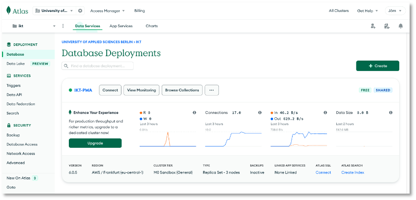
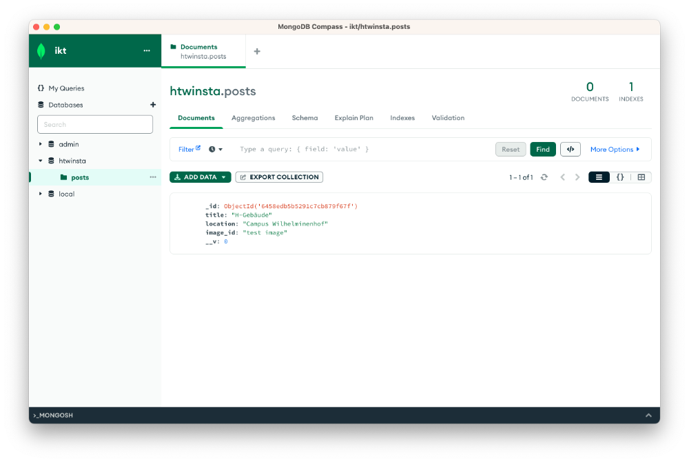

# Übungen


##### Übung 1 (Grundgerüst)

??? "Übung 1"

	1. In der ersten Übung geht es "nur" darum, das [Grundgerüst](../grundgeruest/#grundgerust-unserer-pwa) zu verstehen. Arbeiten Sie dazu diesen Abschnitt durch. Sie werden feststellen, dass sich die meisten Anweisungen (insb. im `HTML`-Code) auf [Material Design Lite](https://getmdl.io/) beziehen. 
	2. Um zu erkennen, was einen [Material Design Lite](https://getmdl.io/)-Bezug hat (und somit nicht wirklich wichtig ist),  ändern Sie das Grundgerüst so, dass Sie nicht [Material Design Lite](https://getmdl.io/), sondern [Bootstrap](https://getbootstrap.com/docs/4.6/getting-started/introduction/) verwenden. Werfen Sie also Material Design Lite komplett raus und ersetzen es vollständig durch Bootstrap. Löschen Sie die `material.min.js` aus dem `public/js`-Ordner.
	3. Starten Sie am besten damit, diese drei Zeilen aus den beiden `index.html`-Dateien zu löschen:
		```html
		<link href="https://fonts.googleapis.com/css?family=Roboto:400,700" rel="stylesheet">
		<link rel="stylesheet" href="https://fonts.googleapis.com/icon?family=Material+Icons">
		<link rel="stylesheet" href="https://code.getmdl.io/1.3.0/material.blue_grey-red.min.css">
		```
	4. Fügen Sie stattdessen den CSS-Link und das JS-Bundle aus [https://getbootstrap.com/docs/5.0/getting-started/introduction/](https://getbootstrap.com/docs/5.0/getting-started/introduction/) ein. 
	5. Sie können ja versuchen, dass es möglichst ähnlich aussieht:
		


##### Übung 2 (Web App Manifest)

??? "Übung 2"

	1. Erweitern Sie Ihre Anwendung (oder das Grundgerüst) um ein Web App Manifest. Verwenden Sie dazu am besten den [pwa-asset-generator](https://www.npmjs.com/package/pwa-asset-generator).  
	3. Die Anwendung soll in dem Moment installiert werden, wenn die Nutzerin das erste Mal auf den `+`-Button klickt. Das heißt, es wird das `beforeinstallprompt`-Ereignis ausgelöst und die Behandlung dieses Ereignisses sorgt dafür, dass Sie die Anwendung genau dann installieren, wenn Sie das erste Mal den `+`-Button klicken: 
	4. Hinweise und Hilfestellungen finden Sie z.B. [hier](https://web.dev/codelab-make-installable/) oder im [Skript](../manifest/#das-beforeinstallprompt-ereignis) (enthält weitere Links).


##### Übung 3 (Promises und Fetch API)

??? "Übung 3"

	1. Clonen Sie sich [hier die Anwendung für Übung 3](https://github.com/jfreiheit/IKT-Uebung3). Wechseln Sie in den Ordner und öffnen Sie die Übung in Ihrer IDE. Lesen Sie die [README.MD](https://github.com/jfreiheit/IKT-Uebung3). 
	2. In der Übung üben wir Promises und die Fetch API. Öffnen Sie die Datei `public/src/js/app.js`. Die Übung besteht aus 3 Teilen:

		3. **Teil 1**: führen Sie ein `fetch()` als GET nach `https://jsonplaceholder.typicode.com/posts/1` aus (siehe [https://jsonplaceholder.typicode.com](https://jsonplaceholder.typicode.com)). Lassen Sie sich die `Response` auf die Konsole ausgeben. Wenden Sie dann noch `json()` an und schauen sich das erzeugte Objekt an (lassen es ebenfalls auf der Konsole ausgeben). Übergeben Sie den `title` an das `output`-Element (`<p id="output"></p>`) aus der `public/index.html`.
		4. **Teil 2**: führen Sie ein `fetch()` als POST nach `https://jsonplaceholder.typicode.com/posts` aus. Beachten Sie das Format des zu sendenden JSON-Objektes (Eigenschaften `title`, `body` und `userId`). Das JSON-Objekt wird zurückgesendet. Geben Sie einen oder mehrere Werte aus diesem JSON in das `output`-Element aus.
		5. **Teil 3**: bauen Sie einen Fehler in die Anfrage (z.B. falsche Url) und behandeln Sie diesen Fehler mit einer Ausgabe auf die Konsole. Lesen Sie dazu die Kommentare in der `app.js`.
	
	6. Hinweise und Hilfestellungen finden Sie im Skript unter [Promises und die Fetch-API](../promises/#promises-und-die-fetch-api).


##### Übung 4 (MongoDB Cloud Atlas und Compass einrichten)

??? "Übung 4"

	Wir richten unsere Entwicklungs-Infrastruktur, insbesondere die MongoDB ein, die wir benötigen, um eine Frontend-Backend-Datenbank-App zu erstellen.

	1. `MongoDB Atlas` einrichten:

		- Es ist nicht notwendig, die [MongoDB](https://www.mongodb.com/de-de) lokal zu installieren. Wenn Sie es doch tun wollen, dann wählen Sie den [MongoDB Community Server](https://www.mongodb.com/try/download/community). Es ist aber, insbesondere für ein späteres Deployment ratsam, die Cloud-Lösung [MongoDB Atlas](https://www.mongodb.com/atlas/database) zu verwenden. Registrieren bzw. loggen Sie sich ein und erstellen Sie sich einen M0-Cluster, z.B. `IKT-PWA`, wie im folgenden Bild:

			 

		- Erstellen Sie eine Nutzerin und wählen Sie die Authentisierungsmethode. Sie können die Account-Passwort-Lösung oder das X.509-Zertifikat wählen. In der Vorlesung zeige ich die Verwendung mithilfe des X509-Zertikats. 

		- Schauen Sie sich unter `Connect` --> `Drivers` an, wie Sie in Node.js eine Verbindung zur Datenbank herstellen können.

	2.  `MongoDB Compass` einrichten

		- Laden Sie [MongoDB Compass](https://www.mongodb.com/products/compass) herunter und installieren es. 

		- Stellen Sie eine Verbindung zu Ihrer `MongoDB Atlas` her. 

		- Erstellen Sie eine Datenbank (z.B. `htwinsta`) und eine Collection (z.B. `posts`). 

		- Sie können auch schon einen Datensatz hinzufügen, wenn Sie möchten. Dann sollte es Bei Ihnen wie im folgenden Bild aussehen:

			 


	3. `Postman` installieren:

		- Postman ist eine Anwendung, um Schnittstellen (*Application Programming Interface - API*), die das Backend bereitstellt, zu entwickeln und zu testen. Sie finden Postman unter [postman.com](https://www.postman.com/). Wir beschränken uns auf den [Postman API Client](https://www.postman.com/product/api-client/).

		- Laden Sie das Tool herunter und installieren es. Rufen Sie Postman auf und geben in das Eingabefeld `https://postman-echo.com/get` ein. Lassen Sie die Auswahl links daneben auf `GET` und klicken auf den `Send`-Button. Es erscheint folgendes Bild:

			

		- Neben der `GET`-Anfrage sind folgende weitere Anfragen HTTP-Anfragen möglich:

			- `POST` - sendet Daten zur Verarbeitung an den Webserver
			- `PUT` - lädt existierende Daten (eine Datei) auf den Server
			- `PATCH` - ändert Daten (eine Datei), ohne - wie bei `PUT` - diese vollständig zu ersetzen
			- `DELETE` - löscht die angegebenen Daten auf dem Server

	4. `Node.js` installieren:

		- [Node.js](https://nodejs.org/en/) ist eine JavaScript-Laufzeitumgebung für einen Server. Node.js reagiert auf Ereignisse und antwortet asynchron. Das bedeutet, dass die Ausführung einer Ereignisbearbeitung nicht zum Blockieren der Laufzeitumgebung führt, sondern nebenläufig weitere Ereignisse eintreffen können, die ebenfalls asynchron behandelt werden. 
		- Laden Sie sich [hier](https://nodejs.org/en/download/) Node.js herunter und installieren es. 

	5. Paketmanager `npm`:

		- Mit der Installation von `node.js`, installieren Sie auch den Paketmanager `npm` (siehe [npmjs](https://www.npmjs.com/)). 
		- Sie können testen, ob die Installation von `node` und `npm` erfolgreich war, indem Sie im Terminal (Windows-Nutzerinnen bitte als Terminal die [GitBash](https://git-scm.com/downloads) verwenden) eingeben:

			```bash
			node --version
			```

			Sollte etwas, wie `v14.20.0` ausgeben und

			```bash
			npm --version
			```

			sollte etwas, wie `9.1.2` ausgeben. Achten Sie darauf, dass Sie eine **gerade Versionsnummer** von `node.js` installieren (also 14 oder 16, nicht 15)!
 


##### Übung 5 (Backend)

??? "Übung 5"

	1. Ergänzen Sie das in [Backend](../backend/#backend-rest-server) erstellte Backend um folgende Endpunkte: 

		- `POST /registration` und
		- `POST /login`

		Beiden Endpunkten soll ein JSON in der Form

		```json
		{
			"email": "test@test.de",
			"password": "testpassword"
		}
		```

		im `body` des Requests übergeben werden. Der erste Punkt registriert die Nutzerin und mit dem zweiten Endpunkt soll überprüft werden, ob die Nutzerin bereits existiert und das Passwort stimmt. Verwenden Sie zum Verschlüsseln des Passwortes in der MongoDB das [bcrypt](https://www.npmjs.com/package/bcrypt)-Paket. Um ein Passwort zu verschlüsseln, nutzen Sie die `hash()`-Funktion (oder `hashSync()`):

		```js
		bcrypt.hash(myPlaintextPassword, saltRounds, function(err, hash) {
		    // Store hash in your password DB.
		});
		```

		Um ein Passwort zu überprüfen, nutzen Sie die `compare()`-Funktion (oder `compareSync()`):

		```js
		// Load hash from your password DB.
		bcrypt.compare(myPlaintextPassword, hash, function(err, result) {
		    // result == true (myPlaintextPassword == hash) or 
		    // result == false (myPlaintextPassword != hash)
		});
		```

		Achten Sie darauf, dass eine E-Mail nur einmal verwendet wird, d.h. bei der Registrierung müssen Sie zunächst prüfen, ob es noch keinen Datensatz mit der angefragten `email` gibt. 

	2. Erstellen Sie sich dazu eine neue Collection `users` (Schema `User`).


		 


##### Übung 6 (Frontend)

??? "Übung 6"

	1. Clonen Sie sich [hier die Anwendung für Übung 6](https://github.com/jfreiheit/IKT-Uebung6). 
	2. Lesen Sie die README.MD](https://github.com/jfreiheit/IKT-Uebung6)
	3. Öffnen Sie das Projekt in Ihrer IDE und implementieren Sie die `app.js`. Die Aufgabe ist dort in den Kommentaren beschrieben.  

	


##### Übung 7 (Kamera und Geolocation + Map)

??? "Übung 7"

	1. Verwenden Sie Kamera und Geolocation in Ihrem Projekt.
	2. Lassen Sie Ihre Geolocation mithilfe von OpenLayers anzeigen. 


##### Übung 8 (IndexedDB)

??? "Übung 8"

	1. Im Abschnitt [IndexedDB](../indexeddb/#indexeddb) haben wir uns mit der Verwendung der In-Browser-Datenbank IndexedDB vertraut gemacht. 
	2. In dem dortigen letzten Abschnitt [Löschen einzelner Einträge](../indexeddb/#loschen-einzelner-eintrage) haben wir in der `db.js` eine Funktion `deleteOneData(st, id)` geschrieben, die einen einzelnen Datensatz aus der IndexedDB mit der übergebenen `id` löscht. 
	3. Implementieren Sie in der `db.js` eine Funktion `deleteByTitle(st, title)`, die den Datensatz (oder die Datensätze) löscht, der (oder die) in dem `title`-Attribut den der Methode als `title` übergebenen String enthält. Z.B. soll aus dem Datensatz 
		```bash
		{id: 1, title: "first post", location: "Berlin", image: "/9j/4AA...UgP/9k="}
		{id: 2, title: "second post", location: "Wilhelminenhof", image: "/9j/4AA...VY/9k="}
		{id: 5, title: "fourth post", location: "Gebaeude C", image: "/9j/4AA...KOX/9k="}
		{id: 10, title: "HTW aus der Luft", location: "Campus WH von oben", image: "/9j/4AA...9z//2Q=="}
		{id: 11, title: "Wilhelminenhofstraße", location: "Campus WH Eingang", image: "/9j/4AA...U9D/9k="}
		```
		- bei Aufruf von `deleteByTitle('posts', 'second')` der zweite Datensatz mit der `id: 2` gelöscht werden, 
		- bei Aufruf von `deleteByTitle('posts', 'post')` sollen die ersten drei Datensätze (mit `id:1`, `id:2` und `id:5`) gelöscht werden.

	**Tipps**: Mit der Methode [getAllKeys()](https://developer.mozilla.org/en-US/docs/Web/API/IDBIndex/getAllKeys) ermitteln Sie z.B. alle Schlüssel (`id`) der Datensätze und mit der Methode [get(key)](https://developer.mozilla.org/en-US/docs/Web/API/IDBIndex/get) erhalten Sie den zum Schlüssel zugehörigen Wert.


